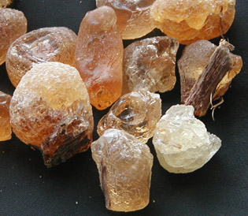
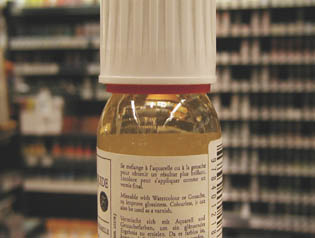
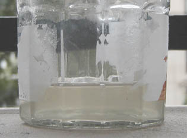
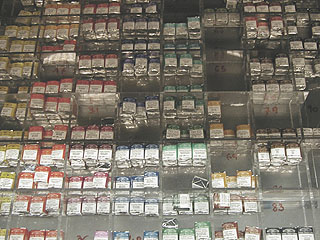
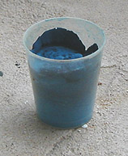

## La gomme arabique, l'aquarelle
### La gomme arabique, l'aquarelle, usage en arts plastiques
 **Gomme arabique,  
aquarelle**  

_La gomme arabique servit dès l'Égypte ancienne pour la réalisation de [détrempes](detrempe.html). Certains auteurs lui attribuent cinq mille ans de bons et loyaux services._

_Pourtant, au début de cet article, il n'est pas inutile de rappeler que ce liant n'est pas éternel. Des égyptologues ont vu des peintures murales s'effacer après qu'elles aient été soumises au jour et à l'air ambiant. Les conditions de conservation sont essentielles, il faut le souligner, et si une bonne gomme arabique est fiable, il ne faut pas s'attendre à ce qu'elle protége le pigment comme le feraient l'huile, l'acrylique ou certaines cires._

_Elle est utilisée actuellement pour plusieurs procédés de peinture et de dessin :_

> \* _l'aquarelle, à bien distinguer des autres détrempes tant elle correspond à une technique artistique tout à fait à part. Elle est née à la fin du XVIIème sous l'impulsion du peintre anglais Paul Sandby et surtout de John Constable, qui laissa vingt mille aquarelles. Elle a progressivement détrôné lavis et autres détrempes._
> 
> \* _la mine sanguine classique (non la craie, le carré ou le crayon), qui est "aquarellable". Aucun rapport avec le "crayon aquarellable" moderne : une dilution plus lente est nécessaire. Elle doit avoir lieu hors du dessin/tableau car le temps d'imbibition est plus important (quelques minutes)._ _[Lire passage in La sanguine.](sanguine.html#laveritablesanguine)_

Sommaire

[La gomme arabique : provenance et particularités](gommearabaquar.html#provenanceetparticularites)

[Particularités de la peinture aquarelle](gommearabaquar.html#particularitesnonreversibilite)

[Adjuvants](gommearabaquar.html#adjuvants)

[L'eau](gommearabaquar.html#leau)

[Fabrication de la peinture](gommearabaquar.html#fabrication)

[Les pigments de l'aquarelle](gommearabaquar.html#pigmentsdelaquarelle)

[Caractéristiques spécifiques de l'application des couleurs](gommearabaquar.html#caracteristiquesspecifiquesdelapplicationdescouleurs)

[Autres spécificités](gommearabaquar.html#autresspecificites)

_\- [Opacification](gommearabaquar.html#opacification)_

_\- [Séchage](gommearabaquar.html#sechage)_

_\- [Réserves](gommearabaquar.html#reserves)_

_\- [Corrections](gommearabaquar.html#corrections)_

_\- [Utilisation "normale" des blancs avec l'aquarelle](gommearabaquar.html#utilisationnormaledesblancsenaquarelle)_

_\- [Outils utiles](gommearabaquar.html#outilsutiles)_

_\- [Une peinture se prêtant aux effets](gommearabaquar.html#unepeinturesepretantauxeffets)_

_\- [Conditionements  : tubes, godets et demi-godets](gommearabaquar.html#conditionnements)_

[Vernis pour l'aquarelle](gommearabaquar.html#vernispourlaquarelle)

[Une technique hybride, la gomme bichromatée](gommearabaquar.html#gommebichromatee)

[Autres informations](gommearabaquar.html#autresinformations)

\_\_\_\_\_

> \* _elle entrerait encore dans la composition de certaines encres._

> \* _Elle a pratiquement disparu des [gouaches](gouache.html)._

_La gomme arabique_ _est également utilisée en cuisine et en confiserie ([voir ci-dessous](gommearabaquar.html#guimauve))._

_La gomme : provenance et particularités_

Sauf culture acclimatée en serre, elle est actuellement récoltée au Sénégal et au Soudan - les sources anglo-saxonnes  mentionnent aussi le Nigeria et l'Australie - sur des arbres de la famille des acacias (voir le morceau d'écorce resté collé sur un morceau, à droite sur la photo ci-contre). Sa teinte naturelle est un jaune plus ou moins pâle (d'autant plus pâle qu'elle serait de bonne qualité, disent certains, conseillant d'écarter tout morceau trop foncé).

Les gommes "Sénégal" seraient moins onéreuses, théoriquement réservées à la gouache, selon certaines sources (en fait, comme nous le disions, les [gouaches](gouache.html) actuelles ne contiennent plus de trace de gomme arabique, ce qui signifie que cette information n'est probablement plus valable). On mentionne aussi des lieux de fabrication dans le monde anglo-saxon, notamment en Australie. Selon d'autres sources, la gomme du Sénégal serait la meilleure. Nous avouons manquer d'informations sûres à ce sujet. La "Kordofan" serait la plus réputée.

Depuis l'aube des temps, c'est la géopolitique qui décide de l'approvisionnement. Le Soudan actuel, tout comme le royaume antique de Kerma, en guerre contre l'Egypte, n'offre pas plus aujourd'hui un contexte géopolitique favorable aux échanges commerciaux.

Une certitude se dégage cependant : la gomme arabique de la région est-africaine a fait ses preuves depuis des millénaires, les murs des tombeaux égyptiens en attestent.

Le diluant de cette gomme est [l'eau](eau.html), employée massivement, d'où les termes anglais et français "watercolor" et "aquarelle". Reprenant une vieille boutade, nous dirons que "_l'aquarelle, c'est de l'eau améliorée_". Ce qui caractérise ce liant, c'est effectivement son aptitude à remplir son rôle même lorsqu'il est fortement dilué.

La gomme arabique a parfois une très légère tendance à l'acidité. Elle n'est alors pas bénigne en tant qu'adjuvant à d'autres procédés (exemple : avec un mélange à la [chaux](chaux.html) ou à la [caséine](caseine.html), ou simplement adjointe de [glycérine](glycerine.html), elle peut parfois provoquer des réactions chimiques). Testée au [papier tournesol](papiertournesol.html) en solution à [l'eau distillée](eau.html#eaudistillee) ([pH](ph.html) neutre), elle peut aussi révéler (bonne surprise !) une parfaite neutralité.

Elle ne trouve pas d'emploi dans des procédés tels que la peinture à l'huile ou à l'acrylique, semble-t-il. Par contre, depuis très longtemps, elle n'est pas inconnue des décorateurs.

_Particularités de la peinture aquarelle_

Les couleurs à l'aquarelle sont très pigmentées. Cette particularité fait à la fois leur intérêt et leur fragilité (particulièrement vis-à-vis de la lumière  : elles sont fortement photosensibles).

**La gomme arabique et la guimauve**

La véritable guimauve, celle que les marchands des fêtes foraines suspendaient, tiède, sur des pics métalliques rivés au plafond, n'existe plus depuis des décennies.

Pourquoi ?

Parce que son coût de fabrication était excessif.

Mais pourquoi l'était-il devenu ?

D'abord parce que la guimauve est une plante qu'il faut cueillir et traiter, ce qui a un prix, ensuite parce que la pâte de guimauve contient... de la gomme arabique.

Celle-ci était soudanaise. Or, pendant les années 70, la grande instabilité politique de la région, rendant ardu le maintien des échanges commerciaux, additionnée de sécheresses qui furent dévastatrices aussi pour les acacias, rendirent la gomme soudanaise indisponible, déclenchant l'abandon de la délicieuse guimauve.

> Le broyage des pigments devrait être bien fin, peut-être un peu plus, dit-on, que pour d'autres peintures. Les pigments industriels sont très bien broyés de nos jours, mais selon certains peintres, dans quelques cas rares, une finition à la [molette](molette.html) pourrait s'avérer nécessaire. Cette information n'est absolument pas confirmée. Elle est même suspecte : il pourrait s'agir d'une rumeur tenace provenant d'une époque reculée. Pour le moment, nous n'avons pas constaté une quelconque nécessité de procéder à un broyage supplémentaire et il y a lieu de signaler que la molette risque fort de donner des résultats décevants, comparée à la puissante machinerie des industriels.
> 
> Cependant, toute expérience avec un pigment trop grossièrement broyé pour un usage à l'aquarelle [nous intéresse](ecrire.html).

La gomme arabique est généralement peu [réversible](liants.html#reversibilite) : elle ne se remet pas aisément en solution à partir du moment où elle a séché une fois sur le papier. Le repentir est difficile.

_Quelques fabricants d'aquarelles de haut de gamme annoncent clairement, voire fièrement, la réversibilité de leurs produits. C'est pour beaucoup d'aquarellistes un non-sens et cela signale une gomme anormale._

_Le travail en couches multiples, en lavis superposés, est en effet typique du procédé à la gomme arabique. Si les couches inférieures devaient se raviver comme des [gouaches](gouache.html) et se mêler aux couches fraîches, cela nécessiterait un changement radical d'approche artistique. Il en va de même pour la peinture décorative où certains incidents sont signalés dans le domaine de l'application en couches multiples. Question de qualité._

_En fait, un degré vraiment très modéré, très restreint, de réversibilité est "communément admis", à condition de ne pas mettre en danger la structure et la composition antérieurement mises en place. La manière d'appliquer la couleur (effleurement, [frotté](frotte.html), [lavis](lavis.html), [projeté](protections.html), etc.) joue un rôle : elle doit être adaptée aux caractéristique de la gomme._

_Du point de vue de la conservation, des précautions s'imposent. **Il faut conserver impérativement les oeuvres en milieu sec de toute manière et à l'abri de la lumière aussi longtemps que possible (cartons à dessin).**_

L'empâtement est absolument impossible et un véritable épaississement est difficile à obtenir.

_La fragilité réputée des tableaux à l'aquarelle n'est pas seulement due au taux de dilution extraordinaire que le peintre impose à cette peinture : elle dépend de la stabilité chimique de ses composants et du support. **Il est imprudent de saturer une aquarelle en adjuvants de toutes sortes.** Les fabricants veillent déjà à offrir les produits les plus stables possibles. Pour les personnes souhaitant fabriquer leur aquarelle, la modération dans les dosages et le maintien d'un [pH](ph.html) raisonnable sont recommandés._

_Adjuvants_

Les adjuvants typiques de l'aquarelle, uniquement employés lors de la préparation de la pâte, sont le miel, le [sucre](sucre.html), le [fiel de boeuf](fieldeboeuf.html) (agent facilitant le mouillage du pigment et l'adhérence à certains supports lisses), la [glycérine](glycerine.html) (pour la souplesse) et/ou la [dextrine](dextrine.html) (cette dernière pouvant accroître dangereusement la réversibilité de la peinture), miel et dextrine ayant le point commun d'apporter du [glucose](glucose.html).

C'est à ces produits (à adjoindre en doses homéopathiques) que se limite à peu près la "cuisine de l'aquarelle", cuisine pratiquement restreinte au seul moment de la fabrication de la peinture car il n'y a pas de médiums dans ce procédé. Les adjonctions de produits divers dans le frais n'ont pas la même vocation : il s'agit de produire des "effets".

Nous conseillons aux peintres souhaitant fabriquer leur aquarelle de ne pas utiliser d'adjuvant dans un premier temps. Seules de très petites doses de glycérine peuvent s'avérer nécessaires pour qui travaille sur support souple. A part ce produit, nous émettons quelques réserves de toute façon quant à l'utilisation d'autres adjuvants car l'aquarelle est une peinture très fragile qui gagne à conserver la plus forte concentration possible de gomme arabique.

_L'eau_

Elle peut modifier radicalement l'aspect des travaux en fonction de ce qu'elle contient réellement. Tout bien considéré, c'est elle l'ingrédient principal de votre peinture !

L'eau du robinet, généralement alcaline (nous relevons notamment un [pH](ph.html) très marqué en Île de France), contient des métaux [alcalinoterreux](alcalinoterreux.html) formant des oxydes de couleur blanche, ainsi que des sels de [chlore](blancssynthetiques.html#lechlore) attaquant le pigment. Elle accentue l'impression de matité, de blancheur au séchage.

L'eau distillée ou du moins l'eau déminéralisée sont conseillées (vérifier quand même leur neutralité chimique avec du [papier tournesol](papiertournesol.html)). Lire l'article consacré à [l'eau](eau.html).

_Fabrication_

Recette (les proportions indiquées sont à mesurer en poids) :

> \* préparer une **_eau gommée_** :
> 
> > \* 1/3 de gomme arabique solide réduite en poudre (le marteau s'avère indispensable : c'est une substance très dure), à placer dans des sacs puis dans un bocal comme pour la fabrication du [médium dammar](mediumdammar.html)
> > 
> > \* 2/3 d'[eau distillée](eau.html#eaudistillee) ou déminéralisée.
> 
> \* Laisser reposer une nuit (si possible, agitez de temps en temps, décollez le ou les sacs du fond). La gomme doit avoir littéralement fondu. Il ne doit rester aucun morceau dur ni même mou dans les sacs.
> 
> \* une eau gommée doit être considérée comme 30% ± 10% du produit final, poids du pigment inclus. Cela peut surprendre, mais ce dernier occupe en effet à peu près 70% de la masse totale, chiffre tout de même très variable en fonction des produits en présence.
> 
> \* FACULTATIF (voire à éviter lors des premiers essais)  : avant d'incorporer le pigment, ajouter "un peu" de [glycérine](glycerine.html) (quantité maximale de ce produit : 1/20ème du poids de l'eau gommée - certains auteurs avancent une proportion excessive de 15%, tout à fait inutile) pour donner de la souplesse et provoquer certaines réactions chimiques relativement stabilisantes dans certaines conditions - [voir _Adjuvants_](gommearabaquar.html#adjuvants). Certains peintres rajoutent un peu de [fiel de boeuf](fieldeboeuf.html) qui donne une certaine tenue sur différents supports, comme mentionné [ci-dessus](gommearabaquar.html#fieldeboeuf1). Il est très important de mesurer le [pH](ph.html) des produits ajoutés ([papier tournesol](papiertournesol.html)). Certains miels, par exemple, s'avèrent acides. Dans ce cas, il vaut mieux mélanger séparément miel et glycérine (ou autre [alcool](alcool.html)) et observer le résultat avant d'adjoindre ces substances à l'eau gommée.  
> Les adjuvants peuvent s'avérer [hygroscopiques](hygroscopique.html) à partir de certaines proportions et des tests préalables en présence de l'eau utilisée comme diluant, sur un échantillon du futur support à peindre, sont alors indispensables.
> 
> \* incorporer le pigment et malaxer à la [spatule](couteauouspatule.html)
> 
> \* placer la pâte dans un godet ouvert, laisser sécher
> 
> \* si la pâte sèche trop vite, ajouter de l'eau distillée.

Certaines couleurs pourraient nécessiter un traitement spécifique, du moins selon certaines sources :

> \* le bleu outremer -> certaines sources recommandent d'ajouter du [borax](borax.html) ou de la [glycérine](glycerine.html), qui neutraliseraient soi-disant les réactions induites par l'acidité de la gomme arabique. Ce traitement ne s'impose qu'à cette condition. Or, il est peu conseillé de toute manière d'employer une gomme arabique acide.
> 
> \* l'alizarine (voir [garance](garance.html)) gagnerait à se voir adjoindre une charge de [dextrine](dextrinefarines.html). Information à vérifier. De toute façon, l'alizarine véritable, issue de la racine de garance, n'est qu'assez peu employée en peinture contemporaine.

L'utilisation de gomme arabique vendue **sous forme liquide**, sorte d'_eau gommée_ dont l'utilisateur ne connaît pas la proportion de gomme par rapport à l'eau et ignore s'il y a présence de miel, de glycérine ou d'autres composants, peut être envisagée si le produit est fabriqué par une entreprise de confiance - qui n'hésiterait pas à fournir des informations détaillées. Voir image ci-contre à droite : exemple d'eau gommée nettement jaune, beaucoup trop teintée. Un tel produit est inquiétant.

Une eau gommée peut être trouble mais elle ne devrait pas être colorée (elle est normalement presque incolore, [voir ci-dessous](gommearabaquar.html#eaugommeeincolore)).

_Les pigments de l'aquarelle_

La plupart sont ceux que l'on retrouve dans les autres peintures, mais on trouve quelques spécificités typiques dans la palette de base, reprises d'ailleurs par certains fabricants de couleurs à l'acrylique :

> \* le gris de Payne (fortement bleuté), très prisé, superbe.  
> Il autorise la création de [sfumatos](chap07rayleigh.html), d'ombres et de noirs.
> 
> \* la laque d'alizarine cramoisie ("alizarine crimson"). Voire _[Garance](garance.html)_  
> C'est depuis longtemps une imitation.
> 
> \* le vert de Hooker, le vert de vessie, certains autres verts et bleus "[phtalo](phtalocyanines.html)".

Les noirs sont peu employés, les mélanges de bleu (ou de gris de Payne) et de brun foncé (terre d'ombre brûlée) les remplaçant avantageusement. Concernant le blanc, voir paragraphe suivant. Pour débuter, une dizaine de couleurs suffisent. Souvent, l'aquarelliste confirmé n'emploiera guère plus de vingt pigments au total - d'où l'intérêt des boîtes vides ou à demi vides disponibles dans le commerce.

_Caractéristiques spécifiques de l'application des couleurs_

**Les blancs** ne sont en théorie jamais employés.

**La transparence de l'aquarelle autorise et indique même particulièrement l'utilisation de la seule blancheur du papier comme source de lumière** (voir aussi ci-dessous, [réserves](gommearabaquar.html#reserves)) comme dans le travail, ci-contre, de [Sylvie Guillot](quinoussommes.html#sylvieguillot), à la frontière entre dessin et peinture. Cette spécificité rend la technique de peinture à l'aquarelle extrêmement proche - dans l'esprit - des [glacis](glacis.html) à l'huile, mais incite davantage à une sorte de gestuelle et d'approche spécifique, souvent faite d'un curieux mélange de spontanéité et de précision.

L'obtention d'une couleur ne doit théoriquement pas se faire sur la palette mais sur le tableau, par superposition, ce qui est facilité par les temps de séchage infiniment plus courts qu'en peinture à l'huile. En échange, le droit à l'erreur est nettement diminué. Beaucoup d'aquarellistes sont de grands consommateurs de papier...

Mais cette contrainte peut constituer une incitation à ne pas chercher à peaufiner (ce qui oblige à mettre en oeuvre plus de dextérité) ni à réduire les accidents, tout en aiguisant le regard, la concentration et le geste.

Mais les approches sont en réalité nombreuses et ces quelques indications généralistes ne doivent absolument pas être pris au pied de la lettre car presque tout est possible en aquarelle sauf l'empâtement.

_Autres spécificités_

**Opacification**

Dans certains cas, l'aquarelliste peut avoir besoin de rendre sa peinture plus opaque et peut alors rendre ses couleurs plus couvrantes en leur adjoignant du blanc (c'était, paraît-il, le principe des premières gouaches : l'adjonction de [blanc de lithopone](lithopone.html), à la mode à l'époque). Cela les transforme, les corrompt d'une certaine manière, mais l'opération peut être indispensable dans certains contextes.

Voir plus loin, «[Utilisation "normale" des blancs avec l'aquarelle](gommearabaquar.html#utilisationnormaledesblancsenaquarelle)».

**Séchage**

Le temps de séchage dépend fondamentalement de l'humidité atmosphérique. Une aquarelle sèche intégralement par temps chaud et sec en une heure au plus, sauf si le papier est totalement imbibé d'eau. Par temps humide, plusieurs heures peuvent être nécessaires.

**Réserves**

Lire [l'article consacré à ces procédés](reserves.html).

L'utilisation de gomme à masquer ("drawing gum") permet de créer des "réserves". 

Autre moyen technique : la [cire de bougie](ciredebougie.html). Elle a deux gros défauts : elle n'est pas très facile à appliquer et encore moins à enlever.

Certains aquarellistes utilisent des crayons spéciaux, faits d'une sorte de [paraffine](paraffine.html), traitée à cet effet (difficile à trouver dans le commerce, semble-t-il). Cette cire-là ne s'enlève pas. Elle peut être nettoyée des traces infligées par accident, c'est tout.

**Corrections**

Théoriquement impossibles, un tantinet contraires à l'esprit de l'aquarelle, on peut tout de même les réaliser de différentes manières :

> \* application locale d'eau de Javel. Attention : le dépôt risque de demeurer hygroscopique. Les sels déposés se ravivent en présence d'eau ou d'humidité
> 
> \* application d'un mélange d'[alcool à brûler](alcools.html#lalcoolabruler) et d'[eau distillée](eau.html#eaudistillee). Cette mixture est censée remettre la peinture en solution. Procédé non testé, sans garantie.
> 
> \* surcouche de blanc.

Cette dernière méthode nécessite l'emploi d'un pigment très couvrant, le blanc de titane de préférence, sous forme de gouache éventuellement (car toujours plus couvrante que l'aquarelle).

**Utilisation "normale" des blancs avec l'aquarelle**

Elle est limitée 

> \* aux brumes et aux flous. Elle peut être réalisée avec un blanc de Chine, moins couvrant que le titane. Elle est appliquée en lavis par-dessus de larges régions, comme un glacis en peinture à l'huile
> 
> \* aux zones nécessitant au contraire de la précision. Il faut alors préférer le blanc de titane, à mêler aux couleurs sur la palette même.

Le blanc demeure d'un usage véritablement mineur chez les aquarellistes professionnels.

Voir aussi ci-dessus, "_[Opacification](gommearabaquar.html#opacification)_".

**Outils utiles**

Un assez gros pinceau de type [petit-gris](pincpoils.html#lepetitgris) est pratiquement indispensable car cet outil autorise des applications très variées (notamment fines, lorsque l'on n'utilise que la pointe), tout à fait adaptées à l'aquarelle, mais d'autres poils sont couramment employés. On peut se contenter d'un pinceau à poil très souple (petit-gris) et éventuellement d'un autre à poil plus dur, mais tout est permis.

Les chiffons et autres Sopalin ® sont extrêmement utiles à l'aquarelliste pour résorber les excédents d'eaux et nettoyer rapidement les palettes.

La brosse à dents et d'autres types de brosses permettant la [projection](projection.html) sont aussi très utiles.

**Une peinture se prêtant aux effets**

L'aquarelle, comme les encres, se prête d'un point de vue pictural aux techniques mixtes et aux effets. Au point de vue chimique, cette peinture étant fragile, seuls certains produits peuvent être employés.

Le sel (surtout le gros sel) est assez utilisé, non sans bonnes raisons. On le jette dans le frais. Il faut bien réfléchir d'avance au procédé d'application et surtout de retrait car _une fois sec, il arrache la surface du papier lorsque l'on veut le décoller_. Il vaut mieux le retirer dans le [demi-frais](demifrais.html) avancé.

L'eau salée est extrêmement alcaline (nous avons mesuré un [pH](ph.html) très élevé dans une eau distillée mêlée de sel de cuisine). Le [sodium](annexe1.html#na) du sel (NaCl) fait partie des métaux alcalins. Il n'est pas exclu que des réactions se produisent au contact de certains pigments et supports.

Le sable très fin et les copeaux de bois très fins également, pour ne pas dire pulvérulents, permettent également de réaliser certains effets.

Le [fusain](fusain.html), préalablement fixé ou non, mêlé ou non à l'eau ou à la peinture (application en sous-couche ou même dans le frais), autorise des rendus intéressants d'autant plus qu'il donne de superbes résultats sur les papiers pour l'aquarelle.

Par-dessus une surface peinte à l'aquarelle bien sèche, tout est possible, mais il faut souligner le fait que l'application de certains corps gras (huiles particulièrement) "tâchera" l'image.

_Conditionnements  : tubes, godets et demi-godets, etc._

Godets, et surtout "demi-godets" sont les plus répandus et les plus adaptés aux petites surfaces et en emploi à l'extérieur. Ils jouent aussi un bon rôle pédagogique en incitant l'aquarelliste débutant à ne pas faire d'empâtements.

Les tubes et les flacons se prêtent aux gros pinceaux et aux grandes surfaces. La pâte se dilue évidemment plus facilement. Théoriquement, elle serait plus brillante mais nous n'avons pas constaté cela dans les faits.

Mais le grand intérêt du conditionnement liquide est qu'il est très possible - sauf exception liée à une particularité de fabrication - de laisser sécher le contenu d'un ou de plusieurs tubes (mélange maison) dans un godet ou sur une palette et de travailler ensuite avec cette peinture durcie.

Si vous fabriquez vous-même votre aquarelle, le petit pot de plastique est très conseillé (photo). Il permet l'utilisation d'assez gros pinceaux et peut être fixé au fond d'une boîte avec un peu de colle.

Les godets et pâtes sèches devenues craquelés doivent simplement être imbibés d'eau. L'apparition d'un peu de moisissure, lorsqu'un boîte est refermée alors que les godets sont encore imbibés d'eau, est sans conséquence. Il est tout à fait inutile de recourir à de l'essence de girofle (une coutume ancienne) car il suffit de nettoyer à l'eau. Certains auteurs préconisent l'emploi de fluorure de sodium ou de désinfectants ménagers. C'est totalement inutile. L'expérience démontre que les agents conservateurs peuvent être gardés pour d'autres usages plus utiles, sauf peut-être lorsque le peintre travaille dans un lieu infecté ou lorsque la gomme arabique employée est particulièrement acide.

En dehors du contexte spécifique de l'emploi de tubes d'aquarelle - qui de toute façon ont tendance à sécher -, il est rarement utile de conserver durablement l'aquarelle sous forme non solide (pâte, liquide). Il n'y a dans ce cas aucune nécessité d'adjoindre un agent conservateur dans l'eau lors de la fabrication si celle-ci est pure et les outils raisonnablement propres.

La distribution au détail de godets entiers n'est pas très usuelle alors que les demi-godets à l'unité sont courants.

_Vernis pour l'aquarelle_

Il n'y a pas, en théorie, de vernis pour l'aquarelle. Par contre, l'emploi d'un fixatif pour fusains et pastels à fins de conservation d'une aquarelle n'est pas déconseillé bien qu'il ne soit pas anodin. Il n'isolera jamais la peinture à la manière d'un vernis mais retardera l'altération du pigment. Il risque cependant de modifier l'aspect général des couleurs. Une autre solution quelquefois employée consiste à couvrir le tableau d'une fine couche d'eau gommée légèrement diluée. Eau et eau gommée doivent alors être neutres chimiquement faute de quoi le remède serait pire que le mal.

L'emploi d'un vernis, d'un médium ou d'un médium-gel acrylique protège mais transforme radicalement l'aspect d'un tableau réalisé à l'aquarelle. Pour certains travaux, cette transformation - qui n'a rien de classique - est en fait très intéressante mais nécessite un "calcul" préalable : ces produits, mêmes mats, vivifient les couleurs non sans outrance et l'épaississement qu'ils occasionnent peut être mis à profit pour la formation d'ombres et d'effets visuels (filtrage, masquage) à l'aide de surcouches réalisées avec d'autres peintures (acrylique, vinyle, huile dans certains cas, etc.).

Certains fabricants se sont lancés dans la création de prétendus vernis pour l'aquarelle en omettant de préciser la composition de ces produits. Bons ou mauvais, ces produits ne devraient jamais être utilisés en l'absence d'informations sur leur composition et sur leur destination précise (lire [courrier d'un lecteur](courrierdeslecteurs2010b.html#20100413eg)). La confiance d'un artiste, même envers un fabricant de renom, connaît tout de même des limites : peut-on par exemple - question essentielle -, comme en peinture à l'huile, retirer aisément de tels vernis ? Sous quelles conditions peuvent-ils entrer en interaction avec la couche peinte ? De quelle manière "accrochent-ils" celle-ci ? Puis-je travailler en plusieurs couches, avec différents produits ? Quels produits ? Quels sont les incompatibles ?

Notre opinion est, compte tenu du fait qu'il s'agit de produits entièrement nouveaux censés révolutionner les usages, en l'absence d'informations de cet ordre, ils ne peuvent en aucun cas convenir à un travail de qualité. Nous recommandons fortement à nos visiteurs de les éviter.

_Une technique hybride, la gomme bichromatée_

Il s'agit d'un procédé à mi-chemin entre photographie et peinture.

Erick Mengal le décrit parfaitement dans un article de [son site](http://www.erickmengual.com/). Cliquer [ici](http://www.erickmengual.com/techniques.php?idtechnique=1) (ou [ici](http://www.erickmengual.com/techniques/gomme_bichromatee.pdf) pour la version [PDF Acrobat](http://www.adobe.fr/products/acrobat/readstep2.html)).

_Autres informations_

La gomme arabique entrerait dans la composition de certains vernis [craqueleurs](craquelures.html).

Cette information pourrait être valable car l'une des techniques les plus utilisées en arts décoratifs pour provoquer des craquelures fait intervenir ce produit ([lire article](craquelures.html#techniqueaveclagommearabique)).

Voir [Papiers pour l'aquarelle](papierspourlaquarelle.html), [La gouache](gouache.html), [L'eau](eau.html).

 [Communication](http://www.artrealite.com/annonceurs.htm) 

