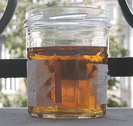

## La gomme laque, les laques
### La gomme laque, les laques, la laque de Coromandel, usage en arts plastiques et autres
 **La gomme laque,  
les laques**  

Présentation des laques

_Les différentes laques sont souvent employées dans des perspectives situées à la frontière de l'art et de la décoration. Certaines oeuvres appartiennent au patrimoine artistique international, comme une visite au [Musée Guimet](http://www.museeguimet.fr/), par exemple, peut nous en convaincre, tandis que d'autres emplois des laques, plus rares à notre époque, n'ont pour fonction que la protection du bois._

  
Ecailles de gomme laque

_Les_ _laques sont tantôt fabriquée sur la base de substances végétales - notamment le "latex" de l'arbre [sumac](laquejaponaise.html#urushisumac) - et solubles à l'eau ou à l'essence (voir [laque japonaise](laquejaponaise.html)), tantôt avec des produits fort différents, d'origine animale, qui sont solubles dans l'alcool et proviendraient (directement ou indirectement) de la côte de Coromandel (Sud-est de l'Union Indienne) ou de la région de la ville de Coromandel (lire au sujet de l'origine historique et géographique [un passage du courrier des Lecteurs](courrierdeslecteurs2010c150.html#20101026nbpourquoicoromandel)), d'où l'appellation "laque de Coromandel"._

_Du point de vue de la répartition géographique, la laque végétale est répandue au Japon et sur le continent de la Corée à la Birmanie tandis que la laque animale est - jusqu'à nouvelle information - exclusivement continentale, utilisée de l'Inde à la Chine, et maintenant aussi en Occident._

_La laque au sumac serait d'un emploi plus ancien que la Coromandel. Elle serait apparu en Chine vers 1000 BC. Elle était utilisée traditionnellement avec du [cinabre](vermillons-2.html) ou un noir du type [noir d'ivoire](noirs.html#lenoirdivoire). Les premiers travaux montrent que l'intérêt des couches multiples avait déjà été compris._

_Enfin, on mentionne une utilisation notable, sur le continent asiatique, d'[oléorésines](oleoresine.html) locales. D'autres résines transparentes ou colorées, plus ou moins grasses, ont été utilisées un peu partout pour réaliser laques et vernis, tel le [sang-dragon](autresresines.html#sangdragon) par exemple, très ancien paraît-il._

Sommaire

[Présentation des laques](gommelaque.html#presentationdeslaques)

[Confusion cher les auteurs occidentaux](gommelaque.html#confusionschezlesauteursoccidentaux)

[Présentation de la laque de Coromandel](gommelaque.html#presentationdelalaquedecoromandel)

[La laque ou le laque ? Une polémique](gommelaque.html#lalaqueoulelaque)

[Utilisations](gommelaque.html#utilisations)

[Caractéristiques techniques](gommelaque.html#caracteristiquestechniques)

[Variétés](gommelaque.html#varietes)

[La cire de gomme laque](gommelaque.html#ciredegommelaque)

[Conditionnements commerciaux](gommelaque.html#conditionnementscommerciaux)

[Emploi, préparation de la gomme laque](gommelaque.html#utilisationpreparation)

[Laques contemporaines, pseudo-laques](gommelaque.html#laquescontemporaines)

[Laques décoratives, patines et laques artistiques](gommelaque.html#laquesdecorativeslaquesartistiques)

[Laque incisées, incrustations](gommelaque.html#laquesinciseesincrustations)

[Laques ciselées](gommelaque.html#laquesciselees)

[Apprêts pour laques ciselées](gommelaque.html#appretpourlaquesciselees)

[Autres apprêts pour laques](gommelaque.html#autresappretspourlaques)

[Choix du support et encollage](gommelaque.html#choixduboisetencollage)

[Un outil d'application traditionnel : le tampon](gommelaque.html#letampon)

[Les accidents de surface et l'application](gommelaque.html#accidentssurfappli)

[Polissage](gommelaque.html#polissage)

[Finition](gommelaque.html#finition)

[Laque de Coromandel, huiles à peindre, peintures aqueuses et techniques mixtes](gommelaque.html#lalaquedecoromandeletlhuiledelin)

[Nos impressions](gommelaque.html#impressions)

 

La laque ou le laque ? Une polémique

Selon certains dictionnaires réputés sérieux, le terme "laque" peut être employé au féminin ou au masculin indifféremment. Mais l'Académie Française lie chaque genre à des acceptions spécifiques :

"_**I.** N. f. **1\.** Latex de divers arbustes de la famille des Térébinthacées (...) **2\.** Par anal. Vernis coloré ou peinture translucide (...)__. **3\.** COIFFURE. Produit qu'on vaporise sur les cheveux pour les fixer.  
**II.** N. m. **1\.** Vernis, le plus souvent noir ou rouge, qu'on prépare avec la résine d'un arbrisseau d'Extrême-Orient, appelé arbre à **laque**, et qu'on applique sur divers meubles et objets d'art. (...) Par méton. Matière enduite de ce vernis. Acheter une table de **laque**. **2\.** Objet d'art, meuble revêtu de **laque**, ou constitué par des couches de **laque** appliquées sur un support textile. Un **laque** de Coromandel._"

Outre le fait qu'une laque n'est certainement pas un simple vernis et qu'elle est aussi souvent, depuis des siècles, verte, bleue ou dorée que rouge ou noire, chacun reconnaîtra dans cette définition un style caractéristique et bien connu de l'Académie quant au choix des genres, certes influencé ici par certains usages français relativement insignifiants à l'échelle de l'histoire millénaire des laques.

**Le genre masculin accordé au produit fini, le féminin bon pour la substance brute,** c'était décidément caricatural et non conforme au sens originel du terme et même à son sens actuel en langue indienne. Reconnaissons au contraire l'essence profondément féminine de toute laque. Dans nos pages, nous parlerons donc toujours de LA laque, sans exception.

_On remarque que du "latex" de sumac (résine phénolique huileuse) aux oléorésines, l'Asie disposait déjà il y a 3000 ans de produits proches chimiquement de la "jeune" peinture à l'huile occidentale._

_Le mot français "laque" provient de l'hindoustani LAKH (ou du sanskrit LAKSHA), ce qui explique vraisemblablement que nous identifions à ce mot la laque indienne Coromandel et beaucoup moins à la laque extrême-orientale de type sumac._

Confusions chez les auteurs occidentaux

Elles sont nombreuses.

Si vous lisez que la gomme laque doit être "_diluée à 50/50 au white spirit_" ou "_poncée pour égaliser la surface_", c'est le signe indubitable que l'auteur de ces mots n'a pas clairement identifié les variétés de laques, et c'est courant !

Ces auteurs et leurs ouvrages ne sont pas forcément à rejeter. Il faut au contraire saluer l'intérêt qu'ils suscitent au sujet de techniques non occidentales. Et puis la difficulté est réelle : les laques sont un domaine complexe que l'Occident n'a découvert que très, très récemment à l'échelle historique.

Présentation de la laque de Coromandel

Note : la gomme laque de Coromandel est couramment nommée "Schellack", mot allemand ou bien "shellack", possible contraction de l'anglais shell lack.

_La laque de Coromandel a une "personnalité", un comportement très particulier. Elle est unique par ses propriétés et par les nombreuses techniques qu'elle autorise._

_Non traitée, elle contient une cire et est colorée (de l'ambré au rouge cerise). La cire peut donner un aspect trouble qui disparaît au séchage, ne jouant finalement qu'un double rôle de matifiant très léger et de bouche-pores._

_Elle n'accepte que des supports durs, mais ce qui est surprenant, c'est que le bois est loin d'être le seul qu'elle tolère. Voir plus loin [Choix du support et encollage](gommelaque.html#choixduboisetencollage)._

_La manière dont la gomme est produite est elle-même peu ordinaire. Elle est fabriquée par des sortes de pucerons se collant entre eux en couches superposées sur des branches d'arbres à l'aide de cette gomme qu'ils secrètent eux-mêmes, d'où l'aspect lamellaire du produit fini. Actuellement encore, elle est surtout produite en Union Indienne._

_Elle ne fut longtemps utilisée qu'en Orient, notamment en Chine et en Asie du Sud-Est. "La Coromandel" ne parvînt en Europe qu'au XVIIème siècle (seules les oeuvres étaient importées, pas les techniques). Elle connût en Occident un âge d'or au début du XXème où l'on trouva même le moyen de l'employer dans la réalisation des disques "78 tours"._

_Attention : certaines soi-disant laques fabriquées à l'Ouest du continent à cette époque et auparavant ont en fait été intégralement réalisées avec de la peinture à l'huile et d'autres produits dont certains, d'ailleurs, n'étaient pas sans intérêt (le "vernis Martin" en particulier)._

**Retrouvailles eurasiennes**

_On tenait à le dire :_

_Le temps qui fut nécessaire pour que les très intéressantes techniques de laques orientales parviennent en Occident permet de juger de_ l'abîme qui sépara les deux parties de notre continent commun durant des milliers d'années _après les étonnants contacts répétés du néolithique dont l'archéologie témoigne depuis quelques années seulement._

_Découvrir, utiliser la technique japonaise et la technique continentale - pas seulement pour l'ébénisterie - est un acte parfumé et enrichissant que nous conseillons à tout artiste occidental. Nous redécouvrons ainsi un lien qui resta rompu durant des millénaires._

**Caractéristiques techniques**

Point de fusion de la gomme laque de Coromandel : 115°C.

**Mise en solution**

D'une nature acide (information vérifiée expérimentalement), cette substance réagit en présence [d'alcools](alcool.html) pour former des [esters](ester.html). Les alcools ne sont donc pas de simples diluants, mais des apports indispensables, semble-t-il.

[L'éthanol](alcools.html#ethanolpur) est l'alcool donnant le résultat le plus efficace. Il est couramment employé.

La [glycérine](glycerine.html), autre alcool, a bien un effet sur elle : elle la ramollit, segmente les écailles en tout petits morceaux après quelques semaines, mais ne parvient pas à la dissocier intimement.

**Réversion, dissolution**

La gomme laque est [réversible](liants.html#reversibilite) sous l'action de l'éthanol et d'autres solvants mais _insensible à l'eau_.

Elle pourrait être [dissoute](diluantssolvants.html) par [l'acétate d'amyle](acetatedamyle.html).

Pratiquement insoluble dans l'essence - contrairement à ce qu'avancent certains auteurs, nous l'avons vérifié - et pas davantage, paraît-il, dans [l'éther](ether.html) ou le [benzène](benzene.html) (chose rare, encore une particularité étonnante), la gomme de Coromandel est non seulement soluble à froid dans [l'alcool éthylique](alcools.html#ethanolpur) mais aussi, dit-on (information non vérifiée), dans un mélange [borax](borax.html)+eau (3 à 4% de borax dans de [l'eau distillée](eau.html#eaudistillee) chaude) ou [ammoniaque](ammoniac.html)+eau. Nous n'avons pas testé ces deux derniers solvants, d'emploi assez rare d'ailleurs. A priori, les résultats obtenus avec ces derniers produits qui sont des [alcalis](alcali.html) risquent de [former des sels](formationdesels.html) et non des esters comme dans le cas de l'éthanol.

**Temps de séchage**

_IL EST TRÈS COURT : 20 minutes environ. C'est le délai à respecter entre deux couches. Le processus de durcissement ne serait cependant achevé complètement qu'après quelques heures._

**Sensibilités**

Sa sensibilité à la lumière (particulièrement aux néons, dit-on) pourrait induire des décolorations, ce qui ne concerne que les [variétés](gommelaque.html#varietes) n'étant pas pré-décolorées.

_Elle est vraiment sensible aux écarts de températures_ et aussi d'hygrométrie mais dans une bien moindre mesure ([voir ci-dessous](gommelaque.html#craquelures)).

**Autres**

Son "[tendu](liants.html#etalementtendu)" est particulièrement remarquable.

Utilisations

On mentionne l'emploi [d'alcool à brûler](alcools.html#alcoolabruler) comme diluant, mais celui-ci devrait plutôt être considéré comme un dissolvant mal adapté car le [méthanol](methanol.html) qu'il contient (de 5 à 10%) n'est pas seulement un produit "agressif" pouvant dénaturer le pigment : employé en usages répétés, il n'est pas sans nocivité. Rien ne remplace [l'éthanol](alcools.html#ethanolpur) de type "alcool à vernir" (proposé dans les magasins spécialisés dans l'ébénisterie, voire les Beaux-arts), titrant 95% à 100% ("alcool absolu"), un solvant moins dangereux présentant un minimum de risques d'interactions avec les pigments.

La gomme laque de Coromandel, étant donnée sa chimie très particulière, ne peut donc pas être employée en peinture à l'huile ni en peinture à l'eau, sauf

> \* en surcouche dans ce dernier cas (elle n'agresse pas [la gomme arabique](gommearabaquar.html), par exemple)
> 
> \* en surcouche aussi sur de la peinture à l'huile parfaitement sèche. C'est très surprenant, mais nous en avons fait l'expérience : cela fonctionne parfaitement. L'adhérence est même exceptionnelle (voir [ci-dessous](gommelaque.html#choixduboisetencollage))
> 
> \* en sous-couche pour l'acrylique et la peinture à l'huile. L'adhérence de celle-ci sur la laque Coromandel est excellente, intime, nous l'avons constaté. L'emploi d'[encaustique](cires.html) est également mentionné par différents auteurs et utilisateurs
> 
> \* mais jamais en mélange.

Il est donc parfaitement possible de réaliser dans un premier temps une aquarelle, puis de la laquer, puis de la recouvrir de peinture à l'huile ou à la cire. Ce type de procédés n'est pratiquement pas utilisé en peinture, moins pour des raisons artistiques que par méconnaissance des possibilités techniques... et c'est fort dommage ! Voir plus loin [Laque de Coromandel, huile de lin et techniques mixtes](gommelaque.html#lalaquedecoromandeletlhuiledelin).

Elle entre dans la composition

> \* de [fixatifs](fixatifs.html) à l'ancienne (elle serait la meilleure résine naturelle pour cet emploi) et de [vernis](vernissage.html) pour peintures [maigres](maigre.html). Cependant, même traitée pour décoloration, elle conserve une teinte jaune.
> 
> \* d'encres et de patines où elle joue le rôle de liant principal ou additionnel
> 
> \* de nombreux produits utilisés en ébénisterie 
> 
> \* et surtout, de peintures orientales traditionnelles ainsi que d'oeuvres modernes ou contemporaines internationales, presque toujours réalisées sur bois.

Elle est donc à la fois un auxiliaire plus ou moins comparable à un vernis (un peu trop fragile en tant que tel) et en même temps _un véritable liant_ auquel l'artiste peut éventuellement adjoindre des pigments, le plus souvent assez transparents, c'est-à-dire ceux que l'on appelle précisément les... [laques](laques.html), quelquefois aussi, des "[terres](terrespigments.html)" et d'autres pigments.

On mentionne aussi son emploi comme vernis spécifique _pour feuilles métalliques_, dont la feuille d'or. Le terme de vernis touche dans ce contexte une fois de plus sa limite car la gomme laque est souvent teintée pour cette application.

Il vaudrait beaucoup mieux employer le terme de [glacis](glacis.html) que celui de vernis lorsque l'on évoque la gomme laque et les laques en général, sauf concernant quelques exceptions.

Signalons en effet l'utilisation de "la Coromandel" dans la réalisation de _[peintures et vernis craquelés](craquelures.html)_. Sa tendance à craqueler fortement lorsqu'elle est chauffée peut être mise à profit dans cette technique. Par contre, l'hygroscopie de la gomme laque à l'humidité est trop faible pour créer des effets sensibles par contact avec l'eau ou la vapeur.

Variétés

La gomme laque brute est naturellement cireuse et teintée. On fabrique des variétés décirées limpides exceptionnellement brillantes. La présence de cire n'implique pas un aspect trouble ni vraiment mat. Les gommes cireuses sont en fait assez brillantes mais moins que les laques décirées. Pour chacune de ces variétés, les fabricants (généralement spécialisés dans les produits pour l'ébénisterie et les Beaux-arts) proposent des produits plus ou moins purifiés, parfois déjà dissous dans l'alcool et présentés en gros flacons plastiques. Il faut en effet rappeler que la gomme laque peut servir d'apprêt et trouve donc des applications en peinture décorative qui concernent des surfaces importantes.

Types de laques :

> \* parmi les laques cirées se déclinent des variétés plus ou moins colorées. On trouve
> 
> > \* une variété assez brute, impure, foncée, généralement nommée "cerise", à séchage très rapide
> > 
> > \* une variété intermédiaire dite "**orange**" d'usage très courant (voir photo [ci-dessous](gommelaque.html#photopailletteslaqueorange)) car sa qualité et sa coloration (elle jaunit légèrement les surfaces) sont adéquates au traitement des bois. Elle serait cependant légèrement [hygroscopique](hygroscopique.html) selon certains auteurs (information non clairement vérifiée à ce jour)
> > 
> > \* une variété plus pure dite "blonde"
> > 
> > \* plusieurs variétés dites "blanches" ou "décolorées", très peu colorées mais parfois aussi blanchâtres ou jaunâtres
> > 
> > \* d'autres variétés intermédiaires, parfois mélangées à différentes résines
> 
> \* parmi les laques décirées,
> 
> > \* des  variétés sensiblement correspondantes, mais beaucoup plus brillantes, pourvues de noms commerciaux aussi variés.
> > 
> > \* une qualité "Beaux-arts" plutôt pure. Elle peut aussi être utilisée pour les bois clairs. Elle peut donner une très légère teinte d'un jaune franc, absolument pas ambré.

Il faut garder à l'esprit que la plupart des laques sont communément destinées à l'ébénisterie et aux arts décoratifs où elles jouent souvent un rôle chromatique. Leur usage dans le domaine des arts plastiques correspond généralement à un emploi comme liant, nécessitant de bonnes qualités de transparence et de neutralité chromatique pour autoriser des traitements plus variés conjointement aux pigments.

La gomme laque décirée et décolorée, variété extrêmement brillante correspond à ces spécifications. _Elle est distribuée par les détaillants orientés "Beaux-arts" ou des généralistes de haut niveau._

Les laques chinoises les plus célèbres ne sont pas brillantes du tout. Elles ne sont probablement pas toujours décirées et sont même peut-être "surcirées" mais sont manifestement décolorées.

L'artiste doit donc faire un choix entre forte brillance et relative matité, tradition et liberté.

_Photo ci-contre_ : une gomme laque orange non décirée mise en solution dans l'éthanol, à comparer avec l'autre échantillon en solution, [voir plus bas](gommelaque.html#photosol2).

La cire de gomme laque

Elle est récupérée lors de l'opération de décirage. Elle est très dure - plus que la [carnauba](cires.html#laciredecarnauba) - et très claire. Elle est employée en ébénisterie mais rien n'empêche de la mettre à contribution dans d'autres domaines dont les arts plastiques. Les conditions de mise en oeuvre sont exposées dans l'article sur [les cires et les encaustiques](cires.html).

Conditionnements commerciaux

Les gommes laques destinées aux travaux d'ébénisteries sont parfois conditionnées en flacons, en solution dans [l'éthanol](alcools.html#ethanolpur), généralement pour un usage comme enduits.

Au-delà du fait que lesdits flacons sont presque toujours opaques, ne permettant pas à l'acheteur de prendre visuellement connaissance du produit, on peut douter des possibilités de stockage à long ou moyen terme à partir du moment où le contenant a été ouvert, l'éthanol étant fort [volatil](volatil.html).

L'aspect pratique, "prêt à l'emploi", de ces conditionnements doit cependant être souligné.

Concernant les gommes vendues sous forme solide, il n'y a qu'une chose à spécifier : celles qui ne sont pas décolorées et dont on souhaite conserver la coloration doivent être mises à l'abri de la lumière. Concernant les autres variétés, c'est exactement le contraire.

On nous signale une variété en bâtons que nous ne connaissons pas. Elle semble aujourd'hui absente de l'offre commerciale.

Emploi, préparation

**Attention :** la gomme laque réagit brutalement à l'eau ([précipité](diluantssolvants.html#precipite) immédiat). Nettoyez les outils (pinceaux, soufflette) _avec de l'alcool et rien d'autre_ dans un premier temps sans quoi vous risquez de désagréables surprises ! Lorsque vous aurez bien retiré la majeure partie de la laque, vous pourrez terminer le lavage à l'eau et au savon sans problème.

Voici des taux de dilution (en poids) dans l'[éthanol](alcools.html#ethanolpur) (dénaturé car la loi n'autorise que des variétés impropres à la consommation, affichant 95% à cause des additifs _[dénaturants](denaturant.html)_), à titre indicatif, en fonction de l'utilisation :

> \* vernis (type vernis pour gouache) -> 5 à 15% (typiquement 10%)
> 
> \* [fixatifs](fixatifs.html) (fusain, pastels, etc.) -> 5% maximum
> 
> \* laque -> 17% à 20%

**Préparation :** procéder comme pour la _[fabrication d'un médium dammar](mediumdammar.html)_ pour la peinture à l'huile mais laisser reposer _cinq jours_ (comme pour un médium mastic) au lieu de 48 heures. [L'éthanol](alcools.html#ethanolpur) remplace l'essence, mais la technique est exactement la même. Bien essorer les sacs au moment de les retirer.

**Photo ci-contre :** une gomme laque décolorée et décirée en solution dans l'éthanol à 20% (en poids). On peut mesurer à quel point cette laque conduit fidèlement la lumière malgré quelques effets troubles en observant la barre métallique noire, au second plan, à travers le fluide. Comparer avec la laque orangée figurant [ci-dessus](gommelaque.html#photosol1). 

Laques contemporaines, pseudo-laques

Longtemps, de pseudo oeuvres laquées, réalisées en fait avec de la peinture à l'huile, parfois avec des produits plus élaborés (dont le "vernis Martin", datant du XVIIIème, appliqué en une multitude de couches et avec lequel ont été réalisées des compositions dites "Chipolin" qui ont aujourd'hui une grande valeur), ont été fabriquées et vendues en Occident.

Parallèlement, des laques au [polyuréthane](polyurethane.html) ou [glycérophtaliques](glycerophtalique.html) appliquées à la brosse (soie de porc) ou à l'aérographe (pistolet) tendent à devenir très courantes dans certaines disciplines décoratives. De même, quelques artistes peintres utilisent le polyuréthane pour réaliser leurs tableaux (support bois). Le choix du liant peut dans ce cas s'avérer particulièrement déterminant quant à la conservation.

Pour ces produits synthétiques, une hotte aspirant le "brouillard de laque" ou une combinaison sont parfois nécessaires.

Il existe d'autres produits plus ou moins récents (comme le _vernis flatting_) dont l'application ressort davantage de la mise en valeur du bois que des techniques artistiques et décoratives habituelles et traditionnelles.

Laques décoratives, patines et laques artistiques

Les premières sont destinées à embellir des objets , les secondes, des oeuvres d'art (notamment les statues que l'on peut patiner de cette manière), les troisièmes constituent parfois en elles-mêmes des oeuvres d'art de très grande qualité. Dans ce dernier cas, elles peuvent être réalisée d'une manière substantiellement différente :

> \* entre l'apprêt et la première couche de laque, une image peut être peinte. Rien n'empêche, nous l'avons testé, de réaliser en sous-couche une aquarelle par exemple. Il vaut mieux utiliser une peinture à l'eau ou en tout cas une technique ne formant pas un film épais dont les accidents seraient démesurément accentués par la laque
> 
> \* lors du laquage, des tracés pigmentés et même, dans certains cas, des incisions au ciseau peuvent être réalisés dans l'épaisseur de la gomme solidifiée (voir [plus loin)](gommelaque.html#laquesinciseesincrustations).

Selon nos sources, en Asie, les différentes peintures à la laque ne sont pas vraiment considérée comme un art au même titre que la peinture bien qu'elles nécessitent des savoir-faire d'un niveau extrêmement élevé. Les chefs d'oeuvre sont cependant reconnus à leur juste valeur. Il s'agit juste de deux domaines distincts, tout comme, en Occident, la peinture et l'architecture, sur lesquels on porte un regard différent. Nous reconnaissons les deux disciplines mais ne leur donnons pas le même statut artistique. A tort, peut-être, car le regard de nos aînés ne fut pas toujours aussi catégorique.

Laques incisées, incrustations

En théorie, il est possible, dans certaines conditions, de réaliser de petites incisions dans l'épaisseur de la gomme et/ou le gesso de sorte à combler ensuite les creux créés avec des poudres métalliques ou pigmentaires. L'incrustation de très menus objets est également réalisable au cours du laquage. Il s'agit de feuille d'or, de morceaux de nacre, de coquilles d'oeuf, d'ivoires divers, de petites pierres ou cristaux, [d'ambre](resinessolach.html#lambre), etc...

Dans la réalité expérimentale, l'incision dans l'épaisseur d'une gomme laque décirée est plus qu'hasardeuse. Il vaut mieux choisir une variété non décirée. Remarquons d'autre part que les laques chinoises ne sont pas toujours épaisses, que la technique de l'incrustation n'est pas la plus pratiquée et que les laques employées sont de natures variées. Voir ci-dessous, [laques ciselées](gommelaque.html#laquesciselees).

Laques ciselées

La laque ciselée pékinoise - un procédé parmi beaucoup d'autres dans ce très vaste pays - serait souvent réalisée à l'aide de gomme _végétale_ (comme la [laque japonaise](laquejaponaise.html)).

Des laques à base de la gomme du _Coromandel_, d'origine animale (KEHUI), seraient aussi utilisées. Dans cette discipline, l'artiste cisèlerait dans l'épaisseur de la laque et même jusque dans l'apprêt, dont l'importance devient donc majeure. Il emploierait un fer en V.

Certains d'entre nous ont essayé cette technique du ciselé. Conclusions :

> \* avec la variété décirée, le ciselé et le rayé sont pratiquement impossible
> 
> \* la variété cireuse autorise ces techniques. On arrive vite au gesso.

Apprêt pour laques ciselées

Il s'agit d'un [gesso](fabriquerungesso.html) adapté à l'incision, la ciselure, donc très épais (environ 5 mm). Nous avons testé les gessos acryliques habituels qui donnent un résultat exécrable pour de véritables entailles : ils sont trop caoutchouteux. Ils ne conviennent qu'au grattage.

Voici une recette réalisable avec des ingrédients disponibles en Europe :

> \* 90g de colle de peau (concernant la préparation de ce produit, lire [l'article](colledepeau.html) qui lui est consacré)
> 
> \* 1,2kg de blanc de Meudon ou d'une autre [terre blanche](terresblanches.html) + un peu de blanc "franc" : [lithopone, titane ou zinc](blancssynthetiques.html).
> 
> \* un litre d'eau

Mélanger et laisser reposer une nuit au réfrigérateur.

La première couche est appliquée à la [taloche](taloche.html) (par exemple). C'est seulement la seconde qui est lissée à la [spatule](couteauouspatule.html) ou mieux : au [sabre d'encollage](sabredencollage.html). Il faut un minimum de douze couches en alternance couche grossière/couche lissée. La dernière couche doit être particulièrement lisse. Tout relief, toute rayure apparaîtra de manière accentuée lors de l'application de la laque.

D'autres procédés peuvent évidemment être employés s'ils recellent les mêmes qualités : permanence, résistance, épaisseur, surface lisse - d'où un hypothèse : les mélanges [caséine-chaux](caseine.html#melangedetypecaseinechaux) devraient pouvoir convenir. Nous ne les avons pas encore testés.

Autres apprêts pour laques

L'apprêt est destiné à offrir le support le plus lisse possible.

En Chine, il est traditionnellement constitué de sable de rivière + charbon de bois + [argile](argile.html) cuite + brique pilée et autres composants (liants, poudres).

En Europe, les apprêts traditionnels les plus courants ont probablement été la [colle de peau de lapin](colledepeau.html) (voir [recette ci-dessus](gommelaque.html#appretpourlaquesciselees)) et la [caséine](caseine.html) qui peuvent convenir. L'important est que l'enduit ne soit jamais gras, qu'il accroche bien et qu'il offre une surface lisse.

Surtout, il faut de toute manière adapter l'apprêt au travail qui va être réalisé au-dessus. Particulièrement, un gesso épais (voire du véritable [plâtre](platresupport.html#quellespeinturespourleplatrequellesenductions)) est nécessaire lorsque l'on souhaite pouvoir réaliser par la suite des incisions. Dans les autres cas, quelques couches suffisent.

Il est possible de pigmenter certaines couches de votre gesso afin de faire apparaître différentes couleurs en fonction de la profondeur du grattage ou de l'incision.

Enfin , il faut aussi considérer le problème à l'envers : la gomme laque sert elle-même couramment d'enduit, notamment pour le plâtre nu. Elle tolère en effet l'application de différentes peintures dont l'huile et l'acrylique.

Choix du support et encollage

Incroyable mais vrai : la laque de Coromandel accroche - et intimement - sur une couche d'huile de lin parfaitement sèche ! Par conséquent, un bois qui a été traité avec cette huile peut être un bon support pour une laque.

Encore plus incroyable : elle tient parfaitement sur le métal ! Bien sûr, nous n'avons pas testé tous les métaux, mais un laiton ou un fer non rouillé conviennent.

Cependant, le support le plus couramment employé est le bois.

Support bois

Le contre-plaqué est vivement conseillé par certains auteurs qui boudent le latté dont les lattes "finiraient par transparaître". Un peu étonnés par cette affirmation étant donné la longévité des assemblages par lattes, procédé très utilisé pour la peinture depuis des siècles, nous ne nous prononcerons pas en défaveur de ces supports car en plus nous les avons testés avec succès !

Une chose est certaine : le support doit être assez épais et à défaut de l'être, il doit être renforcé (tasseaux, châssis).

Voir [Le bois](bois.html).

L'application _recto-verso_ d'une [tarlatane](tarlatane.html) (plus anciennement, une toile de lin ou de chanvre) sur le bois accompagne l'encollage pour certaines techniques. Pour qui souhaite utiliser une [colle de peau](colledepeau.html), un dosage très fort à 16 grammes serait recommandé. Les colles synthétiques peuvent donner de bons résultats de même que les enduits à la [caséine](caseine.html) très légèrement [glycérinée](glycerine.html). La toile consolide le support. Nous avons cependant remarqué qu'elle n'est pas toujours indispensable.

Un outil d'application typique : le tampon

Un [article séparé](tampon.html) lui est consacré.

Il est surtout adapté au grandes surfaces, aux larges aplats. Sauf pour un maître laqueur rompu à l'emploi du tampon, le pinceau demeure un outil irremplaçable pour une application locale.

Les accidents de surface et l'application

La question du lissage est relativement importante pour la laque. Il serait en effet dommage de "manquer la dimension du toucher".

Le ponçage, soit disant, selon certains auteurs européens, "_nécessaire, à chaque couche, pour effacer les accidents de la surface_", est en fait irréalisable avec la gomme laque de type Coromandel, nous l'avons vérifié et des professionnels de l'ébénisterie nous l'ont aussi confirmé.

_D'ailleurs, l'application traditionnelle de la laque à l'aide d'un tampon (voir [ci-dessus](gommelaque.html#letampon)) ou même d'un banal pinceau permet d'obtenir une surface déjà extrêmement lisse._

_Les empreintes laissées par les brosses sont discrètes : la laque semble s'étaler toute seule. On peut cependant l'aider en diluant davantage le liquide (avec de [l'éthanol](alcools.html#ethanolpur)). La surface ajoutée localement aura cependant toujours tendance à former un relief, surtout le long des contours. Ce relief s'accentuera toujours au fil des couches superposées. C'est à cet inconvénient que l'on mesure les limites d'un emploi non traditionnel de la laque. Cela ne doit absolument pas arrêter l'artiste contemporain._

_En peinture contemporaine, les accidents et les imperfections sont souvent recherchés. Les disciplines décoratives nécessitent souvent une finition qui exaspèrerait les artistes d'aujourd'hui et même des cent cinquante dernières années. Il y a quand même lieu de préciser que les accidents obtenus en peinture à la laque peuvent mener à des résultats excessivement incontrôlables et qu'un coup de main doit être acquis par l'expérimentation pour tirer parti au final des propriétés spécifiques à ce type de produits, comme pour toute technique picturale._

Polissage, lissage

Le polissage, évoqué par certains auteurs occidentaux, ne semble pouvoir être réalisé sur des travaux effectués avec la gomme laque de Coromandel. Il semble qu'il y ait confusion avec d'autres produits ou techniques mixtes.

**Le lissage au chiffon doux est par contre tout à fait adapté.**

Finition

En ébénisterie, il n'est pas rare qu'une laque soit recouverte par une [encaustique](cires.html). Cette pratique ne se justifie pas systématiquement : avant de commencer son travail, l'artiste ou l'ébéniste choisit précisément une laque cireuse ou décirée pour obtenir un aspect plus ou moins brillant et une sensation précise au toucher. L'encaustique ne l'intéresse que s'il souhaite un résultat vraiment mat ou satiné.

Une couche protectrice peut aussi être nécessaire dans certains cas. Une huile à peindre peut être utilisée. Il faut appliquer en tamponnant, surtout pas en brossant : une couche vraiment très fine est largement suffisante alors que le séchage d'un film épais est très long et peut poser des problèmes. Évidemment, l'application d'une huile réduit à néant la sensation particulière que peut offrir une laque au toucher. 

Laque de Coromandel, huiles à peindre, peintures aqueuses et techniques mixtes

Comme on l'a dit, la laque de Coromandel et l'huile de lin (ou tout autre huile à peindre) ne sont pas compatibles _en mélange_ car leurs diluants diffèrent radicalement. Cependant, une peinture grasse (huile, encaustique, mélange des deux) peut être apposée sur une couche de laque sèche et _vice versa_. De même, une aquarelle - et sûrement d'autres peintures aqueuses - peut parfaitement être réalisée en premier lieu, en sous-couche avant application de la laque.

_D'un point de vue artistique, l'aquarelle peut servir à déterminer un motif servant de base de travail. La laque qui la recouvrera en transformera radicalement l'aspect (brillance, coloration globale ou locale). L'huile et l'encaustique peuvent altérer cet aspect, ce qui peut être mis à profit surtout à l'échelle d'une surface locale. Des effets de profondeur peuvent être créés grâce à l'épaisseur de la couche de laque. L'ajout final de tracés opaques peints à l'huile donne un effet saisissant, profond, mystérieux et ensorcelant._

_D'un point de vue technique, la peinture décorative nous enseigne, une fois de plus, des possibilités très intéressantes d'emploi de la laque comme ISOLANT. Entre deux couches (la première étant bien sèche) dont on veut éviter les interactions, une couche de laque est un isolant couramment utilisé par exemple dans la réalisation de faux marbres._

Nos impressions

En conclusion, après expérimentation, il nous semble que la laque, les laques, sont des mondes à explorer par les artistes, quitte à ne pas respecter les anciennes règles traditionnelles, liées à des recherches esthétiques précises qui aujourd'hui ne correspondent pas forcément aux aspirations et à la créativité spécifique que nous avons acquises progressivement "en peu de siècles" si l'on peut dire.

La limpide laque de Coromandel décirée et décolorée présente des ressemblances avec certaines peintures en glacis occidentales, mais offre des sensations nouvelles dont la plus surprenante concerne le sens du toucher. Sa brillance naturelle est de l'ordre du phénoménal : _on dirait un liquide, même quand elle est sèche_ (variétés décirées uniquement, rappelons-le). Cette propriété est peut-être à l'origine de son nom puisque AQUA, KWA, LAC désigneraient, dans toutes les langues humaines malgré quelques variations, l'EAU - selon certains linguistes. **Lak**shmi, bellissime déesse hindoue, épouse de Visnu, serait d'ailleurs née de l'océan, à l'instar d'Aphrodite. Un tel attribut océanique et unificateur pourrait éventuellement avoir eu une portée symbolique dans le choix de ces appellations. Quelques informations complémentaires peuvent être trouvées dans un [passage du courrier des lecteurs](courrierdeslecteurs2011c065.html#laksha).

Malgré notre enthousiasme, il nous faut rappeler une dernière chose, très importante, à nos visiteurs : la laque de Coromandel ne supporte VRAIMENT PAS les gros écarts de température. Ne JAMAIS poser une oeuvre près d'un radiateur, lui éviter l'éclairage solaire direct prolongé. Moyennant ces précautions, une laque peut être conservée pendant des siècles.

Voir aussi _[Gomme dite de Xanthan ou de Botany Bay](autresresines.html#gommeditedexanthanoudebotanybay)_.

 [Communication](http://www.artrealite.com/annonceurs.htm) 

