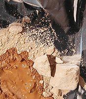

## La laque japonaise urushi
### La laque japonaise urushi, usage en arts plastiques et autres
 **Laque japonaise  
KI-URUSHI**  

Les photos illustrant cet article ont été prises par Shinji YAMADA dans l'atelier de Keisuke ASAI (Japon). Nous les remercions tous les deux pour leur aide précieuse.

Les mots japonais sont écrits en majuscules, à la manière japonaise.

_L'Occident doit presque tout au Japon dans le domaine de la laque. DUNAND, initié vers 1912 par SUGAWARA et surtout Katsu HAMANAKA, qui résida en France, n'ont pas seulement introduit cette technique à l'Ouest du continent - et particulièrement à Paris - : ils en ont fait un procédé nouveau, participant très activement aux innovations de l'Art Moderne. Des artistes chinois, connaissant la laque "sumac" (japonaise et continentale) et [la laque "Coromandel"](gommelaque.html) (continentale), y ont contribué également._

_La laque japonaise traditionnelle est réalisée avec la résine extraite du tronc de l'arbre URUSHI (symbole ci-contre). Elle n'a rien à voir techniquement et chimiquement parlant avec la gomme laque des côtes du Coromandel que nous connaissons habituellement en France et qui n'est diluable que dans [l'éthanol](alcools.html#ethanolpur). On retrouve la laque à base de résine d'URUSHI sur le continent : en Chine, en Corée, à Taiwan, au Vietnam, en Thaïlande et au Myanmar (anciennement Birmanie). Elle a probablement été la première laque du monde._

**Cette résine peu ordinaire est une [émulsion](emulsion.html) naturelle**_._ _Elle peut donc être diluée avec de l'eau ou de l'essence. Le plus souvent, elle est dilué avec de la [térébenthine](essences.html#essencedeterebenthine) ou une [essence de pétrole](essences.html#lessencedepetrole) mais il existe certains traitements à base d'eau._

Sommaire

[La matière première, les précautions à prendre, le champ d'application](laquejaponaise.html#urushisumac)

[Description du procédé](laquejaponaise.html#descriptionduprocessus)

\- [Un produit qui n'est pas anodin](laquejaponaise.html#unproduitquinestpasanodin)

\- [URUSHI et KI-URUSHI](laquejaponaise.html#urushietkiurushi)

\- [Préalable  : outils de polissage](laquejaponaise.html#prealableoutilsdepolissage)

\- [Étape KIJIGATAME](laquejaponaise.html#etapekijigatame)

\- [Étapes SHITAJI et SHITAJIGATAME](laquejaponaise.html#etapesshitajietshitajigatame)

\- [Étape NAKANURI](laquejaponaise.html#etapenakanuri)

\- [Étapes finales](laquejaponaise.html#etapesfinales)

\- [Pigmentation et SUKI-URUSHI](laquejaponaise.html#pigmentation)

\- [UWA-NURI-URUSHI](laquejaponaise.html#uwanuriurushi)

\- [Séchage](laquejaponaise.html#sechage)

[Notes](laquejaponaise.html#notes)

[Substituts occidentaux](laquejaponaise.html#substitutsoccidentaux)

**La matière première, les précautions à prendre, le champ d'application**

L'arbre URUSHI n'est autre qu'un **[sumac](sumac.html)**, _rhus vernacifera_, dit aussi "_arbre à laque_" ou "_vernis du Japon_", arbuste de la famille des anacardiacées (cotinus, faux poivrier, manguier, pistachier, sumac, des térébinthacées) poussant surtout au Japon et en Chine où il donne d'ailleurs, à l'état brut une sève, un colorant jaune, ARAMI-URUSHI.

_Rhus vernaciflua (Japon, Chine, Corée), rhus succedanla (Taïwan et Vietnam) et melanorrhoea usitata (Thaïlande, Myanmar)_ semblent bien les seules variétés permettant de réaliser les laques. _Rhus coriaria_, le _somagh_ persan (dit "_vinaigrier_" en France), donne une épice. Parmi les variétés d'Amérique (sumac de Virginie, _rhus typhina_), on trouve des plantes aux propriétés vraiment très toxiques. Un peu partout dans les zones tropicales, pousse _rhus mollis,_ "sumac amarante", cultivé pour sa beauté, la coloration rouge de ses feuilles. Toute tentative d'élaboration d'une laque avec un sumac mal identifié et non certifié pour cet usage est non seulement aléatoire mais potentiellement dangereuse !

Selon nos informations, la laque japonaise s'applique plus à des objets : récipients traditionnels, boîtes et autres, magnifiques (voir photo ci-dessus), qu'à des meubles, contrairement aux applications continentales usuelles : tables, paravents, etc. Les objets laqués ont fait l'objet de collections vraiment très dorées vers la fin du régime monarchique en France.

**Description du procédé**

_Une description de procédé de réalisation de laques japonaises nous a été confiée par un artiste, maître laqueur japonais, [Keisuke ASAI](quinoussommes.html#keisukeasai) par l'intermédiaire secourable de [Shinji YAMADA](quinoussommes.html#shinjiyamada) à qui nous adressons nos amicaux remerciements._

_Nous devons préciser avant tout qu'il existe au Japon plusieurs écoles et de nombreux procédés._

**URUSHI, ARAMI-URUSHI et KI-URUSHI : précisions**

Le terme URUSHI semble désigner toutes les laques de ce type.

La base est ARAMI-URUSHI, produit brut pouvant être utilisé tel quel. C'est une résine [phénolique](phenol.html) huileuse qui contient de l'URUSHIOL, produit complexe constituant son principe fondamental.

L'urushiol est un mélange de catéchine - voir _[cachou](cachou.html)_ - et [d'antigènes](antigene.html). C'est une substance odoriférante allergène à cause de la présence de ces antigènes (voir [http://www.ctq.qc.ca/juillet97tox.html](http://www.ctq.qc.ca/juillet97tox.html) - voir [CTQ _in_ Références](liensutiles.html#ctq)). Elle fut découverte par Toshiyuki MASHIMA, chimiste japonais, 1874-1962. Sa formule est C15H27(OH)2. Noter que les autres laques à rhus ont un principe actif légèrement différent (le lacol et le thitsiol, C17H31(OH)2).

Le KI-URUSHI est une version purifiée (le radical KI, symbole de gauche, signifie _pur_ dans ce terme) dilué dans un [pétrole lampant](lampant.html) (rarement de l'eau) avec éventuellement du [camphre](camphre.html), donnant plus de fluidité. Le procédé au camphre peut être plus ou moins raffiné. L'une des méthodes, apparemment complexe, nécessite une cristallisation réalisée par réchauffement à l'aide d'une spatule au travers d'un papier japonais.

URUSHI, KI-URUSHI et les dérivés craignent les rayons solaires.

**ATTENTION : ce produit, bien que naturel, n'est pas anodin.**

Les maîtres laqueurs japonais prennent des précautions.

Il est vraiment très important de nettoyer tous les éléments ayant été en contact direct avec ce produit qui peut demeurer actif longtemps, étant huileux donc séchant lentement et pouvant "contaminer" d'autres objets. Utiliser de l'essence puis de l'eau froide et du savon. Éviter de brûler tout résidu : cela dégagerait des antigènes.

On ne réagit jamais lors d'un premier contact, seulement - éventuellement - aux suivants. Par ailleurs, la réaction peut apparaître après quelques heures ou bien après des semaines. Elle se traduit sous des formes de type "_dermatite à Rhus_", pouvant évoquer les effets d'un coup de soleil. Seule l'exposition répétée est réellement dangereuse, d'où l'importance du nettoyage.

Pour éviter ces petits soucis, utiliser des gants jetables et se laver les mains (eau froide, savon) tout de suite après manipulation. Veiller à bien nettoyer aussi les objets ayant été en contact. 

Les réactions aux émanations naturelles, sans combustion, sont très rares.

PRÉALABLE : OUTILS DE POLISSAGE

>   
> La pierre et l'eau, le charbon de bois et l'eau, du bois en poudre, voire du bois de cerf en poudre ou la pâte dentifrice mêlés à de l'huile de colza sont utilisés avec un simple chiffon. Après chaque polissage, on applique un tout petit peu de KI-URUSHI et on essuie (voir [SHITAJIGATAME](laquejaponaise.html#etapeshitajigatame)).

Etape KIJIGATAME (enduction)

> Ici, KI signifie bois, JI veut dire base, GATAME = durcir.
> 
> On passe une couche de KI-URUSHI sur une planche en bois pour faire perdre au support sa capacité d'absorption.

Etapes SHITAJI  et shitajigatame (empâtement)

> Étape shitaji
> 
> > C'est la couche d'empâtement.

> > On fait une pâte avec du KI-URUSHI, du bois en poudre ou plus couramment de la poudre de pierre à aiguiser (dix parts pour cinq à huit d'URUSHI) et un peu d'eau puis on étend cette pâte avec une spatule.
> > 
> > Cette poudre est de l'argile, une terre à diatomées, dite TONOKO et extraite à YAMASHINA, KYOTO. La photo ci-contre montre cette terre en partie mouillée.  
> > Elle est d'une grande plasticité.
> 
>   
> Étape SHITAJIGATAME
> 
> >   
> > L'étape précédente, SHITAJI, présente un danger d'arrachement lors du polissage à cause de la concentration de KI-URUSHI en surface, s'accentuant au séchage. Il est nécessaire de durcir (GATAME) l'élément. On ajoute une couche de KI-URUSHI supplémentaire avec une spatule ou une brosse.  
> 
> Araser la surface à l'eau avec une pierre après durcissement.  
> _On répète ce processus 3 à 5 fois._

Etape NAKANURI (polissage)

>   
> On peint avec du NAKANURI-URUSHI (KI-URUSHI noirci) puis on polit à l'eau avec un morceau de charbon de bois. Le fait de polir est en fait l'un des buts de l'opération.  
> On exécute l'opération 2 à 3 fois.

Etapes finales : pigmentation, lustrage

> Dernière couche avant d'ajouter éventuellement une décoration.
> 
> Apparemment, l'étape de pigmentation n'est pas toujours réalisée, notamment en ce qui concerne les laques ARAMI-URUSHI.
> 
> Pigmentation et SUKI-URUSHI
> 
> > On peint gras avec des KI-URUSHI raffinés, débarrassé de leur eau (KUROME-URUSHI, dits SUKI-URUSHI) et on introduit du pigment. De l'huile et des colorants peuvent être incorporés lors de cette étape.
> > 
> > Avec des oxydes de fer, cela donne ROIRO-URUSHI (ROIRO comme _rouille_).
> > 
> > Avec d'autres pigments, on parle de JOBANA (HANA URUSHI) et KUROBANA, HANA ou BANA signifiant _fleur_ (pour la couleur, peut-être). Les pigments doivent être neutres chimiquement. Oublier par exemple le [blanc de Meudon](terresblanches.html#meudon).
> > 
> > Le SUKI-URUSHI peut être fabriqué par deux types d'opérations appliquées à KI-URUSHI et donnant des résultats différents quoiqu'ayant, comme on l'a dit, le même but, éliminer l'eau de l'émulsion : 
> > 
> > > \- traitement NAYASHI, par brassage. Il apporte de l'homogénéité.
> > > 
> > > \- traitement KUROME, par réchauffement. Il donne la transparence.
> > 
> > 
> > 
> > SUKI signifie à peu près, dans ce contexte, quelque chose comme "transparent". On a vu que KI (symbole ci-contre) pouvait vouloir dire "pur". SU-KI serait donc un peu "super pur" ! De fait, cela signifie "transparent".

> UWA-NURI-URUSHI (Lustrage)
> 
> > UWA-NURI-URUSHI donne un [lustre](lustre.html) déterminé, comme certains vernis ou patines occidentaux.

Séchage

> On a vu sur ce site que les peintures à l'eau se solidifient ("précipitent") par séchage, que les huiles "siccativent" en incorporant de l'oxygène, il nous restait à apprendre que la laque japonaise sèche par prise d'humidité !
> 
> On place les objets à faire sécher dans une boite légèrement aérée (en rotin par exemple) dans laquelle on a disposé un chiffon imbibé d'eau. Le processus dure de six à douze heures à température moyenne ou chaude.

NOTES

Espérons que cette présentation - certes un peu courte - de procédés complexes élaborés au fil des millénaires donnera quelques indications aux visiteurs de Dotapea curieux d'expérimenter cette technique remarquable donnant des résultats tridimensionnels dont la valeur est internationalement reconnue.

Il est possible de se procurer du sumac en France, notamment chez [Laverdure](refijkl.html#laverdure). Tout autre détaillant ou grossiste peut nous communiquer ses coordonnées - [cliquer ici](ecrire.html). Nous ignorons pour l'instant si ce sumac correspond bien à URUSHI, à KI-URUSHI ou à un autre produit mais une enquête est en cours.

Notre correspondant japonais nous a fourni des URUSHI de fabrication chinoise qui peuvent peut-être se trouver à Paris. Enquête en cours. Les produits _made in Japan_ coûtent vraiment beaucoup plus cher, même au Japon. Ils sont d'une grande finesse et surtout adaptés à des travaux de très haute qualité.

Dernière précision : parmi les instruments utilisés au Japon, il existe des pinceaux dont les poils sont... des cheveux ! Ils sont plaqués entre deux lattes de bois. A cause de l'usure, on doit littéralement "tirer/couper les cheveux". Voir photo (instruments de gauche).

Substituts occidentaux et accommodements contemporains

Les plus proches de la laque URUSHI sont phormophénoliques. On les nomme "vernis gras".

Une marque espagnole importe du Japon des tubes de laque correspondant à peu près au produit japonais, mais sans doute en plus synthétique. La pâte est soluble dans la térébenthine.

 [Communication](http://www.artrealite.com/annonceurs.htm) 

