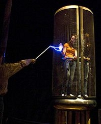

## La peau du métal - Chapitre XXX des Dialogues de Dotapea
### La peau du métal - Chapitre XXX des Dialogues de Dotapea
 Navig. page/section

  
  

\_\_\_\_\_

**Pages soeurs**

[I, A propos des liants](chap01liants.html)  
[II, Bulles, siccativ., struct. élec.](chap02bullessiccativation.html)  
[III, Caséine, phosphore, dissociation](chap03caseine.html)  
[IV, Les orbitales](chap04orbitales.html)  
[V, L'aérogel](chap05aerogel.html)  
[VI, Polarisation de la lumière](chap06polaris.html)  
[VII, Sfumato et diffusion Rayleigh](chap07rayleigh.html)  
[VIII, Les interférentielles](chap08interferences.html)  
[IX, Dextrine, farine et chiralité](chap09dextrine.html)  
[X, L'ocre bleue](chap10ocrebleue.html)  
[XI, Les métamatériaux](chap11metamateriaux.html)  
[XII, Le jaunissement](chap12jaunissement.html)  
[XIII, Laser etc.](chap13laser.html)  
[XIV, L'holographie](chap14holographie.html)  
[XV, L'holographie numérique](chap15holographienum.html)  
[XVI, Extérieur, intérieur, chaux](chap16interieurexterieurchaux.html)  
[XVII, L'électrolyse et les ions](chap17electrolyseions.html)  
[XVIII, L'électricité, un peu plus loin](chap18electriciteplusloin.html)  
[XIX, Oxydation, métaux](chap19oxydationsmetaux.html)  
[XX, Les échelles](chap20echelles.html)  
[XXI, Nature et évolution des résines](chap21resines.html)  
[XXII, Le mouillage pigmentaire](chap22mouillage.html)  
[XXIII, La molette](chap23molette.html)  
[XXIV, Blanche neige](chap24blancheneige.html)  
[XXV, Lumière et matière](chap25lumiereetmatiere.html)  
[XXVI, Magnétisme](chap26magnetisme.html)  
[XXVII, Ambre et vieilles branches](chap27ambre.html)  
[XXVIII, L'origami miroir](chap28origamimiroir.html)  
[XXIX, Le feu](chap29feu.html)  
XXX, Peau du métal  
[XXXI, La ville en un souffle](chap31bellastock.html)  
[XXXII, Oxyder des matériaux](chap32oxydermateriaux.html)  
[XXXIII, Ocre bleue, une solution](chap33ocrebleuesimulation.html)

\_\_\_\_\_

Copyright © www.dotapea.com

Tous droits réservés.  
[Précisions cliquer ici](droitscopie.html)

**Les dialogues sur la physique-chimie  
appliquée aux arts**

**Chapitre** **XXX**

**La peau du métal**

dial   dial   dial

Ce court chapitre est un retour sur un sujet qui a été abordé dans deux autres chapitres des Dialogues.

Attention, il est un peu "technique". Il nous a cependant paru s'imposer car il fallait une mise au point sur des sujets abordés antérieurement, auxquels nous donnons ici une articulation cohérente au travers du concept de "peau du métal".

Cette mise au point nécessaire, parsemée de quelques "points forts" - notamment sur la ["transition"](chap30peaudumetal.html#transition) - pourrait aussi être un point de départ pour d'autres travaux.

Voici donc la trentième discussion entre Jean-Louis, physico-chimiste au CNRS, et Emmanuel, candide.

Emmanuel : Jean-Louis tu évoques dans une discussion récente (_L'origami miroir_, [lire le passage](chap28origamimiroir.html#peaudumetal)) l'impossibilité d'un champ électrique dans un matériau métallique conducteur, ce qui fait qu'un photon ne peut pas "entrer" dans un métal.

Mais dans le chapitre XVII tu dis que dans un fil électrique il y a des photons qui transmettent de l'information ([lien](chap17electrolyseions.html#filelectrique)).

Donc ma question est comment cela s'articule ?

Est-ce que tu veux dire qu'un champ électrique ne peut pas entrer dans un métal mais que dans un métal il peut y en avoir un et que la particularité du métal est d'avoir une... disons une sorte de cuirasse ? 

Jean-Louis : Ce n'est pas un sujet facile.

Les photons sont le vecteur de l'interaction électromagnétique, donc il y en a littéralement partout. Y compris dans les fils métalliques bien sûr.

Vis à vis des champs électriques "extérieurs", les conducteurs métalliques se comportent comme des écrans, c'est la cage de Faraday.

Les champs extérieurs s'annulent dans une zone de la surface appelée peau, plus ou moins épaisse selon les métaux, la fréquence, etc.

Si tu appliques une différence de potentiel aux deux bouts d'un fil, c'est différent car les électrons du fil subissent ce champ dans le fil même. Cependant, les courants qui vont circuler dans ces fils seront eux aussi cantonnés à cette fameuse épaisseur de peau.

Il existe cependant des cas où l'intérieur du fil "ne sert à rien", tout le courant circulant en surface. C'est une des raisons pour lesquelles on étame, argente ou dore la surface de certains fils de cuivre qui travaillent à haute fréquence. Pour le courant "ordinaire" à 50Hz l'épaisseur de peau est, de mémoire, d'environ 1cm. Donc tout le courant passe "dans" le fil.

**\[La peau et l'évanescence\]**

Emmanuel : Dans le chapitre XXVIII, tu évoques \[[lien](chap28origamimiroir.html#peaudumetal) cité ci-dessus\] une zone où les photons venant de l'extérieurs donnent à l'approche du métal une onde évanescente (voir aussi une [évocation des ondes longitudinales](chap25formesmotsechelles.html#longitudinale), chap. XXV). Cette onde correspond-elle à la "cage de Faraday" que tu évoques ? 

Expérience de la cage de Faraday au [Palais de la Découverte](http://www.palais-decouverte.fr/index.php).

Voir aussi ce [lien](http://www.google.fr/#hl=fr&source=hp&q=%22cage+de+faraday%22&aq=f&aqi=g10&aql=&oq=&gs_rfai=&fp=ef4cf840a8f08f92) vers une recherche Google sur "cage de Faraday".

Jean-Louis : J'aurais envie de dire non. En général la cage de Faraday est utilisée pour écranter des champs statiques, même si elle fonctionne aussi avec les champs alternatifs, en acceptant des limitations en fonction de la fréquence et de la nature du matériau.

Le terme écranter réfère au fait de faire écran

Parenthèse

L'effet de peau qui limite la circulation des courants alternatifs à une zone proche de la surface des conducteurs résulte de l'interaction des courants induits (par les champs variables) avec le courant principal.

Les photons, qui sont un champ électromagnétique variable de très très haute fréquence ne pénètrent pas les matériaux conducteurs. C'est d'ailleurs pour ça que les métaux ont cet aspect métallique, brillant.

Aucune quantité physique ne peut passer brutalement de non-nul à nul. Donc la lumière qui est à l'extérieur du métal ne disparaît pas brutalement à la surface. Elle pénètre "un peu" dans le métal, sur une certaine distance. Ce peu de lumière qui pénètre dans le métal s'appelle "onde évanescente".

Une onde qui fait transition

Emmanuel : D'accord, on ne peut pas assimiler le phénomène de Faraday à l'onde évanescente. Sinon métaphoriquement, comme tu le faisais en début de chapitre.

Je reviens juste sur un point : tu écris "_Les photons, qui **sont** un champ électromagnétique variable de très très haute fréquence (...)_", mais comme beaucoup de non-initiés je pense, j'ai une tendance paresseuse à les voir seulement comme agents et pas comme des champs eux-mêmes. Tu as sûrement raison mais cette précision est-elle indispensable, ne risque-t-elle pas de faire cafouiller les candides dans mon genre ?Jean-Louis : C'est vrai que c'est pas facile, mais précisément c'est la dualité onde-corpuscule, les photons sont les deux à la fois et c'est parce qu'ils sont une onde qu'ils sont réfléchis par les métaux.

 

 

Le photon vu lui-même comme un champ électromagnétique

Emmanuel : Dans l'un des premiers chapitres ([le sixième](chap06polaris.html)), on voit bien en effet, notamment dans la vidéo reprise ci-contre, qu'il y a un champ autour du photon lui-même... ou plutôt, le photon se déplace dans son propre champ, autour de sa trajectoire.

Et il est lui-même agent d'un champ.

Drôle d'animal, ce petit photon.

[Chapitre suivant](chap31bellastock.html)

 

  [Communication](http://www.artrealite.com/annonceurs.htm)