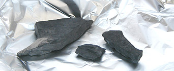

## La pierre noire
### La pierre noire, usage en arts plastiques
 **La pierre noire**  

L'appellation est approximative, mais aujourd'hui on identifie la pierre noire à l'ampélite.

L'ampélite est un mélange naturel de carbone et [d'argile](argile.html), soit une sorte de [mine de crayon](crayon.html) naturelle. Les tracés obtenus sont très comparables à ceux de crayons ou de mines graphite, bien que beaucoup moins homogènes.

Elle a été employée dans différents procédés gras et aqueux (notamment [à fresque](fresque.html) probablement), tout comme peut l'être le [graphite](graphite.html).

Les crayons dits "pierre noire" correspondent-ils réellement à ce minéral naturel que l'on trouve notoirement en Bretagne ? Nous n'avons aucune information à ce sujet. Il est très possible par contre que l'appellation pierre noire n'ait pas correspondu au minéral que nous désignons ainsi de nos jours. On évoque une "pierre noire" comme composant d'une ancienne encre de Chine (cf. [Perego](livres.html#perego), p.57), mais de quoi s'agissait-il au juste ?

 [Communication](http://www.artrealite.com/annonceurs.htm) 

