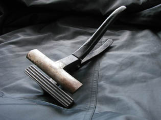

## La pince à tendre
### La pince à tendre, usage en préparation de supports
 **La pince à tendre**  

_Comme son nom ne l'indique pas, son rôle n'est pas seulement de tendre, de tirer, mais aussi de maintenir, de tenir tendu ("mordre")._

_Une pince à tendre ne doit pas relâcher prise : elle doit "tenir mordue" la toile sans en broyer la trame. Certains modèles, pas forcément plus performants (ni moins) que les autres, sont pourvus d'un anneau de serrage._

Il est souhaitable d'éviter les pinces à tendres dentelées qui ont tendance à broyer les trames et de leur préférer les modèles **rainurés** (voir image).

De même, il vaut mieux éviter tout pince ayant tendance à cisailler (tenailles) ou possédant une surface mordante étriquée (risque de déchirement).

Certaines "pinces de tapissiers" conviennent. Il n'est pas forcément plus aisé de s'en procurer et cela peut s'avérer aussi coûteux.

L'utilisation conjointe de deux à quatre pinces permet un réglage équilibré dans la perspective d'une tension au plus près du "[droit fil](d.html#droitfil)" (trame parallèle aux bords du châssis). La pose d'agrafes temporaires (voir [Tension sur châssis](tensionsurchassis.html)) peut être substituée par un serrage effectué par une paire de pinces.

