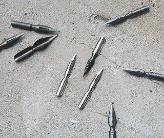

## La plume
### La plume, usage en arts plastiques
 **La plume**  

Cette page est en cours de développement. Les témoignages des visiteurs sont bienvenus. [Cliquer ici](ecrire.html)

La plume a remplacé le [calame](calame.html). D'abord prise à l'oiseau, puis fabriquée à l'aide de métal [galvanisé](galvaniser.html) à l'ère industrielle, elle semble avoir perdu de son attrait de nos jours mais demeure un outil très importants pour les arts plastiques. Pour exemple, les fabuleux travaux de Rembrandt au sujet desquels on a parlé « d'écriture ».

Note

Une utilisation inhabituelle de la plume d'oie : tremper le bout opposé à la pointe dans la peinture. Cela permet de créer des tracés exploités assez couramment en peinture décorative dans le domaine des faux marbres.

Note

Voir [_plume du peintre_](pinceaux.html#plumedupeintre).

 [Communication](http://www.artrealite.com/annonceurs.htm) 

