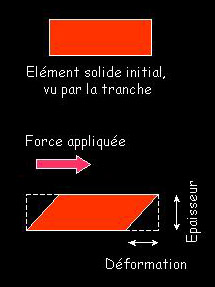
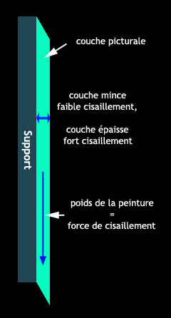

## La rhéologie et la thixotropie
### La rhéologie et la thixotropie, phénomènes importants pour les arts plastiques
 Navig. page/section

  
  

\_\_\_\_\_

**Pages soeurs**

[Les dialogues de Dotapea](dialoguesdotapea.html)  
[Les échelles](echelles.html)  
[Gaz, liquides, solides (phases)](gazliquidessolides.html)  
Rhéologie, viscosité et thixotropie  
[Diluants, solvants, dissolvants](diluantssolvants.html)  
[La saponification](saponification.html)  
[Saturation](saturation.html)  
[Les liaisons entre atomes](liaisons.html)  
[La conduction électrique](conductionelec.html)  
[Oxydants/réducteurs/acides/bases](oxyreducacidesbases.html)  
[Oxydoréduction](oxydoreduction.html)  
[Les acides](acides.html)  
[Les alcalis](alcali.html)  
[Les sels, leur formation](formationdesels.html)  
[L'émulsion](emulsion.html)  
[L'ester](ester.html)  
[L'ion et l'isotope](ion.html)  
[Electronégativité, polarité](electronega.html)  
[L'onde](onde.html)  
[La tensioactivité](tensioactivite.html)  
[Cisaillement et compression](cisaillecompr.html)  
[Différenciation magmatique](differenciatmagma.html)  
[Pâtes, charges et agrégats](pateschargesagreg.html)  
[Le colloïde](colloide.html)  
[Toxicité, nocivité, pollution](toxicite.html)  
[Distillation, raffinage](distillationraffinage.html)  
[La photoluminescence](photoluminescence.html)

\_\_\_\_\_

Copyright © www.dotapea.com

Tous droits réservés.  
[Précisions cliquer ici](droitscopie.html)

**La rhéologie,  
la viscosité et la thixotropie**

La thixotropie envisagée plus spécifiquement dans la perspective  
des arts plastiques est traitée dans un [article séparé](thixotropie.html).  
A lire également, un complément dans le Courrier des Lecteurs. [Lien](courrierdeslecteurs2010a120.html#20100305dmvh)

_La science qui étudie les déformations des corps en fonction des contraintes qui leur sont appliquées est la rhéologie. La devise de la société américaine de rhéologie est la phrase d'Héraclite :_ παντα ρει_, panta rhei, tout s'écoule. C'est dire..._

Le coefficient qui lie la vitesse de déformation (i.e. le taux de déformation par seconde) à la déformation s'appelle la [viscosité](viscosite.html). Voir encadré ci-contre.

> \* Les liquides dont la viscosité est constante quel que soit la vitesse de déformation sont dits "newtoniens". Il y en a très peu.  
> [Exemple](rheologie.html#eau)
> 
> \* Les liquides dont la viscosité augmente avec le taux de déformation sont rhéo-épaississants.  
> [Exemple](rheologie.html#pateapizza)
> 
> \* Les liquides dont la viscosité diminue avec la vitesse de déformation sont rhéo-fluidifiants ou thixotropes.  
> [Exemple](rheologie.html#thixotrope)
> 
> \* Il y a enfin des "liquides à seuil" ou "de Bingham", qui ne commencent à couler que quand la déformation qui leur est appliquée dépasse un certain seuil.  
> [Exemple](rheologie.html#fromageblanc)

**Quelques exemples**

...souvent tirés de l'agro-alimentaire où l'on trouve les comportements les plus fous :

> \* comportement newtonien : l'eau. L'eau, étant donné la taille de ses molécules est incroyablement visqueuse. Comparer par exemple avec l'acétone, dont la molécule est pourtant beaucoup plus grosse. C'est à cause des "liaisons hydrogène" qui se forment entre les molécules d'eau. Dans certaines limites, l'huile est un liquide newtonien. Plus visqueuse que les liquides simples car formée de longues molécules.
> 
> \* comportement rhéo-épaississant : la pâte à pizza. Si on la malmène, elle est plutôt dure, on peut la mettre en boule. Mais si on pose la boule, elle aura tendance à couler.  
> Les Anglo-saxons connaissent un produit qui s'appelle "Silly Putty", à base de silicone ou d'autres produits. Façonnée en boule, elle rebondira contre les murs si on la jette violemment, mais posée sur une surface elle coulera partout.
> 
> On peut aussi fabriquer un liquide rhéo-épaississant en mélangeant de l'amidon avec de l'eau. Mettre assez d'eau pour que la pâte soit juste liquide. Si on touille, ça coule, si on frappe la surface avec la cuiller, on sent une texture solide.
> 
> \* comportement rhéo-fluidifiant (thixotrope) : le ketchup ! Pour qu'il sorte du bocal on tape sur le fond.  
> Des peintures aussi, bien sûr, qui collent au pinceau et au mur (pas de [cisaillement](cisaillecompr.html)) mais qui s'étalent et coulent quand on les travaille avec ce même pinceau.  
> Une manière simple et très courante, surtout en peinture, pour rajouter de la tenue, c'est-à-dire de la thixotropie aux peintures est d'y disperser des particules de silice. Du sable propre et fin peut parfois convenir.
> 
> \* liquide à seuil : le fromage blanc. Il faut un minimum de contrainte pour qu'il commence à couler. On pourrait classer la mayonnaise dans ce cas aussi. Les peintures "gels", "qui ne coulent pas", sont aussi des liquides à seuil.
> 
> On connaît aussi le miracle du "sang de Saint Janvier" qui est contenu "coagulé" dans une ampoule mais qui se liquéfie régulièrement tous les ans quand la procession qui le porte l'a secoué suffisamment. L'Église refuse qu'elle soit analysée mais il a été possible de fabriquer un gel rhéo-fluidifiant avec du chlorure ferrique, du sel de cuisine et du carbonate de calcium, tous matériaux disponibles aisément depuis les années 1390, date d'apparition de la fameuse ampoule, bien que le saint soit mort vers l'an 300.

Disons encore qu'un matériau qui n'est pas newtonien est dit viscoélastique.

Ajoutons quelques exemples de mesures de la viscosité dans l'article _viscosité_ du glossaire. [Cliquer ici.](viscosite.html#exemplesviscosites)

Un solide peut subir une contrainte statique : il peut être déformé par l'application d'une force constante dans le temps. Comme par exemple un élastique ou un ressort que l'on tendrait entre deux doigts. La contrainte est définie comme le rapport de la déformation sur l'épaisseur.

Un liquide (et c'est une définition), n'offre pas de prise aux forces constantes. On ne peut pas prendre de l'eau entre deux doigts et si on "appuie" à la surface de l'eau on ne sent aucune résistance.  
Par contre, si la contrainte est fonction du temps (par exemple si l'on agite la main dans l'eau), on ressent une force, et cette force est fonction (linéaire pour les [liquides newtoniens](rheologie.html#liquidesnewtoniens)) de la vitesse d'agitation. La constante de proportionnalité est la viscosité.

Dit d'une autre manière :

> \- une force appliquée à un matériau implique une déformation  
> \- cette déformation est proportionnelle à la force exercée  
> \- la proportion force appliquée/déformation est constante (pour un matériau)  
> \- cette proportion, c'est la viscosité. Par exemple, la déformation (proportionnelle à la force appliquée) de l'eau est énorme. L'eau est extrêmement visqueuse comparativement à la taille de la molécule qui la constitue.

Ci-dessous, un exemple où la force appliquée n'est autre que le poids d'une peinture, parallèle à son support :

Sur le concept de cisaillement, lire [l'article qui lui est consacré.](cisaillecompr.html)

_[(s) Jean-Louis](quinoussommes.html#jeanlouis)_ 

 

 

 [Communication](http://www.artrealite.com/annonceurs.htm) 

