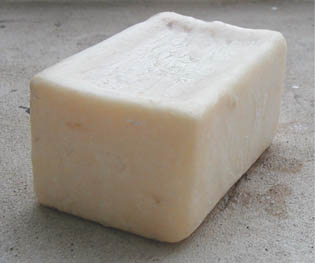

## La saponification
### La saponification, intérêt en arts plastiques et autres domaines
 **La saponification et l'estérification**

_[English text](english/saponification.html) _  

_Accès direct aux Mesures  
(indice d'ester, indice de saponification, indice d'iode)  
_\--> [cliquer ici](saponification.html#mesures)

La saponification est la réaction chimique suivante :

[Ester](ester.html) + [eau](eau.html) ou [base](base.html) 

donnent

La réaction inverse existe. C'est _l'estérification_ :

acide + alcool ou phénol

donnent

ester + eau

_La proportion d'esters obtenus dans un laps de temps donné est fonction du type d'alcool : avec un monoalcool ([éthanol](alcools.html#ethanolpur)), elle avoisine les 70%, avec un [dialcool](dialcool.html) (glycol), les 60% et avec un [trialcool](polyalcoolpolyol.html) ([glycérol](glycerine.html)), 10%. Le type de [fonction alcool](alcool.html#fonctionsalcool) intervient également. En fait, plus l'alcool est complexe, plus la réaction est complexe, donc lente. Des molécules de grande ampleur se forment plus facilement avec des polyalcools tandis que les probabilités de réactions d'estérification sont plus faibles._

Les deux réactions chimiques, saponification et estérification, peuvent former un cycle qui s'interrompt avec l'évaporation et/ou parce que l'une des deux réactions est plus lente que l'autre (généralement l'estérification). Ce cycle, parfois, redémarre en milieu humide ou au contact d'éléments alcalins s'il reste des esters ou en présence d'alcool s'il reste des acides et surtout si les propriétés des éléments chimiques obtenus le permettent.

Ce processus n'est connu que depuis la seconde moitié du XIXème siècle et n'a été confirmé scientifiquement qu'après la première guerre mondiale.

**Un exemple classique d'estérification :  
la formation d'un [triglycéride](t.html#triglycerides)**

On a d'un côté les [fonctions alcool](alcool.html#fonctionsalcool),

CH2OH   +   CHOH   +   CH2OH, soit une [glycérine](glycerine.html) (glycérol)

et de l'autre, trois acides organiques ([cf. carboxyles](carboxyle.html))

r1-COOH   +   r2-COOH   +    r3-COOH.

Cela donne

CH2OCO-r1   +   CHOCO-r2   +   CH2OCO-r3 \[le triglycéride\]

+   3 H2O

Le concept de savon s'est affiné depuis. Lire [un texte consacré aux amphiphiles](chap01liants.html#amphiphile) in _Les dialogues de Dotapea, chap. I, A propos des liants_ et un [autre passage](chap01liantsavon.html) sur la même page.

En ce qui concerne les "objets savons" (aux sens cosmétique, domestique, nettoyant), signalons que ceux-ci sont obtenus à l'aide de soude [potassique](potasse.html) ou [sodique](soude.html) et d'une ou plusieurs huiles généralement végétales. Certaines de ces huiles ne sont autres que celles qu'utilisent les artistes, les décorateurs, les ébénistes et les cuisiniers. Pour cette raison, nous avons référencé [en fin d'article](saponification.html#mesures) certains outils qui peuvent servir dans l'exercice de ces différents métiers.

Quel est le rôle de l'objet savon commun ? Essentiellement, il solubilise les graisses. A l'opposé, en peinture décorative ou artistique - nettoyage des outils et surfaces mis à part -, on utilise plus souvent le savon comme un matériau "final" faisant partie de l'oeuvre.

Plus généralement, certaines peintures faisant intervenir acides, bases et alcools posent un problème de [réversibilité](liants.html#reversibilite) qui peut être résolu par des dosages et choix de produits équilibrés et réfléchis donnant un résultat raisonnable et adapté moyennant une conservation tout de même assez attentive. D'autres peintures (ou autres produits) ne sont pas réversibles. La saponification ne peut plus être "redémarrée" avec des moyens normaux dès lors que l'eau s'est évaporée.

_Par exemple, la combinaison acide phtalique/glycérol, une fois sèche, donne une substance particulièrement résistante qui n'est autre que la [peinture glycérophtalique](glycerophtalique.html). Cet ester forme une couche dure qui, ne réagissant plus à l'eau, n'a plus guère de chance de se saponifier... en théorie._

En théorie seulement car un support très alcalin (béton frais, plâtre frais, chaux) aura toujours tendance à agresser les peintures habituelles (huile, acrylique, glycéro, etc.), qui donnent des esters. Le terme "saponification" désigne d'ailleurs parfois en peinture décorative un phénomène de décomposition des liants provoqué par l'application de peinture sur ce genre de supports.

_L'environnement et le dosage de tous ces corps chimiques sont toujours déterminants pour un usage, un contexte donné._

De même, certains liants dits "saponifiés" (les cires saponifiées, par exemple) sont finalement fort stables une fois secs. Il n'existe pas de règle générale sur le plan de la conservation au-delà des propriétés de chaque liant. Un [alcali](alcali.html) puissant comme [l'ammoniaque](ammoniac.html), par exemple, déclenche une réaction de dissolution radicale même sur des peintures à l'huile sèches depuis des années, alors qu'une averse suffira à laver une gouache oubliée à l'extérieur. Chaque liant, chaque procédé de peinture, chaque ester plus généralement, a son comportement spécifique. Tout cela se mesure ([voir ci-dessous](saponification.html#mesures)).

Notes

> Dans certaines conditions - présence de [métaux alcalinoterreux](alcalinoterreux.html) \-, une saponification/estérification risque de former des écumes, des dépôts de [sels minéraux](selsmineraux.html), des blanchiments et autres effets picturaux plus ou moins souhaitables.
> 
> L'élimination _mécanique_ des esters, des acides et des alcools n'est rien d'autre qu'un nettoyage - ce qui peut d'ailleurs être envisagé, pourquoi pas, dans certaines perspectives artistiques originales où il s'agirait de faire mousser la peinture, au sens... propre.

Voir absolument [Les sels, leur formation](formationdesels.html), [gras, graisse](gras.html) et [savon](savon.html), [émulsion colle/huile/savon noir](liantsemulsions.html#emulsionenduitausavonnoir), [savon noir in glossaire](savonnoir.html), [soude](soude.html), [soude caustique](soudecaustique.html) et [potasse](potasse.html) _in_ [glossaire](glossaire.html).

**Mesures (indice d'ester, indice de saponification et indice d'iode)**

On peut mesurer différentes propriétés d'un [ester](ester.html).

> \* L'indice d'ester indique la quantité de [potasse](potasse.html) (une matière alcaline utilisée comme référence) nécessaire pour obtenir une réaction de saponification. Il représente en quelque sorte la "solidité" d'un ester.
> 
> \* L'indice de saponification est également exprimé par une quantité de potasse, correspondant cette fois à l'obtention d'un [pH](ph.html) neutre.
> 
> Visite conseillé :  
> [soapcalc.com/calc/SoapCalcWP.asp](http://www.soapcalc.net/calc/SoapCalcWP.asp)  
> Cette page destinée à aider les savonniers dans leur  
> "calcul de potasse" permet notamment  
> de connaître cet indice pour différents corps gras  
> utilisés par d'autres corps de métiers.  
> Ce lien a été rétabli en 2013.  
> S'il rompait à nouveau, merci de bien vouloir [nous le signaler](ecrire.html).
> 
> \* Enfin, l'indice d'iode, lui, concerne directement la saturation de l'ester. Il est très important lorsqu'il s'agit, pour un artiste ou un ébéniste (entre autres spécialités), de savoir si l'huile qu'il compte utiliser pour peindre sera "siccative". [Cliquer ici.](saturation.html#indicediode)

 [Communication](http://www.artrealite.com/annonceurs.htm) 

