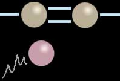
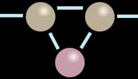

## La saturation
### La saturation, concept physico-chimique
 **La saturation**

_Accès direct indice d'iode_  _: [cliquer ici](saturation.html#indicediode)_

Les substances saturées ne peuvent s'allier à d'autres substances car elles ont déjà engagé toutes les liaisons possibles ([valence](valence.html) maximale), c'est-à-dire qu'une liaison avec un autre corps provoquerait une rupture de la molécule initiale.

C'est une liaison multiple entre deux atomes, au sein d'une molécule, qui joue le rôle "insaturateur", caractéristiques de la plupart des liants et colles utilisés par les artistes. Elle permet en effet d'engager une liaison avec une autre molécule (ou atome) sans provoquer une rupture.

Donnons un illustration graphique simplifiée, un exemple.

Sur la première image, nous faisons un zoom sur une double liaison entre deux atomes situés à l'intérieur d'une molécule. Un troisième atome (couleur guimauve) approche de cette formation.

Dans la seconde image, l'une des deux liaisons s'est rompue pour se reporter, de part et d'autre, sur le troisième élément tandis que l'autre liaison continue à maintenir la cohésion de l'ensemble. Cette partie de la molécule est maintenant saturée. Aucune rupture de la chaîne n'a eu lieu. Le "corps" de la molécule a véritablement intégré un nouvel élément. Savoir si cette union est durable est une autre question.

**Ce n'est qu'un cas de figure parmi d'autres.** Par exemple, chaque atome de la molécule originelle peut se lier non pas avec un seul élément tiers, mais avec deux atomes distincts, ou peut engager davantage d'électrons dans l'échange (voir [Covalence](covalence.html)). Des liaisons électroniques triples ou même quadruples existent.

D'autre part, le ou les atomes intégrés peuvent parfaitement appartenir à un ensemble moléculaire. C'est de cette manière que s'opère la formation de très grosses molécules, les [polymères](polymere.html). Autre exemple : voir ci-dessous, _[Mesure de la saturation](saturation.html#indicediode)_.

Pour donner une représentation à notre échelle du concept de saturation en même temps qu'une explication directe du choix de ce terme, supposons une substance A insaturée et une substance B susceptible de se lier à la substance A. Lorsque l'on met en solution les deux substances, si B est en quantité excédentaire par rapport aux possibilités de liaisons de A, B finit par former un dépôt au fond du contenant (s'il est plus lourd que A, sinon, il forme une couche supérieure ou s'évapore : selon sa nature, il se différencie à sa manière).

L'insaturation n'est pas sans conséquences sur la coloration. A ce sujet lire le chapitre XII des Dialogues de Dotapea, _[Le jaunissement.](chap12jaunissement.html)_

**Mesure de la saturation : l'indice d'iode**

[Lire l'article du glossaire consacré à l'iode.](iode.html)

Cette mesure consiste à mettre en présence de grandes quantités de diiode (typiquement, deux iodes liés par un chlore et de l'acide acétique, soit I2(acide) + Cl(acide) ) la ou les doubles liaisons présentes dans un ester gras. A la fin de l'expérience (soumise à un protocole complexe), la quantité de molécules iodées en présence est en quelque sorte soustraite à la quantité initiale, permettant de savoir avec précision combien de diiodes ont été capturés par les doubles liaisons.

On obtient un chiffre représentant le degré d'insaturation du corps analysé.

Voici quelques données concernant différents corps gras. Les deux premiers exemples donnent une bonne représentation de l'importance de la proportion d'acide linoléique et de ses [variantes CLA, voir glossaire](linoleiquelinoleniquealc.html).

 

Deux exemples de substances brutes

 

Indice d'iode

acide linoléique

181

acide oléique

90

 

Différentes huiles

 

Indice d'iode

huile de lin, certaines huiles de poissons

175-200

huile de carthame

135-150

huile de noix

145

huile d'oeillette

131-151

huile de soja

120-143

huile de tournesol (variété non "oléique")

110-143

huile de maïs

103-128

huile de colza

96-100

huile d'arachide

80-105

huile d'olive

80-90

huile de ricin

85

huile de palme

25-32

Ces chiffres, provenant de plusieurs sources, sont fournis à titre indicatif, sans aucune garantie d'exactitude. D'ailleurs, tout dépend du mode d'extraction.

Visite conseillé :  
[soapcalc.com/calc/SoapCalc.asp](http://www.soapcalc.com/calc/SoapCalc.asp)  
Cette page destinée aux savonniers donne l'indice d'iode  
(et autres données) de différents corps gras

 [Communication](http://www.artrealite.com/annonceurs.htm) 

