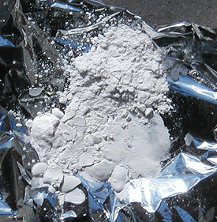

## La silice
### La silice, usage en peinture
 **La silice (arts picturaux)**

_Accès direct Silice colloïdale --> [cliquer ici](silicepeinture.html#silicecolloidale)_

La [silice](silice.html) est assez connue pour ses multiples emplois en sculpture et arts du feu (terre, verre).

Elle l'est moins en tant que produit auxiliaire en peinture. Il faut dire que les argiles (même le très pur [kaolin](kaolin.html)) n'ont pas très bonne réputation : elles sont cassantes, font perdre leur viscosités aux liants, craquèlent, etc.

Et pourtant, Dotapea a pu recenser quatre utilisations de la silice dans de hauts domaines des arts picturaux et décoratifs :

> \* l'emploi de [terres à diatomées](diatomees.html) pour [la laque japonaise](laquejaponaise.html). Elle sert de charge pour [l'impasto](empatement.html) ;
> 
> \* l'emploi de "[tripoli](tripoli.html)" pour les patines en ébénisterie ;
> 
> \* l'emploi de "silice colloïdale" tant en peinture décorative qu'en peinture artistique - [voir ci-dessous](silicepeinture.html#silicecolloidale) ;
> 
> \* l'emploi de [sable](sable.html) en peinture artistique ou décorative.

Dans chaque cas, ce sont des propriétés très différentes de la silice qui sont mises à contribution.

Le sable et les autres produits étant traités sur d'autres pages, nous évoquerons uniquement dans celle-ci la silice colloïdale parce que c'est elle qui intéresse les peintres en premier lieu.

**La silice colloïdale**

Son procédé de fabrication aurait été mis au point par Théodore Schwenk, un spécialiste de l'hydrodynamique contemporaine qui s'est notamment intéressé à l'argile (information non confirmée à ce jour). Elle se présente sous la forme d'une poudre très fine (haut de l'image ci-dessous).

L'adjectif "[colloïdal](colloide.html)" ne doit pas induire en erreur : il ne s'agit pas d'une "colle de silice". Le produit montre bien une certaine viscosité à la mise en solution bien caractéristique des colloïdes, mais s'il n'est pas adjoint d'un liant ou d'une colle, il retombe en poudre une fois sec (cf. image). Si on le mouille de nouveau, il retrouve ses propriétés colloïdales.

Ce caractère colloïdal est extrêmement important dans le domaine des charges pour la peinture. Le problème des charges "cristalloïdes" - qui sont une majorité -, est qu'elles sont totalement dépourvues de réaction à leur environnement et "tombent" dans les pâtes de peinture comme elles tomberaient dans un verre d'eau ou presque, entraînant avec elles force accidents picturaux. La silice colloïdale est donc une charge particulièrement intéressante. Par contre, il faut reconnaître qu'elle donne une pâte certes transparente, mais _un peu grisâtre à sec._ Cela empêche de l'employer massivement pour des travaux où l'on recherche la pureté de la couleur ou la transparence.

D'ailleurs, elle n'est pas toujours employée comme charge : elle est également présente dans différents médiums et vernis du commerce car elle présente des vertus spécifiques liées à sa grande [plasticité](plastique.html). Par exemple, le médium cristal pour peintures à l'huile, simple mélange d'huile d'oeillette et de silice colloïdale, a une particularité : _il conserve les stries laissées par la brosse_.

La silice colloïdale donne à la pâte ou au vernis un aspect satiné ou mat en fonction des proportions. Elle est un agent matifiant fort puissant. Elle semble un peu "boire" les liquides et donne vraiment une pâte "cohérente" bien différente de celle que l'on obtient avec les cristalloïdes. On sent qu'il y a vraiment conjugaison de propriétés distinctes et non adjonction d'un produit neutre.

Elle est vendue par certains détaillants spécialistes des produits pour les arts plastiques, parfois aussi chez les spécialistes de la décoration.

_Chimie_

Différentes formulations sont signalées, notamment une base d'acide silicique Si(OH)4 utilisée sous forme de gel en pharmacologie et sans doute pour d'autres usages liés au corps où l'on signale soit de faibles acidités, soit la neutralité. De toute façon, tout dépend de si l'on parle du précurseur ou du résultat. Le résultat est de la silice non-cristalline, aussi stable, neutre et pratiquement inerte qu'une vitre ou un verre.

Essayons d'en dire un peu plus sur la nature de ce que l'on nomme silice colloïdale. Il existe deux façons d'obtenir un colloïde siliceux, les deux donnant de toute façon de petits agglomérats de SiO2 :

> \* partir de silice, auquel cas au moment de la mise en solution le résultat risque d'être décevant car c'est un produit très peu soluble (le verre ne se dissout pas beaucoup !),
> 
> \* partir de Si(OH)4 ou d'autres molécules susceptibles de se ré-agencer d'une manière ou d'une autre en silice sous la forme d'agglomérats colloïdes. On obtient alors de meilleurs résultats.  
> Dans certains cas (notamment la production [d'aérogel](chap05aerogel.html)), on emploie des combinaisons carbonées (citons le tétraméthyle orthosilicate ou le tétraéthyle orthosilicate) pour "restituer" ensuite la silice sous forme colloïde par [hydrolyse](hydrolyse.html). Puis, éventuellement (dans le cas de l'aérogel), on évacue savamment le diluant pour ne conserver que la silice, structurée d'une manière particulière.

_Toxicité :_

Attention : cette note ne concerne que le produit destiné aux arts plastiques et décoratifs, vendu sous forme de poudre.

Il s'agit d'un produit ininflammable. Ses incompatibilités concernent des produits contenant du fluor ainsi que certaines solutions d'alcalis peu communes dans un atelier de peinture. Il n'est pas signalé comme cancérigène ni mutagène. Il est sans grande dangerosité à condition d'éviter autant que possible de l'inhaler de manière répétitive ou en fortes quantités.

Parfois, cette silice est à tort considérée comme toxique par confusion avec les poudres de silice cristalline.

_Autres notes :_

Cette silice est également employée dans le domaine du moulage comme épaississant durcissant des résines polyesters, du plâtre et de l'alginate. Ses applications sont par ailleurs multiples : on la retrouve en cosmétique, en papeterie, en pharmacologie, dans l'industrie des abrasifs, des matériaux réfractaires et des textiles.

Une emploi encore plus rare concerne les [aérogels](chap05aerogel.html).

 [Communication](http://www.artrealite.com/annonceurs.htm) 

