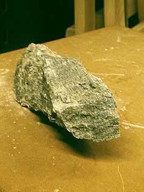

## La stéatite
### La stéatite, usage en sculpture et autres disciplines
 **La stéatite**  

Il s'agit d'une sorte de jade très tendre, autorisant une taille réellement aisée, employée traditionnellement en Chine pour réaliser des sceaux. Cette pierre fort belle autorise des travaux non traditionnels.

L'appellation "pierre à lard" utilisée par certains auteurs ne semble vraiment pas correspondre à la stéatite, qu'ils décrivent comme une roche "d'aspect graisseux". Mais il est possible que le toucher assez particulier (un peu savonneux) de ce minéral ait produit cette appellation et cette description.

Il est très facile de tailler la stéatite à l'aide d'instruments métalliques moyennement résistants.

Bien polie (simple chiffon), elle a un peu l'aspect du jade mais demeure légèrement pulvérulente. Il n'est pas exclu qu'un traitement à l'encaustique puisse annuler radicalement cette tendance.

La réalisation de sceaux implique que le sculpteur donne une forme arrondie à la face destinée à l'impression car une surface plane laisserait apparaître toutes les inégalités de niveaux. Il est possible de contempler de superbe sceaux chinois au Musée Guimet à Paris. Traditionnellement, on les trempe dans une encre qui ressemble à une pâte de couleur vermillon prétendument naturelle mais plus probablement fabriquée avec du [cinabre](vermillons-2.html#enchine), donc toxique. Inutile de s'empoisonner : une peinture à l'huile contemporaine fait parfaitement l'affaire.

La stéatite est également connue en Europe, notamment en France sous le nom de _craie de Briançon_.

Elle est vendue au poids dans les magasins de fournitures en arts plastiques et quelques magasins orientaux. Les blocs ont une forme plutôt allongée (voir photo) de l'ordre de 20 à 50 cm.  Ils sont assez cassants. Il n'est pas inutile de les examiner attentivement avant d'acheter.

