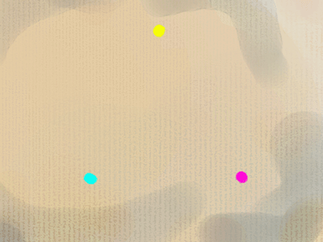
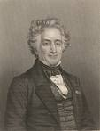

## La synthèse soustractive
### La synthèse soustractive, usage en arts plastiques
 **La synthèse soustractive**  

L'animation ci-contre présente les couleurs (le spectre visible, l'arc-en-ciel) sous la forme d'un cercle.

On peut affirmer que naturellement, sans ajout ni compensation d'aucune sorte,

> \* une partie de ce spectre, entourant les jaunes, de l'orangé au jaune-vert, est claire

> \* la partie opposée, du magenta au bleu, est sombre
> 
> \* la zone vert-cyan et la zone des rouges sont d'une clarté moyenne.

Ces données sont fondamentales et objectives (sauf à juger de ce qui est rouge, jaune, bleu, etc.). Elles ont beaucoup d'importance dans la détermination des contrastes et par-delà, dans la composition de toutes les oeuvres picturales.

Par contre, le fait de considérer telle ou telle couleur comme froide ou chaude est du domaine subjectif (voir [plus loin](synthesesoustractive.html#chaudesetfroides)).

Le point de vue scientifique ne nous éclaire pratiquement pas - sans jeu de mot - : il nous indique que les couleurs les plus énergétiques sont les bleus (ou les violets si l'on veut), à une longueur d'onde de 400 nanomètres, et les moins porteuses d'énergie, les rouges, à 750 ou 800 nanomètres. **C'est une différence notable,** du simple au double d'énergie ! Mais la seule chose que nous puissions retenir de ces données (peuvent-elles avoir une portée artistique ?), c'est que _**la couleur rouge est celle qui fatigue le moins la rétine**_. Les astronomes amateurs ne l'ignorent pas, eux qui consultent leurs cartes célestes à la lueur d'une lampe de poche bardée d'un filtre rouge pour préserver l'acuité de leur vision nocturne.

Cependant, peut-être pour des raisons cognitives, le rouge serait la couleur qui impressionnerait le plus vite la rétine et celle qui serait aperçue en premier même à distance (information non confirmée).

Une autre considération scientifique, plus physiologique, nous indique une particularité de la vision humaine qui a été exploitée par de nombreux peintres : dans la pénombre, nous ne distinguons pratiquement pas les couleurs. L'intérêt de cette constatation est que **_nous percevons beaucoup mieux les contrastes de [valeurs](valeur.html) d'un tableau dans la pénombre_**. Certaines évidences se révèlent alors.

Les couleurs dites "_primaires_" (par convention) permettent théoriquement de reconstituer par mélange n'importe quelle couleur du spectre. En fait, c'est faux mais nous y reviendrons. Elles sont trois :

> \* le  **jaune**  pur, ni verdâtre ni rougeâtre. Le jaune citron (qui tire souvent sur le vert dans les interprétations des fabricants) ne peut pas faire office de jaune primaire : il salirait les mélanges.
> 
> \* le  **magenta** , sorte de mauve (rouge nettement violacé), souvent assimilé à tort à un rouge.
> 
> \* le  **cyan** , sorte de bleu-vert.

Elles ne peuvent théoriquement pas être elles-mêmes reconstituées par mélange. Cette affirmation concerne en fait des concepts scientifiques et non des pigments.

La nature ne met pas à notre disposition des pigments correspondant exactement ou même inexactement aux primaires. Par conséquent, on ne peut se rapprocher de celles-ci que par des mélanges, sauf en ce qui concerne le jaune - ou disons plutôt une approximation de jaune -, qui peut difficilement être synthétisé par mélange.  
Il est tout à fait possible par contre de reconstituer une approximation de cyan (bleu + vert-jaune) ou de magenta (rouge + bleu-violet).

Le fait est : la nature ne met pas à notre disposition les exactes couleurs primaires sous forme de pigments. _Donc, c'est un comble mais c'est une réalité : pour essayer de concrétiser le concept des couleurs primaires, il faut recourir à des mélanges._

Cette constatation prend toute sa valeur lorsqu'il s'agit de constituer une palette de couleurs (lire [exemple de base pour une palette](paletteexemplede.html)).

_Les couleurs secondaires (obtenues par la combinaison de paires de primaires) sont :_

 _-  **l'orangé**  et  **le rouge**  (jaune + magenta)_

 _-  **le violet**  et  **le bleu**  (cyan + magenta)_

 _-  **le vert**  et  **le vert-jaune**  (cyan + jaune)._

_La combinaison de couleurs secondaires fabriquées à l'aide de couleurs "primaires" ou d'autres mélanges peut donner des résultats assez sales. **Important :** à partir d'un certain degré de mélange de couleurs multiples, les éléments constitutifs des mélanges finissent par interférer et grisailler (voir [Couleurs monopigmentaires et pluripigmentaires](monopluripigm.html) et plus loin, [Règles physiques fondamentales](synthesesoustractive.html#grisaille2))._

**Chaudes et froides**

Les concepts communs de froid et de chaud ne sont pas objectifs car ils sont avant tout une transposition de sensations subjectives provenant d'un autre domaine sensitif, la perception des températures, sans aucun rapport, précisons-le, avec le concept physique de [température de couleur par rapport au corps noir](corpsnoir.html). Il ne s'agit que d'impressions de correspondances ressenties par chacun, de tendances plus ou moins admises par tous.

Si l'on trace mentalement une ligne diagonale partant aux environs du vert-jaune et rejoignant de l'autre côté du cercle chromatique la zone située entre le rouge et le violet, on peut visualiser l'une des répartitions les plus classiques entre _couleurs chaudes_, en haut à droite sur [la figure ci-dessus](synthesesoustractive.html#primairesetsecondaires), et _froides_, en bas à gauche.

Les choses se gâtent lorsque l'on parle des couleurs neutres. Certains peintres considèrent que le vert-jaune est chaud, d'autres avancent que le violet constitue la zone frontière, neutre, alors que beaucoup attribuent le même titre à la [garance](garance.html) et considèrent le vert-jaune comme une couleur très fraîche.

Certains essayent de se représenter le chaud et le froid d'une manière symbolique tendant à l'universalisme. C'est cependant une chimère : telle personne estime que c'est le jaune, semblable au soleil, qui "représenterait" la couleur chaude par excellence... mais pour telle autre personne, c'est le rouge, qui évoque le fer rouge, la braise, la chair.

Deux affirmations sont cependant admises par tous  : aux abords de l'orangé, c'est chaud ; autour du bleu, c'est froid.

**Règles physiques fondamentales  
(théorie de Chevreul)**

La théorie de Chevreul (_De la loi du contraste simultané des couleurs et de l'assortiment des objets colorés_, 1839, Paris) est un volumineux mémoire scientifique - non loin de 750 pages, l'auteur dissertant longuement sur les applications déjà multiples à l'époque. C'est-à-dire que les peintres qui ont profondément marqué l'histoire de l'art aux XIX et XXème siècles (on citera en particulier les impressionnistes et les divisionnistes mais aussi Delacroix avant eux) en s'inspirant en partie de cette théorie ont peut-être, pour certains, eu la chance d'assister aux conférences publiques de ce grand savant, mais pour la plupart ils n'auront connu cette oeuvre que partiellement et indirectement.

Qu'à cela ne tienne, Chevreul a été compris des artistes et sa contribution scientifique aux arts picturaux (entre autres) fut considérable.

L'histoire l'a un peu oublié - à tort : que seraient nos ordinateurs, nos télévisions et nos impressions quadrichromiques sans son travail sur la synthèse de couleurs ? -, pourtant cet homme a joui d'une reconnaissance et d'une célébrité internationales de son vivant (1786-1889, soit 103 ans), mais - ironie du sort - davantage pour son patient travail de chimiste sur les corps gras et la thématique de la [saponification](saponification.html), thématique qu'il n'est pas tout à fait parvenu à... synthétiser.

Bien entendu, la recherche sur les synthèses et la perception des couleurs ne s'arrête pas à Chevreul mais pour le moment, évoquons quant à nous quelques principes qu'il a édictés :

> \* Dans une combinaison, plus les couleurs sont éloignées sur le cercle chromatique, plus elles s'annulent et **grisaillent** ([cf. couleurs monopigmentaires et pluripigmentaires](monopluripigm.html)). Pour faire court, disons que cela donne une teinte "**marronnasse**" lorsque les chaudes dominent , du "**caca d'oie**" lorsque apparaissent des froides. Mais attention : malgré ces intitulés méprisants, ces couleurs ne sont pas à rejeter. Elles permettent les associations les plus subtiles, parfois joyeuses, notamment dans les valeurs très claires, les carnations, les ciels, les ors et les autres métaux, les bois, les terres, etc.
> 
> \* Les combinaisons les plus éloignées (se situant à 180° l'une de l'autre sur le cercle) sont dites **_complémentaires._** Unies en proportions égales, à propriétés couvrantes et colorantes égales, elles s'annulent, donnant un gris plus ou moins clair.
> 
> \* Les trois couleurs primaires mêlées donnent également un gris neutre.
> 
> \* Chevreul indique que "_lorsqu__e l'oeil voit_ _deux couleurs contiguës, il les voit les plus dissemblables possible. Ce contraste provient à la fois de la tonalité et de la luminosité des couleurs._" Le contraste des valeurs s'ajoute donc au contraste des couleurs. L'oeil se sert de tous les critères possibles pour distinguer les moindres nuances, les plus petites variations.
> 
> \* Le plus fort contraste possible est la combinaison   **BLEU-ORANGÉ**   car c'est entre ces deux complémentaires qu'il existe _le plus fort contraste de valeurs en plus du contraste de couleurs_, toute variation des valeurs par l'adjonction de blanc, de noir, ou d'un jeu de transparence étant ici mise de côté. Chevreul évoque les caractéristiques intrinsèques de couleurs.

Pour toutes ces raisons, le bleu et le violet _obtenus par mélanges de primaires_ ne sont ni clairs ni purs, de même que certains rouges, décevants (un rouge [vermillon](vermillons-2.html) obtenu par jaune + magenta est bien terne), et les orangés, particulièrement problématiques en quadrichromie, dit-on. _Les associations de couleurs primaires ou de toutes couleurs disposées à 120° l'une de l'autre sur le cercle chromatique, voire moins, donnent en général (il existe d'assez nombreuses exceptions mais il s'agit ici d'exposer une tendance) des résultats plutôt impurs, particulièrement handicapants dans la zone sombre du spectre où les mélanges noircissent facilement. Dans la zone claire, sous l'empire du jaune, véritable soleil du cercle chromatique, nous obtenons d'assez beaux verts-jaunes et jaunes-orangés._

Il est donc nécessaire de recourir à d'autres couleurs de base bien choisies pour les mélanges, d'autant plus que les catégories chromatiques "jaune, violet, bleu, rouge, etc.", sont produites par des pigments matériels qui ont des capacités limitées par les propriétés des éléments moléculaires qui les composent : certains jaunes vendus dans le commerce comme "primaires" sont trop peu colorants pour donner de bons résultats dans les mélanges. Certains magentas sont très colorants mais pas assez couvrants ou trop fugaces, etc.

Voir [exemple de base pour une palette](paletteexemplede.html).

**Combinaisons ternaires ou plus complexes**

Dans la combinaison ternaire "basique" (que l'on apprend parfois à l'école), nous associons les trois primaires en quantités différentes. Dans les faits, le peintre qui en arrive aux mélanges de trois couleurs n'utilise déjà plus les primaires (sauf le jaune, souvent un cadmium clair ou un azoïque) mais plutôt des pigments purs non mélangés parfois très éloignés les uns des autres.

Il s'agit

> \* de créer des ocres particuliers, des verts subtils, etc. et surtout _de_ _les décliner et les altérer considérablement_. Un fondu vers une couleur pure devient aisé, facile à contrôler dans le détail.  
> Exemple : jaune de cadmium clair + vermillon + une note de bleu outremer foncé = un ocre situé entre l'ocre jaune et la Sienne brûlée selon la quantité de vermillon, ou bien une Sienne naturelle particulièrement grise à mesure que l'on rajoute de l'outremer. La gamme des "terres" peut être parcourue aisément en direction d'une vive ou d'une autre terre : il suffit de jouer à volonté sur l'une trois composantes. La même opération est plus difficile à réaliser à l'aide d'une terre + une seule vive, mélange propice aux dégradés simples.  
> En travaillant _[alla prima](p.html#primaallaprima)_, le peintre peut s'amuser à révéler par une imperfection provoquée la véritable nature de l'ocre apparemment tranquille qu'il nous offre à contempler.
> 
> \* de donner un aspect unifié à la surface picturale. L'emploi, même en faible quantité, d'une couleur omniprésente parmi tous les mélanges donne une grande solidité à la composition chromatique. Un résultat approchant peut être obtenu par la pose de [glacis](glacis.html) terminaux, plus sûre sur le plan chimique (elle restreint la quantité d'interactions).

**HARMONIE**

L'artiste pictural crée des harmonies de teintes juxtaposées dans l'espace, parfois dans le temps. Des sortes d'accords de couleurs.

Certains auteurs se sont spécialisés dans les _théories harmoniques_, énumérant les "accords" à 3, 4 ou 5 couleurs. Il est vrai qu'un rapprochement avec la théorie de la musique n'est pas forcément sans pertinence. Lumière et sons sont des phénomènes ondulatoires qui ont bien sûr des points communs. A commencer par ce que l'on nomme les harmoniques.

Une corde, lorsqu'elle est effleurée en certains points précis de sa longueur et mise en vibration, va livrer un son bien net dont la fréquence est une fraction "harmonique" de celle de la corde entière. Elle sonnera de manière clairement identifiable l'octave (à mi-longueur), la quinte juste et la tierce majeure (plus une octave) à d'autres positions, ainsi que d'autres intervalles à d'autres distances, mais moins clairement. La tierce, la quinte et l'octave représentent ce que l'on nomme des consonantes, des harmonies à la fois classiques et naturelles (pas tout à fait naturelles dans le cas du clavier tempéré, mais c'est un autre sujet).

Qu'en est-il en ce qui concerne les couleurs ? Le peintre, le photographe, le vidéaste n'ont aucun des repères de positionnement dont disposent les artistes du son. Il n'y a pas de corde pour donner une longueur d'onde à la lumière. Et que serait un accord majeur en peinture ? La chose est calculable mais c'est d'autant plus difficile à concevoir naturellement que le bleu serait peu ou prou l'octave du rouge (400 nm = 800 nm / 2), ce qui rend l'intégralité des couleurs visibles comparable à _une seule et unique gamme musicale !_ "L'octave chromatique" existe mais elle est à la limite de notre perception. De plus elle est fixe alors qu'un intervalle musical est glissant.

Ainsi on identifie aisément l'octave d'une note "à l'oreille", mais _qui reconnaîtrait dans le bleu l'octave du rouge ?_ Et que comprendrions-nous à la musique si nos oreilles pouvaient à peine entendre un intervalle d'une octave immuablement fixée ? Nous verrions probablement l'univers sonore comme un tout fermé, comme nous le faisons dans le domaine des couleurs ("cercle chromatique"). Nous dirions peut-être que le si est la note la plus froide et le do la plus chaude, sans comprendre intuitivement comme c'est le cas en musique qu'il existe des si et des do plus chauds et plus froids à l'infini.

Disons-nous "votre ré est saignant", "son si est d'une froideur", "ce la est tellement chic" ? Les notes sont si innombrables qu'elles sont incapables de porter une signification alors que chaque couleur est unique. Voilà toute la différence. Nous accordons une infinité de significations symboliques à telle ou telle couleur alors qu'il est bien rare que nous en fassions de même avec une note.

Pour donner une image forte, outrée, on pourrait (partiellement) comparer les artistes picturaux à des musiciens qui joueraient avec un ocarina devant un public qui ne serait de toute façon pas en mesure d'envisager le concept cyclique et structurant de gamme. C'est l'un des points de vue par lesquels nous pouvons entrevoir tout l'art du véritable "[coloriste](couleur.html)", qui ne se borne pas à [chamarrer](chamarrer.html) son oeuvre n'importe comment mais qui conçoit et met en oeuvre, à force de travail et avec son intuition, ce qui est harmonique, harmonieux, dissonant, consonnant, etc., à travers une toute petite fenêtre de fréquences visibles. Un travail qui évoque celui du sourd mais génial Ludwig van Beethoven. Partitions et claviers de pianos en moins, [valeurs](valeur.html) et significations en plus.

 [Communication](http://www.artrealite.com/annonceurs.htm) 

