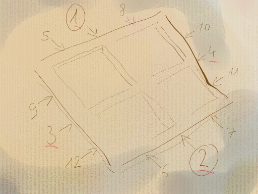
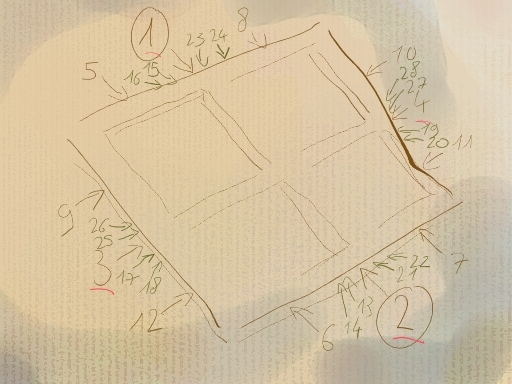
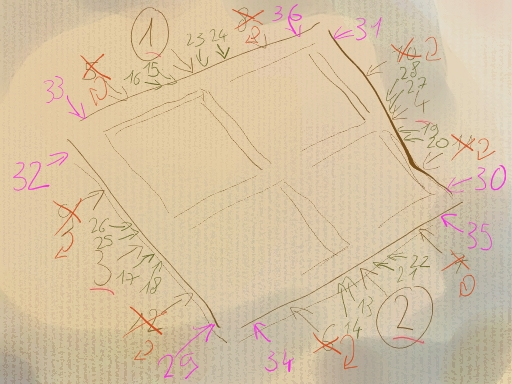

## La tension sur ch�ssis
### La tension sur ch�ssis, usage en peinture
 **La tension sur ch�ssis**  > \* _tendre une premi�re fois la toile sommairement (trois agrafes ou clous par c�t� environ, un peu plus si vous utilisez de la [colle de peau](colledepeau.html))_
> 
> \* _l'enduire en l'�tat et laisser s�cher_
> 
> \* _Il n'est pas inutile de poncer la surface et de repasser une couche d'enduit. De petits noeuds du textile peuvent �tre trait�s (aras�s) lors de cette �tape_
> 
> \* _retirer les agrafes ou les clous_
> 
> \* _retendre la toile._

_L'emploi de [colle de peau](colledepeau.html) provoque toujours une forte tension alors que les enduits vinylique (le [Caparol �](caparol.html) par exemple) ont souvent l'effet contraire. Lorsque le peintre commence � bien rep�rer le comportement d'une toile et d'un enduit, il lui est plus facile de proc�der en une seule �tape lorsque c'est possible. L'avantage de la tension en un seul temps avec de la colle de peau est que celle-ci tend naturellement la toile._

_Mais le fait de travailler en deux temps n'est pas mauvais pour le textile�: il est toujours b�n�fique de faire un peu travailler la toile (ou le papier) avant de peindre._

Le [d�catissage](decatissage.html) pr�alable n'est n�cessaire que pour des tissus non destin�es � la peinture ou achet�es chez un grossiste ou un interm�diaire. L'enduction directe - surtout avec de la colle de peau - d'une toile non d�catie est dangereuse�: il arrive que le ch�ssis �clate brutalement.

L'utilisation de clous � la place d'agrafes est _d�conseill�e_�: ils ne font qu'ab�mer la toile, y faisant des trous importants. Le rapport maintien/attaque de la toile va nettement en d�faveur des clous. De plus, ils rouillent et sont difficiles � �ter. L'agrafeuse a apport� un r�el progr�s.

L'emploi d'une [pince � tendre](pinceatendre.html) (au moins) est indispensable.

**M�thodes de tension**

Des choix techniques mais aussi psychologiques

> La tension dite "en svastika" est tr�s souvent employ�e. Elle n'est ni meilleure ni pire qu'une autre du point de vue purement technique. Mais elle est extr�mement connot�e et peut certainement troubler - _consciemment ou non_ - l'inspiration du peintre. On n'a pas forc�ment envie de peindre sur une structure en croix gamm�e.
> 
> A ce stade, qui est la mise en place de l'ossature et des organes de cet �tre vivant que sera le tableau, les choix sont essentiels. Celui de l'enduit n'est pas innocent non plus�: la colle animale est plus qu'un symbole, c'est _vraiment_ de l'animal. Par ailleurs, elle repr�sente la voie traditionnelle, ce qui peut �tre consid�r� comme positif ou n�gatif selon le peintre.

Le terme de svastika est li� � la mani�re de placer les agrafes�: les quatre premi�res agrafes sont dispos�es en croix, les autres plac�es de proche en proche en direction des angles, par paires en diagonale. C'est tr�s simple, mais pas id�al car des torsions peuvent se produire.

La tension initiale "en croix" se retrouve dans la m�thode expos�e ci-dessous. Celle-ci permet non seulement d'�viter la r�f�rence "croix gamm�e", mais aussi de ne pas d�former les fibres, de mieux respecter le [droit fil](d.html#droitfil).

Voici donc une m�thode de tension bien �prouv�e�:

Son principe sp�cifique est l'�vitement de la torsion de la trame (conservation du droit fil) par la pose syst�matique de paires d'agrafes sur deux c�t�s oppos�s, mais pas en diagonale, comme on le fait dans la m�thode svastika. Son "truc" consiste dans la pose d'agrafes lat�rales et le _retrait temporaire_ de placements plus centraux dans l'objectif d'�viter les ondulations.

_Examiner le ch�ssis�: si les angles sont trop ac�r�s et_ a fortiori _si votre toile est fragile, les r�per doucement avec un papier de verre fin (cette intervention n'est que rarement  n�cessaire)._

_Placer les [cl�s](chassis.html#lescles) sur le ch�ssis - s'il en dispose - sans trop les enfoncer. Leur fonction est de retendre une toile apr�s plusieurs ann�es d'exposition�; il ne convient donc pas de se servir d'elles dans cet objectif avant m�me d'avoir peint le tableau._

_D�couper la toile en laissant une bonne marge (7 � 10 cm, mieux vaut trop long que trop court�: on peut toujours raccourcir, pas allonger), posez-la sur le ch�ssis � plat. �vitez les portions de toiles aux plis trop marqu�s, surtout si vous peignez maigre (voir [remise en �tat de toiles abim�es](toilesabimees.html))._

_Essayez de d�couper "� droit fil", c'est-�-dire en respectant au mieux la trame de la toile, parall�le aux c�t�s du ch�ssis. Cette d�coupe, puis une pose la respectant, est favorable � une tension sensiblement homog�ne o� aucun point sensible ne risque d'appara�tre et de cro�tre._

_Agrafez la toile au milieu de chaque c�t� en proc�dant par PAIRES oppos�s (en tendant peu ou pas du tout pour la premi�re agrafe, plus fortement pour celle qui est en face, surtout au d�but), puis proc�dez en subdivisant en quarts comme dans le sch�ma ci-dessous. La pose de la premi�re agrafe est importante. Si vous d�tectez une asym�trie, recommencez._

__

_Si votre toile n'est pas pr�par�e (encoll�e, enduite au gesso), arr�tez l� l'agrafage, [pr�parez-la](enductiondestoiles.html) telle quelle et laissez bien s�cher. Si apr�s coup la surface s'est d�tendue (colles synth�tiques) ou trop tendue (colles animales), enlevez les douze agrafes et recommencez l'op�ration._

_Suite �: reprenez au milieu de chaque c�t�, vers les angles, toujours par paires oppos�es pour �viter les torsions. Allez jusqu'aux agrafes de quarts (5 � 12)._

__

_Bien tendue au centre, la toile peut maintenant poser des probl�mes vers l'ext�rieur. **C'est le moment critique**._

_Retirez les agrafes de quart (5 � 12, voire m�me 5 � 28 pour les grandes surfaces ou pour certaines toiles r�tives)._

_Placez les agrafes not�es 29 � 36 en tendant fort. Elles vont jouer un r�le essentiel._

_Replacez les agrafes de quart (et �ventuellement celles plus centr�es, 9 � 28, comme indiqu� ci-dessus - pardon pour l'aspect compliqu� du croquis)._

__

_Agrafez ensuite en allant (toujours par paires oppos�es) du milieu des c�t�s jusqu'aux angles._

_Cette m�thode peut bien entendu �tre affin�e. Le principe de la pose d'agrafes "lat�rales" (29-36) suivie du retrait d'agrafes pos�es ant�rieurement peut �tre r�p�t� � l'approche des angles, points sensibles._

_Faites ensuite un repli bien net aux angles, d�coupez l'exc�dent de toile au verso ou agrafez-le, juste pour le plaquer sur le ch�ssis._

_Une toile bien tendue renvoie un son musical proche de celui d'un instrument de percussion._

 [Communication](http://www.artrealite.com/annonceurs.htm) 

