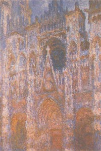
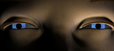
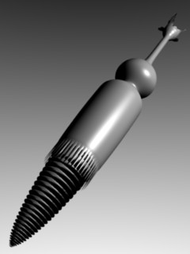

## La vue
### La vue, l'oeil et les arts plastiques
 **La vue**

On pense en général à l'oeil comme appareil perceptif et nous aborderons largement le sujet sous cet angle dans ce texte. Cependant dans ce préambule et un peu au-delà, il semble naturel de rendre justice à cet organe précieux en évoquant aussi son rôle dans le domaine de l'expression.

L'oeil humain est visible et même voyant. Regardons-le dans un miroir, que voyons-nous ? Du noir, une couleur, celle de l'iris, mais aussi beaucoup de blanc, un blanc lumineux, brillant. Ce blanc, absent du reste visible du corps à l'exception toute relative des dents, se voit d'assez loin. Au point, parfois, de dessiner la limite du danger d'être vu (souvenons-nous de l'injonction militaire « ne tirez que quand vous verrez le blanc de leurs yeux »). Notre espèce en particulier est peu discrète sous ce rapport. Les chats, les chiens, les vaches ou les chevaux et même nos cousins chimpanzés ou orangs-outans, pourtant assez proches de nous par les expressions de leur regard, ne laissent qu'à peine entrevoir le versant clair du globe. Seuls quelques oiseaux (chercher certaines variétés rares de perroquets) semblent faire exception.

"_La fonction fait l'organe_", disait Claude Bernard. Est-ce la fonction expressive qui nous a "fait", "façonné" cet oeil ? Nous y reviendrons.

Que voyons-nous encore de l'oeil ? Que l'on y lit très bien : à grand renfort de muscles, de vaisseaux, de cils et de sourcils, de peau et de paupières, de rides, de pattes d'oie, de valises, de larmes, de clins et bien sûr de maquillages, c'est décidément l'un des principaux agents d'expression. Plus encore, regarder est un acte (comme parler) et chez les animaux, c'est un code, dont nous avons partiellement hérité d'ailleurs.

Mais venons-en à l'oeil comme organe de perception puisque c'est sous cet angle que nous en parlerons essentiellement ici (sans rompre le lien toutefois). Faisons une comparaison sans valeur scientifique, juste dans le but de prendre un recul nécessaire pour tenter d'apprécier l'importance des deux fonctions, expression et perception :

> Un autre de nos sens, l'ouïe, a quelque chose en commun avec la vision : il s'agit dans les deux cas de capter et d'interpréter un phénomène extérieur de nature ondulatoire. L'audition bat la vue à plates coutures dans le domaine de l'étendue des fréquences perçues. Si nos oreilles percevaient une aussi courte étendue de sons, nous n'entendrions qu'une seule gamme de notes [\[1\]](vue.html#note1). En échange si l'on peut dire, nos si fines oreilles ne semblent pour le moins pas aussi expressives que nos yeux. Elles sont inertes (en général). Ce rôle ne leur appartient plus, cette fonction a abandonné cet organe. Nous aurions beaucoup à réapprendre des chats.

**Sommaire**

\- Introduction ci-contre

[\- Avant d'aller plus loin : les couleurs qui n'existent pas](vue.html#couleursquinexistentpas)

[**P**](vue.html#premierpanorama)[**remier panorama**](vue.html#premierpanorama)

[\- Le centre de l'oeil](vue.html#centreoeil)

[\- Le blanc de l'oeil](vue.html#blancdeloeil)

[\- La prunelle](vue.html#prunelle)

[\- La pupille](vue.html#pupille)

[\- La cornée, le cristallin et le muscle ciliaire](vue.html#corneecristallin)

[\- L'iris](vue.html#iris)

[\- La fovéa](vue.html#fovea)

[\- Le disque optique, le point aveugle et le nerf optique](vue.html#disquenerfoptique)

[\- Le chiasma optique](vue.html#chiasma)

[\- La suite du chemin](vue.html#suitechemin)

[\- Au-delà](vue.html#audela)

**[Mises en perspective](vue.html#misesenperspective)**

[\- Avertissement](vue.html#avertissement)

[\- Les visions animales](vue.html#visionsanimales)

[\- Histoire d'oeil](vue.html#histoireoeil)

[\- Les anomalies de la vision humaine](vue.html#anomalies)

[\- Mécanismes artificiels](vue.html#mecanismesartificiels)

[\- Connaissance de l'oeil](vue.html#connaissance)

**[Focus sur les récepteurs rétiniens](vue.html#recepteursretiniens)**

[\- Les bâtonnets](vue.html#batonnets)

[\- Les cônes](vue.html#cones)

[\- Au coeur du sujet : rétinal et opsine](vue.html#opsine)

[\- Longueurs d'ondes](vue.html#longueursdondes)

[\- Les catégories de cônes](vue.html#conescateg)

[\- Des serrures](vue.html#serrures)

[\- Des groupes](vue.html#groupes)

[\- Un véritable fatras biologique très bien organisé : la rétine, mangrove de l'oeil](vue.html#fatrasbiologique)

**[Conclusion](vue.html#conclusion)**

\_\_\_\_\_

Avant d'aller plus loin : les couleurs qui n'existent pas

Le lecteur pourrait être surpris du fait que l'on n'évoque ci-dessous le spectre visible que du bleu au rouge, en oubliant les violets, les mauves et les pourpres. La raison en est que comme le blanc, ces couleurs n'existent pas physiquement. Elles sont des abstractions, des [synthèses](synthesedecouleurs.html) absolument "artificielles" produites "naturellement" par notre appareil visuel qui fonctionne [par groupements](vue.html#groupes). La couleur pourpre nous apparaît lorsque du bleu est présent et du rouge aussi de manière très resserrée dans l'espace ou dans le temps, mais il n'existe pas de spectre pourpre.

Le blanc, lui, est l'addition de plusieurs spectres. Pas de spectre blanc.

Pas de spectre noir non plus (absence de couleur), ni de spectre gris car celui-ci nous ramène au cas du blanc, en moins lumineux.

**P****remier panorama**

Le centre de l'oeil

Pourquoi pas commencer par là.

C'est un milieu suffisamment pur pour que la lumière puisse y transiter sans encombre. Il n'est absolument pas blanc, même partiellement, comme pourrait le suggérer l'effrayant trucage du Chien andalou de Luis Buñuel (on a choisi ici une autre image pour ne pas choquer inutilement) : il est intégralement transparent. C'est ce que l'on appelle le corps vitré, une gelée limpide.

  
Entre la membrane blanche externe et ce centre se situent d'autres membranes :

> \* vers l'extérieur, la choroïde, sorte de « couche de service » irrigant et nourrissant les autres composants de l'oeil,  
> \* la toute précieuse rétine, vers l'intérieur.

Le blanc de l'oeil

Cette

sclérotique ou sclère (du grec _sklêros_, dur) - est une membrane opaque effectivement dure, un tendon qui maintient très fermement sous pression l'ensemble de cet organe.

La prunelle

C'est un terme que l'on évitera ici malgré la beauté de son évocation fruitière car vérification faite, son sens réfère tantôt à la pupille, tantôt à l'ensemble pupille et iris, voire par métonymie à l'oeil entier. Trop imprécis pour cet exposé, malheureusement.

La pupille

Il faut bien sûr un trou pour que la lumière entre dans la chambre obscure et atteigne la rétine. Notons au passage que l'image qu'elle y forme est à l'envers, comme sur la pellicule d'un appareil photo argentique. La remise à l'endroit se fait sans lentille ni miroir mais elle est bien réelle et tellement parfaite que nous n'en avons pas la moindre conscience. On peut dire que nous voyons le monde à l'envers sans le savoir.

Le croisement des nerfs qui a lieu dans le chiasma optique (nous reviendrons sur ce terme, [lien](vue.html#chiasma)), n'est lui-même pas assimilable semble-t-il à un retournement de l'image mais plutôt à quelque chose de beaucoup plus compliqué : un traitement sélectif côté droit/côté gauche de l'ensemble de la vision. Voilà de quoi se faire une idée de la complexité du traitement naturel de l'image.  
 

La cornée, le cristallin et le muscle ciliaire

La sclère délimite l'iris devant lequel elle devient

cornée. Celle-ci, _tunica cornea_, de tunique et corne - on parle de « tunique de l'oeil » - a la particularité d'être transparente et déformable. C'est une membrane externe perpétuellement humide sans équivalent dans le corps. Nous n'avons aucune information sur l'association avec la corne, très ancienne semble-t-il. N'hésitez pas à nous écrire si vous disposez d'informations à ce sujet.

  
La cornée est séparée du cristallin (la lentille de l'oeil, enfermée dans un « sac cristallinien ») par une sorte de petite poche d'eau, l'humeur aqueuse (ou chambre aqueuse, ou antichambre de l'oeil, observable sous certains angles comme un très léger renflement). Le cristallin est « coincé » entre cette poche et un ligament suspenseur (le zonule) le maintenant à l'avant du [corps vitré](vue.html#centreoeil). Latéralement, un tout petit muscle peut modifier rien moins que la forme de la lentille elle-même. C'est le muscle ciliaire (ou corps ciliaire, sans rapports avec les cils).

Cette déformation du cristallin est ce que l'on appelle l'accommodation. C'est ce qui nous permet de faire le point sur le proche ou le lointain. Avec un objectif photographique nous obtenons un résultat similaire d'une façon qui peut sembler particulièrement primaire en comparaison, en déplaçant une solide lentille de verre en avant ou en arrière. Si nous savons produire et implanter un cristallin artificiel lorsque le cristallin naturel durcit ou s'opacifie, l'ensemble du dispositif naturel est encore au-delà de ce que nous savons reproduire techniquement de manière satisfaisante.

Notons au passage que certaines sources - pas des moins connues - décrivent l'opération de la cataracte comme une ablation du cristallin en oubliant qu'il s'agit aujourd'hui de lui substituer une prothèse. Dans le passé cependant, l'opération était réalisée sans substitution. L'oeil opéré ainsi est dit « aphake » alors qu'un implant donne un oeil « pseudophake ».

On opérait déjà de la cataracte pendant l'Antiquité ([lien externe](http://cat.inist.fr/?aModele=afficheN&cpsidt=12004718)). Sans prothèse, l'opéré devenait bien sûr incapable de faire le point mais au moins, il voyait.

Évoquer ce point sur Dotapea n'est pas superflu : Monet lui-même aurait modifié sa palette après une telle opération. Avant de parler de couleurs, interrogeons nos yeux.  
 

L'iris

Il joue le rôle de diaphragme mais peut-être a-t-il aussi d'autres fonctions, notamment celle de nous intriguer. Les Berbères ont souvent les yeux très clairs, les Scandinaves et beaucoup de Slaves et de Centre-Asiatiques aussi. On pense a priori que la luminosité de la neige ou du désert y sont pour quelque chose en termes d'adaptation au milieu. Cela pourrait être une fausse piste : les Peuples du Nord (Inuits, Sibériens, Saamis) n'ont pas l'iris particulièrement clair de même que les San (Bushmen) du Kalahari ou les Égyptiens. La nature expérimente sans arrêt ses propres mutations, les déplacements humains brouillent les cartes à toute vitesse à l'échelle de l'évolution, sans parler des changements climatiques, très significatifs eux aussi à l'échelle de l'histoire de notre espèce.

Ces sujets ont fait l'objet de débats et de polémiques.  
Sans entrer dans le détail on en dira quelques mots. Que la fonction modèle l'organe est une chose mais que l'absence de fonction implique la disparition ou la transformation d'un caractère en est une toute autre. On suivra ici la « théorie neutre » de [Motoo Kimura](http://www.google.fr/search?hl=fr&q=%22Motoo+Kimura%22&aq=f&aqi=&aql=&oq=&gs_rfai=) ([médaille Darwin](http://www.google.fr/search?hl=fr&source=hp&q=%22m%C3%A9daille+darwin%22&aq=f&aqi=&aql=&oq=&gs_rfai=) 1992) : les mutations ne s'opposent pas nécessairement à l'adaptation au sens où l'entendait Darwin ni à la fonction, chère à Claude Bernard. Il existe des Africains aux yeux verts, ils ne s'en portent pas plus mal même si l'utilité sur les plans fonctionnel et adaptatif de cette couleur est inconnue - pour autant qu'elle existe, ce qu'il est pertinent de mettre en doute.

La taille de l'iris humain semble poser davantage question. Nous avons évoqué au début de ce texte le blanc de l'oeil, assez vaste chez l'humain. Pourquoi cet iris mince et ce blanc voyant, voilà une question à laquelle il est difficile de répondre, et pourtant le fait est suffisamment notable et constant pour que l'on puisse supposer une ou plusieurs fonctions correspondant à cette particularité. Notamment, nous distinguons assez bien, par rapport à d'autres espèces, où regarde autrui (comme parfait contre-exemple, on évoquera un peu plus loin les insectes qui n'ont pas cette capacité). Cela participe-t-il à la fonction de communication sur laquelle nous avons insisté en préambule ? Sujet vaste et semé d'écueils. Toute information précise est bienvenue.

Ajoutons quelques informations concernant cette splendeur de délicatesse florale qu'est l'iris :

> \* bien que l'on distingue usuellement trois ou quatre dominantes (brun, bleu, vert, gris et glauques), ses couleurs s'avèrent incroyablement variées et bien perceptibles même à l'oeil nu dès lors que nous nous approchons vraiment.

> L'iris de nombreux animaux peut être entièrement jaune mais le nôtre, s'il ne le peux pas (semble-t-il), porte très couramment une multitude de taches jaunes et d'autres couleurs, comme certaines variétés de la fleur du même nom.
> 
> Crédit photo [Jean Mascolo](quinoussommes.html#outa)

> En réalité l'iris est un chaos de reliefs et de couleurs traversé de sillons, d'anneaux, de cryptes. un véritable univers.
> 
>   
> \* la coloration foncée d'un iris correspondrait à une présence soutenue de mélanine.
> 
> \* nous manquons d'informations sur les molécules impliquées dans ces colorations. N'hésitez pas à nous écrire si vous disposez d'informations.
> 
> \* l'iris peut se dilater ou se contracter autour de la pupille dans des proportions très importantes sous l'effet de deux minuscules muscles, le sphincter circulaire pupillo-constricteur situé en bordure de la pupille et un dilatateur qui s'étend sous toute la surface de l'iris. L'action de l'un inhiberait celle de l'autre sous l'effet d'impulsions dirigées par les systèmes sympathique et parasympathique.
> 
> Quel que soit le diamètre de notre pupille, nous ne voyons jamais la couleur de notre iris par transparence. Il semble donc extraordinairement opaque. On évoque pourtant seulement deux couches de cellules pigmentées (information non confirmée), plus le muscle dilatateur, pas très épais. Au sujet de ce mystère (qui réside peut-être dans la manière dont la rétine tapisse l'oeil), toute contribution est bienvenue.
> 
>   
> \* le tissu pigmenté est fibreux, irrigué et innervé (à ce titre une pure merveille). Il est entouré d'un « stroma irien », un tissu conjonctif (on peut traduire grossièrement stroma par tapis) dans lequel se situerait la mélanine lorsqu'elle est présente - information non confirmée. Elle l'est en principe beaucoup moins pour les yeux bleus, elle est absente chez les albinos dont l'iris est si intégralement transparent que le superbe rouge de leurs yeux n'est autre que celui des délicats muscles situés à l'arrière, autour du [cristallin](vue.html#cristallin).

La rétine

Comme la [sclère](vue.html#blancdeloeil) ou la [choroïde](vue.html#choroide), c'est une quasi sphère de quatre centimètres de diamètre. Dans son épaisseur (un quart de millimètre), la lumière se transforme en information neurobiologique.  
Elle est composée de trois couches :

> \* les photorécepteurs (bâtonnets et cônes),
> 
> \* une couche intermédiaire qui va affiner les informations des photorécepteurs,
> 
> \* des cellules ganglionnaires (il s'agit de neurones) liées au cortex visuel par le nerf optique.

Nous y reviendrons longuement [ci-dessous](vue.html#conclusion).

La fovéa

La fovéa est le centre de la rétine, dit-on. Elle ne doit en fait ce titre un peu bancal qu'à sa position face à la rétine, sur le fond de l'oeil. Son diamètre théorique est très petit, de moins d'un millimètre et demi chez l'humain. C'est une zone très riche en [cônes](vue.html#cones), donc particulièrement adaptée à la vision de la couleur. Notre acuité visuelle diurne y est maximale. Si maximale que dépassant de loin celle des autres espèces, elle est caractéristique de l'humanité.

La fovéa et la zone qui l'entoure (la macula) sont peu chargées de vaisseaux sanguins. Il s'agit d'une région particulièrement privilégiée en termes de capacité perceptive...

... de capacité perceptive _diurne_, car dans la nuit, c'est tout le contraire. Pour repérer une étoile peu lumineuse ou proche d'une autre qui l'est trop, il vaut mieux utiliser (pointer, viser) un champ visuel éloigné de la fovéa. Sur l'image ci-contre, l'étoile Alcor (à gauche, magnitude 4) apparaît malgré la brillance de Mizar (magnitude 2,27). Nul besoin de télescope, on peut voir Alcor à l'oeil nu. Il suffit de viser un point imaginaire un peu à côté de l'ensemble.

Ce couple est situé dans la Grande Ourse (cercle rose dans la carte en bas) et peut être vu toute l'année dans l'hémisphère Nord.

Ce test visuel est assez connu mais on peut le reproduire sur beaucoup d'autres objets, en couples ou isolés comme par exemple la nébuleuse d'Orion, pas toujours très perceptible surtout en ville.

Crédit photo [ESO](http://www.eso.org/public/)

Le disque optique, le point aveugle et le nerf optique  
 

Le disque optique, appelé à tort ou à raison "tête du nerf optique", est l'inévitable "couture" par laquelle les millions d'axones en provenance des [cellules ganglionnaires](vue.html#cellulesganglionnaires) se rassemblent pour passer derrière le fond de l'oeil. Certains n'hésitent pas à utiliser des formulations assez impressionnantes que l'on peut reprendre ainsi : _le cerveau s'étend jusqu'à la rétine_. Distinguer un nerf optique parce que l'on est en présence d'un rassemblement d'axones est en effet davantage une facilité conceptuelle qu'une réalité. Il y a bien sûr continuité intégrale de la communication neurale de l'oeil au cortex visuel, en passant par des corps intermédiaires.

Le disque optique est une zone aveugle - dite « le point aveugle » - non seulement à cause de cette convergence d'axones, mais aussi parce que d'assez gros vaisseaux sanguins suivent cette convergence. Pour révéler cette zone il suffit de trouver un point de repère pas trop large, une tache, un détail, de fermer un oeil, de placer deux doigts, bras à peu près tendu, juste à gauche de ce repère et de viser juste à gauche de vos doigts. Le point de repère disparaît.

Le chiasma optique

Située presque juste derrière les yeux, cette sorte de X nerveux (du grec _khiasma_, croisement) n'est pas un croisement symétrique du nerf optique. Fait de plusieurs "circuits" qui ne suivent pas la même trajectoire, le chiasma grouperait les visions latérales (non-croisées) d'une part et les visions centrales (croisées) d'autre part.

De telles interversions nerveuses droite/gauche ne sont pas rare dans le corps humain et sont connus depuis Hippocrate. A la charnière entre le IVème et le IIIème siècles BC, cet admirable observateur scientifique avant la lettre (ami de Démocrite) avait déjà identifié le rôle des nerfs et placé le siège de la pensée dans le cerveau, avant qu'Aristote l'en détrône durablement, lui préférant le coeur.

On ne connaît toujours pas avec une totale exactitude l'utilité de ces croisements nerveux. Quoi qu'il en soit, dans le cas du chiasma optique, on constate, comme sur le schéma ci-contre, que grâce à ce « demi-croisement », une lumière située à main droite est « répercutée » via le nerf optique en direction du cortex visuel gauche. L'inverse est également valable. Il s'agit donc bien de grouper les informations « bâbord » et « tribord ».

La suite du chemin

Au-delà du chiasma, n'allons pas croire qu'il y a fusion de chaque côté et que tout parvient au cerveau tel quel. Notons d'ailleurs au passage qu'à ce niveau, ce que l'on nomme « nerfs » est toujours constitué des axones des [cellules ganglionnaires](vue.html#cellulesganglionnaires) de la rétine. Cela se nomme « tractus optique » et non plus « nerf optique » mais c'est exactement la même chose, juste un peu plus loin.

Les informations arrivent donc encore relativement brutes à des entités intermédiaires tout en continuant semble-t-il à suivre des trajectoires différentes selon qu'elles proviennent de la partie « extérieure » des rétines, non croisées dans le chiasma, ou selon qu'elles sont d'origine « centrale » (on dit souvent « nasale »), croisées.

Les informations croisées suivraient un parcours relativement simple. Elles parviendraient aux deux pulvinars, puis directement au cortex visuel, vers l'aire V5 dont il est question dans la note 2 ([lien](vue.html#note2)). Un pulvinar (oreiller en latin) est semble-t-il assez réactif au changement de taille des objets vus, soit pour ainsi dire au mouvement indépendamment du relief. Cela semble impliquer qu'à ce niveau il est déjà question d'analyse de la forme, de la luminosité, de la couleur et de la brillance (travaux de Benevento notamment, 1981, 1995 etc.), et de ce que l'on appelle l'attention : détection, recherche, sélection, un ensemble de phénomènes en partie de l'ordre de l'action - Petersen 1985. Le pulvinar rêve fort et crève l'oreiller : avant même d'arriver au cerveau on n'en serait déjà plus à la passivité.

Quant à l'aire V5, l'interprétation du mouvement est dirait-on sa spécialité.

Les informations non-croisées dans le chiasma, elles, parviendraient au corps genouillé (en fait, selon d'autres sources, les informations croisées dans le chiasma y parviendraient aussi mais il y a peut-être là une confusion due au fait que les deux pulvinars et les deux corps genouillés sont collés et forment deux paires - on laissera ce sujet en forme de point d'interrogation). Corps genouillé : un nom dû à une configuration formelle. Il s'agit en effet de sortes de couches superposées plus ou moins repliées. On évoque non seulement une organisation stratifiée mais aussi un traitement en « colonnes » et une influence corticale à contre-courant. Il est difficile d'attribuer à ce corps un rôle précis de manière affirmative car il existe à ce jour plusieurs interprétations.

Au-delà

Au-delà, on entre dans un domaine réellement théorique, pleinement dans le champ de la recherche neuroscientifique contemporaine.

On peut juste préciser que des zones ont été identifiées et localisées dans le cortex visuel, cette partie du cerveau qui reçoit des informations en provenance des corps intermédiaires que nous venons d'évoquer.

La zone dite "V1" serait responsable de la persistance des couleurs, des ombres colorées et de notre capacité à concevoir un objet indépendamment de l'éclairage (renforcement des contrastes chromatiques - ce qui réfère à la découverte des « îlots chromatiques » et des « cellules à double opposition », par David Hubel et Margaret Livingstone, 1979). La zone V3 analyserait l'orientation, la zone V5, le mouvement. Les autres zones ont sans doute un rôle plus compliqué et sont moins documentées. La zone V4 aurait tendance à impliquer de larges régions du cerveau sur un mode associatif ce qui fait dire à certains qu'elle correspondrait à l'arrivée de la vue à la conscience.

Mentionnons aussi l'existence d'une théorie de « la voie du quoi » et de « la voie du où » qui ne peut être expliquée en détail ici. En réalité nous avons déjà pénétré depuis un moment dans ce texte dans un domaine où la recherche n'a pas apporté de véritables certitudes.

Le vénérable Hippocrate ne se sentirait probablement pas dépaysé par nos connaissances et surtout nos conclusions actuelles par rapport à ce qu'il savait déjà, mais il s'agit peut-être d'apparences. Le travail effectué ces derniers siècles et surtout ces dernières décennies, aussi imparfait qu'il semble, est considérable. La route n'en paraît pas moins fort longue.

**Mises en perspective**

**Avertissement**

Ce passage est conjugué au conditionnel car de nombreux mystères et incertitudes demeurent dans un exercice qui ne consiste en rien d'autre que reconstituer ou décrire objectivement ce que l'on peut nommer par excellence la vision subjective. Lançons ceci comme une demi-boutade : ce n'est pas en observant un oeil, un nerf optique ou un cerveau, même avec des instruments performants, que l'on peut décrire l'image qui apparaît dans la pensée, ce qui fait d'ailleurs tout l'aspect passionnant de la recherche dans ce domaine.  
Peut-être certains poètes parviennent-ils cependant à percer les mystères de la vision, tel Baudelaire qui savait lire l'heure dans les yeux des chats.

**Les visions animales**

La plupart des animaux voient moins de couleurs que nous et même aucune dans de nombreux cas. Les singes et quelques cas exceptionnels (on mentionne les écureuils, information non confirmée) semblent jouir d'une perception chromatique proche de la nôtre. Elle serait même meilleure en ce qui concerne différents oiseaux et autres espèces (voir [tétrachromatie](vue.html#tetrachromatie)). Pour la majorité, les différences par rapport à la vision humaine sont réellement notables. Le chat par exemple serait « dichromate protanope » : il percevrait deux couleurs, le bleu et le vert, pas le rouge (pas d'équivalent des [cônes L](vue.html#conescateg)). Le chien verrait seulement le vert.

  
Attention : tous ces propos - qui d'ailleurs ne sont encore que des hypothèses à ce jour - sont réellement à nuancer tant les écarts entre les fréquences perçues par les différentes catégories de cônes sont dissymétriques et peu alignées sur les primaires ou même les grandes catégories de couleurs, et tant une catégorie de cônes recouvre à elle seule une gamme de fréquences fort large (une bonne moitié du spectre). La vision colorée n'est absolument pas basée sur trois couleurs régulièrement réparties, nous le verrons plus loin. Les cônes M du chien, par exemple, lui permettraient de percevoir a minima du jaune, du vert et du bleu, pas seulement du vert.

D'autres animaux y compris mammifères ne disposent d'aucun cône S.

Cette variété dans le monde animal pourrait ne pas être sans rapport avec des considérations de l'ordre de l'adaptation et des mutations aléatoires.

Comment dénicher des fruits si je n'en vois pas les couleurs. On peut inverser la proposition : une mutation permettant à un animal de percevoir plus de couleurs le rendra capable de cueillir des fruits. Mais il peut aussi bien préférer la viande. Sans pour autant négliger la beauté de nouvelles couleurs. Toute mutation, même si elle peut paraître précieuse d'un autre point de vue, n'est pas forcément utile ou souhaitée par un individu, un groupe, une espèce. Elle est là, et bien sûr nous en faisons ce que nous pouvons et ce que nous voulons.

Prenons un exemple imaginaire. Si nos iris devenaient phosphorescents, détesterions-nous cette mutation, la considèrerions-nous comme un handicap ou bien au contraire comme une capacité de fasciner ou quelque chose de cet ordre ?

  
 

  
Quelle que soit leur perception chromatique, un nombre important d'animaux traiteraient bien mieux que nous les informations de luminosité. Être nyctalope (voir bâtonnets [ci-dessous](vue.html#batonnets)) n'est pas une rareté zoologique et la sensibilité au mouvement serait souvent excellente.

Au-delà de ces tendances, il est assez vain d'essayer de décrire un cas général pour le règne animal. Par exemple chez différents mammifères, un dispositif biologique bien connu tel que le _tapetum lucidum_, situé dans la [choroïde](vue.html#choroide), occasionne un réfléchissement bien connu de la lumière (un effet de fluorescence selon certains, information non confirmée) sur le fond de l'oeil et semble jouer un rôle dans la pénombre. Il ne fait pas de miracles : les chats ne voient pas dans le noir. Par contre on peut citer la réceptivité infrarouge des yeux des moustiques qui savent très bien où piquer sans lumière visible. Plus exotique encore, la perception de la polarisation de la lumière par certaines araignées ([lien](chap06polaris.html#araignee)).

**Histoire d'oeil**

A quoi ressemblait le premier oeil ? Difficile de répondre à cette question. On peut noter qu'il peut y avoir oeil sans qu'il y ait lentille (insectes). Une « chambre » pourvue d'une ouverture ou quelque chose qui y ressemble et un photorécepteur qui déclenche des réactions, cela pourrait suffire pour parler d'oeil même en l'absence de neurones. Les dictionnaires ne nous renseignent guère sur les limites lexicales en définissant l'oeil comme « _organe de la vue_ », la vue comme « _action de voir_ » et voir comme « _percevoir les images des objets par le sens de la vue_ » ou « _percevoir quelque chose par les yeux_ ».

On évoque l'existence d'un gêne commun dirigeant le développement des yeux pour tout le règne animal. Mais en deçà de l'univers des êtres organisés, certains mentionnent l'existence d'appareils biologiques qui auraient été réactifs directionnellement à la lumière chez des êtres monocellulaires très anciens. L'information transmise aurait été « il y a de la lumière par là ». A peu près l'équivalent d'une cellule photoélectrique. Ce sont des hypothèses, cependant les yeux à facettes des insectes semblent la multiplication de ce principe. Il s'agit de milliers d'yeux sans lentilles qui permettent à un cerveau minuscule de constituer une image dans un champ de vision particulièrement large là où notre organisation oculaire a tendance à limiter ce champ.

Cette limitation a des implications. Chats, chiens et singes nous ressemblent : on peut les regarder de face, ainsi que certains oiseaux nocturnes, mais on peut à peine regarder un cheval , un âne ou une vache dans les deux yeux simultanément, et c'est peine perdue pour un pigeon, un poisson, etc. Le rétrécissement du champ est une perte pour la vision mais peut-être un gain pour la communication par le regard et par-delà pour une sensation d'affinité entre espèces, assez profonde pour en marquer semble-t-il très durablement leur destin commun.

Le poids émotionnel d'un regard frontal n'est-t-il pas considérable ?

**Les anomalies de la vision humaine**

Partant des anomalies, la science a pu progresser dans la connaissance de la vision et de ce progrès sont nées des applications techniques majeures ainsi que des théories artistiques. Citons un passage du site du CNEBMN (Collège National des Enseignants de Biophysique et de Médecine Nucléaire) :  
« _Les dyschromatopsies \[daltonismes\] devrait figurer en bonne place dans les bibliothèques de tous ceux qui s'intéressent de près ou de loin à la vision des couleurs ou qui utilisent la couleur (étudiants en biologie, biochimie, médecine, graphistes, plasticiens, coloristes, éclairagistes, ingénieurs biomédicaux). Ils prendront connaissance de son contenu avec beaucoup de fruit._ » ([lien externe](http://www.cnebmn.jussieu.fr/enseignement/ateliers/dyschromatopsie.htm)).

a. Les daltonismes, des exemples-types. 

...sur lesquels il ne faudrait sans doute pas trop se focaliser. Il existe d'autres anomalies, par exemple dans la perception du relief, de la lumière ou encore du mouvement, voir note [\[2\]](vue.html#note2). La science médicale distingue les phénomènes héréditaires des phénomènes acquis pour une raison simple : les anomalies d'origine génétique seraient immuables alors que les autres varient parce qu'elles peuvent découler de pathologies temporaires ou évolutives. On peut ajouter que des niveaux très éloignés du traitement de l'information peuvent être impliqués.

Il existe plusieurs catégories de daltonismes. Toutes impliquent un dysfonctionnement partiel (suffixe « -anomalie » comme dans deutéranomalie) ou total (suffixe « -opie » comme dans deutéranopie, « -opsie » quelquefois) d'une à trois catégories de [cônes](vue.html#conescateg). Le cas le plus courant serait une

deutéranomalie où le daltonien percevrait le rouge et le bleu (les deux extrêmes, S et L) ainsi que de très nombreuses nuances entre ces deux couleurs.

On peut dire sans prendre trop de risques que ses deux séries de cônes actifs ne sont que peu « épaulées » par les cônes M et que ce daltonien aura statistiquement plus de difficulté que la normale à percevoir des couleurs intermédiaires.

  
A ce stade il est important de spécifier qu'il n'existe pas de « pigment du vert », du bleu ou du rouge dans l'oeil humain. En fait, il n'y a ni pigment (terme inadapté à ce domaine selon les lexicographes qui n'ont peut-être pas tort d'éviter d'ajouter de la confusion à un sujet déjà difficile), ni perception exclusive du vert.

Lorsque deux catégories de cônes sont inactives et qu'il n'en reste qu'une, on n'a pas forcément l'équivalent d'une absence totale qui équivaudrait à une perception en teintes de gris (achromatopsie) uniquement à l'aide des [bâtonnets](vue.html#batonnets) comme c'est le cas chez certains animaux. Une seule catégorie de cônes percevant une plage de fréquences permet en théorie à l'appareil visuel de distinguer des [teintes](teinte.html).

Une parenthèse : John Dalton, physico-chimiste anglais (1766-1844), est à l'origine du mot daltonisme. Il était lui-même daltonien et fut grand explorateur de cette anomalie visuelle (1794), ouvrant des voies à la connaissance de la vision humaine. Il sut faire de ce que certains nomment handicap ou maladie (on se contente plutôt de nos jour de parler simplement d'anomalie dans ce domaine) une avancée importante et utile à la communauté.

Il serait d'ailleurs injuste d'évoquer John Dalton sans rendre hommage à son génie scientifique plutôt méconnu du grand public. Il fut en effet, entre autres hauts faits de science, rien moins que le fondateur de la théorie atomique moderne (1803).

Mais comment effectuer des comparaisons ? Une différence entre deux fréquences peut-elle être interprétée dans un sens ou dans l'autre (vers le bleu ou vers le rouge) ou sont-elles interprétées comme équivalentes ? N'hésitez pas à nous écrire si vous disposez d'éléments de réponses.

b. la tétrachromatie

C'est une autre anomalie chez l'humain. Certains d'entre nous disposeraient d'une quatrième catégorie de cônes, sensibles autour de l'orangé. En termes de fréquences, cela les situerait tout près des cônes M et L déjà très abondants. Certains chiffres annoncés ont de quoi surprendre : 50% des femmes et 10% des hommes en possèderaient. Nous n'avons pu en obtenir ni la confirmation ni l'infirmation.

Différentes sources mentionnent aussi la présence de ces "cônes supplémentaires" chez certains animaux, de même qu'un cinquième type. [Libero Zuppiroli](livres.html#zuppiroli) précise ainsi que « _Beaucoup de vertébrés, comme les oiseaux, les tortues ont des rétines avec quatre voire cinq sortes de pigments. Sans doute illustrent-ils ce qu'auraient pu être les autres évolutions possibles, si les habitudes nocturnes des mammifères primitifs n'avaient pas limité leur nombre de cônes à deux._ »  
Dès lors, existe-t-il une sorte de phénomène de vases communicants, un grand nombre de bâtonnets (cf. « _les habitudes nocturnes_ ») impliquant nécessairement une restriction du nombre de cônes ? La surface d'une rétine n'est pas extensible infiniment, les cônes et les bâtonnets étant situés dans la même couche cellulaire (voir [ci-dessous](vue.html#segmentsexternes)), donc ce n'est pas de l'ordre de l'impossible a priori. Cela semble illustré par l'organisation et les spécificités de la [fovéa](vue.html#fovea) humaine. Information à confirmer.

**Mécanismes artificiels**

Quelques éléments de comparaison.

Parlons d'abord du temps. Entre l'arrivée d'un photon au niveau d'un cône et celle de l'information visuelle correspondante au cerveau, deux longs centièmes de seconde s'écoulent. Ce n'est pas rien et c'est une donnée de première importance. Cette durée correspond en effet, ce n'est pas un hasard, à l'intervalle entre deux affichage d'images sur un écran d'ordinateur (50 images complètes par seconde). En deçà de cette cadence une fatigue de la vue peut survenir. Les images entrelacées d'une télévision, affichées en deux fois sur un cycle d'1/25ème de seconde sollicitent un travail supplémentaire de notre système de cognition visuelle.

  
Toutes ces données sont cependant purement statistiques, pour ne pas dire « juste indicatives ». Concrètement on sait que le million d'axones partant de la rétine transmet en direction du cerveau, via des corps intermédiaires, quelques dizaines d'impulsions par seconde et que le reste du traitement suit assez sensiblement dans ces intervalles de temps. Il s'agit donc bien d'une cadence approximative pouvant être employée comme référence.  
 

Parlons maintenant d'espace. Un écran d'ordinateur en configuration 1024x768 affiche 786 432 pixels et l'on peut compter tout juste le double sur une machine bien équipée. En 2008, une caméra numérique produit une image de quelques millions de pixels, moins de cinq en standard. Qu'en est-ils de nos capteurs naturels ? On peut dire qu'ils sont organisés très différemment et pris dans un processus beaucoup plus compliqué et en bonne partie d'une tout autre nature, mais il n'est pas inutile de donner deux chiffres : 100 millions de bâtonnets, 5 millions de cônes (par oeil). Mais pour être bien rigoureux, faut-il compter les cônes ou leurs [opsines](vue.html#opsine), un million de fois plus nombreuses ?

**Connaissance de l'oeil**

En ce qui concerne la rétine, notre savoir est très récent. C'est seulement dans les années 1960 que l'on est en mesure d'étudier de près nos capteurs biologiques.  
On analyse les réponses des récepteurs de la couleur en 1964, sur la rétine du singe et de l'homme et, surprise, on découvre que « (.) _les fonctions de réponse des trois sortes de cônes_ (.) _sont loin de reconstruire harmonieusement le spectre visible._ » ([Libero Zuppiroli](livres.html#zuppiroli)).  
De premières études dans les années 1950 avaient permis de découvrir l'importance du travail neuronal dans le travail de séparation des couleurs par groupes de cônes rétiniens (voir [ci-dessous](vue.html#groupes)).

**Focus sur les récepteurs rétiniens**

**Les bâtonnets**

Leur vocation est de capter la [valeur](valeur.html), la luminosité. Beaucoup d'animaux ont un nombre très élevé de bâtonnets mais disposent de peu ou pas de [cônes](vue.html#cones). Ils sont nyctalopes, c'est-à-dire qu'ils voient bien dans la pénombre, non dans l'obscurité (autant le redire car la confusion à ce sujet est persistante). Ce n'est pas forcément juste à cause du nombre de bâtonnets qu'ils possèdent. Certains disposent de mécanismes biologiques particuliers tels que le _tapetum lucidum_, voir [ci-dessus](vue.html#tapetumlucidum).

L'être humain comme les autres animaux ne capte pas, de toute façon, la couleur dans la pénombre. Un handicap retourné en avantage par certains artistes qui le mettent à profit pour porter un autre regard sur leurs oeuvres, sans les couleurs. C'est paradoxalement de la pénombre que naît la lumière.

Qui n'a pas observé la teinte bleu-vert-gris d'un paysage éclairé par la lune ? Quand les bâtonnets prennent le relais des cônes pour nous fournir une interprétation de ce qui est devant nous dans la pénombre, la couleur générale nous semble d'une dominante grisâtre plutôt froide. La raison en est que les bâtonnets sont pratiquement insensibles à la couleur rouge. On peut ainsi lire un document éclairé en rouge et aviser sans transition les étoiles sans perte d'acuité visuelle alors que la même expérience avec une autre couleur nécessiterait une dizaine de minutes, lumière éteinte, pour rétablir une vision normalement fine du firmament. Des phénomènes tout à fait sensibles et bien connus des astronomes amateurs.

**Les cônes**

Ils apportent la perception de la couleur, mais ce faisant ils participent bien sûr également à la perception générale de l'environnement, donc aussi de la luminosité. Si je perçois de la couleur, c'est qu'il y a de la lumière. Ils sont peu opérants dans la pénombre mais leur apport est considérable en plein jour lorsqu'il s'agit de distinguer des objets séparés, même inertes, grâce aux couleurs. Ce sont des agents essentiels de ce que l'on nomme l'acuité visuelle (voir [ci-dessus](vue.html#fovea)).

Sur l'image ci-contre - une reconstitution sans valeur scientifique réalisée à partir de croquis de Franziska von Kaenel -, la partie conique (dite « segment externe ») située sous une sorte de jupe crénée (délimitant le « segment interne », au-dessus) est la part photosensible. Les deux segments sont littéralement plantés dans le fond de la rétine. Seuls émergent la partie sphérique (le noyau cellulaire) et ce qui la surplombe, un axone et son pédoncule. Concernant le positionnement du cône dans la rétine, voir le schéma [ci-dessous](vue.html#fatrasbiologique).

Le segment dit interne n'a ce nom que parce qu'il est proche du noyau. Sa fonction est utilitaire : n'oublions pas que cette précieuse cellule vit et respire à sa manière, comme toute autre. Le lien, invisible ici, entre les deux segments, est ce que l'on nomme le « cil », une transition appartenant à un dispositif général extensible. Le « cône » serait capable de modifier sa taille en fonction de la longueur des ondes qu'il reçoit. La très commune technologie CCD, qui n'est qu'une application assez basique de l'effet photoélectrique décrit par Albert Einstein, semble assez rudimentaire par rapport à cette toute petite chose encore à peine comprise et sans équivalent technologique connu à ce jour.

Au coeur du sujet : rétinal et opsine

Chaque cône contient environ un million d'opsines. A proprement parler, l'opsine est une protéine enveloppant le rétinal, qui est le récepteur fondamental, identique quelque soit le type de cônes. Le rétinal - entendons bien ici que nous parlons d'une [macromolécule](macromolecule.html) - est extrêmement réactif à l'arrivée d'un photon. Il se détend. Dit autrement, il change de configuration moléculaire.

C'est le début d'une réaction en chaîne qui est « configurée » par l'opsine. Celle-ci envoie des « messagers chimiques » à l'ensemble du cône qui réagit à son tour et transmet des informations (caractérisées par son type, c'est-à-dire par le type de cônes) vers ses interlocuteurs.

  
Longueurs d'ondes

  
Le spectre auquel les cônes sont sensibles se situe chez l'humain entre 400 et 800 nm (entre 380 et 780 selon certains, des chiffres à ne pas prendre de toute façon pour des frontières nettes sachant par exemple qu'à 360 nm de véritables perceptions seraient constatées). Pour chaque type de cônes, on prend ci-dessous pour référence la fréquence où la réponse est optimale (pics de sensibilité). Mais les champs de fréquences sont à « large bande » et se recouvrent mutuellement.  
Sur ce point on citera de nouveau [Libero Zuppiroli](livres.html#zuppiroli) : « _Pour extraire des informations enregistrées par les photorécepteurs la vaste palette de teintes que nous connaissons, il faut, dans la rétine, des circuits neuronaux qui augmentent le contraste, ainsi qu'une analyse globale des espèces colorées et des contrastes de couleurs que seul le cortex cérébral peut achever._ »

A quelles couleurs correspondent les longueurs d'ondes ?

  
Les catégories de cônes

Ce sont :

> \* les cônes S (de _short wavelength_, longueurs d'ondes courtes). Un « pic » se situant autour de 420 ou 450 nm selon les sources.
> 
>   
> \* les cônes M (_medium_, 530 nm) et L (_long_, 560 nm). Ils sont très proches par les spectres perçus (une séparation de 30 nm pour une demi-zone de perception de 100 nm, le cône L dessinant ainsi la frontière entre le rouge et l'invisible infrarouge). Ils sont proches aussi par leurs chimies.  
> Tous deux ne se seraient distingués l'un de l'autre qu'assez récemment - il y a 30 millions d'années sur les 80 généralement attribuées aux primates, sources Robert W. Rodieck, Libero Zuppiroli. D'après ce dernier, les cônes S auraient précédé cette subdivision du tronc commun M/L mais ne seraient apparus qu'il y a 40 millions d'années. Ainsi, pendant 10 millions d'années, les primates auraient perçu les chaudes et les froides mais mal distingué les couleurs intermédiaires, comme beaucoup de daltoniens (voir [ci-dessus](vue.html#deuteranomalie)).

Pour les humains d'aujourd'hui, la population par types de cônes se répartirait approximativement ainsi :

> \* S : 1,6%
> 
> \* M : 32,8%
> 
> \* L : 65,6%

La dissymétrie est donc tout aussi considérable sur ce plan. Toutes ces considérations sur les recouvrements et les disproportions nous incitent à une réflexion globale qui s'impose comme une évidence : sans le travail du système neurobiologique situé des cônes réceptifs à notre cerveau, notre vision du monde serait incroyablement bancale.

Des serrures

Les substances contenues dans les cônes (les « opsines » S, M et L) absorbent ou non la lumière en fonction de son spectre à cause de leur propre configuration [isomérique](isomerie.html). La perception de la couleur commence donc, à l'instar d'une serrure et d'une clé, par une affaire de tailles et de formes.

Des groupes

La transmission des informations à destination du cortex visuel ne se fait pas « cône par cône » comme on l'a cru très longtemps mais par champs récepteurs, par groupes de cônes (sachant rappelons-le qu'un seul cône contient un million [d'opsines](vue.html#opsine)). Cela signifie notamment qu'une couleur peut être « séparée » (c'est le terme généralement utilisé), en fait « élaborée » et même synthétisée par groupes. La synthèse de couleurs (voir [l'avertissement préliminaire](vue.html#couleursquinexistentpas)) pourrait bien commencer à un niveau primaire, celui des [cellules ganglionnaires](vue.html#cellulesganglionnaires) (voir [Connaissance de l'oeil](vue.html#connaissance)). Information non confirmée.

Un véritable fatras biologique très bien organisé : la rétine, mangrove de l'oeil  
 

Contre toute logique apparente, la rétine est composée de couches cellulaires dont les agents récepteurs sont situés, par rapport à la lumière incidente, tout en arrière (c'est peu ou prou la couche du fond, qui contient les cônes et les bâtonnets fixés dans un corps de cellules jointives [\[3\]](vue.html#note3)) alors que les axones transmetteurs (le nerf optique) sont tout à fait en avant. Entre les deux se situe une consistante ménagerie biologique dont les fameuses cellules ganglionnaires, multiples points de départ du [nerf optique](vue.html#disquenerfoptique), mais aussi toutes sortes de connexions variées traitant différents niveaux du signal transmis par les photorécepteurs ainsi que des corps « utilitaires » assurant le fonctionnement de l'ensemble.

Les cellules ganglionnaires effectuent un important travail de mise en contraste des informations en provenance des cônes. Si comme on l'a dit ceux-ci sont très peu éloignés quant aux spectres perçus, entre le type M et le type L, une telle cellule serait capable de multiplier cet écart par un facteur 4 ou 5. Un puissant labeur est ainsi effectué juste au-dessus de la source d'informations. D'autres interprétations seraient réalisées encore en deçà, dans les couches intermédiaires.

Les transmissions sont électrochimiques, c'est-à-dire plus précisément que le récepteur situé dans les cônes et les bâtonnets fournit une information électrique (n'oublions pas que la lumière a une action sur les électrons) alors que les transmetteurs (synapse et pédoncules synaptiques) fournissent une information chimique, à savoir une molécule, un « neurotransmetteur », ici un glutamate, ce qui est assez commun dans l'univers neural.

Cette molécule provoque à son tour l'émission d'impulsions électriques que l'on sait mesurer. Leur fréquence est peut-être porteuse d'informations. Une cellule ganglionnaire de la [fovéa](vue.html#fovea) émet trente impulsions par seconde lorsqu'une lumière rouge parvient aux récepteurs.

La lumière traverse en un espace de 250 µm un peu moins d'une dizaine de couches cellulaires imbriquées. Les récepteurs (ici en bas), cônes et bâtonnets, transmettent leurs signaux électrochimiques via des connexions dites « cellules horizontales », puis via les longues cellules intermédiaires chargées de premiers traitements. Ces impulsions parviennent à une autre couche intermédiaire où sont présentes les synapses postérieures des cellules ganglionnaires. De ces cellules partent d'autres synapses, antérieures, qui constituent le nerf optique, acheminant les informations aux corps intermédiaires ([pulvinars](vue.html#pulvinar), [corps genouillés](vue.html#corpsgenouille)) via le [disque optique](vue.html#disquenerfoptique) et le [chiasma](vue.html#chiasma).

Cela donne l'impression d'un espace serré, dense, mais les 250 microns d'épaisseur de la rétine représentent quand même 312 fois la longueur d'onde du rouge et 825 fois celle du bleu environ. Néanmoins, c'est bien une sorte de petite mangrove cellulaire qui surplombe les photorécepteurs.

Le schéma ci-dessus est particulièrement sommaire et ne se veut pas fidèle ni même explicatif. Il prétend seulement donner une image en coupe figurant un peu les « étages imbriqués » de la rétine.  
 

**Conclusion**

Ce qui semble le plus frappant dans cette exploration de l'appareil visuel, ce sont les incertitudes, la nouveauté de la recherche et même le retard avec lequel nous-mêmes avons choisi de traiter le sujet sur ce site internet. Comme si ledit sujet demeurait d'une manière ou d'une autre l'objet de profondes résistances.

  
\_\_\_\_\_

1 Les fréquences visuelles sont perçues approximativement entre 400 et 800 nm. Cette différence du simple au double correspond à un écart d'une octave en musique, une et une seule. L'oreille en perçoit environ une dizaine, autour du la du diapason.  
Celui-ci est généralement défini à 442 Hz de nos jours, ce qui correspond à une longueur d'onde de 68 cm (pour un son se propageant à 300 m/s). Cette longueur est plus d'un million de fois plus grande que celle d'une lumière de couleur moyenne.

Cette considérable différence d'échelles n'est peut-être pas sans rapport avec celle qui marque notre manière de capter les phénomènes visuels et auditifs. La cochlée a un diamètre d'un ou deux millimètres alors que les composants de la rétine sont des objets micrométriques ou nanométriques.

Si nous étions sensibles à davantage de fréquences de la lumière, percevrions-nous la redondance, la répétition à l'octave qui nous est si familière, si évidente en musique ? Ce n'est pas à exclure a priori. Alors quels seraient nos concepts, nos mots pour parler de la couleur ? Placerions-nous un rouge bémol sous la troisième ligne d'une portée en clé de jaune ? Sans doute serions-nous amenés à ce genre de classifications, aussi fantaisistes qu'elles puissent paraître.

C'est une vue de l'esprit mais on se rend vite compte des implications : si nous percevions dix fois plus de couleurs (comme nous percevons une dizaine d'octaves), entre deux seules « notes de couleur » (demi-tons transposés à la lumière), nous aurions 1202 (soit 14 400) combinaisons possibles et non juste 122 (soit 144). Cent fois plus d'accords binaires de couleurs.  
Il est impossible - c'est un constat - de percevoir dans l'univers des couleurs l'équivalent de la complexité harmonique que l'on trouve en musique. La palette d'un peintre est pour ainsi dire misérable par rapport aux registres dont dispose un musicien. Mais une seule octave permet de réaliser une mélodie infiniment transposable.

Par ailleurs, c'est important de le souligner, entre deux « demi-tons chromatiques », nous percevons sans doute beaucoup plus que cinq écarts alors qu'en musique, cinq « commas » tout au plus peuvent être distingués par l'oreille humaine dans un demi-ton. Propos à relativiser : nous percevons beaucoup plus de nuances entre les différents verts qu'entre d'autres couleurs. Nos capacités de perception chromatique ne sont pas réparties uniformément. Un peu comme si nous percevions les variations du mi mieux que celles du la.

Pour retourner au corps du texte, cliquez sur le bouton "Précédent" de votre navigateur 

2 Il arrive que la perception du déplacement perde toute fluidité. C'est l'akinétopsie ou cécité du mouvement. Une voiture qui se rapproche semble passer sans transition du lointain au proche, comme en deux « instantanés » juxtaposés. Cette maladie (très handicapante) peut être déclenchée par un accident vasculaire cérébral. Elle correspond à des lésions de « l'aire V5 ou MT », une partie du cerveau qui serait précisément spécialisée dans le traitement du mouvement. A noter que c'est encore une anomalie qui a permis de faire avancer nos connaissances. 

3 nommé « épithélium pigmentaire » bien qu'il ne contienne pas de pigments au sens strict du terme.  
 

Pour retourner au corps du texte, cliquez sur le bouton "Précédent" de votre navigateur

 

 [Communication](http://www.artrealite.com/annonceurs.htm) 

