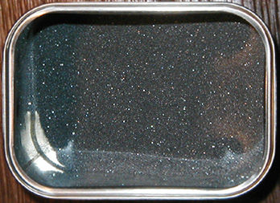
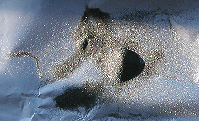

## Le Carborundom ®
### Le Carborundom ® et son usage en arts plastiques
 **Le carborundum ®**

Poudre abrasive à base de carbure de silicium (une molécule toute simple, CSi), le Carborundum ® fut l'invention d'un homme peu ordinaire, Edward Goodrich Acheson (1856-1931), un touche-à-tout américain véritablement génial, à demi autodidacte, qui déposa soixante-dix brevets au total.

C'est en cherchant le moyen de synthétiser un diamant artificiel que ce chercheur atypique (remarqué par Thomas Edison qui lui fournira une aide amicale plusieurs fois dans sa vie) observa une curieuse poudre qui se déposait sur les carbo-électrodes de son four. Croyant par erreur avoir affaire à un composé carbo-aluminé - ou parce qu'il remarqua très vite ses propriétés abrasives -, il baptisa cette substance d'après le mot _corundum_, c'est-à-dire [corindon](corindon.html) (un composant majeur de [l'émeri](emeri.html)). Le brevet de fabrication fut accordé le 28 février 1893.

_Incroyable mais vrai_, l'inventeur trouva un peu plus tard un moyen de créer, par la fusion à 4150°C de cette substance, la plus abrasive après le diamant, un graphite très pur qui permit la réalisation de solutions [colloïdales](colloide.html) utilisées par les industries comme _d'extraordinaires lubrifiants_ (lire passage in _[graphite](graphite.html#acheson)_) ! Abrasion extrême, lubrification extrême : E. G. Acheson a réellement posé deux des principaux jalons entre lesquels s'étend l'espace technologique que nous connaissons actuellement.

En effet, l'industrie de précision des XXème et XXIème siècles n'aurait pratiquement pas pu exister sans le Carborundum. Son découvreur, qui ne sut pas profiter pleinement des possibilités financières de ses inventions, reçut quand même sur le tard une certaine reconnaissance (médailles, doctorat _honoris causa_) et ne mourut pas dans la misère.

Aujourd'hui, la poudre scintillante - au demeurant peu coûteuse - est toujours très employée par l'industrie, mais nous la connaissons surtout par les outils de bricolage. Cela va de la mèche de perceuse "au carbure" aux feuilles abrasives couvertes de colle puis saupoudrées de Carborundum avant d'être montées sur des outils aux formes diverses.

Un peu moins connus, le dépolissage du verre, certains procédés contemporains de gravure, l'emploi comme matériau [réfractaire](refractaire.html), sont des applications de cette substance extraordinaire qui demeure injustement peu connue du grand public.

Après avoir fait la fortune de nombreux industriels, le carbure de silicium intéresse aujourd'hui l'industrie des micromécanismes, des nanotechnologies annonçant "_l'ère du diamant_".

Et les artistes, que peuvent-ils faire de ce produit ? 

Dans le domaine artistique, la première application semble avoir été est la gravure. Elle survient tardivement, en 1967, lorsque l'artiste franco-américain Henri Goetz (ingénieur chimiste de formation) invente le procédé au Carborundum ® - [lire l'article consacré à l'atelier Pasnic](http://www.artrealite.com/pasnicatelier.htm). Plus tard, à partir de 1978 ou 1979, cet atelier offrira de larges possibilités à qui s'intéresse à la gravure par ajout et non par retrait ou par copie sérigraphique ou offset. Le produit supporte des pressions colossales et autorise donc les reliefs.

Restent les possibilités esthétiques qui lui sont propres. Certes, les poudres métalliques pigmentaires (or, cuivre, etc.) ont acquis une certaine noblesse dont le "carbure", encore trop jeune, est encore dépourvu, mais cette étrange substance proche du diamant a sûrement des possibilités qui n'ont pas encore été exploitées.

Elle est aussi magnifique que mystérieuse, à la fois sombre et étincelante. Un artiste, peintre, sculpteur, plasticien ou orfèvre, s'y intéressera sans doute un jour sous cet angle.

Nous avons trouvé un distributeur fiable ([cliquer ici pour consulter ses coordonnées](refh.html#haxoblun)). Tout autre fabricant ou détaillant est chaleureusement invité à se faire connaître ([cliquer ici](ecrire.html)).

Voir [silicium](silicium.html), [palettes](palettes.html#palettesaposer), [article _La silice (arts picturaux)_](silicepeinture.html) et surtout l'article consacré à [**_l'atelier Pasnic_**](http://www.artrealite.com/pasnicatelier.htm).

Note : nos photos peuvent sembler légèrement floues mais la transparence et la finesse du Carborundum ® en sont la cause.

 [Communication](http://www.artrealite.com/annonceurs.htm) 

