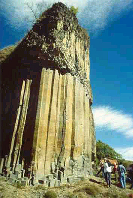

## Le basalte
### Le basalte, usage en sculpture
 **Le basalte**  

Il n'est rien d'autre que de la lave. Il constituerait la totalité de la couche de croûte terrestre s'étalant de 16 à 160 km de profondeur. C'est aussi la roche la plus courante _à la surface_ de notre planète (70% de celle-ci, dit-on).

Il est relativement (très relativement) peu chargé de [silice](silice.html). Pour cette raison, il est classé parmi les [roches basiques](rochesbasiquesacides.html). Lire absolument l'article [_La différenciation magmatique_](differenciatmagma.html). Sa densité est située aux alentours de 3.

C'est une roche [ignée](igne.html) [effusive](ignees.html#effusives) [microlithique](microlithe.html) plutôt noire généralement (voir quand même une exception [ci-dessous](basalte.html#photoorgueschilhac)), faite

> \* d'une masse vitreuse (donc très majoritairement non cristalline). Quand elle domine dans la roche, celle-ci est nommée _tachylite_.
> 
> \* d'une quantité variable de [microlithes](microlithe.html)
> 
> \* de [phénocristaux](phenocristal.html) de [feldspath](feldspath.html) [plagioclase](plagioclase.html), de [pyroxènes](pyroxene.html), d'[olivines](olivine.html), de [magnétite](magnetite.html) (apportant la couleur noire), etc. Il existe cependant des variétés de basaltes sans phénocristaux, dites _aphanitiques_.

Le basalte se présente en coulées pouvant former par accumulation des volcans énormes dépassant cinq mille mètres d'altitude (dits "volcans hawaïens") et bien davantage sur d'autres planètes du système solaire. Ces coulées peuvent prendre la forme d'entassements de coussins (volcans sous-marins, voir _[La palagonite](verre.html#palagonite)_) ou bien, exceptionnellement, de prismes géants ("orgues" d'Auvergne, France - ci-contre, celles de Chilhac, Haute-Loire, avec l'aimable autorisation d'[Alain Guillon](quinoussommes.html#alainguillon) -, "Chaussée des géants" en Irlande du Nord, grotte de Fingal dans les Hébrides, Royaume Uni). Ces phénomènes plutôt rares en surface se produisent lorsque la lave bénéficie de conditions spécifiques de refroidissement.

Au point de vue de la technique artistique, les basaltes sont des pierres dures, comme [les granites](granit.html) (quoiqu'un peu moins). Ils se travaillent avec les mêmes outils. Plus fins que les granites, ils autorisent de beaux polissages.

Les basaltes d'Auvergne sont couramment utilisés en sculpture.

 [Communication](http://www.artrealite.com/annonceurs.htm) 

