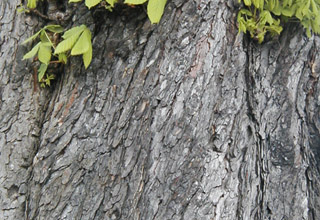
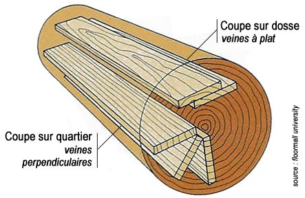

## Le bois comme support
### Le
                            bois comme support
 **Le bois comme support**

_Pour le moment, Dotapea n'est pas en mesure d'évoquer le bois en tant que substrat dans le contexte de la sculpture et des installations. Cet article est donc pour l'instant exclusivement consacré au bois en tant que support de la peinture._

_Le bois a été le support favori des peintres avant la généralisation de l'usage de la toile._

_Certains états d'Europe du Nord contrôlaient la fabrication du bois à peindre. Des corporations de menuisiers appliquaient leurs marques sur les bois, comme aujourd'hui les fabricants de papiers._

Sommaire

[Quel bois ?](bois.html#quelbois)

[Un bois sous quelle forme ?](bois.html#unboissousquelleforme)

[Le panneau massif](bois.html#lepanneaumassif)

[Le contreplaqué](bois.html#lecontreplaque)

[Le latté](bois.html#lelatte)

[L'aggloméré](bois.html#lagglomere)

[L'Isorel ®](bois.html#lisorel)

[Le "médium" MDF](bois.html#mdf)

[Conclusion](bois.html#assemblerdepetitesplaques)

_[Cennino Cennini](livres.html#cennini) préconisait deux essences : le tilleul et le saule. De fait, le tilleul a été utilisé comme support d'antiques portraits du Fayoum (exemple ci-contre - [lire passage in Les cires utilisées comme liants](cires.html#introduction)), dont la conservation est_ _exceptionnelle._

_Vinci, entre autres maîtres, conseillait l'assemblage des plaques et le contre-collage. De fait, avant et après lui, cette pratique s'est imposée et a fait ses preuves. Ce choix pourrait finalement s'avérer au moins aussi important que celui de l'essence. Bien ajustées, plaques et lattes semblent en effet équilibrer leur tensions._

_Une distinction a été faite depuis longtemps entre deux types de bois :_

> \* _le bois dit tendre - en fait pas forcément tendre -, c'est-à-dire celui des conifères_
> 
> \* _le bois dit dur - en fait pas forcément dur -, celui des feuillus._

_Le bois tendre est souvent considéré comme "nerveux", "mouvant". Il est déconseillé pour cette raison par certains auteurs. Pourtant, sous forme assemblée, il est performant, nous aurons l'occasion d'y revenir._

L'utilisation actuelle du bois comme support pour la peinture correspond principalement à trois contextes :

> \* l'apprentissage, la réalisation de nombreux tableaux ([Isorel ®](bois.html#lisorel))
> 
> \* [le marouflage](marouflage.html)
> 
> \* les travaux plastiques professionnels exploitant essentiellement
> 
> > \* les petites surfaces
> > 
> > \* les très grandes surfaces décomposées en petites surfaces.

Pour des raisons de poids et parce que toiles et papiers se sont imposés, les autres formats sont moins utilisés.

**Quel bois ?**

Traditionnellement, l'emploi de certaines espèces ont été recensés :

> \* **le chêne**
> 
> \* **le cèdre**
> 
> \* le tilleul
> 
> \* le saule
> 
> \* le châtaigner
> 
> \* le hêtre
> 
> \* le noyer
> 
> \* le peuplier (ex. : la Joconde)
> 
> \* le pin - assez proche, on nous signale aussi l'épicéa qui contiendrait moins de résines
> 
> \* **l'acajou, d'emploi plus récent**, n'attire pas les vers à bois.
> 
> \* l'okoumé est également mentionné par [Xavier de Langlais](livres.html#langlais) comme support d'emploi récent utilisable "_à la rigueur_". Ce sujet semble pouvoir prêter à polémique.

Précisons que l'okoumé, provenant d'Afrique équatoriale occidentale est le principal constituant des bois assemblés modernes en provenance de cette région, voire peut-être de certains agglomérés. Comme l'acajou, l'okoumé résiste bien à différents insectes, mais pas aux termites. _Cependant, toutes les sources s'accordent à mentionner sa forte réactivité à l'humidité._  
Nous nous permettrons donc d'émettre tout à fait exceptionnellement une réserve vis-à-vis de l'affirmation du Maître Xavier de Langlais, selon laquelle les agglomérés d'acajou et d'okoumé sont de bons supports. Ils ne sont pas assemblés et leur agglutinant est en contact direct avec l'extérieur. Un aggloméré réalisé avec de l'okoumé et une mauvaise colle risque de réagir fortement à l'humidité et d'attirer une population mycologique inopportune, sans parler de la fragilité du support. Voir plus loin _[L'aggloméré](bois.html#lagglomere)_.

Les conifères sont généralement peu appréciés. Xavier de Langlais mentionne l'utilisation "_dans le midi_" du cèdre et du pin "_qui n'offraient pas cependant pour cet usage toutes les garanties !_"

Pourtant, cette utilisation traditionnelle n'est pas tout à fait dénué de fondement : le même auteur affirme que les panneaux de bois assemblés de nature tendre (comme le pin notamment) "_se déforment moins que les bois durs sous l'action de l'humidité_".

Quel que soit le bois, l'emploi de vermifuges n'est pas anodin et peut altérer la couche peinte, ce qui fait l'intérêt de l'acajou.

La qualité des bois assemblés (c'est-à-dire la plupart des bois utilisés en peinture) dépend beaucoup de celle des colles d'assemblage.

**Un bois sous quelle forme  ?**

Le débit et l'assemblage permettent d'utiliser des supports de dimensions et de propriétés variées :

_le panneau massif_

Il est malheureusement débité "sur [dosse](dosse.html)", c'est-à-dire dans le sens de la longueur du tronc et sur sa largeur entière. Il se courbe en vieillissant parce qu'il est composé de deux éléments qui s'altèrent de manière différente : 

> \* le coeur, déjà sec, ne change guère,
> 
> \* l'aubier, réparti en deux masses, de part et d'autre du coeur, rétrécit en séchant.

Le phénomène est accentué lorsque le revers est exposé à l'air. L'enduction du revers avec des produits contemporains efficaces tels que du vinyle ou un vernis adapté, peut limiter les dégâts (voir [contre-collage](contrecollage.html)).

Le remède des anciens peintres était tranchant : éviter l'emploi de bois débité sur dosse, lui préférer les coupes sur quartier dont il existe deux types : la coupe sur quartier théorique et la coupe sur quartier pratique. Sensiblement équivalentes au point de vue du peintre, elles sont plus difficiles à réaliser que la coupe sur dosse et offrent un rendement inférieur pour l'entrepreneur.

Xavier de Langlais mentionne une opération nécessaire pour toute surface d'un mètre carré ou plus : le parquetage. Nécessitant des outils spécifiques, nous n'avons pas souhaité nous étendre sur cette préparation qui sera, de toute façon, réalisée par des spécialistes du bois.

Les peintres primitifs ont préféré au panneau massif des assemblages de lattes de bois comparables au latté contemporain. Dans l'ensemble, leurs travaux se sont bien conservés.

Il semble que les panneaux faits d'un seul bloc ne peuvent être employés - aussi magnifiques soient-ils - pour les grandes tailles que moyennant des garanties de qualité exceptionnelle.

Les épaisseurs recommandées en fonction des dimensions ne peuvent être indiquées car elles dépendent du bois choisi et de la coupe.

_Le contreplaqué_

A priori (car l'invention est récente et nous manquons de recul pour juger), il serait un très bon support pour les tableaux de petite taille (60 cm au maximum dans la plus grande dimension, avec un épaisseur avoisinant alors le centimètre). Il suffit de l'enduire, _au revers comme à l'avers_, d'un liant vinylique ou acrylique. Les enduits-colles à la caséine peuvent être utilisés lorsque les dimensions, rapportées à l'épaisseur, suggèrent une solidité suffisante. Ces produits n'étant pas très souples, le support doit être très rigide. La [colle de peau](colledepeau.html), elle, crée de fortes tensions et ne peux être conseillée.

_Le latté_

C'est le seul support avéré correct pour les œuvres de bonne taille. **Il s'apparente aux assemblages anciens.** L'apprêt d'encollage doit être disposé sur les deux faces, comme pour le contreplaqué. Solide, il autorise l'emploi d'enduits-colles à la caséine. Il faut cependant veiller à choisir des plaques présentant une épaisseur raisonnablement en rapport avec la grandeur de la surface. En cas de doute sur la rigidité du support, l'emploi d'un liant vinylique ou acrylique est préférable.

_L'aggloméré_

Il est boudé par les peintres car empli de colles de compositions incontrôlables qui sont directement en contact avec l'extérieur. De plus, il est difficile à préparer et fragile.

Certains agglomérés, le Copopan ® et l'Isopan ® semblent cependant présenter des propriétés intéressantes selon [Xavier de Langlais](livres.html#langlais). Une source flamande au demeurant intéressante mentionne également ces produits : [http://users.pandora.be/werner.de.wree1/1%20olieverf.htm](http://users.pandora.be/werner.de.wree1/1%20olieverf.htm).

Après une courte enquête, si le Copopan ® semble identifié comme un agglomérat de copeaux présentant probablement une qualité hors norme, l'Isopan ® semble un mystère. Ce terme désigne en effet des plaques d'aluminium thermo-isolantes, des produits de réparation pour carrosseries automobiles à base de fibre de verre, etc., mais nous n'avons pas su identifier la moindre substance de ce nom ressemblant à du bois !

[Toute information à ce sujet sera bienvenue.](ecrire.html)

_L'Isorel ®_

_Lire_ [_l'article du glossaire_](isorel.html)

C'est une planche fine (environ 5 mm, souvent moins) fabriqué par projection de bois pulvérulent et de colle - théoriquement de la [colle de poisson](colledepoisson.html). Elle peut être découpée à façon. Elle a une face totalement lisse et une autre très rugueuse.

La face lisse peut être des avantages pour certains travaux, par rapport à la toile. La plupart des anciens maîtres, qui recherchaient une surface la plus lisse possible, auraient apprécié ce support. Les peintres utilisant le verso rugueux sont cependant assez nombreux aujourd'hui.

Il faut signaler l'intérêt de ce support pour l'apprentissage de la peinture : c'est un bois peu coûteux présentant, on l'a vu, deux grains différents, que l'on peut se procurer à la découpe ou sous forme de chutes dans n'importe quel magasin de bricolage. Il se prête parfaitement aux tests picturaux.

Voir absolument _[Préparation de l'Isorel ®](preparatboispeinture.html#lisorel)_.

_Le "médium" MDF_

C'est une variante récente d'agglomérat bois-colle. Le "Medium Density Fiberboard" (panneau de fibres de moyenne densité) est réalisé à partir d'essences diverses - y compris résineuses - réduites en poudre et traitées à la vapeur avant d'être encollés à l'aide d'une colle synthétique ([polyuréthane](polyurethane.html) ?), ce qui n'est guère original. Plus remarquable est le fait qu'il peut être ignifugé ou hydrofugé "dans la masse", lors de la fabrication. Par ailleurs il se déformerait peu, ne se fendrait pas et n'éclaterait pas (informations non confirmées).

Les plaques, épaisses de quelques millimètres à quelques centimètres pour des dimensions conséquentes (plusieurs mètres), peuvent être couvertes - en usine - d'une couche de [mélamine](melamine.html), d'un film [PVC](melamine.html), de papier ou de vernis divers.

Non recouvertes, elles pourraient être assemblées (plaquées) à l'aide de colles vinyliques ou "UF" (urée-formol).

La masse volumique se situe autour de 600 à 800g/m2, ce qui est assez peu.

On a peu d'informations concernant l'enduction. Une précision cependant : les faces usinées (sciées) sont plus poreuse et doivent normalement être enduites de l'une des colles mentionnées ci-dessus.

**En principe, ce support a vocation décorative.** Il peut tout à fait être peint directement ou laqué mais on n'a guère d'informations sur le long terme ni sur la qualité de l'accrochage de certaines peintures sur ce support. Il est aussi employé pour maroufler des oeuvres.

Notons enfin que le « médium » engendrerait plus de poussières au sciage qu'un bois "classique". Ces poussières contiendraient - c'est bien normal - des résidus dégradés de colle, dont entre autres du monoxyde de carbone, des oxydes d'azote et de soufre et de [l'aldéhyde formique](formol.html) (source : [strategis.ic.gc.ca](http://strategis.ic.gc.ca/)). Selon la même source, "_La qualité du MDF et la fiabilité de ses propriétés ont réalisé des progrès considérables au cours des 10 dernières années_" (texte de 2006), ce qui signifie que ce support n'a très probablement pas encore atteint une formulation et un traitement "définitifs". Très séduisant à plusieurs points de vue, il ne constitue pas encore une solution _éprouvée_ pour des travaux artistiques et/ou de valeur destinés à résister à l'épreuve du temps. Mais c'est une technologie déjà utilisable dans certains domaines et à surveiller de près de toute façon.

**Conclusion**

La "solution juxtaposition/assemblage" a été retenue par différents maîtres, y compris au XXème siècle. Lesdites plaques peuvent elles-mêmes être des assemblages (contre-plaqué, latté).

Autre paramètre important quoique plus intuitif : quelle que soit la forme ou la variété végétale, une pièce faite d'un bois trop frais, trop résineux, est difficilement exploitable en tant que support en raison des risques d'exsudation. C'est peut-être le point le plus important lors du choix du bois.

L'encollage et la préparation du bois, à part quelques exceptions, sont essentiels. Un article entier lui est consacré. [Cliquer ici.](preparatboispeinture.html)

