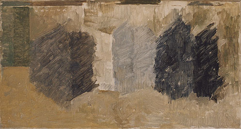
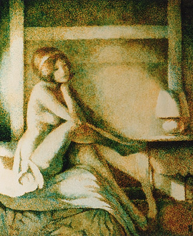

## Le brossé vs le posé
### procédés d'application : brossé contre posé, usage en arts plastiques
 **Le brossé _versus_ le posé**

_Le coup de brosse de l'artiste peintre ne consiste pas, généralement, en un simple balayage._

_Habituellement, le peintre **pose** la pâte plus qu'il ne la balaye (voir photo ci-dessous, travail en glacis superposés de deux couleurs seulement). Le mouvement du pinceau est fréquemment tournoyant, local, empâté et non balayé quand il s'agit d'effectuer par exemple un mélange de couleurs_ [alla prima](p.html#primaallaprima)_._

_Si le brossage/balayage est souvent la tendance naturelle du débutant, quelques rares peintres de haut niveau maîtrisent parfaitement ce procédé (voir photo ci-contre à droite, tableau de [Shinji Yamada](quinoussommes.html#shinjiyamada))._

La décision de peindre par brossage, par balayage, est souvent la conséquence de la nécessité de "casser", précisément parce que le brossage casse la touche.

Il peut aussi être intéressant de brosser franchement - notamment lors de l'application de [gesso](fabriquerungesso.html) - pour utiliser ensuite, telles quelles ou non, les traces parallèles laissées par les poils de la brosse. L'utilisation de [soie de porc](pincpoils.html#lasoiedeporc) est alors recommandée car c'est ce poil qui laisse le plus d'empreintes.

Il existe d'autres applications de la technique par brossage mais celle-ci, peu aisée, demeure d'usage minoritaire. Elle est souvent employée avec une matière maigre ([jus](jus.html), [glacis](glacis.html)), autorisant des retraits dans le frais.

 [Communication](http://www.artrealite.com/annonceurs.htm) 

