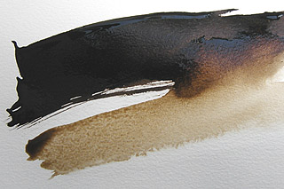

## Le brou de noix
### Le brou de noix, usage en arts plastiques
 **Le brou de noix**

L'étymologie du terme brou est assez surprenante. Elle a probablement un rapport avec l'action de brouter ou de broyer, avec la brousse et même les pousses.

On peut l'écrire brout.

_Le brou de noix est un liquide brun, semblable d'aspect et de consistance à une encre. Il est utilisé en peinture pour les [lavis](lavis1.html) et en menuiserie (teinture des bois) ainsi qu'en teinturerie. Il se dilue dans l'eau._

_Note : des précisions substantielles ont été apportées à cet article  
dans le cadre d'un "courrier des Lecteurs". [Lien.](courrierdeslecteurs2011c020.html#20110805ccd)_

_Les variétés vendues dans les drogueries et les supermarchés sont rarement de véritables brous de noix. Il s'agit (en théorie) de solutions liantes ou de poudres contenant un "extrait de Cassel" (voir [terre de Cassel](noirs.html#laterredecassel))._

_Le véritable brou de noix est fabriqué avec l'écale - de la noix de plusieurs variétés de noyers (un arbre originaire d'Anatolie et exploité depuis l'Antiquité). L'écale est une sorte de gangue verte à l'extérieur, que l'on broie._

_L'écale jeune peut donner des teintures rouges pour les cheveux. Les variétés plus mûres ont servi pour les vêtements. Les Gaulois se seraient beaucoup servi de ces produits. Il n'est pas à exclure que de belles Gauloises portant torque et fibules d'or sur tuniques rouges se soient teint les cheveux en roux ainsi._

Au Moyen-âge en Occident, le brou a servi de teinture noire. Mal conditionné, sans doute à cause d'une perte de savoir-faire typique de cette période, il était de mauvaise qualité. On le nomma "faux noir" et "noir corrosif" à cause des adjuvants mal employés qui rongeaient les tissus. A la même époque, des peuples amérindiens semblent avoir utilisé l'écorce et la racine d'arbres divers pour produire des teintures de bonne qualité (ici, la source d'informations est [Anne Varichon](livres.html#annevarichon)). L'empire ottoman aurait préféré utiliser cette substance pour obtenir des jaunes.

En teinturerie, les feuilles émiettées du noyer peuvent être utilisées aussi bien que l'écale. Une bonne marinade (dans l'eau) devant permettre une coloration très forte doit durer deux ans, mais on peut abréger le processus au bout d'un mois pour obtenir un résultat plus clair à partir de feuilles ou de gangues jeunes qui donnent des teintures plus ou moins vertes. Le brou de noix donne de toute façon des teintures très solides. Son [mordant](mordant.html) est [l'alun](alun.html).

Revenons à l'emploi en peinture. Là, c'est exclusivement l'écale qui produit le brou - toujours brun - et non les feuilles de l'arbre.

**Le brou de noix est généralement [réversible](liants.html#reversibilite)** (non mordancé ni lié), ce qui présente

> \* un avantage : vous pouvez corriger aisément les erreurs, les imprécisions, comme avec une [gouache](gouache.html) ou une [dextrine](dextrine.html).
> 
> \* un inconvénient : vous ne pouvez pas travailler confortablement par couches superposées et vous ne pouvez employer les techniques mixtes qu'avec les contraintes que cela implique.

Il est peu coûteux, assez permanent et très pratique pour les travaux d'étude. Les imitations conviennent aussi dans ce dernier cas.

Voir _[Le lavis](lavis1.html), [La sanguine](sanguine.html), [La sépia](sepia.html), [L'encre de Chine](encredechine.html)_.

