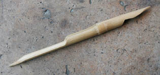

## Le calame
### Le calame, usage en arts plastiques
 **Le calame**

_Avec ce morceau de roseau (_calamus_, qui donne "chaume") ou de bambou taillé - sans doute aussi d'autres bois -, les Anciens d'Orient et d'Occident ont écrit surtout - notamment sans encre, par incision sur les tout premiers supports, de petites masses d'argile - et parfois dessiné._ 

_En Occident, la plume d'oie a remplacé cet outil mais celui-ci est encore utilisé à des fins artistiques sur tous les continents._

Aujourd'hui, de nombreux artistes recherchent son trait franc, heureusement imparfait et généreux qui se prête non seulement au croquis, mais aussi à certains travaux plus élaborés dans lesquels la recherche d'une spontanéité, d'une authenticité du travail gestuel jouent un rôle majeur.

Les papiers glissants comme le [bristol](papierspourlaquarelle.html#bristol) et le [lavis technique](papiersspeciaux.html#lavistechnique) donnent d'excellents résultats (préférez des grammages important si vous souhaitez appliquer une grande quantité d'encre).

Le calame se taille facilement au cutter. Sa grande taille autorise l'emploi de toutes sortes d'encres et de peintures diluées.

Il est parfois utilisé en calligraphie mais... ne met pas son utilisateur à l'abri du _lapsus calami_.

 [Communication](http://www.artrealite.com/annonceurs.htm) 

