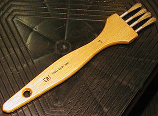

## Le chiqueté ou chiquetis
### Le chiqueté ou chiquetis, procédé d'application, usage en arts plastique
 **Le chiqueté**

Le terme provient de "chique" (petite boule), venant peut-être du verbe allemand _schicken_, envoyer.

En arts plastiques et décoratifs, il s'agit à peu près de cela : de petites "chiques" de peinture sont "envoyées" sur une surface ou déposées grossièrement au pinceau, à l'éponge ou d'une autre manière. 

La pose peut aussi être effectuée à l'aide de brosses spéciales ayant plusieurs sorties rondes parallèles, montées en fourche. Voir [brosses à chiqueter](pincformes.html#sortiesmultiples).

Le but est de créer des taches aux formes irrégulières devant soit être conservées telles quelles ("tachisme") soit être ensuite reprises dans le frais à [l'éponge](eponge.html), à la brosse ou au [chiffon](chiffon.html) pour créer des effets plus diffus et des [imprimés](imprime.html).

Une peinture séchant lentement apporte une plus grande facilité de réalisation pour les grandes surfaces.

Voir aussi [Dépouillé](depouille.html).

 [Communication](http://www.artrealite.com/annonceurs.htm) 

