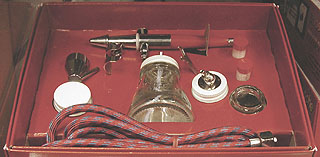
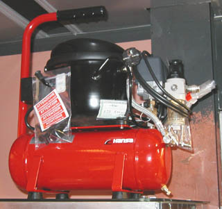

## Le compresseur
### Le compresseur, usage en arts plastiques et arts graphiques
 **Le compresseur**

Cet outil motorisé est destiné au procédé à l'aérographie (voir ci-contre à droite, photo d'un pistolet aérographe classique).

Les peintures employées sont

> \* l'[acrylique](acrylique.html) sous forme d'encres ou de pâtes diluées dans l'eau
> 
> \* la peinture au [polyuréthane](polyurethane.html), utilisée notamment pour les carrosseries automobiles et en décoration, employée conjointement à une résine fixative réputée pour sa solidité, projetée également.

Le colorant est projeté sous la forme de gouttelettes microscopiques, autorisant des fondus et des modelés remarquables.

Le compresseur (photo à gauche) est souvent employé conjointement avec la [frisket](reserves.html#frisket) (ou un produit équivalent) pour créer des masques suivant une technique empruntant beaucoup au pochoir.

 [Communication](http://www.artrealite.com/annonceurs.htm) 

