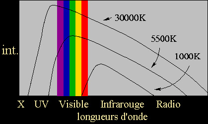
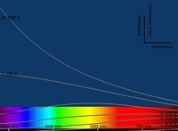

## Le corps noir
### Le corps noir, présentation, usage en arts plastiques
 **Le corps noir** 

_Notre but est d'ouvrir progressivement Dotapea aux champs artistiques tels que le sky art et le land art, mais aussi certains types d'installations et de performances._

_Qu'est-ce que le corps noir ?_

Les physiciens se sont aperçus que les corps qui absorbent le plus la lumière, comme le carbone par exemple, sont ceux qui émettent le plus d'énergie thermique.

Un corps qui absorbe toute l'énergie rayonnante qui l'entoure est nommé _corps noir_. Fait curieux, l'énergie qu'il rayonne lui-même par [incandescence](corpsnoir.html#lincandescence) (représenté par son [spectre](pigments.html#spectre)) ne dépend pas de _la nature_ de ce corps. Cet étrange phénomène est universel. 

Il était donc tentant d'en faire un étalon.

_Température de couleurs_

Le spectre du corps noir varie beaucoup en fonction de sa température ([voir diagramme ci-dessous](corpsnoir.html#diagrammetempercorpsnoir)).

On peut donc comparer le spectre d'une lumière quelconque à celui du corps noir chauffé à diverses températures. Au niveau de coïncidence des deux spectres, on dit que la température du corps noir est la _température de couleur_ de la lumière en question.

Quelques définitions

L'incandescence (cas les plus courants : la flamme, l'ampoule classique dite "lampe à incandescence", halogène ou non) est l'émission de lumière par un corps par le seul fait de sa propre température.

Par contre, la photoluminescence (néons, couleurs fluorescentes, phosphorescentes, etc.) est provoquée par l'apport direct d'énergie en provenance de l'extérieur. [Lire l'article consacré à ce phénomène.](photoluminescence.html)

  
Il s'agit là d'une sorte de moyenne statistique. Par exemple, la lumière d'un néon n'occupe que très peu de "[raies d'émission](pigments.html#spectre)" et n'aura qu'un lointain rapport avec l'un des spectres du corps noir alors que le soleil couvre un très large [spectre](pigments.html#spectre) nettement plus comparable.

Mais même le spectre solaire se révèle différent selon qu'il est observé à partir de l'espace ou de la terre. Ici, les éléments présents dans l'atmosphère absorbent certaines raies d'émission. Il suffit de quelques nuages pour que cette variabilité nous soit directement sensible !

L'emploi des "moyennes statistiques" que nous évoquions est lié à leur utilisation la plus courante, liée à l'emploi d'éclairages artificiels (très importants dans les domaines du cinéma et de la photo notamment, mais aussi dans les musées, les galeries et certains ateliers d'artistes).

En liaison directe avec ces domaines, des étalons internationaux en matière de spectres lumineux ont été créés.

L'étalon A a une température de couleur de 2850K. Il correspond à une banale lampe au tungstène.

L'étalon B "atteint" 4800K. Il ressemble à la lumière du soleil.

L'étalon C, 6500K, évoque la lumière d'un ciel bleu. Son spectre est obtenu à l'aide de filtres pigmentés au cuivre et au cobalt.

Le blanc (noté W) est une lumière théorique possédant un "spectre d'égale énergie" : toutes les couleurs sont aussi intenses. Dans les faits, le blanc est obtenu avec une lumière proche de l'étalon A à laquelle on applique des filtres légers bleus et rouges.

_Comme le prouve le diagramme ci-dessus - aimablement fourni par [Alain Klotz](quinoussommes.html#klotz) - il n'y a aucun lien entre la température de couleur et les appellations courantes "couleur chaude" ou "couleur froide", très utilisées dans le domaine des arts picturaux. Ou plutôt, si un lien devait exister, il serait inversé : les bleus et violets correspondent à des températures de couleurs plus élevées que les couleurs dites chaudes._

_A droite, un zoom plus détaillé sur le spectre visible (cliquer sur l'image pour l'agrandir) :_

 

 

En fait, un spectre naturel est toujours complexe. Pour l'analyser, on est obligé de recourir à des concepts tels que le "facteur de pureté" ou la "longueur d'onde dominante". De plus, la température des éléments émetteurs détermine la largeur de chaque spectre d'émission. L'identité d'un spectre à celui du corps noir chauffé à une température donnée n'est jamais qu'approximative.

 [Communication](http://www.artrealite.com/annonceurs.htm) 

