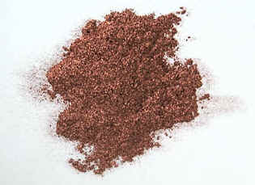

## Le cuivre
### Le cuivre comme pigment, usage en arts plastiques
 **Le cuivre  
(pigment)**

Le véritable [cuivre](annexe1.html#cu) pur n'est pas courant en tant que pigment. La solution la plus simple pour s'en procurer consiste certainement à râper des tuyaux destinés à la plomberie. Mais il est difficile de produire un grain fin et homogène.

Dans le domaine pigmentaire contemporain, les imitations du cuivre non oxydé ne se comportent vraiment pas de la même manière que le véritable cuivre "pur", nettement plus lourd - et plutôt coûteux. Nous avons testé l'un de ces produits liés à l'huile et à l'eau ; le résultat est variable : tantôt noirâtre, tantôt franchement bleu, ce qui nous pousse à affirmer que les imitations n'en sont pas vraiment. Elles contiennent bien du cuivre, mais en quelles proportions ?

Pour toute peinture, une précaution s'impose : isoler la couche de cuivre "en sandwich" entre deux [glacis](glacis.html) (en respectant les temps de siccativation) pour éviter l'oxydation, en s'assurant de la neutralité chimique des substances utilisées ([papier tournesol](papiertournesol.html)).

L'oxydation du cuivre a elle-même donné lieu à de très nombreuses substances colorées, mais ce métal ne "rouille" pas si facilement que nous pourrions le croire. Forcer le travail des ans et des lustres, même en s'aidant d'acides, n'est pas si simple.

_**Oxyder le cuivre (ou le bronze, qui en contient beaucoup, voire aussi le [laiton](laiton.html)) est un métier.**_

Les patineurs spécialisés en sculpture ne diront sûrement pas le contraire et les sculpteurs non plus, pas plus que les fabricants de pigments qui produisent les bleus et verts de [phtalocyanine de cuivre](phtalocyanines.html). Pendant l'Antiquité et le Moyen-âge, le [vinaigre](vinaigre.html) a été utilisé comme oxydant. Il existe aujourd'hui des produits plus puissants destinés à accélérer radicalement la formation de vert-de-gris, mais ils sont, on s'en doute, fortement toxiques et corrosifs, tout comme les [eaux-fortes](e.html#eauforte) des graveurs.

Lire un [passage](chap19oxydationsmetaux.html#patines) (et des exemples) dans le chapitre XIX des Dialogues de Dotapea.

Attention : le cuivre pourrait présenter certains aspects dangereux pour le vivant, notamment en s'oxydant (lire passages dans [Toxicité](toxicite.html#lecuivre) et dans [Vert-de-gris](verts.html#vertdegris)).

 [Communication](http://www.artrealite.com/annonceurs.htm) 

