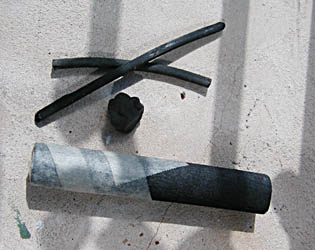

## Le dessin préparatoire
### Le dessin préparatoire à un travail de peinture, usage général en arts plastiques
 **Le dessin préparatoire**

_A Niaux (Ariège, France) vers 12 000 BC, on utilisait déjà des torches calcinées pour poser à même la roche les bases des peintures pariétales._

_De nos jours, le dessin préparatoire est réalisé sur une toile, un papier ou tout autre support avant l'application de la peinture afin de poser des points de repère et, parfois, de déceler des erreurs de composition._

**La solution classique : fusain, graphite**

Le [graphite](graphite.html) donne d'assez mauvais résultats lorsque le tableau est destiné à être peint à l'huile ou, plus rarement, à la cire ou tout autre liant gras. **Seul le [fusain](fusain.html) est assez maigre** pour ne jamais entraîner d'affreuses coulures au contact des huiles, corps gras et essences. Pour qui souhaite absolument utiliser du graphite, nous conseillons la qualité la plus maigre possible (6H, 8H).

L'acrylique ou tout autre peinture aqueuse pourraient également mal réagir à un tracé réalisé avec un crayon ou une craie trop grasse.

Mais même naturel, non reconstitué (voir photo), le fusain lui-même laisse des traces poudreuses dans les [jus](jus.html) initiaux. Il est souhaitable d'estomper beaucoup les tracés avant de commencer à peindre. Lors du travail au fusain proprement dit, utiliser une [gomme mie de pain](gommemiedepain.html) bien propre, sans graisses, ou mieux encore, une [gomme chaussette](gommes.html#lagommechaussette), outil parfaitement adapté à cet emploi.

**Solution moderne**

_Un tracé préparatoire peut être directement réalisé avec une pâte extrêmement diluée, effaçable au chiffon, plutôt qu'avec un [fusain](fusain.html) dont la poudre noire, même estompée, sera de toutes manières étalée par vos premiers coups de brosse, salissant vos premières couleurs.  
Le tracé initial très délayé apporte de plus la possibilité de poser quelques points de repères chromatiques. Le fusain peut être réservé aux dessins préparatoires sur papier séparé, pour lesquels il est parfait. Lire l'article "[jus](jus.html)" du glossaire._

_Aujourd'hui, nombreux sont les enseignants qui conseillent ce procédé dont l'intérêt est aussi d'ordre pédagogique. L'élève apprend à désacraliser la peinture, employée en l'occurrence "comme pour dessiner". De plus, devant employer une pâte très diluée, il apprend à travailler maigre aux premiers temps de la réalisation de son tableau._

Variante de ce procédé : l'emploi d'une [barre (ou bâton) d'huile](barresdhuile.html) pour le tracé de mise en place. Trois défauts se signalent particulièrement : 

> **\*** il devient vite difficile de corriger
> 
> **\*** à moins de diluer systématiquement à l'aide d'une brosse imprégnée d'essence, on est tout de suite "dans la pâte", dans le gras
> 
> **\*** la miscibilité de l'huile en barres avec la peinture à l'huile habituelle n'est pas toujours garantie. Il faut faire quelques essais, repérer un produit (une marque) qui correspond à vos exigences. Quant à la bonne tenue des peintures aqueuses sur de telles surfaces, elle est du domaine de l'improbable.

**Quelle préparation pour le dessin préparatoire ?**

> **\*** pour le [fusain](fusain.html), la surface ([gesso](fabriquerungesso.html) ou autre) doit être poreuse, plâtreuse. Le fusain lui-même doit absolument être tendre sans quoi il rayerait irrémédiablement les enduits.
> 
> **\*** pour les [jus](jus.html), les opinions sont partagées. Néanmoins, une surface bien lisse (surcouche de liant synthétique pur, par exemple) permet d'effacer très facilement au chiffon, de "gommer" littéralement les tracés malheureux.

 [Communication](http://www.artrealite.com/annonceurs.htm) 

