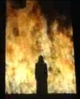
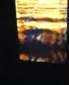
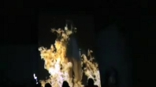
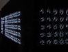
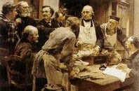

## Le feu - Chapitre XXIX des Dialogues de Dotapea
### Le feu - Chapitre XXIX des Dialogues de Dotapea
 Navig. page/section

  
  

\_\_\_\_\_

**Pages soeurs**

[I, A propos des liants](chap01liants.html)  
[II, Bulles, siccativ., struct. élec.](chap02bullessiccativation.html)  
[III, Caséine, phosphore, dissociation](chap03caseine.html)  
[IV, Les orbitales](chap04orbitales.html)  
[V, L'aérogel](chap05aerogel.html)  
[VI, Polarisation de la lumière](chap06polaris.html)  
[VII, Sfumato et diffusion Rayleigh](chap07rayleigh.html)  
[VIII, Les interférentielles](chap08interferences.html)  
[IX, Dextrine, farine et chiralité](chap09dextrine.html)  
[X, L'ocre bleue](chap10ocrebleue.html)  
[XI, Les métamatériaux](chap11metamateriaux.html)  
[XII, Le jaunissement](chap12jaunissement.html)  
[XIII, Laser etc.](chap13laser.html)  
[XIV, L'holographie](chap14holographie.html)  
[XV, L'holographie numérique](chap15holographienum.html)  
[XVI, Extérieur, intérieur, chaux](chap16interieurexterieurchaux.html)  
[XVII, L'électrolyse et les ions](chap17electrolyseions.html)  
[XVIII, L'électricité, un peu plus loin](chap18electriciteplusloin.html)  
[XIX, Oxydation, métaux](chap19oxydationsmetaux.html)  
[XX, Les échelles](chap20echelles.html)  
[XXI, Nature et évolution des résines](chap21resines.html)  
[XXII, Le mouillage pigmentaire](chap22mouillage.html)  
[XXIII, La molette](chap23molette.html)  
[XXIV, Blanche neige](chap24blancheneige.html)  
[XXV, Lumière et matière](chap25lumiereetmatiere.html)  
[XXVI, Magnétisme](chap26magnetisme.html)  
[XXVII, Ambre et vieilles branches](chap27ambre.html)  
[XXVIII, L'origami miroir](chap28origamimiroir.html)  
XXIX, Le feu  
[XXX, Peau du métal](chap30peaudumetal.html)  
[XXXI, La ville en un souffle](chap31bellastock.html)  
[XXXII, Oxyder des matériaux](chap32oxydermateriaux.html)  
[XXXIII, Ocre bleue, une solution](chap33ocrebleuesimulation.html)

\_\_\_\_\_

Copyright © www.dotapea.com

Tous droits réservés.  
[Précisions cliquer ici](droitscopie.html)

**Les dialogues sur la physique-chimie  
appliquée aux arts**

**Chapitre** **XXIX**

**Le feu**

dial   dial   dial

Emmanuel : Le dictionnaire de l'Académie donne du feu la définition suivante :

> _"Combustion d'une matière inflammable."_

et de la flamme, celle-ci :

> _"Lumière produite par les gaz incandescents qui se dégagent d'une substance, d'un mélange en combustion."_

Qui l'eut cru, la flamme est donc uniquement la lumière émise par l'incandescence d'un gaz. N'est-ce vraiment que la lumière ? J'aurais dit que c'est le gaz lui-même.

Deux autres définitions :

Incandescence. _"État d'un corps qui, porté à très haute température, devient lumineux."_  
Un peu plus loin, l'Académie évoque quand même le courant électrique dans le cas d'une lampe à incandescence.

Combustion. _"Ensemble des phénomènes qui se produisent lorsque l'oxygène ou un autre comburant entre en combinaison avec un ou plusieurs corps en dégageant de la chaleur."  
_  
Ce qui m'amène à deux ou trois questions :  
Energie électrique ou thermique... cela est-il important ? Quelles autres formes de l'énergie peuvent-elles "bouter le feu" ?  
Chaleur, lumière... existe-t-il des feux froids, ou des feux invisibles ?

Jean-Louis : Oui, bon, c'est un peu une question de définition.

_Travaux sur le projet Tristan_ _et Isolde_,

Peter Sellars/Bill Viola 2005-2008

> 1) Flamme : ce sont effectivement des gaz chauds, donc les atomes sont excités et émettent de la lumière. Les couleurs de la flamme viennent de la spécificité des éléments excités qu'elle contient : jaune=sodium, rose= azote, rouge=hydrogène, etc... (comme les [aurores boréales](phosphofluo.html#auroresboreales), en fait). C'est comme ça qu'on colore les flammes des feux d'artifice.

Deux phénomènes déterminent la couleur d'une flamme

> Il y a aussi éventuellement des particules solides (carbone, ...) [incandescentes](corpsnoir.html#lincandescence), qui elles apportent "le rayonnement du corps noir", c'est-à-dire un rayonnement continu qui va du rouge au blanc quand la température s'élève ([lien](corpsnoir.html)).
> 
>   
> 2) Ce qui produit la flamme, c'est une réaction énergétique. L'énergie peut avoir plusieurs origines : mécanique, électrique, chimique. Si tu frottes deux morceaux de silice tu produits des éclairs qui sont de la [triboluminescence](phosphofluo.html#triboluminescence), si tu fais un arc électrique tu chauffes le gaz entre les électrodes et tu l'ionises, si tu fais brûler de l'essence, tu as une réaction [d'oxydo-réduction](oxydoreduction.html) qui libère de la chaleur. En exagérant un peu, un morceau de fer qui rouille lentement et se transforme en oxyde, c'est un feu sans flamme. Le même morceau de fer peut aussi s'oxyder plus rapidement à haute température si tu le fais brûler dans l'oxygène.

Emmanuel : Si je suis bien le processus que tu indiques, l'action mécanique déclenche un échange d'électrons. Un atome (par exemple le fer que tu cites) donne des électrons à de l'oxygène qui est un grand accueilleur d'électrons.  
Cet échange produit de l'énergie thermique. Cela chauffe l'air et si je vaporise de l'essence à proximité (ou si j'approche de la paille très sèche), elle prend feu.  
Est-ce que c'est ça ? 

Jean-Louis : Ben dans le cas des silex, pas du tout !  
Le cas des deux silex frottés ou frappés : c'est de la triboluminescence. L'énergie du choc excite les électrons des molécules sur des niveaux supérieurs, quand ils reviennent à leur état "normal" ils émettent de la lumière.

  
Si par contre on frappe de l'acier avec un silex, l'énergie du choc porte l'acier à une température suffisante pour qu'il puisse commencer à brûler dans l'air, et donc dégager encore plus de chaleur, ce qui permet de propager la réaction.

_Mur de feu_, Yves Klein

recréé en mai 2007 à Nice

[Voir vidéo](http://www.youtube.com/watch?v=tfMlVXPS2aE)

Le fer brûle

(parenthèse)

Emmanuel : Pas mal, voilà une chose que je n'ai jamais essayée.  
Est-ce que l'acier brûle parce qu'il contient du carbone ou cela fonctionnerait-il aussi avec du fer ordinaire ?

Jean-Louis : Non, le fer brûle dans l'air si il est suffisamment chaud ou si la surface de combustion est grande (poudres fines). Dans l'oxygène ça brûle évidemment très bien. C'est comme ça qu'on découpe les tôles (oxycoupage).

En fait ta question soulève un point important dont on n'avait pas parlé, celui de l'allumage du feu. Tout le monde a pu constater que les allumettes restent sages dans leur boite, que l'essence des voitures ne brûle pas spontanément, etc... C'est parce que dans tous les cas, il y a un seuil énergétique à franchir pour que la combustion démarre. Il faut mettre le feu aux poudres :) ensuite, ça marche tout seul et surtout ça s'auto-entretient parce que la combustion des premières molécules donne de l'énergie aux suivantes.

Emmanuel : D'accord. Et une fois le phénomène "enclenché", c'est une oxydoréduction qui l'entretient ?

  
Jean-Louis : Oui. Tant qu'il y a combustible et comburant, et que la chaleur n'est pas dissipée. Si le feu a trop froid, il s'éteint.

**\[Feu "corporel"\]**

Distinguer l'allumage du feu "enclenché"

Emmanuel : A cause de cet auto-entretien, on a un peu l'impression que le feu est un système comparable à un être vivant. Réciproquement, on dit parfois que le corps (humain, animal) brûle ses ressources - par exemple dans l'effort physique - et qu'il a besoin pour cela de carburant (glucose, glucides, ...).

C'est induit par les concepts un peu oubliés de milieu intérieur et d'homéostasie de Claude Bernard (1857 - [lien](http://www.google.fr/#hl=fr&source=hp&q=%22claude+bernard%22+%22milieu+int%C3%A9rieur%22&aq=f&aqi=&aql=&oq=&gs_rfai=&fp=86f0fd94149efe06) vers une recherche Google). Mais jusqu'à quel point pouvons-nous vraiment nous comparer à... un feu ?

  
Jean-Louis : Comme dit, c'est une question de définition. La rouille du fer est une combustion froide et sans flamme. En général j'imagine que si il n'y a ni flamme ni chaleur, c'est pas vraiment un feu....

_La leçon de Claude Bernard_,

Léon-Augustin Lhermitte, 1889

Emmanuel : A propos de définitions, peut-on imaginer des flammes liquides ou dans d'autres phases ? Une flamme solide, une flamme de plasma...

  
Jean-Louis : C'est gazeux par définition.

**\[Mises en scène ou en oeuvre\]**

Des flammes folles ?

Emmanuel : A ton avis quels sont les moyens de contrôler un feu ? Je vois des questions et notes en vrac, n'hésite pas à répondre en vrac également, tu figures en bleu-violet :

> \* le contrôle de la composition de l'air (ou autre comburant) environnant, par exemple plus ou moins chargé d'eau ou d'autres matériaux, ou plus ou moins oxygéné. En particulier je crois que l'on peut jouer avec l'oxygénation ou la réduction pour modifier la couleur des flammes et la quantité et la couleur de la fumée.
> 
>   
> Oui. Comburant, combustible et adjuvants divers....  
>   
> \* toujours concernant l'environnement, avec d'autres corps très légers on peut créer des étincelles.
> 
>   
> Pas forcément léger. Les trucs des sapins de Noël contiennent de la limaille de fer.
> 
>   
> \* pour un feu ordinaire, de bois par exemple, le seul comburant possible est-il l'oxygène ?
> 
>   
> Pour un feu ordinaire, oui. Mais on peut faire un feu (flamme et chaleur) dans du fluor ou dans du chlore.
> 
>   
> \* le contrôle du mouvement de l'air : "souffler" sur le feu, tenter de créer des tourbillons. Jusqu'à quel point pourrait-on "modeler une flamme" et comment ?
> 
>   
> \* utiliser le feu lui-même pour créer des tourbillons. Un feu extrêmement violent peut engendrer une tornade à proximité de l'eau. Pourrait-on utiliser ce phénomène à petite échelle ? Je crois que cela fonctionne avec ce que l'on appelle l'inversion de températures en météo.
> 
>   
> Une flamme est essentiellement un gaz. Donc pas de contrôle simple, surtout avec une flamme "libre". J'ai pas d'idée.  
>   
> \* contrôler le mouvement de la flamme elle-même. Le moyen simple est de modifier l'orientation de la projection du carburant lorsque celui-ci le permet.
> 
>   
> Chalumeau, bec de gaz, cuisinière, réacteur d'avion....  
>   
> \* un autre élément de contrôle du feu est... le carburateur.
> 
>   
> Pas vraiment...
> 
> D'accord, indirectement. Le carburateur fait le mélange.  
>   
> \* Peut-on imaginer des montages de carburateurs capables de modifier la direction, la couleur et l'intensité d'un feu ?
> 
>   
> Il "suffit" de contrôler le débit et la nature du combustible :)
> 
>   
> \* on peut aussi utiliser le simple déplacement d'un liquide ou d'un gaz lourd. Le feu se propage avec le liquide ou le gaz. Lorsque l'on fait flamber un plat ou un gâteau, on peut peut incliner l'assiette et faire circuler le feu.
> 
>   
> \* un feu qui évacue suffisamment de gaz dans une autre direction que le zénith devient propulseur (cette tournure est-elle correcte ?). On pense tout de suite à une fusée, mais ce n'est peut-être pas le seul montage possible.
> 
>   
> \* souvent, dans le domaine de la propulsion des fusées, il est fait référence à une grande différence entre carburants liquides et solides. Sais-tu à quoi cela correspond ?
> 
>   
> A part les problèmes techniques, non, je ne vois pas. La principale différence, c'est qu'une fois que tu as "mis le feu aux poudres", tu ne les éteins plus, alors que pour les liquides tu peux fermer le robinet.

**\[Braises, fumées et explosions\]**

Plus directement en vue d'une utilisation artistique

Emmanuel : Est-ce que l'on peut considérer la braise comme un feu ?

Jean-Louis : Au minimum c'est une combustion. Est-ce un feu si il n'y a pas de flamme, là encore c'est une question de définition.

Emmanuel : Bien. Que se passe-t-il du feu à la fumée ?

Jean-Louis : Eh bien il peut y avoir du feu sans fumée, déjà :)  
La flamme, ce sont des gaz chauds qui émettent de la lumière, et des particules solides incandescentes. Ces mêmes particules une fois froides forment la fumée. Tous les produits de combustion ne sont pas forcément gazeux, ils peuvent être solides.

Emmanuel : Par rapport au feu, qu'est-ce qu'une explosion ? Jean-Louis : Une combustion possède une vitesse de propagation. Si la vitesse de propagation du front de combustion dépasse une certaine valeur, genre quelques km/sec, ce n'est plus une combustion mais une détonation ou une déflagration, je ne connais pas précisément la terminologie.

Emmanuel : Merci Jean-Louis !

Autour du feu

Un petit rappel pour terminer :

Sur ce site, il est souvent question de matériaux dangereux. Parfois, nous avons dû nous informer auprès des pompiers pour connaître les risques.

Pour travailler avec le feu, il faut commencer par là. Préparez bien vos questions (pour ne pas avoir à rappeler plus tard), appelez le 18 et demandez un numéro où l'on pourra vous fournir toutes les informations nécessaires. Les pompiers ont des spécialistes tout à fait capables de vous renseigner.

Mais n'encombrez pas leur standard inutilement. Merci à vous.

Au feu !

[Chapitre suivant](chap30peaudumetal.html)

 

  [Communication](http://www.artrealite.com/annonceurs.htm)