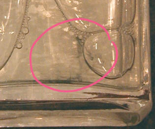

## Le fiel de boeuf
### Le fiel de boeuf, usage en arts plastiques et autres
 **Le fiel de boeuf**  

Produit de composition assez repoussante (bile du boeuf.), sentant assez mauvais et présentant parfois de suspects filaments sombres (voir cercle rose sur la [photo ci-dessous](fieldeboeuf.html#photo)), le fiel de boeuf est pourtant assez utilisé de nos jours. Il semble se caractériser

> \* par sa capacité de pénétration des surfaces poreuses comme le papier
> 
> \* par son apport d'adhérence et de viscosité, fonctions utiles pour les peintures à l'eau employées diluées, mais aussi pour certains supports comme les [Rhodoïd ®](rhodoid.html). Dans ce cas précis, le peintre se contente de tremper le pinceau propre dans le fiel avant de le charger de couleur.
> 
> \* par ses qualités d'agent facilitant le mouillage des pigments par la [gomme arabique](gommearabaquar.html)
> 
> \* par sa transparence, filaments sombres exceptés
> 
> \* par son aptitude présumée à faciliter le nettoyage des tableaux peints à l'huile (ceci dit _sans aucune garantie d'efficacité et d'innocuité pour vos tableaux_).

Il est fréquemment utilisé comme adjuvant à la gouache, parfois aussi à l'aquarelle.

Certains artistes l'emploient pour enduire des surfaces comme le papier.

On le signale comme ingrédient pour la réalisation des papiers marbrés.

C'est un adjuvant ancien.

A titre de piste, voir _[choline](choline.html)_ (glossaire).

 [Communication](http://www.artrealite.com/annonceurs.htm) 

