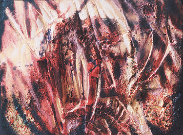

## Le frottis
### La technique d'application en frottis, usage en arts plastiques
 **Le frotté**

Il est à distinguer du simple frottage (souvent réalisé à l'aide d'un [chiffon](chiffon.html) en arts décoratifs notamment). C'est un procédé très simple qui ne peut être réalisé que sur une surface présentant des aspérités (voir photo : détail d'un tableau réalisé sur plâtre sculpté ajouté de matières diverses). Il met toujours en valeur le relief.

Il s'agit en effet de frotter - voire d'effleurer - une surface de sorte que la peinture ne se dépose que sur ces aspérités.

La granulation, la trame ou les motifs en relief sont ainsi soulignés tandis que l'image ainsi partiellement recouverte demeure visible.

Cette technique, commune à la peinture et au dessin, est abondamment employée par les pastellistes notamment.

Son principe de base : utiliser les aspérités d'un support, a probablement été élaboré dès la préhistoire.

Il est possible d'accentuer le grain d'une matière servant de support (toile, papier) en utilisant de cette manière une peinture ou un enduit légèrement épais qui ajoute un peu de relief aux aspérités.

