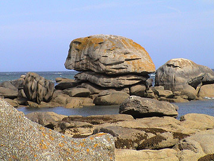
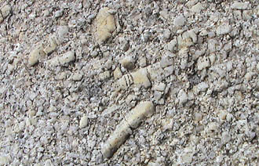

## Le granit
### Le granit, usage en sculpture
 **Le granit**  

Peut aussi s'écrire _granite_. Provient de l'italien _granito_, grenu.

Photos : granites de Brignogan Plage, Finistère (France).  
Remerciements à [Alain Guillon](quinoussommes.html#alainguillon)_._

Le granite est une [roche ignée intrusive](ignees.html#intrusives) grenue (voir [_roche microgrenue_](microgrenue.html)), très dure et très légèrement radioactive, de couleur rose, rouge, blanche ou grise. Il est particulièrement résistant aux agents chimiques et mécaniques. Et pourtant, comme le prouve la photo ci-contre, il n'est pas totalement à l'abri de l'érosion...

Sa composition : [feldspath](feldspath.html) [alcalin](alcali.html), [quartz](quartz.html) principalement, avec aussi du [mica](mica.html) (quelquefois noir - _[biotite](biotite.html)_) ou des [amphiboles](amphibole.html) (sombres). D'autres composants plutôt sombres comme les [olivines](olivine.html) et les [pyroxènes](pyroxene.html) peuvent également être présents, mais la coloration de la roche dépend vraiment de la proportion de chacun de ses composants, qui peuvent être relativement nombreux.

Densité : de 2,55 à 2,75 (chiffres [_Philippe Clérin_](livres.html#philippeclerin)).

En sculpture, le granite est l'un des matériaux les plus difficiles à travailler. Comme le basalte, il nécessite des [outils spécifiques](outilstaillepierre.html) et impose des types de réalisations très "en masse" et "arrondies", du moins en ce qui concerne la plupart des variétés de cette pierre. Cassantes, elles ne supportent ni les profondeurs ni les saillies.

Le granit est d'autant plus dur qu'il est chargé de [quartz](quartz.html).

En Europe, les variétés les plus réputées pour la taille proviendraient de la région d'Aberdeen (Royaume Uni), d'Irlande, de Bretagne (France), de Scandinavie et de la région des Vosges (France) - informations non confirmées à ce jour.

 [Communication](http://www.artrealite.com/annonceurs.htm) 

