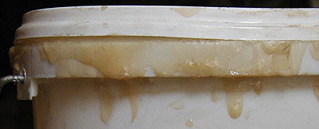

## Le jaunissement - Chapitre XII des Dialogues de Dotapea
### Le jaunissement - Chapitre XI des Dialogues de Dotapea
 Navig. page/section

  
  

\_\_\_\_\_

**Pages soeurs**

[I, A propos des liants](chap01liants.html)  
[II, Bulles, siccativ., struct. élec.](chap02bullessiccativation.html)  
[III, Caséine, phosphore, dissociation](chap03caseine.html)  
[IV, Les orbitales](chap04orbitales.html)  
[V, L'aérogel](chap05aerogel.html)  
[VI, Polarisation de la lumière](chap06polaris.html)  
[VII, Sfumato et diffusion Rayleigh](chap07rayleigh.html)  
[VIII, Les interférentielles](chap08interferences.html)  
[IX, Dextrine, farine et chiralité](chap09dextrine.html)  
[X, L'ocre bleue](chap10ocrebleue.html)  
[XI, Les métamatériaux](chap11metamateriaux.html)  
XII, Le jaunissement  
[XIII, Laser etc.](chap13laser.html)  
[XIV, L'holographie](chap14holographie.html)  
[XV, L'holographie numérique](chap15holographienum.html)  
[XVI, Extérieur, intérieur, chaux](chap16interieurexterieurchaux.html)  
[XVII, L'électrolyse et les ions](chap17electrolyseions.html)  
[XVIII, L'électricité, un peu plus loin](chap18electriciteplusloin.html)  
[XIX, Oxydation, métaux](chap19oxydationsmetaux.html)  
[XX, Les échelles](chap20echelles.html)  
[XXI, Nature et évolution des résines](chap21resines.html)  
[XXII, Le mouillage pigmentaire](chap22mouillage.html)  
[XXIII, La molette](chap23molette.html)  
[XXIV, Blanche neige](chap24blancheneige.html)  
[XXV, Lumière et matière](chap25lumiereetmatiere.html)  
[XXVI, Magnétisme](chap26magnetisme.html)  
[XXVII, Ambre et vieilles branches](chap27ambre.html)  
[XXVIII, L'origami miroir](chap28origamimiroir.html)  
[XXIX, Le feu](chap29feu.html)  
[XXX, Peau du métal](chap30peaudumetal.html)  
[XXXI, La ville en un souffle](chap31bellastock.html)  
[XXXII, Oxyder des matériaux](chap32oxydermateriaux.html)  
[XXXIII, Ocre bleue, une solution](chap33ocrebleuesimulation.html)

\_\_\_\_\_

Copyright © www.dotapea.com

Tous droits réservés.  
[Précisions cliquer ici](droitscopie.html)

**Les dialogues sur la physique-chimie  
appliquée aux arts**

**Chapitre XII**

**Le jaunissement**

dial   dial   dial

Ce court chapitre des [Dialogues de Dotapea](dialoguesdotapea.html) est une discussion entre Jean-Louis, physico-chimiste au CNRS, et un candide, Emmanuel. Une troisième personne, chimiste du CNRS est intervenue indirectement.

Ce dialogue est clairement inachevé mais il nous a semblé utile d'aborder ce sujet. Susciter des questionnement, provoquer des interventions, c'est le but des Dialogues.

Emmanuel : Certaines réactions plus ou moins lentes produisent la coloration des matières picturales. Elles sont parfois mystérieuses au point de faire l'objet de recherches importantes [\[1\]](chap12jaunissement.html#marinecotte). Le phénomène est-il dû aux réactions entre composants, entre couche picturale et environnement ? Ou bien au liant lui-même... Parlons de ce dernier cas. Le plus souvent, des matériaux comme les [huiles à peindre](huiles.html), les [polyuréthanes](polyurethane.html), le [vinyle](vinyle.html), etc., semblent avoir une tendance presque naturelle au jaunissement ou au brunissement, temporaire parfois, définitif souvent.

A ton avis est-ce que l'on peut donner un éclairage synthétique, global, sur ces phénomènes ? Ils semblent a priori d'origines variées mais pourquoi s'agit-il toujours sensiblement de la même couleur, plutôt jaune ou brune ?

Jean-Louis : Un collègue suggère le mécanisme suivant : sous l'effet des rayonnements UV, de la chaleur, de l'oxygène, de l'humidité, les molécules organiques de la peinture, surtout les chaînes polymères des liants, se dégradent en fragments plus petits.

Au fur et à mesure de la dégradation ces fragments absorbent de plus en plus, du fait de la présence de liaisons [insaturées](saturation.html). L'absorption commence à apparaître dans le bleu, donc les produits prennent un teinte jaune. Si la dégradation continue, l'augmentation d'absorption fait que ça devient de plus en plus jaune, brun, puis rouge. Voilà. Ca répond ?  
 

Emmanuel : Elles absorbent de plus en plus... de lumière, tu veux dire ? 

Jean-Louis : Oui. 

**Insaturation et coloration**

Emmanuel : Quel est la nature du rapport entre cette absorption partielle de lumière et les liaisons insaturées ?

  
Jean-Louis : C'est encore une histoire d'électrons. Un matériau absorbe en fonction des [niveaux électroniques](chap04orbitales.html) qu'il possède. Si les énergies auxquelles les électrons sont sensibles sont dans le domaine du visible, le matériau est coloré. Il se trouve que la présence de liaisons doubles ou triples (insaturées) fait que ça absorbe dans le visible, UV ou bleu.  
 

\_\_\_\_

1 On mentionnera par exemple une récente étude de Marine Cotte sur le noircissement de peintures au cinabre à Pompéi. L'enjeu - y compris économique - est majeur.  
Cf. ESRF (European Synchrotron Radiation Facility) Newsletter - n°44 - déc. 2006 - "Science and art" - [Lien](http://www.esrf.eu/UsersAndScience/Publications/Newsletter)

**Rôle majeur des électrons**

[Chapitre suivant](chap13laser.html)

 

 [Communication](http://www.artrealite.com/annonceurs.htm) 

