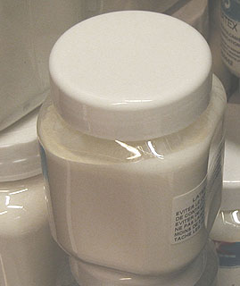
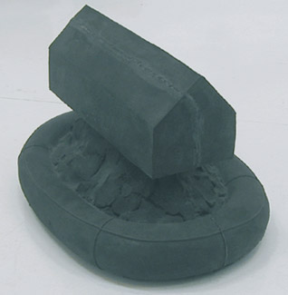

## Le latex
### Le latex, usage en arts plastiques
 **Le latex  
et le caoutchouc**

_Il s'agit en fait d'un type précis de polymères ayant l'élasticité comme caractéristique intrinsèque majeure car c'est en cela qu'ils peuvent être distingués des colles et des liants (qui eux aussi adhèrent à eux-mêmes). Cependant, quelques [liants](liants.html) synthétiques (l'acrylique particulièrement) peuvent aussi être considérés comme des latex car ils présentent un aspect laiteux, collent à eux-mêmes et sont assez élastiques à sec._

_Les latex naturels, eux, sont des émulsions ([voir glossaire, acception 1](emulsion.html)) riches en [amidon](amidon.html), [alcaloïdes](alcaloide.html) et [hydrocarbures](carbure.html), secrétées notamment par l'hévéa, d'autres euphorbiacées, des moracées (figuiers), des composacées (notamment certains pissenlits)... et des papavéracées, le latex du pavot blanc donnant l'opium. Selon [Jean-Pierre Delpech](livres.html#techniquesdulatex), "_Un millier de plantes produisent un sève d'où peut être extrait le caoutchouc, mais la quasi-totalité de celui utilisé provient de l'_hevea brasiliensis_._" - latex synthétiques mis à part. On mentionnera aussi parmi les latex la gomme gutte ([lire l'article du glossaire](gommegutte.html))._

_Le principal constituant du caoutchouc naturel est [l'isoprène](isoprene.html), un liquide [volatil](volatil.html) qui a permis de produire les premières synthèses appelées [élastomères](elastomere.html) (voir [utilisations modernes](latex.html#utilisationsmodernes)). Le caoutchouc n'est rien d'autre qu'un ensemble d'isoprènes associés sous une forme [terpénique](terpene.html)._

_Fabrication, composition_

Comme nous l'avons dit, le latex sèche  en présence d'air et devient caoutchouc. Ce processus peut être [précipité](diluantssolvants.html#precipite) par l'incorporation d'un acide (fabrication du caoutchouc ordinaire).  

Malgré la variété des modes de fabrication, la plupart des fabricants n'indiquent pas la composition ni l'origine des produits qu'ils nous proposent sous l'intitulé un peu court de "latex". Pour nous représenter les choses, précisons que concernant les caoutchoucs d'usage courant, environ un cinquième seulement serait d'origine naturelle et que cette part-là proviendrait en très large proportion d'Asie et non plus d'Amérique. Lesdits fabricants de latex à usage artistique (dont les produits, même synthétiques, ne posent pas forcément un problème de qualité mais de transparence de l'information, de communication) prennent seulement la précaution de nous signaler qu'ils sont fortement alcalins. En effet, grossièrement, le latex n'est rien d'autre qu'environ un tiers de caoutchouc ([isoprène](isoprene.html)) dans à peu près deux tiers d'eau, mais pour le conserver en solution liquide, on ajoute un dixième environ [d'ammoniac](ammoniac.html).

Il vaut donc mieux éviter le contact cutané et surtout bien aérer le lieu de travail.

_Utilisation en peinture_

L'utilisation du latex en peinture (sous-couches, reliefs) et quelques autres techniques nécessite des précautions :

\- poser préalablement une couche isolante ([liant](liants.html) aqueux non [réversible](liants.html#reversibilite) ayant un [pH](ph.html) neutre, de type [liant vinylique](vinyle.html)) sur le support

\- poser une autre couche isolante une fois le latex posé et séché de sorte à pouvoir peindre par-dessus.

Une couche moyenne, étalée par exemple avec une brosse, sèche en moins de 24 heures.

_La conservation des latex naturels n'est pas garantie (penser aux élastiques)._ Elle ne dépend pas que des interactions chimiques, mais aussi des actions mécaniques qui lui sont infligées et de la température (le froid provoque un durcissement). Malgré cela, certains objets amérindiens en latex se sont assez bien conservés au fil des siècles.

_Utilisation en moulage_

_Tout d'abord, un rappel : le moulage du corps humain ne peut être réalisé sans danger qu'avec de [l'alginate](alginate.html). Mouler un être vivant avec du latex est potentiellement dangereux, même si cela a été abondamment pratiqué par les Amérindiens, notamment pour protéger les bébés du froid. Le risque est triple : allergie et agression chimique cutanée (la transpiration véhicule des acides, le latex est une base), intoxication par les [alcaloïdes](alcaloide.html) présents dans les latex végétaux._

_Une maquilleuse nous a fait part de l'utilisation de latex pour provoquer un vieillissement artificiel de la peau du visage notamment. Ce genre de pratiques d'apprentis sorciers est simplement inadmissible et ne peut être que fortement déconseillé. Il y a atteinte au corps. Rien ne dit qu'aucune retombée ne peut en découler, au contraire. Il faut par ailleurs rappeler que l'inhalation d'ammoniaque peut réellement occasionner des lésions pulmonaires irréversibles. L'application de latex sur le visage est donc une pratique particulièrement dangereuse._

Quel que soit le procédé, **il faut d'abord enduire le modèle (inerte, donc) de [vaseline](vaseline.html)**. En théorie, cette précaution devrait permettre l'emploi de latex pour le moulage des êtres vivants. Il faut cependant se méfier des actions mécaniques pouvant provoquer une mise en contact direct. Le vivant est animé et la prise n'est vraiment pas immédiate. Par ailleurs, l'ammoniac produit des vapeurs qui, comme nous le disions, sont toxiques.

_**1er procédé**_

Appliquer une couche de latex à l'aide d'une brosse, d'un pinceau à poil dur. Laisser reposer une nuit et recommencer de sorte à poser trois couches environ, formant une épaisseur d'un centimètre et demi. Le démoulage est très aisé car le produit sec est élastique.

**Le nettoyage** de la brosse pose par contre un problème : au contact de l'eau et des essences, le latex [se précipite](diluantssolvants.html#precipite). Certains plasticiens et sculpteurs utilisent préventivement des pinceaux usagés.

Mentionnons un vieux procédé - à déconseiller - nécessitant du [trichloréthylène](trichlorethylene.html), un produit dangereux qu'il n'est plus très facile de trouver dans le commerce de toute manière.

Il est possible que d'autres produits conviennent (notamment un mélange toxique d'éther et de térébenthine), mais il vaut mieux éviter de courir les risques graves qu'ils induisent.

On nous signale **une solution nettement plus élégante**, qui est également employée dans le contexte de l'application de [gomme à masquer](reserves.html#drawinggum), qui d'ailleurs n'est autre qu'un latex. Il suffit d'imbiber le pinceau de [savon](savon.html) avant de le tremper dans le latex. Cela réduit l'adhérence de ce produit, ce qui permet un nettoyage beaucoup plus facile.

_**2ème procédé**_

Il consiste à tremper le modèle dans un bain de latex. Le nombre de bains sera déterminé par l'épaisseur de la couche de latex sec qui doit avoisiner 1,5 cm.

Le moule est fait. On peut alors couler différentes matières comme du [plâtre](platresculpt.html) ou une [barbotine](barbotine.html) et réutiliser le moule plusieurs fois.

_Autres utilisations du latex, détails historiques et techniques_

_Elles proviennent en premier lieu du monde amérindien et sont assez nombreuses. Nous mentionnerons le fait que le latex brûlant doucement, il permettait de fabriquer des lampes sans mèches restant allumées vingt-quatre heures et que l'on s'en servait comme encens en mélange avec un [copal](resinessolach.html#lescopals) (source [J.-P. Delpech](livres.html#techniquesdulatex)). Brûler du latex naturel contenant notamment des [alcaloïdes](alcaloide.html) devait probablement provoquer certains effets. C'est peut-être pour cette raison que cette pratique ne s'est pas répandue en dehors de ces civilisations pour lesquelles le latex avait la particularité d'être véritablement sacré._

Pour leur fameux _jeu de balle_, les _Olmèques_ ("_ceux du lieu ou pousse l'hévéa_" ou "_hommes du caoutchouc_", selon les traductions) fabriquaient une balle en latex.  
Ceci démontre que ce produit peut parfaitement être utilisé à d'autres fins que le moulage.

Et de fait, cela n'a pas échappé aux artistes contemporains. Il est possible non seulement de couler le latex, mais aussi de réaliser des objets relativement complexes. Ci-contre, un travail de [Yves Bodiou](quinoussommes.html#yvesbodiou) réalisé par coulage autour d'un noyau de mousse polyester (_Bouée, Série/déluge_, 2001).

Christophe Colomb aurait découvert le latex lors de son tout premier voyage, mais c'est seulement au XVIIIème siècle que La Condamine et Fresneau ont témoigné en Europe de son intérêt. En fait, le retard pris était du au fait que la substance liquide coagulait en présence de l'air lors du long voyage sur l'Atlantique et arrivait à l'état solide informe, inutilisable.

Pierre-Joseph Macquer (dont la contribution aux arts plastiques fut importante) et Hérissant, deux chimistes du XVIIIème siècle toujours, trouvèrent une astuce géniale : un moyen de _remettre en solution le caoutchouc_, c'est à dire le latex sec, à l'aide d'essence de [térébenthine](terebenthine.html) et d'[éther](ether.html). A partir de ce moment, le transport du produit solide vers l'Europe ne posa plus de problèmes et l'histoire européenne du latex commença.

**Utilisations modernes**

La gomme à effacer en caoutchouc apparut en premier lieu, puis d'innombrables applications industrielles. On découvre en 1823 le moyen de rendre le produit imperméable en le traitant à la [benzine](benzine.html) (Mackintosh, Hancock). En 1830, une autre invention (_mastication_ ou _malaxage_, Hancock), basée sur la capacité du caoutchouc de s'associer à lui-même, permet notamment d'améliorer la qualité des gommes à effacer et de rendre le caoutchouc plus malléable. En 1834 apparaissent les premiers bandages pour roues. Puis, Charles et Nelson Goodyear inventent différents procédés (la [_vulcanisation_](vulcanisation.html) particulièrement) permettant la fabrication de nouveaux produits à base de caoutchouc (dont [l'ébonite](ebonite.html)) dans les années 1850.

La qualité des caoutchoucs devient progressivement meilleure. On découvre des additifs accentuant telle ou telle propriété : le soufre principalement, mais aussi les noirs carbonés ou l'oxyde de zinc qui accroissent la rigidité, des antioxydants, le [toluène](benzene.html#toluene), etc.

Thompson, Dunlop, puis les frères Michelin creusent l'idée des bandes caoutchoutées pour roues et parviennent en 1895 au pneu démontable pour automobiles tandis que la production de latex passe de la cueillette à la plantation. Les enjeux économiques augmentent de manière radicale, provoquant guerres et horreurs. La principale zone de production se déplace progressivement en Asie dans la première partie du XXème siècle (souvenons nous du film _Indochine_ où Catherine Deneuve joue le rôle de patronne d'une exploitation d'hévéas).

La synthèse du constituant majeur du caoutchouc naturel, [l'isoprène](isoprene.html), est réalisée en 1909.

A partir de la seconde guerre mondiale, de nouveaux [élastomères](elastomere.html) (BUNA, SBR, SBL - voir [butadiène](butadiene.html) et [styrène](styrene.html)) prennent rapidement la première place du marché du caoutchouc. Leurs formules, bien qu'hydrocarbonées, s'éloignent nettement de celle de l'isoprène. Leurs variétés et leurs applications sont extrêmement nombreuses. Certaines peuvent intéresser les artistes.

A ce titre, le butadiène, adjuvant de plusieurs peintures synthétiques et résines, est assez présent comme matériau de base pour la production de substances empâtées, caoutchouteuses.

 [Communication](http://www.artrealite.com/annonceurs.htm) 

