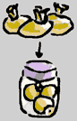

## Le médium dammar
### Le médium dammar, usage en arts plastiques et autres
 **Le médium maigre au dammar**  

_Ce produit simple à réaliser est destiné à la peinture à l'huile, mais son procédé de fabrication peut être transposé pour de nombreuses techniques de mise en solution de résines (voir [note ci-dessous](mediumdammar.html#note))._

_Signalons par exemple que l'on peut réaliser un [fixatif](fixatifs.html) en substituant de [l'éthanol](alcools.html#ethanolpur) à l'essence dans la recette ci-dessous. En utilisant de la [gomme laque](gommelaque.html) à la place de la gomme dammar, on réalise le liant de la laque commune des ébénistes. Avec de la [gomme arabique](gommearabaquar.html) et de l'eau distillée, on fait une eau gommée pour l'aquarelle._ 

_Mais revenons au médium dammar. Il ne nécessite que deux substances : la résine d'un arbre (voir [résine dammar](resinedammar.html)) et une essence commune pour la peinture.   
Sans être véritablement oléagineux, il n'est pas pour autant [un vernis au sens strict](vernis.html). On l'appelle parfois - à tort - "vernis dammar" simplement parce qu'il est maigre, ce qui est abusif. Il peut être employé :_

> \* _tel quel ou adjoint d'huile et d'autres substances, comme médium_  
> \* _sous forme plus concentrée, comme vernis._

_Indéniablement, ce produit sans huile peut parfaitement être utilisé comme médium, sauf dans certains cas où l'emploi d'un adjuvant nettement gras est indispensable (supports particulièrement souples)._

_Son faible prix, sa bonne qualité, la facilité de sa fabrication et l'aisance de sa mise en oeuvre en font un auxiliaire de tout premier plan._

_On lui reproche d'être cireux, mais il peut être déciré._

_En cas de problème, lire [ce courrier](courrierdeslecteurs2009a020.html#20090109gg)._

**Précautions**

> Elles sont évidentes : sans être du gaz de ville, l'essence est inflammable. Il vaut mieux bien reboucher les contenants, les stocker hors de portée des enfants et travailler en milieu calme suffisamment ventilé.
> 
> C'est surtout pour des quantités importantes (préparation et stockage collectifs dans le cadre d'un cours par exemple) ou des contextes particuliers qu'il faut prendre davantage de précautions. On peut alors consulter le [Reptox](liensutiles.html#csst) et si nécessaire, les pompiers.

**Ingrédients et matériel (mesures en poids)**

> \* gomme dammar : 33 à 50% du poids total (plus la quantité est importante, plus le produit se rapproche d'un vernis)
> 
> \* essence de pétrole raffinée ou essence de térébenthine rectifiée (67 à 50%)
> 
> \* des pièces de tissus fin (l'idéal est le nylon)
> 
> \* un bocal à goulot large
> 
> \* un autre bocal ou un flacon de même contenance.

**Procédé :**

> \* _Mettre en poudre par broyage simple les morceaux de [gomme dammar](resinedammar.html)._
> 
> \* _Disposer la poudre dans un ou plusieurs sacs de textile fin, pièces de tissus à refermer comme une bourse, avec un bout de ficelle._
> 
> \* _Placer les sacs dans un bocal_
> 
> \* _Verser l'essence_
> 
> \* _Fermer hermétiquement_
> 
> 
> 
> \* _Laisser reposer 48 heures_
> 
> \* _Les sacs contiendront encore un volume notable de "restes" particulièrement cireux et poisseux ([voir Les insolubles in La résine dammar](resinedammar.html#insolubles)). Jeter ces sacs et transvaser le médium dans le second bocal._
> 
> \* _Etape facultative de_ **_décantation de la cire_**_._

> _Après quelques jours, un dépôt cireux commence à se former au fond du contenant. Ne pas remuer ! Au contraire, pour obtenir la meilleure qualité, c'est-à-dire la moins cireuse, il peut être bon de laisser décanter pendant quelques jours puis de transvaser le liquide dans un autre récipient. Les puristes répéteront l'opération plusieurs fois en allongeant le temps de décantation.  
> Beaucoup de peintres ne trouvent pas ces décantations systématiquement nécessaires._
> 
> _Effectivement, le dammar n'est généralement pas si poisseux et cireux que certains l'ont dit (cela varie en fonction de la variété choisie) et par ailleurs, la cire forme un dépôt suffisamment solide au fond du flacon à condition de lui laisser le temps de se déposer et de durcir, soit quelques jours._

**Note**  : comme mentionné en début d'article, ce procédé peut être utilisé pour préparer de nombreux autres produits. La gomme et le diluant varient ainsi que la durée de la marinade, mais le principe demeure strictement identique. 

**L'intérêt pédagogique de l'apprentissage de la préparation d'un médium au dammar est notoire car ce procédé peut être transposé à d'autres techniques.**

Le traitement terminal des dépôts cireux n'est pas universel. Dans de nombreux cas sans rapport avec la gomme dammar, il n'a pas de raison d'être.

 [Communication](http://www.artrealite.com/annonceurs.htm) 

