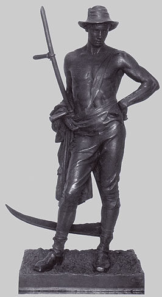

## Le moulage
### Le moulage, concepts généraux
 **Le moulage et la reproduction**

Pour information, on évoquera une intéressante page web consacrée au bronze, fort bien rédigée par un sculpteur lecteur de Dotapea. Garnie de nombreuses illustrations et vidéos, elle peut être lue pour approfondir le sujet - et d'autres, comme les patines - après cette entrée en matière. [Cliquer ici (lien externe).](http://jean-luc.garioud.fr/pages/techniques.html)

**Panorama**

D'emblée, constatons que le moulage a son vocabulaire. Essayons de faire le point a ce sujet dans le cadre d'une vision d'ensemble.

> **Le modèle**
> 
> Tout commence avec le modèle original, inerte ou vivant, sauf procédé particulier ([voir ci-dessous](moulage.html#moulenonmoule)). Certains le nomment "positif", mais ce n'est pas une très bonne idée car cela crée une confusion avec l'épreuve finale, alors que l'original peut lui-même être une statue. Le terme de modèle est beaucoup plus pertinent, d'autant plus qu'il s'agit parfois d'un véritable modèle vivant. A ce sujet, rappelons que seule [l'alginate](alginate.html) et quelques produits synthétiques spécifiques permettent de prendre sans danger l'empreinte du vivant.
> 
> **L'agent de démoulage**
> 
> Le modèle doit le plus souvent être enduit d'un agent liquide destiné à faciliter ultérieurement le démoulage. Le rôle de cet "agent de démoulage" est aussi parfois protecteur dans une certaine mesure, s'il est choisi en adéquation d'une part avec le modèle, d'autre part avec le matériau du futur moule. Il s'agit souvent de [vaseline](vaseline.html), de savon liquide ou d'eau savonneuse, de terre humide (matériaux durs comme le ciment), d'huile (même usage), de [talc](talc.html) (gélatine, alginate), de graphite (métaux), parfois d'eau simple et dans le cas des résines, le recours à un produit chimique spécifique peut être nécessaire (on signale cependant l'emploi de cire et d'autres éléments plus ou moins naturels pour différents procédés synthétiques).  
> Une enduction préalable de type "[bouche-pore](bouchepores.html)" doit quelquefois être appliquée sur le modèle pour faciliter l'ensemble de l'opération de moulage. Il peut s'agir, selon les cas, de gomme-laque, de produits vinyliques, etc.
> 
> En préparation du coulage et du démoulage final (détaillés ci-dessous), un agent de démoulage est également utilisé. Ce n'est pas forcément le même.
> 
> Il est conseillé de faire quelques essais et, dans certains cas, de se documenter auprès d'enseignants ou de fabricants car le choix peut être assez délicat. Il doit être adapté aux matériaux en présence.
> 
> En principe, [l'alginate](alginate.html), [l'argile](argilemodmoul.html) et [le Varaform ®](varaform.html) ne nécessitent pas d'agent de démoulage spécifique, mais la nature de ce qui doit être moulé peut quand même inciter à prendre des précautions.
> 
> **Le moule, l'empreinte**
> 
> Le moule peut être réalisé de différentes manières : trempage, coulage, réchauffement ([Varaform ®](varaform.html), gélatine, etc.), enduction à la brosse (plâtre liquide, barbotine, latex, alginate) ou [estampage](estampe.html). Il est nommé "négatif" ([voir aussi _dépouille_ ci-dessous](moulage.html#depouilleetcontredepouille)). Il peut être :
> 
> \* monobloc (donnant un positif sans couture). Les exemples les plus courants sont le [latex](latex.html) ou [l'élastomère silicone](elastomeresilicone.html), souvent utilisés pour réaliser un "moule-chaussette" (type classique de "moule à peau", c'est-à-dire de moule assez fin) renforcé par des chapes retirables.
> 
> \* fractionné ("coquilles" maintenues par des chapes ou moule formant une masse, le modèle étant plongé dans un véritable bain),
> 
> et, en même temps,
> 
> \* élastique ([latex](latex.html), [alginate](alginate.html))
> 
> \* ou rigide ([plâtre](platresculpt.html), [barbotine](barbotine.html), résines diverses, etc.).
> 
> La liste des matériaux utilisables est très longue, notamment à cause des procédés inventés dans le monde industriel (pétrochimie, métallurgie, verrerie, etc.). Voir ci-dessous _[La matière de l'outil principal : le moule](moulage.html#matieremoule)_.  
> La partie du moule qui a été mise en contact avec le modèle et a pris sa forme est nommée "empreinte". C'est en quelque sorte le creux du moule. Lorsque le moule est en plâtre, la couche interne est souvent colorée de sorte à signaler la proximité du modèle lors des différentes opérations et plus particulièrement si le moule doit être détruit après le coulage.
> 
> > Une méthode de moulage dite "au fil", assez typique du moulage au plâtre, permet de créer deux pièces en une seule opération. Un fil solide et huilé est simplement plaqué sur le modèle avant l'application du plâtre sur plusieurs couches. Avant que le plâtre soit trop sec, on retire le fil de sorte à créer une séparation, une fente. Cette technique est assez difficile à mettre en oeuvre car la fente peut soit se refermer (plâtre trop frais), soit entraîner des morceaux de moule (plâtre trop sec).  
> > Deux, trois fils ou plus peuvent être utilisés pour créer quatre, six pièces ou davantage - ce qui multiplie d'autant la difficulté de l'opération.  
> > _Il n'est pas exclu que le même procédé puisse être appliqué avec un autre matériau de moulage "plastique" comme la terre ou la pâte à modeler. Pour tous les matériaux, des essais préalables sont indispensables avec cette méthode._
> > 
> > Autre méthode, dite de la bande. Elle est souvent employée. Cette fois, au lieu d'un fil sous-jacent, c'est un petit muret (la bande) qui est élevé sur le modèle, à l'emplacement de la frontière entre les futures coquilles (généralement au nombre de deux). La bande a quelques centimètres de largeur pour une épaisseur assez faible. Elle peut être faite de matériaux plastiques comme les terres ou la pâte à modeler, ou bien de matières plus solides. De simples marques en creux (les contre-clefs) sont creusées à intervalles réguliers sur un versant du "muret", celui où l'on va appliquer du plâtre tout de suite après.  
> > Le travail est effectué de proche en proche, si l'on peut dire.  
> > Une première surface délimitée par la bande (surface qui peut représenter la moitié de la surface à mouler) est couverte de plâtre par couches successives. Puis, la bande est retirée, laissant apparaître des protubérances (les clefs) moulées dans les creux des contre-clefs.  
> > La surface encore intacte est à son tour couverte de plâtre, prenant, sur les bords, l'empreinte des clefs. Lorsqu'elle est sèche, l'ensemble est en totale cohésion.  
> > Pour cette raison, le modèle doit être détruit (creux perdu) sans quoi aucun démoulage n'est possible.
> 
> **Maintien du moule et premier démoulage**
> 
> Lors du premier démoulage, du coulage ou du second démoulage, il n'est pas exclu que modèle soit détruit. On parle alors de moulage à creux perdu, à opposer au moulage à bon creux. Le procédé à creux perdu autorise certaines libertés. Il peut par exemple être appliqué à un modèle constitué de terre encore humide.
> 
> Certains matériaux de moulage comme le [Varaform ®](varaform.html) ou la [bande plâtrée](platresculpt.html#labandeplatree) permettent un démoulage très simple, à l'aide d'une paire de ciseaux.
> 
> Quelle que soit la méthode employée, les différents éléments sont d'abord rassemblés si nécessaire sur le modèle car il est le plus souvent indispensable d'ajouter des pièces démontables, dites "chapes" (éventuellement pourvues de morceaux de métal ou de bois), à l'extérieur du moule de manière à ce qu'il soit possible d'assembler et de maintenir de nouveau les éléments ultérieurement. Ces pièces peuvent être maintenues à leur tour par des cordes, des élastiques, etc. Lorsque le sculpteur est sûr de pouvoir reconstituer aisément par la suite son puzzle en relief, il lui devient possible de démonter les pièces, c'est-à-dire de démouler.
> 
> **La p****réparation au coulage**
> 
> Les pièces, enduites d'un agent de démoulage adapté, sont assemblées à vide (sauf dans certains cas comme la cire perdue).
> 
> Différents orifices doivent être pratiqués (ils le sont parfois lors d'une étape antérieure). Il faut généralement ménager un _trou de coulée_ (sauf forme ouverte évidemment) et un ou plusieurs _trous d'évacuation_ (dits _évents_ si c'est de l'air qui doit être évacué).
> 
> Note 1 : il est parfois possible, avant le coulage final, d'obtenir des effets de matière en plaçant certaines substances plus ou moins granuleuses ou poudreuses dans l'agent de démoulage. Des tests préalables sur des échantillons sont indispensables.
> 
> Note 2 : il n'était pas rare, dans l'Antiquité, de faire cuire un moule réalisé par [estampage](estampe.html) avec de la terre. Ce procédé a notamment l'avantage d'autoriser le coulage de matériaux très divers. Il permet également de faire un nombre important de copies sans altération du moule. Ce procédé un peu contraignant mais puissant est toujours d'actualité.
> 
> Note 3 : il est possible de fabriquer un moule sans faire de moulage ! Par exemple, tailler une forme creuse dans le bois, le plâtre ou tout autre matière est une chose faisable.
> 
> **Le coulage et le démoulage final**
> 
> Une matière liquide est coulée dans le moule. Le séchage (ou la solidification) peut s'accompagner de différents traitements thermiques ou électriques.
> 
> En ce qui concerne le coulage de plâtre, on distingue deux techniques :
> 
> > \* le coulage à la volée. C'est un coulage simple (dans la théorie) qui s'opère d'une pièce.
> > 
> > \* le coulage à l'imprimé. Destiné aux épreuves grandes ou complexes, il s'effectue en plusieurs temps. Le fait de travailler par étapes, par pièces, permet de disposer progressivement des renforts (filasse, bois, métal, etc.) à l'intérieur de chaque pièce avant l'assemblage final, qui s'opère dans la foulée par un nouveau coulage, pièces jointes.
> 
> Avec le plâtre, une [barbotine](barbotine.html) ou certaine autres matériaux, une épreuve creuse peut être réalisée en coulant le long des parois. Le moule est souvent couché ("renversé") et tourné progressivement pour faciliter l'opération. Ce n'est pas quelque chose de facile !  
> Il est souvent nécessaire d'agir mécaniquement pour évacuer les bulles d'air ou faire entrer le plâtre dans les interstices.
> 
> 
> 
> _Avec d'autres matériaux comme le bronze, par exemple, le recours à un [noyau](ciredebougie.html#inclusionnoyau) central est nécessaire pour réaliser des pièces volumineuses creuses. Même quand cela n'est pas utile, il n'est pas rare de placer au dernier moment, dans le frais, non pas un noyau mais une sorte de "bouchon" de forme régulière (typiquement un parallélépipède, un cylindre ou une forme dérivée) qui pourra être retiré du trou de coulée ou laissé en place de sorte à permettre un assemblage soit avec une autre pièce de la sculpture, soit avec un socle.  
> Illustration : bronze de Harno Thornycroft,_ The mower_, 1882-94._
> 
> Quel que soit le matériau coulé, vient le moment émouvant du démoulage, qui permet de dégager ce que l'on nomme la copie ou bien l'épreuve ou encore le "positif". Cette étape implique parfois la démolition du moule, de sorte qu'une seule copie peut être créée. On parle alors de décochage.
> 
> Le travail n'est pas forcément terminé. Une finition est souvent nécessaire pour éliminer les traces des jointures et autres imperfections.

**En respectant une forme, changer de matière**

La matière coulée dans le moule doit être compatible avec celle... du moule. Plusieurs opérations peuvent donc être nécessaires pour créer le négatif adapté à la substance finale recherchée.

Exemple :

> Étape 1 : moulage d'un objet. Par exemple, un oeuf, à l'aide de plâtre. C'est une opération simple qui ne devrait nécessiter que deux pièces.
> 
> Étape 2 : coulage de cire dans le moule en plâtre.
> 
> Étape 3 : l'épreuve de cire est utilisée pour réaliser la fonte d'un bronze à [cire perdue](ciredebougie.html#cireperdue).

Partant d'un véritable oeuf de poule, nous avons créé un oeuf de bronze.

**La matière de l'outil principal, le moule**

Il existe maintenant un grand nombre de matériaux pouvant servir à réaliser un moule. S'il est pratiquement impossible de tous les énumérer, on peut citer deux catégories éternelles :

> \* Les moules souples. Les plus connus sont le [latex](latex.html) et [l'alginate](alginate.html). Suivent _[l'agar-agar](agaragar.html),_ quelques [gélatines animales](gelatine.html) et une imposante panoplie de produits synthétiques dont des [élastomères silicones](elastomeresilicone.html), des [polyuréthanes](p.html#polyurethane), des [PVC](pvc.html) et des élastomères [polyvinyliques](polyvinyle.html). Très souvent, quelle que soit la substance employée, elle doit être maintenue par un matériau solide comme par exemple la bande plâtrée.
> 
> \* Les moules durs. Le plus utilisé est [le plâtre](platresculpt.html), mais on peut citer [l'argile](argilemodmoul.html), les mélanges argileux (argile + plâtre, argile + sable), la [cire](ciredebougie.html), des [polyesters](polyester.html) (gel-coats), des [epoxys](epoxy.html) et d'autres produits de synthèse.  
> Certaines matières dures permettent à l'artiste de sculpter un moule sans se servir d'un modèle : le bois, le [carreau de plâtre](platresupport.html#lecarreaudeplatre), le [béton cellulaire](betoncellulaire.html), la pierre et certains métaux.

Entre les deux catégories, il existe assez peu d'intermédiaires. Quelques produits synthétiques tels que le Varaform ® permettent de moduler la souplesse en fonction du type de produit et du nombre de couches ([lire passage in _Le Varaform ®_](varaform.html#utilisation)).

**Les contraintes formelles : dépouille et contre-dépouille**

Le matériau n'est pas la seule contrainte. La forme en est une autre.

Il existe de nombreux cas où la rigidité du moule et la forme du modèle imposent une pratique assez particulière.

Le moule peut en effet être littéralement **bloqué** par le modèle si celui-ci présente certains types de creux, une forme générale particulière ou si le moule n'est pas composé d'un nombre suffisant de parties distinctes. Comment "dépouiller" le modèle de son moule ?

En employant à l'avance, au moment du moulage, ce que l'on nomme des "contre-dépouilles". Il s'agit de sortes de portions de moules séparées destinées à permettre le retrait de la dépouille (la pièce majeure du moule ou du fragment de moule). Ces pièces sont retirées après la dépouille quand c'est possible, sans quoi elles sont détruites ou conservées telles quelles avec le modèle.

Mais comment procéder lors du moulage ? C'est assez simple : il faut commencer par réfléchir aux parties qui risquent de bloquer le retrait du moule et de penser à la forme optimale à donner aux fragments de moule et aux contre-dépouilles. C'est un travail mental où l'expérience et l'astuce jouent un rôle : on parle de "raisonner le moule".

Puis, il faut travailler en deux temps, c'est-à-dire que l'on moule d'abord les contre-dépouilles et on les laisser sécher, puis on moule la dépouille par-dessus l'ensemble. 

Certains modèles présentant des formes complexes, des creux difficiles à traiter sont dits "contre-dépouillés", manière de signaler par avance que l'emploi de contre-dépouilles risque d'être nécessaire. Les autres modèles sont dits "de dépouille".

 

 

 [Communication](http://www.artrealite.com/annonceurs.htm) 

