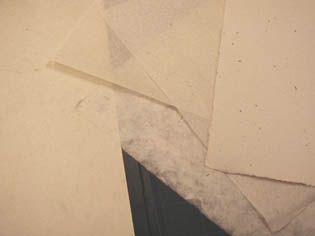
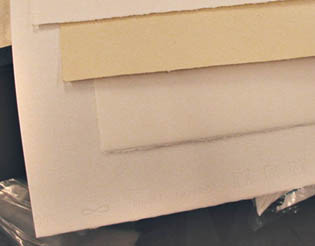

## Le papier
### Le papier, usage en arts plastiques et autres
 **Le papier  
(section)**

_Support beaucoup plus ancien que la toile à peindre [(1)](papier.html#note1), le papier demeure cependant moins noble que celle-ci pour l'esprit contemporain dans son ensemble. L'oeuvre peinte sur toile est plus appréciée du public et coûte d'ailleurs plus cher, ce qui n'est pas rendre justice au papier._

_Malgré son statut de véhicule de la culture écrite, dessinée ou peinte depuis l'Égypte archaïque (si on prend le terme "papier" dans un sens assez large pour inclure le papyrus), en passant par la Chine (là on parle de papier au sens strict), ses mérites progressivement reconnus dans tout l'Orient ne sont peut-être pas appréciés à leur juste valeur en Europe, peut-être parce qu'il y est lié au quotidien, au fastidieux ("la paperasse"). Une regrettable association qui masque les très remarquables avancées techniques réalisées par les papetiers d'Orient et d'Occident d'hier et d'aujourd'hui._

 Sommaire 

[Profil des emplois](papier.html#emplois)

[Situer le papier par rapport à des supports semblables](papier.html#lafabricationlegrainlegrammage)

[Le transfert de connaissances, la fabrication](papier.html#lafabricationlegrainlegrammage)

[La composition et les invariants](papier.html#lacomposition)

[La teinte du papier dit "blanc"](papier.html#lateintedupapierditblanc)

[Le papier et la colle](papier.html#lepapieretlacolle)

[Les papiers apprêtés](papier.html#lespapiersprepares)

[L'enduction du papier](papier.html#enduction)

**Limites et avantages : profil des emplois**

Le papier n'est pas dur et se prête par conséquent assez mal tel quel aux peintures épaisses ou dures (la peintures à l'huile, par exemple), techniques occidentales plutôt post-médiévales, à contrario du travail à [l'encre](encresdiverses.html), à la [pointe d'argent](pointedargent.html) ou au carbone ([fusain](fusain.html), [graphite](graphite.html)). Pourtant, enduit (par le peintre ou pré-enduit industriellement) avant peinture puis marouflé, il offre des qualités plastiques inimitables, notamment parce qu'il peut _avoir du grain_. Non-enduit, il réagit à l'eau (voir [cellulose](cellulose.html)) et cette réaction est également intéressante.

Le papier est avant tout pratique, malléable et [plastique](plastique.html). Peintres et dessinateurs orientaux et occidentaux se sont attelés à créer des variétés répondant à leurs exigences (par exemple en France, Ingres, Gaspard Maillol, etc.). Certaines disciplines (exemple : le dessin au [fusain](fusain.html), plus généralement, tout le dessin [académique](academies.html)) dépendent assez fondamentalement du support papier.

**Situer le papier par rapport à des supports semblables**

Le papier que nous connaissons habituellement est à distinguer du [papyrus](papyrus.html), du [liber](liber.html) et du [parchemin](parchemin.html) car d'une part sa base est le bois, d'autre part il n'est pas tissé et il suppose la préparation d'une pâte. Il fut inventé, dit-on, en 105 AC par le Chinois T'sai Louen, qui, observant la construction d'un nid de guêpes, eut l'idée (c'est ce que dit la légende) d'employer les fibres de mûrier et de bambou pour créer une pâte à faire sécher.

Au Laos, c'est de l'écorce du mûrier dont on se sert - encore de nos jours - pour fabriquer une pâte dans laquelle on incruste des pétales et des feuilles. Au Népal, le _daphné canabina_ sert de base pour des fabrications assez comparables. Ces fabrications non dépourvues d'éléments décoratifs ne sont pas rares dans différentes régions d'Asie.

**Le transfert de connaissances, la fabrication**

1276\. Le premier moulin à papier d'Europe est créé à Fabriano près d'Ancône, Italie, un haut lieu de cette industrie encore de nos jours. On cite ici et là d'autres dates, fort proches, pour ce même événement : 1264 et 1268. Nous avons choisi la moins optimiste mais peu importe : rapidement, naissent des moulins espagnols, français et italiens autour de 1300.

L'invention a pu être selon les uns amenée en Europe par Marco Polo (sur cette thèse on lira une [page](http://www.museodellacarta.com/viaggio.html) en italien sur le site du Museo della carta de Fabriano mais la date du retour du grand voyageur, en principe 1295, semble _a priori_ incompatible avec celles qui sont avancées pour la création du moulin de Fabriano). Selon les autres elle fut prise à des artisans chinois du Turkestan par les conquérant de Samarkand en 751 et convoyées en Europe au fil d'un très long parcours dans le monde musulman (passant notamment par l'Espagne).

Quoiqu'il en soit, il semblerai que les papetiers chinois auraient bien gardé le secret la fabrication du papier durant plusieurs siècles. Une pratique du secret commercial qui ne serait pas isolée : on peut citer en Chine la soie ou en Europe le [rouge d'Andrinople](rouges.html#lerougedandrinople) pour prendre des exemples célèbres. Ceci pourrait expliquer pourquoi le voyage du papier de la Chine à l'Ouest du continent aurait duré rien moins que **onze ou douze siècles** (information non confirmée).

Le papier le plus "classique" en Occident est au départ (en principe, toutes sortes de procédés ayant été développés) une pâte à base de chiffon soit le plus souvent du coton, ou plus rarement du [lin](l.html#lin), mêlée de colle et mariné dans l'eau. Le papier recyclé d'aujourd'hui se produit de la même manière (on substitue du vieux papier au chiffon). Des substances végétales extrêmement nombreuses, voire même animales, peuvent être utilisées en théorie. Cependant, les résines brutes étant généralement [acides](acides.html), on remarque que ce sont les papiers "chiffons" qui sont naturellement les plus neutres ou les plus alcalins. Des procédés contemporains de plus en plus répandus permettent cependant de rectifier les charges électrochimiques.

Pour obtenir un **_grain_**, on applique la "pâte à papier" sur une _forme_, composée d'une trame métallique normalement adjointe de [phosphore](annexe1.html#p), afin d'éviter toute oxydation intempestive. La _forme_ d'un papier, fruit de longues recherches, est une oeuvre de grande valeur car elle définit le grain en fonction de besoins artistiques.

Le _**grammage**_ est un concept simple, totalement indépendant du grain : c'est le poids d'une feuille d'un mètre carré. L'épaisseur peut avoir un lien avec le grammage, mais aussi avec la densité, généralement d'autant plus grande que la pâte est chargée de colles ou comprimée (cartons).

**La composition et les invariants**

Le papier - et même le [papyrus](papyrus.html) éponyme -, c'est TOUJOURS un amalgame fondamentalement [cellulosique](cellulose.html) (ce qui le distingue du [parchemin](parchemin.html), d'origine animale). L'adjonction de composants acryliques, micacés ou autres ne change rien à cette base dont les réactivités les plus sensibles pour l'utilisateur sont invariablement :

> \* l'inflammabilité. Combien d'incendies à cause du papier ?
> 
> \* [l'hygroscopie](hygroscopique.html). Sous l'effet de l'eau, le papier tend normalement à redevenir une pâte.

**La teinte du papier dit "blanc"**

C'est un motif de tricherie autant qu'un sujet de controverses ayant des ramifications sociopolitiques.

La tricherie, ce sont les _**[azurants optiques](azurantoptique.html)**_. Il est aujourd'hui aisé de dissimuler un jaunissement, conséquence d'acidité, en ajoutant à une pâte de mauvaise qualité un colorant bleu-violet. Certains fabricants proposant par ailleurs de bons produits n'hésitent pas à recourir à cet expédient pour leurs "entrées de gammes". D'autres semblent intégralement spécialisés dans cette pratique. Si un papier "blanc" vous semble étrangement bleuté ou violacé, cela peut être légitimement un motif de questionnement sur son acidité éventuelle.

Il y a bien pire : certains fabricants recourant à une main d'oeuvre du tiers-monde, traiteraient leurs pâtes à papier au **chlore** pour les blanchir (voir [Chlore _in_ Blancs synthétiques](blancssynthetiques.html#lechlore)) dans des conditions sanitaires et environnementales parfois exécrables.

[L'eau oxygénée](courrierdeslecteurs2011b050.html#20110607tg3) est évoquée également - comme étant d'un emploi majeur - mais nous ne disposons pas pour le moment de documents réellement référentiels confirmant ou détaillant sérieusement cet usage industriel. Merci de bien vouloir nous communiquer toute information recoupée à ce sujet.

Par contre, différents papiers d'excellente qualité sont naturellement un peu jaunes  (lavis Vinci, Arches). Ceux-là ne jauniront pas davantage. Un papier jaunâtre n'est absolument pas nécessairement de mauvaise qualité.

C'est en partie le collage du papier qui est en question dans cette problématique.

**Le papier et la colle**

Certains papiers sont dépourvus ou très peu chargés de colle, au moins sur une face :

> \* les papiers japonais (au moins une face sans colle ni résine), de grammage très léger,
> 
> \* le papier buvard, de grammage assez important
> 
> \* le "papier restauration", extrêmement fin.

Ils sont effectivement tous trois employés notamment en restauration, car neutres chimiquement.

Mais la plupart des papiers sont adjoints de colles de type [gélatine](gelatine2.html) (papiers traditionnels, [parchemins](parchemin.html#colledepoisson)) ou de [poix-résine](poix.html) (acide), de résines synthétiques (solution courante) et parfois de résines végétales incluses naturellement dans la pâte (papiers népalais, etc.). Le collage à la [colophane](autresresines.html#colophane) (1850) induisait une forte acidité.

Les fonctions des colles (ou résines) sont

> \* l'apport de résistance
> 
> \* l'évitement ou la maîtrise de l'effet buvard.

Précisément, ce qui définit l'aspect de la plupart des papiers, c'est la localisation de la colle :

> \* homogène jusqu'en surface : papiers lisses
> 
> \* seulement "à coeur" : papiers poreux en surface
> 
> \* sur une seule face, comme certains papiers japonais.

Le dessin à sec nécessite généralement mais pas systématiquement une surface poreuse accrochant bien le [fusain](fusain.html), les [pastels](pastelssecs.html) ou le crayon [graphite](graphite.html). Les techniques humides se marient bien avec les papiers poreux mais les effets obtenus sur des papiers moins poreux peuvent être aussi intéressants. Et de toute façon un [enduction](enduits.html), modifiant radicalement ces propriétés des papiers, est toujours envisageable.

**Les papiers apprêtés**

Certes, le terme de "papiers apprêtés" est un peu vague. Nous l'associons _grosso modo_ à une enduction préalable à un emploi bien spécifique, par opposition à une finition comme celle que subissent certains papiers décoratifs, et aussi par opposition aux papiers dont tout le processus de fabrication est consacré à la préparation à un usage spécifique (le papier aquarelle, par exemple).

La liste qui suit est appelée à s'allonger progressivement :

> \* les papiers destinés à l'écriture. On citera pour exemple - parmi tant d'autres - le remarquable Vélin velouté Clairefontaine ® (90 gr.), réputé pour cette application. Dès la naissance du papier, il apparut qu'il fallait un groupe de produits bien dédiés à l'écriture, bien distinct des feuilles et rouleaux à vocations artistiques ou pratiques. Certains exercices artistiques peuvent cependant tirer parti des spécificités des papiers conçus pour l'écriture.
> 
> \* les papiers pour le feutre ("[layout](layout.html)"), dotés d'une "barrière chimique" interdisant la traversée des encres tout en autorisant par leur transparence un travail de calque. Leur grammage avoisine 70 g/m2
> 
> \* les papiers et transparents destinés à l'impression, à la reproduction laser ou jet d'encre. Ce sont les "papiers couchés".
> 
> \* les papiers pré-enduits destinés aux peintures à l'huile et acrylique (papier toilé). Certains ont un grain imitant la trame d'une toile
> 
> \* les papiers [paraffinés](paraffine.html) comme le papier cristal. Ils servent souvent à protéger les oeuvres réalisées au fusain, aux pastels secs et autres techniques pulvérulentes ou légèrement grasses comme par exemple le graphite
> 
> \* les cartes à gratter, couvertes d'une couche grattable blanche (parfois à base de [kaolin](kaolin.html)) et éventuellement d'une fine surcouche noire (carte à gratter noire)
> 
> \* les papiers grattables, souvent utilisés par les illustrateurs travaillant à l'aérographe. Ces papiers sont de plus en plus rares sur le marché.

**L'enduction du papier**

Théoriquement elle n'est  nécessaire que si l'on souhaite détourner un papier de son usage normal car tout papier est d'emblée encollé d'une manière raisonnée. Parfois c'est pour le protéger qu'il faut l'enduire, par exemple dans le cas de certains [krafts](papiersspeciaux.html) ou cartons qui ne sont pas conçus pour durer.

Mais très typiquement, c'est lorsque l'on veut appliquer de la peinture à l'huile qu'il faut enduire le papier car celui-ci ne supporte guère les corps gras : cela fait des taches et il existe dans certains cas un risque de [saponification](saponification.html). On peut utiliser un enduit traditionnel de type [gélatine](gelatine.html) ([colle de peau](colledepeau.html) par exemple) mais n'est-ce pas d'une certaine manière créer une redondance avec la colle que contient le papier ? De plus l'application n'est pas des plus simples.

Une enduction moderne, à l'aide de [liant acrylique](acrylique.html) ou [vinylique](vinyle.html), semble plus adaptée aux cas courants.

Dans tous les cas il faut veiller à ne pas utiliser une brosse trop grossière qui laisserait des reliefs beaucoup plus visibles que sur une toile. Éventuellement délayer l'enduit plus que pour une toile et travailler en deux couches. L'enduction recto-verso est souhaitable tant pour la protection du support que pour éviter les problèmes de tension. Elle est inutile pour les pochades et autres petits essais.

Une autre possibilité est d'huiler le papier. Cette pratique n'est absolument pas à déconseiller malgré les on-dit tout à fait erronés. [Cennini](livres.html#cennini) la recommandait pour réaliser des [calques](papiersspeciaux.html#calquespasses) et beaucoup de peintres l'ont appliquée (certains allant même jusqu'à réaliser non seulement l'enduction mais aussi les [gessos](fabriquerungesso.html) à l'huile). Un papier épais ne donne évidemment pas de transparences. Il s'assombrit seulement.

Il faut veiller à ce que le papier ne soit pas [alcalin](alcalin.html) car il altèrerait l'huile par [saponification](saponification.html).

Le papier huilé est un bon support mais le défaut majeur du procédé est la durée du séchage, considérable.

Pour le [maroufler](maroufler.html), une [colle polyacrylique](moyendassemblage.html#collepolyacrylique) est presque indispensable.

\_\_\_

(1) Certes la toile a été utilisée très tôt comme support (assez mineur) pour l'écriture et le dessin, mais force est de constater qu'elle ne fut utilisée massivement que beaucoup plus tard. Lire l'introduction de l'article/tête de section [Les toiles](toiles.html).

 [Communication](http://www.artrealite.com/annonceurs.htm) 

