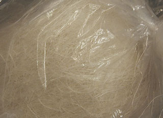

## Le plâtre : modelage, moulage, taille
### Le plâtre : modelage, moulage, taille
 **Le plâtre  : modelage, moulage**

Le plâtre est traité sur plusieurs pages.

L'article _Plâtre_ du glossaire joue le rôle de portail.  
[Cliquer ici.](platre.html)

Description du produit, composition  
\--> [lire _Le plâtre en tant que liant_](platreliant.html).

_Voici quelques milliers d'années (10 000 ans, dit-on) que le plâtre est apprécié pour ses qualités plastiques. Très tôt, il fut utilisé comme revêtement puis modelé, enfin utilisé comme matériau de moulage (Égypte, XXIVème siècle BC). Si le monde gréco-romain continua à l'utiliser, le Moyen-âge l'oublia ou le rejeta. La Renaissance le remit à l'honneur._

_Grâce à ses multiples fonctions, il a souvent joué un rôle en sculpture et en peinture (Max Ernst, par exemple, s'en est servi en peinture), sans parler des techniques hybrides. Mais les arts décoratifs l'ont mis à contribution davantage que n'importe quelle discipline. Le XVIIème siècle français a vu l'éclosion - voire l'explosion - de la peinture sur plâtre moulé. Il aurait transmis l'épidémie au monde anglo-saxon (information non confirmée)._

**Sommaire**

[Le plâtre, mode d'emploi et caractéristiques générales](platresculpt.html#leplatreemploicarac)

\- [Assouplissant](platresculpt.html#assouplissant)

\- [Retarder la prise et le séchage](platresculpt.html#retarderlesechage)

\- [Rendre le plâtre moins opaque](platresculpt.html#rendreleplatremoinsopaque)

[Modelage](platresculpt.html#modelageduplatre)

\- [Les outils du modelage (article externe)](outilsmodelage.html#platre)

[Moulage](platresculpt.html#moulage)

[La bande plâtrée](platresculpt.html#labandeplatree)

[Quelles peintures pour le plâtre, quelles enductions ? (lien vers autre page)](platresupport.html#quellespeinturespourleplatrequellesenductions)

[Staff, stuc](platresculpt.html#staffstuc)

[Gomme à plâtre etc.](platresculpt.html#gommeaplatre)

[Nettoyage d'un plâtre](platresculpt.html#nettoyagedunplatre)

[Divers](platresculpt.html#divers)

_D'autres manières de faire ont pris le relais au XXème siècle (notamment les résines), mais il reste toujours beaucoup à apprendre des techniques décoratives qui peuvent aisément être transposées dans le domaine artistique, déjà très riche en ce qui concerne l'utilisation du plâtre en modelage et en moulage._

**_Le plâtre, mode d'emploi et caractéristiques générales_**

Produit commun, c'est une simple poudre que l'on verse "en pluie" dans l'eau pour la rendre malléable. En principe, la quantité à verser pour obtenir une plasticité moyenne est atteinte lorsque la poudre atteint ou dépasse légèrement la surface. En réalité, la qualité du plâtre et surtout l'emploi auquel on le destine justifient des dosages bien différents. Des tests préliminaires sont donc indispensables pour cette raison et aussi parce qu'il est utile d'avoir une idée de la masse à préparer en fonction du temps de séchage et du volume ou de la surface à traiter.

Le mélange (soit le _gâchage_ proprement dit) peut ensuite être réalisé de différentes manières : à l'aide d'une [truelle](truelle.html), d'une [spatule](spatule.html) ou bien à la main. L'important est d'éviter que des bulles ou des grumeaux se forment. Il existe des mixeurs automatiques, mais étant donné le court temps de séchage du plâtre et les quantités imposantes que ces machines permettent de traiter, celles-ci ne semblent trouver que rarement des applications dans le domaine artistique.

L'étape de la "prise", c'est à dire de la cristallisation, à bien distinguer du séchage, nécessite un repos total car la structure moléculaire cristalline n'a pas la souplesse des [macromolécules](macromolecule.html) de l'huile de lin, de l'acrylique ou des résines. Elle est donc sensible aux chocs et à toute forme de mouvement. Certaines machines permettrent, par vibration stable et homogène, d'obtenir un plâtre extrêmement dense, pratiquement débarrassé de toute trace d'air.

La prise entraîne un dégagement de chaleur.

C'est lorsque ce processus s'achève que se produit le véritable séchage : l'eau qui pouvait être absorbée au niveau moléculaire a bien été intégrée, mais l'excédent doit s'évaporer. Cela prend des heures ou des jours en fonction de la dilution initiale.

Une fois sec, le plâtre ne peut être remis en solution sans l'emploi de dissolvants comme les [acides](acides.html), dont l'action est particulièrement destructrice.

Non protégé, il est **très fortement sujet à l'érosion** (eau, vent sur la surface nue). Aussi est-il déconseillé de placer durablement une oeuvre à l'extérieur, sauf protection particulièrement renforcée et réfléchie. [Cires](cires.html), [gomme laque](gommelaque.html), [huiles](huiles.html) et produits contemporains, parfois mixés, sont indispensables. Il est également possible - mais insuffisant - de placer certains produits solidifiants et/ou [assouplissants](platresculpt.html#assouplissant) dans la masse dès le début.

Le plâtre est dur (plus dur que le [carreau de plâtre](platresupport.html#lecarreaudeplatre)), modérément lourd mais surtout très cassant.

C'est aussi un liant, c'est à dire que l'on peut parfaitement lui adjoindre un pigment ([lire l'article consacré à ce sujet](platreliant.html#enquoileplatreestilunliant)). Sa couleur blanche peut être exploitée pour les tons pastels ou rompus. Cette ressource est parfois employée en peinture décorative. Elle peut parfaitement l'être aussi en sculpture, en amont de l'application de [patines](patines.html).

Le plâtre à modeler peut être effectivement modelé, comme son nom l'indique, mais aussi coulé dans un moule dans l'objectif de réaliser une épreuve (enduire préalablement le moule de vaseline pour empêcher les effets d'adhérence). Il permet également de réaliser un moule, une empreinte (souvent à l'aide d'une [bande plâtrée](platresculpt.html#labandeplatree)).

Le plâtre synthétique permet de réaliser des moules et des épreuves d'une précision supérieure.

**Assouplissant**

Il est possible de rendre le plâtre un peu plus souple qu'il ne l'est par nature. Les liants vinyliques peuvent être adjoint lors du gâchage ou dans l'eau, juste avant. Ils confèrent un peu de leur élasticité. Cette opération peut être utile lorsqu'il existe un risque de fissure - sur de grandes surfaces, par exemple.

On évoque aussi la poudre de racines de guimauve ! Difficile de vérifier cette information tant cette plante est devenue rare, comme la délicieuse friandise que l'on en tirait ([lire encadré in La gomme arabique, l'aquarelle](gommearabaquar.html#guimauve)).

**Retarder la prise et le séchage**

Cela est possible en premier lieu par une dilution supérieure (qui induira une fluidité pas forcément souhaitée) avec de l'eau froide - l'eau chaude produisant l'effet inverse -, mais aussi par l'adjonction d'une colle ou un produit assimilé : liant [vinylique](vinyle.html), [eau gommée](gommearabaquar.html#eaugommee), [dextrine](dextrinefarines.html), [gélatine](gelatine.html) si possible diluable à froid, etc. Une adjonction de l'ordre de 1 à 10% du poids du plâtre frais est envisageable, mais ce chiffre doit être adapté au produit utilisé. De petites quantités de [borax](borax.html) sont conseillées par certains auteurs. Quel que soit le moyen utilisé, il vaut mieux réaliser quelques test préalables et... ne pas s'attendre à un miracle.

Par ailleurs il faut signaler que le plâtre de Paris, bien pur et bien calciné, est probablement le plus rapide à la prise. Le choix, lors de l'achat, n'est pas indifférent sous ce rapport.

L'adjonction de poudres siliceuses ou alumineuses ou de ciments en contenant permettent également d'allonger nettement la prise et le temps de séchage en principe sans problèmes majeurs. Selon le cas, le résultat obtenu peut fortement varier  : le grain peut devenir trop grossier (ciment) ou bien trop fragile (silice pure).

**_Modelage_**

Dans ce domaine, le plâtre n'est pas toujours d'un emploi aisé car il sèche très vite - par rapport aux terres, par exemple. Pourtant, il fut utilisé par les plus grands sculpteurs.

Il peut être combiné à du coton, de la [filasse](filasse.html) (voir photo), du crin de cheval, de la [fibre d'agave](agave.html), de la toile de jute ou de chanvre et pourquoi pas du bois ou tout autre matériau fibreux apportant un certain maintien.

Il est fréquent de combiner plâtre et fibres sur des supports comme le grillage de fil de fer [galvanisé](galvaniser.html). Il vaut mieux, en effet, sauf intention délibérée, éviter d'employer des métaux trop oxydables.

Autre combinaison : la combinaison plâtre + [lait de chaux](chaux.html#badigeonlaitdechaux). Le mélange serait durcissant.

L'objet résultant du modelage, une fois sec, peut être travaillé à l'aide de différents abrasifs, limes, lames, ciseaux, riffloirs, etc.

En général, pour véritablement pouvoir modeler un plâtre, il vaut mieux qu'il ne soit pas trop liquide. L'emploi sous forme plus liquide présente en revanche l'intérêt de prendre la forme du support.

Il n'existe pas de règle générale dans le domaine du modelage du plâtre. Chacun a ses préférences : noyau quasiment moulé à l'aide de toiles, de panneaux divers, puis travaillé dans le sec ou le demi-frais ou bien, au contraire, structures aériennes couvertes de quantités restreintes de matériau modelable. Tout est permis, mais il demeure toujours un dilemme entre solidité et liberté créatrive.

**Les outils du modelage du plâtre**

Ils font l'objet d'une section spécifique dans l'article consacré aux outils du modelage. [Cliquer ici.](outilsmodelage.html#platre)

**_Moulage_ _et coulage_**

Différents types de moulages peuvent être réalisés à l'aide de plâtre.

> \* la prise d'empreinte directe. La matière du plâtre doit être assez liquide, un peu comme une [barbotine](barbotine.html). Lors du séchage, un léger accroissement du volume assure une bonne fidélité au modèle.  
> Le plâtre synthétique est le plus précis.
> 
> \* l'aide à la prise d'empreinte. Sous différentes formes - [notamment la bande plâtrée](platresculpt.html#labandeplatree) -, une autre matière moulante ([latex](latex.html), [alginate](alginate.html), gélatines diverses) est "maintenue par le plâtre", préservant la forme générale du moule.

Il n'y a guère d'autres spécificités : le moulage au plâtre est un procédé classique qui rentre pleinement dans le "cas général" du [moulage](moulage.html).

Quant au coulage, il en va de même sauf sur les points suivants : 

> \* un coulage de plâtre s'effectue avec une qualité très liquide.
> 
> \* un noyau central, escamotable ou non, peut être utilisé.
> 
> \* du pigment peut être ajouté. [Lire l'article consacré au plâtre comme liant.](platreliant.html)

Il existe des "procédés d'ateliers" de grande valeur qui ne peuvent être expliqués que dans le cadre d'un enseignement, mais les autres aspects du moulage et du modelage (procédé général, agents de démoulage, etc.), sont exposés pour l'essentiel dans l'article _[Le moulage](moulage.html)_. Tout enseignant ou artiste souhaitant ajouter des précisions dans l'intérêt des internautes est chaleureusement invité à le faire en [cliquant ici](ecrire.html).

**_La bande plâtrée_**

Il s'agit d'une sorte de bande de gaze ou de [tarlatane](tarlatane.html) imprégnée de plâtre à modeler qu'il suffit d'imbiber d'eau pour la rendre malléable.

Elle est souvent utilisée pour faciliter les prises d'empreintes réalisées avec des substances molles ([alginate](alginate.html), [latex](latex.html), etc.). Très souvent, on utilise la même bande pour maintenir le moule lors du coulage.

Il n'est pas exclu d'utiliser la bande plâtrée pour mouler grossièrement un modèle (non vivant) d'assez grande taille. De même, on voit des sculpteurs "modeler la bande plâtrée" sur une armature, s'aidant éventuellement de filasse, de plâtre, de grilles de [fil de fer galvanisé](galvaniser.html#galvamodelage) ou de carton. C'est effectivement un moyen intéressant de "faire du volume" sans surcharger l'oeuvre en poids. Et puis tout est possible !

**_Staff, stuc_**

Lire les articles [stuc](stuc.html) et [staff](staff.html) du glossaire.

**_Gomme à plâtre_**

Il s'agit d'une sorte de porte-mine dont la mine est remplacée par de la fibre de verre. C'est une puissante gomme bien adaptée au plâtre.

**_Recoller un morceau brisé_**

C'est assez simple en principe : il suffit d'utiliser une colle à bois. La trace du collage peut être atténuée par une légère abrasion.

Certains mettent en oeuvre deux applications dont la première tient lieu de bouchage des pores. En fonction de la porosité de la surface ébréchée et de la nature de la colle, chacun jugera de l'utilité de ce procédé.

**_Nettoyage d'un plâtre_**

Il existe différents moyens de réaliser cette opération, mais une question centrale demeure : quels effets peut provoquer le nettoyage ?

Bien sûr, faire imbiber l'oeuvre dans l'eau pendant des heures puis la passer à l'eau courante est une manière efficace de la débarrasser de toute poussière, mais étant donné la réactivité à l'eau des plâtres, il est évident que la sculpture risque fort de se trouver assez altérée par un tel traitement. Il en va de même avec les procédés de nettoyage à l'amidon ou toute autre colle.

En fait, tout plâtre laissé en l'état, sans patine protectrice, ne peut être nettoyé si facilement. C'est un travail de restaurateur.

Un plâtre patiné ne peut pas forcément être lessivé avec du savon car la nature des patines est très variable et peut être réactive. Seul le lavage superficiel à l'eau (la plus pure et la plus neutre possible) est en principe sans risque. Connaître la nature de la patine est une chose importante car cela permet de déterminer les traitements possibles.

**_Divers_**

Lire l'article [tarlatane](tarlatane.html) du glossaire.

 [Communication](http://www.artrealite.com/annonceurs.htm) 

