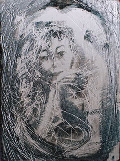

## Le plâtre : support, substrat
### Le plâtre comme support ou comme substrat, usage en arts plastiques
 **Le plâtre (substrat, support)**  

Le plâtre est traité dans plusieurs pages web sur Dotapea.

L'article _Plâtre_ du glossaire joue le rôle de portail.  
[Cliquer ici.](platre.html)

_Le plâtre a ses spécificités - avertissements_

Il faut vraiment mettre en garde les artistes songeant à utiliser ce produit pour réaliser des tableaux ou dessins, contre son poids important et son caractère cassant. L'accrochage est malaisé, le transport délicat. L'enchantement qui peut naître lors du travail avec ce merveilleux support peut être réduit en miette, c'est le mot juste, lors d'une exposition ou d'une expédition. D'importantes précautions doivent être prises (voir notamment [renforcement _in_ carreaux de plâtre](platresupport.html#renforcement)).

En fait, tout comme nous l'avons fait dans l'article _[Le plâtre comme liant](platreliant.html)_, nous conseillerons ici l'emploi du support plâtre sur un autre support plus résistant, voire fixe.

La poudre soulevée lors de la taille ou du polissage du plâtre n'est pas plus anodine que n'importe quelle poudre de pierre à base de calcium ([marbre](marbres.html), [albâtre](albatres.html), etc.).

_Quelles peintures pour le plâtre, quelles enductions ?_

Excellent support pour les peintures aqueuses (voir photo : peinture vinylique sur carreau de plâtre), le plâtre ne nécessite pour celles-ci une enduction qu'à cause de son caractère très poreux et pulvérulent - noter que cet aspect peut aussi être mis à profit et l'a souvent été. Le plâtre étant un liant, il peut aussi (comme [la chaux](chaux.html)) être employé pour peindre sur... lui-même !

Les [patines](patines.html) et peintures décoratives sur plâtre (notamment à base de [gomme arabique](gommearabaquar.html) et de [gomme laque](gommelaque.html)) ont été largement employées et continuent à l'être sans enduction préalable. La gomme laque peut d'ailleurs parfaitement servir d'enduit pour le plâtre nu, c'est une pratique assez courante en peinture décorative.

De même, une ou deux couches d'enduit vinylique ou acrylique (10 à 30%, en volume, en dilution dans l'eau) autorise une intervention picturale avec n'importe quelle peinture, dont la peinture à l'huile. L'enduit n'est d'ailleurs complètement nécessaire qu'avec cette dernière : le plâtre boirait l'huile qui laisserait des "taches de gras".

Concernant les surfaces poreuses propres que l'on peut assimiler au plâtre (murs, pierre calcaire), nous conseillons ce type d'enduits, éventuellement enrichis de... plâtre lorsque l'on souhaite un matériau "plastique", pouvant être empâté et travaillé de différentes manières.

Il suffit de garder à l'esprit quelques "dangers" :

 _- le contact direct du plâtre pur avec des substances acides a pour conséquence la [formation de sels](formationdesels.html) car c'est un produit [alcalin](alcali.html). Ce phénomène peut être mis à profit moyennant de rigoureux tests préalables._

 _- toujours à cause de son [pH](ph.html) alcalin, le plâtre est susceptible de réagir en présence de certains esters (voir [saponification](saponification.html)). Une peinture à l'huile appliquée directement sur le plâtre sans enduction préalable peu occasionner en premier lieu de splendides "taches de gras", puis elle brunit. Mais après une enduction correcte, son application sur le plâtre ne pose aucun problème._

 _- il est pulvérulent. L'action mécanique n'a pas seulement l'inconvénient de salir son auteur : elle abîme la surface. Il est donc prudent de prévoir, selon le cas, une enduction, un vernis ou un fixatif._

Concernant les enduits non synthétiques - sauf corps gras -, il n'existe guère d'indication ou de contre-indication spécifique. Pour les grandes surfaces, on notera un procédé peu coûteux (mais non testé par nous) à base [d'amidon](amidon.html) évoqué dans l'article sur la préparation des bois ([cliquer ici](preparatboispeinture.html#preparationduboisouduplatreavecdelamidon)). Plus couramment dans le domaine des enduits "à l'ancienne", on utilise la [colle de peau](colledepeau.html), parfois la [caséine](caseine.html).

Il est possible de donner au plâtre un petit quelque chose de l'aspect du marbre par adjonction de lait au moment du [gâchage](platresculpt.html#gachage). Un beau poli pourrait être obtenu par ce moyen.

Il faut mentionner l'inutilité par nature de l'application d'un [gesso](fabriquerungesso.html), avantage supplémentaire du plâtre.

Celui-ci peut absolument être utilisé comme liant [à fresque](fresque.html), comme la [chaux](chaux.html) sur un support en plâtre bien propre, sans enduction préalable. [lire l'article dédié à cet emploi](platreliant.html).

_Le carreau de plâtre_

A de nombreux points de vue, c'est un support extraordinaire. Outre le fait que les carreaux - d'épaisseurs variées, à partir de 3 cm environ - sont faits pour s'emboîter (possibilité de réaliser des polyptyques et des installations assez aisément), ils sont faits d'un plâtre particulièrement tendre donc très facile à tailler - ce qui n'est pas le cas du plâtre ordinaire. Des ciseaux et gouges à bois suffisent amplement. Attention, au moment de l'achat, de choisir des carreaux massifs car certains sont allégés par des espaces creux internes limitant les possibilités de taille.

Il est facile de faire alterner peinture et sculpture sur ce support. La seule petite contrainte est de devoir enduire les portions que l'on vient de tailler avant d'appliquer la peinture, ce qui est bien peu de chose. Voir plus loin, _[Quelles peintures pour le plâtre, quelles enductions ?](platresupport.html#quellespeinturespourleplatrequellesenductions)_

_Renforcement_

L'oeuvre terminée peut être fixée sur un panneau de bois épais (latté) à l'aide d'une colle [polyacrylique](polyacrylique.html), la seule véritablement efficace à notre connaissance. Quelques vis, clous et autres dispositifs peuvent renforcer l'assemblage par le fond et les côtés.

**Fabrication maison, composition**

_Il est possible de se procurer chez certains grossistes de la colle à carreaux de plâtre et de fabriquer soi-même des pièces de la même consistance mais de formes ou de couleurs différentes._

_Le plâtre utilisé pour la fabrication des carreaux contient beaucoup de [gypse](gypse.html). C'est typiquement un plâtre de Paris._

_Le plâtre et le carreau de plâtre, excellents supports pour le fusain_

... à condition de s'attarder à bien le fixer, ce qui n'est pas une mince affaire, c'est le moins que l'on puise dire étant donné que le support est lui-même pulvérulent ! Moyennant cette précaution indispensable, le plâtre, ou mieux le carreau de plâtre - parfaitement plat -, est un support d'un confort exceptionnel : le [fusain](fusain.html) "accroche" mieux que sur le meilleur des papiers et le travail par retrait est particulièrement aisé.

 [Communication](http://www.artrealite.com/annonceurs.htm) 

