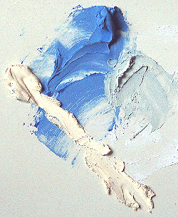

## Le plâtre comme liant
### Le plâtre comme liant, usage en arts plastiques et décoratifs
 **Le plâtre comme liant**  

Le plâtre est traité sur plusieurs pages.

L'article _Plâtre_ du glossaire joue le rôle de portail.  
[Cliquer ici.](platre.html)

Signalons l'importante contribution documentaire  
de M. Marc Potin, DécoSystème/Plâtrière Vieujot  
[Platre.com](http://www.platre.com/), que nous remercions

_Le plâtre n'est pas seulement une substance "[plastique](plastique.html)"  : il est liant, c'est-à-dire qu'il peut, tout comme la chaux, "enfermer" des [pigments](pigments.html) ([voir ci-dessous](platreliant.html#enquoileplatreestilunliant))._

_Dans cet article où les aspects chimiques de son utilisation sont particulièrement essentiels, nous avons voulu commencer par décrire sa composition et sa fabrication._

_Le mode d'emploi "généraliste" du plâtre est exposé dans un autre article. [Cliquer ici.](platresculpt.html#leplatreemploicarac)_

_Ce texte-ci concerne pratiquement toutes les utilisations du plâtre (modelage, moulage, fresque et "techniques mixtes", décoration, etc.) car rien n'empêche le sculpteur, le peintre ou le décorateur d'exploiter ses propriétés liantes._

**Sommaire**

[Composition, fabrication du plâtre](platreliant.html#compositionfabrication)

[En quoi le plâtre est-il un liant ?](platreliant.html#enquoileplatreestilunliant)

[Avantages et inconvénients](platreliant.html#avantagesetinconvenients)

[Mise en oeuvre comme liant](platreliant.html#miseenoeuvre)

[Séchage, finition, protection, conservation](platreliant.html#sechageprotectionfinition)

 [Interactions chimiques](platreliant.html#interactionschimiques)

**Composition, fabrication du plâtre**

[Lire de préférence en premier l'article _Gypse_ du glossaire.](gypse.html)

_Le plâtre courant est principalement produit avec du gypse, minerai naturel fort transparent. Sa composition est un peu plus complexe - et variable - que celle de la [chaux](chaux.html) qui d'ailleurs pourrait en être extraite (information non confirmée). Leur base à tous deux est le [calcium](annexe1.html#ca), mais la particularité du plâtre est d'être un sulfate._

_Sa fabrication est très simple : du gypse est chauffé à 200°C (variétés moyennes - [voir ci-dessous](platreliant.html#qualites)). A cette température - plus ou moins 50°C environ -, il perd la majeure partie de son eau. A 300°C, la substance obtenue ne serait plus utilisable (toujours pour une variété moyenne). De même, une température trop basse donne une substance trop peu soluble._

_On a donc :_

        Gypse (pierre) = CaSO4 - 2(H2O)      **\--- réchauffement 200°C --->**    CaSO4 - 0,5(H2O) = plâtre (poudre fine)

_Le "0,5(H2O)" qu'elle contient peut surprendre. Il correspond à une distribution par paires dont une molécule contient H2O et l'autre non._

_La poudre obtenue (dont le nom scientifique est_ la bassanite_) a une finesse qui est une particularité importante du plâtre. Il peut être nécessaire de lui adjoindre du [sable](sable.html) ou d'autres éléments durs pour obtenir une sorte de [mortier](mortier.html). Ce mortier, intéressant en peinture notamment, n'a guère de valeur pour ce qui concerne la solidité, le sable jouant plutôt un rôle fragilisant._

_Il est à noter que lorsque le plâtre a de nouveau fixé de l'eau, il reforme bien un gypse._

(SO4 Ca) (H2O)2 donne par cuisson (SO4 Ca) (H2O)1/2 donne par sur-cuisson (SO4 Ca) qui donne par gâchage (SO4 Ca) (H2O)2

        CaSO4 - 0,5(H2O)      **\--- gâchage --->**    CaSO4 - 2(H2O)

_Cependant les cristaux de ce gypse renaissant sont devenus microscopiques. Pour cette raison (une multitude de facettes produisant toujours un aspect opaque), il perd la transparence du minéral originel._

_**Qualités**_

_Elles varient en particulier suivant la température de cuisson : 200 °C pour les plâtres les plus courants, jusqu'à 600 °C pour les plus rares. Des températures encore plus élevées sont possibles mais ne sont plus utilisées actuellement - d'ailleurs, à partir d'un certain seuil, on obtient de la chaux par dégagement du soufre. Ces plâtres plus cuits sont dits "surcuits" ou anhydrite (CaSO4) car ils ont perdu encore plus d'eau que le plâtre classique (hémihydrate). Ils ont une réaction de prise plus lente que les plâtres à basse température._

_**En quoi le plâtre est-il un liant ?**_

Nous avons l'habitude, sans le savoir, depuis l'école, d'employer des peintures dont l'élément liant enserre le pigment dans un réseau macromoléculaire. Dans le cas du plâtre, le réseau est cristallin donc nettement moins souple, mais le processus est identique : lors du séchage, les cristaux de [bassanite](platreliant.html#bassanite) s'assemblent et emprisonnent le pigment.

_**Avantages et inconvénients**_

La blancheur du plâtre ([illustration ci-dessous](platreliant.html#photo1)) limite son utilisation picturale, mais elle peut être mise à profit chromatiquement parlant. Par contre, sa fragilité et son poids sont des handicaps définitifs qui imposent un support dur (pierre, béton, bois) ou des renforts ainsi qu'un conditionnement particulièrement soigné dans le domaine du transport - quand celui-ci est possible !

Au chapitre des avantages, le plus important est sans aucun doute [la plasticité](plastique.html). Suivent _la finesse_ (extrême avec les variétés synthétiques), _la facilité d'emploi_ et le prix, imbattable.

_**Mise en oeuvre comme liant**_

Note : l'emploi général du plâtre est exposé dans une section de l'article _[Le plâtre (modelage, moulage)](platresculpt.html#leplatreemploicarac)_

Cette mise en oeuvre est très simple : il suffit de bien mélanger le pigment au plâtre en poudre avant de l'incorporer dans l'eau en pluie ou l'ajouter en dernier, ou les deux. L'important est de bien gâcher.

En fonction de sa fluidité, le travail se rapprochera de la peinture à fresque (pâte plutôt liquide) ou du modelage... à moins qu'il ne s'agisse de couler ce plâtre teinté dans un moule.

Sur l'image, les couleurs sont un bleu outremer foncé, un jaune de Naples imitation et le mélange des deux couleurs, à droite.

Une petite quantité de liant [vinylique](vinyle.html), [acrylique](acrylique.html) (incorporer dans l'eau avant de tremper le plâtre) ou de colle à carreaux de plâtre permet d'accroître la solidité du matériau tout en l'assouplissant légèrement.

Un alcool comme la [glycérine](glycerine.html) ne réagira pas chimiquement. Son rôle, généralement assouplissant, n'est pas forcément opérationnel dans le cas du plâtre dont la structure cristalline diffère de celle des liants classiques. Au contraire, elle ne fera que diminuer la proportion de matière liante et accentuera le [retrait](retrait.html). Un liant acrylique ou vinylique sera en principe plus efficient.

Les [huiles à peindre](huiles.html) peuvent être adjointes à la pâte, mais elles ont tendance à brunir (de plus en plus avec le temps) car elles réagissent en présence d'un matériau alcalin comme le plâtre (voir _[Saponification](saponification.html)_).

Les corps acides peuvent être employés afin de provoquer la [formation de sels](formationdesels.html), réaction pouvant être assez brutale et nécessitant des tests préalables.

Par contre, afin d'éviter les mauvaises surprises lors d'un emploi "normal" du plâtre mêlé de pigments, nous conseillons à nos visiteurs de restreindre leur palette à celle de la peinture à fresque ([lire article](pourlafresque.html)).

_**Séchage, finition, protection, conservation**_

Le temps de séchage - nommé de préférence "temps de prise" - varie en fonction de la provenance du produit. Le plâtre de Paris, particulièrement chargé en gypse, est à prise rapide.

Pour vernir ou "fixer" une oeuvre peinte de cette manière, il est conseillé de procéder par pulvérisation pour ne pas "emporter", "drainer" la poussière de plâtre, conséquence inévitable d'une application à la brosse. Ce conseil n'est valable que pour les travaux précis. Un vernissage n'est d'ailleurs pas toujours nécessaire. Bien souvent, on emploiera plutôt des [patines](patines.html) - dont l'effet chromatique combiné à la pigmentation du plâtre doit être réfléchie. Noter d'ailleurs qu'une patine à l'encaustique (voir [Encaustique à froid](cires.html#emploiensolutionafroid)) peut apporter un peu de transparence.

En ce qui concerne les travaux moins précis, il faut signaler la possibilité de polir et lustrer le plâtre. Sous réserve de confirmation expérimentale, après une telle opération, une très légère transparence, sensible à une épaisseur de l'ordre d'un demi millimètre, pourrait être acquise sans recourir au moindre adjuvant.

_La bonne conservation du plâtre, tant sous forme de poudre que sous forme de statue, est directement fonction de l'humidité de l'environnement car il s'agit d'un produit [hygroscopique](hygroscopique.html). Elle est à éviter, c'est la règle numéro un. Le plâtre ne supporte guère d'être déposé près d'un sol ou d'un mur humide. Mais il ne faut pas non plus trop exagérer : le plâtre supporte un peu d'humidité et de plus, il est rarement exposé directement à celle-ci car il est le plus souvent peint ou enduit._

_**Interactions chimiques**_

Attention : bien que ce ne soit pas un cas commun, certains plâtres peuvent contenir du soufre libre. Ils sont alors incompatibles avec les pigments et produits au plomb.

Le danger, mentionné par certains auteurs, de voir des sels se former progressivement sur la surface n'est réel qu'en milieu acide. Par contre, il vaut mieux veiller à éviter les eaux trop chlorées lors du gâchage. Voir [_Formation des sels_](formationdesels.html).

 [Communication](http://www.artrealite.com/annonceurs.htm) 

