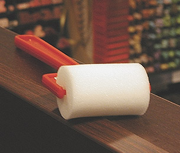

## Le rouleau
### Le rouleau, usage en arts plastiques et décoratifs
 **Le rouleau**  

Le rouleau peut être employé selon différents objectifs :

> \* couvrir une surface de manière homogène ([enduits](enduits.html), [gesso](fabriquerungesso.html), [imprimatures](imprimatures.html), aplats)
> 
> \* peindre un [motif](motif.html) sur de larges supports (peinture décorative ou artistique).

La finesse de la mousse est déterminante. Grossière, elle laissera des aspérités. Mal lavée, elle deviendra grossière (et laissera des aspérités !).

Sans rentrer dans le détail, mentionnons aussi des rouleaux nettement plus perfectionnés. Ils datent du début du XXème et imitent précisément la texture de certains bois. Le centre du cylindre est en bois ; il est recouvert de cuir épais "gravé" manuellement. Un objet fort éloigné du rouleau en mousse et en plastique qui illustre cet article.

C'est peut-être une idée à creuser pour certains d'entre nous : créer un cylindre imprimant quelques formes pour faire un fond parsemé d'un léger relief irrégulier ou d'autres éléments picturaux, essayer différentes mousses et d'autres matières, inclure des objets dans la mousse, etc.

 [Communication](http://www.artrealite.com/annonceurs.htm) 

