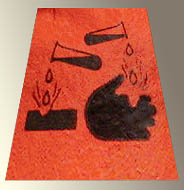

## Les abrasifs
### Les outils abrasifs, usages en arts plastiques
 **Les abrasifs et les outils de polissage**

_Un très vaste domaine qui concerne un grand nombre de disciplines. Pas question, pour nous, d'en aborder toutes les facettes, c'est impossible._

_Nous mentionnerons donc différents produits connus et nous rentrerons dans le détail progressivement, au fil des enquêtes, ce qui risque de prendre quelque temps lorsque l'on songe par exemple que l'abrasif définit aussi une vaste catégorie de substances - notamment des peintures - qui lui résistent, catégorie bien concrète qu'il faudra évoquer. N'hésitez pas, chers lecteurs, à nous suggérer des ajouts ou des modifications._

**Sommaire**

[Les machines et outils](abrasifs.html#machinesetoutils)

[Les meules](abrasifs.html#tours)

[Poudres et pierres](abrasifs.html#poudresetpierres)

[Les potées](abrasifs.html#potees)

[Les acides](abrasifs.html#acides)

 - Machines et outils

> _Il en existe une infinité !_
> 
> \* Parmi les outils, on citera le [polissoir](p.html#polissoir) et le [brunissoir](brunissoir.html), destinés aux métaux fins et notamment au traitement de la [feuille d'or](feuillesmetalliques.html). Certains outils de polissage nécessitent eux-mêmes un entretien de type... polissage.
> 
> \* Mentionnons également les laines d'acier et d'autres métaux. Elles sont utilisées notamment pour le travail du bois.
> 
> \* Parmi les outils et machines destinés aux travaux d'abrasion, beaucoup sont pourvus d'une surface où une poudre abrasive a été collée.
> 
> \* D'autres sont des "[tours](tour.html)" motorisés où l'on fixe des cylindres (meules) plus ou moins abrasifs ou polissants sur une tige rotative, voir ci-dessous.

 - [Meules](meule.html) (cylindres à adapter aux "[tours](tour.html)")

> _Ces objets sont de toutes natures. Nombreux sont ceux qui sont couverts de poudres collées (voir paragraphe suivant), mais nous citerons deux exceptions :_
> 
> \* la "patate". C'est une bande de tissu (généralement du coton) qui a été imbibée de [colle de peau](colledepeau.html). Enroulée sur elle-même, elle forme un cylindre où l'on perce, après séchage, un trou central afin de l'adapter à un tour. Cet accessoire permet de polir différents matériaux, y compris des métaux assez durs comme le bronze par exemple.
> 
> \* la meule de [pierre meulière](pierremeuliere.html), les meules faites d'autres roches. Dures, taillées en cylindres percés, elles permettent de polir et d'affûter.

 - Poudres et pierres utilisées pour l'abrasion et le polissage

> _Au sein de chaque type de substances, les usages varient essentiellement en fonction de la finesse des grains. Les poudres sont très souvent collées sur un support plan (papier, toile, papier toilé, plastique) ou cylindrique (adaptables à des tours). La colle est parfois une simple [colle de poisson](colledepoisson.html)._
> 
> _Dans d'autres cas (notamment le polissage de la pierre), les abrasifs pulvérulents sont souvent mélangés à une graisse ([suif](suif.html), huiles) ou à de l'eau dont on imbibe des tissus fins, des tampons, des feutres ou des velours ("bouchons") servant à l'application._
> 
> > _Mesure_
> > 
> > _La taille des grains est mesurée de différentes manières. Le [papier de verre](abrasifs.html#silices) et la toile [émeri](emeri.html) sont référencés sur [l'échelle émeri](e.html#echelleemeri) notamment. Il existe une classification standard qui concerne différentes poudres. Elle indique le nombre de mailles au pouce-carré du tamis témoin - elle n'est donc pas conforme au système métrique. Concernant l'émeri par exemple, elle va du 12 (très gros) au 600 (très fin). Le 80 correspond au 0 sur l'échelle émeri. Les unités du Système International (micron, millimètre, etc.) sont employées également, le choix de telle ou telle mesure dépendant entre autres du corps de métier concerné._
> 
> _Voici donc une liste de poudres et de roches où l'on voit nettement dominer les matériaux à base de [silicium](silicium.html) et d'oxyde de fer. Les autres ont été placées en fin de liste._
> 
> > \* [Le tripoli](tripoli.html), très ancien, toujours très fin, surtout destiné au polissage. Il est mis en solution avec de l'eau et/ou d'autres produits. Il est rouge, chargé non seulement de silice mais aussi d'oxyde de fer.
> > 
> > \* Le rouge d'Angleterre (dit aussi de France, ou autres appellations) est un produit de polissage relativement comparable. [Lire passage in Les terres rouges,](terresrouges.html#rougedangleterre)
> > 
> > \* Le rouge à polir est une version plus contemporaine. C'est un oxyde de fer.
> > 
> > \* [Les terres d'infusoires](infusoire.html) sont plutôt employées pour l'astiquage.
> > 
> > \* La pierre ponce, roche extrêmement poreuse et légère de nature silic[atée](uresiresates.html), employée depuis l'aube des temps. Elle aurait d'autres vertus. Il serait possible de l'adoucir à l'aide de produis cireux.  
> > La poudre de pierre est une poudre abrasive également utilisée. On la nomme _ponce soie_.
> > 
> > Notes :
> > 
> > > \* il existe des pierres ponces reconstituées, agglomérats de sable collé.  
> > > [Cliquer ici pour tout apport concernant ce thème de recherche.](ecrire.html)
> > > 
> > > \* la pierre ponce est employée dans certaines recettes de préparation des huiles à peindre.
> > 
> > \* D'une nature chimiquement proche, on mentionne également le _grenat_ ou _garnet_, poudre dure utilisée par différents corps de métiers. Nous manquons également d'informations sur ce produit.
> > 
> > \* Certaines matières particulièrement [siliceuses](silice.html) : [le verre](verre.html), [le sable](sable.html), certains [grès](gres.html) bien chargés de quartz et le [quartz](quartz.html) lui-même (qui donne le _papier de verre_ traditionnel - grain voir [ci-dessus](abrasifs.html#echelles)). On ne les met pas en solution à proprement parler, mais on leur adjoint fréquemment de l'eau ou des graisses, quelquefois simplement pour limiter le dégagement de poussières.
> > 
> > \* Différentes [craies siliceuses](craie.html#craiessiliceuses) (blanc d'Espagne, de Meudon) sont employées pour les travaux très doux.
> > 
> > \* Comme son nom l'indique, la [pierre meulière](pierremeuliere.html) - un autre calcaire siliceux - est utilisée comme [meule](meule.html). Elle est dure.
> > 
> > \* Le [talc](talc.html), autre matière siliceuse, est mentionné comme outil abrasant,
> > 
> > \* [Le Carborundum ®](carborundum.html), dit "le carbure" (carbure de silicium) est particulièrement dur,
> > 
> > \* Le diamant (carbone véritable) détient le record absolu de dureté,
> > 
> > \* [Le corindon](corindon.html) et [l'émeri](emeri.html), poudres [alumineuses](alumine.html), sont encore d'usage courant. La dureté du corindon se situe juste au-dessous de celle du Carborundum Â®.
> 
> La pierre peut également être utilisée pour polir une surface de manière très douce. Mentionnons notamment le polissage au galet dans la technique du [tadelakt](tadelakt.html).

 - Les "potées"

> _Ces produits souvent toxiques agissent non seulement par leur dureté, mais aussi - voire surtout - par leur causticité. Ils sont souvent mêlés à un corps gras qui facilite leur application._
> 
>  - [La potée d'étain](poteedetain.html),
> 
>  - Les produits à base [d'acide oxalique](oxalique.html) ou d'autres acides (voir ci-dessous).

 \- Les acides

> _Leur usage est plus courant que l'on ne croit, leurs domaines d'application étant nombreux. Leur fonction est l'abrasion par corrosion. Une action mécanique peut être nécessaire après traitement, et d'ailleurs ce traitement peut être destiné à préparer l'action mécanique._
> 
> _La dangerosité des acides est directement liée à leur concentration dans le produit utilisé. Exemple : le citron est anodin, mais l'acide citrique pur est extrêmement [caustique](caustique.html).__  
> Tester le pH des produits à l'aide de [papier tournesol](papiertournesol.html) est indispensable bien que pas toujours suffisant._
> 
> _En effet, les acides ne sont jamais anodins, non seulement parce qu'il sont corrosifs, mais aussi parce que leurs incompatibilités à d'autres produits sont nombreuses dans bien des cas, sans parler d'autres propriétés spécifiquement dangereuses._
> 
> Évoquons quelques emplois d'acides communs :
> 
> > \* [L'acide sulfurique](sulfuriqueacide.html) et [l'acide nitrique](nitrique.html), bien qu'ils ne soient pas des acides forts (au sens strictement chimique du terme - lire [passage](chap03caseine.html#forcefaiblesse) in _Les dialogues de Dotapea,_ chap. III), sont extrêmement violents. Ils sont principalement utilisés pour leur effet radical sur les métaux.
> > 
> > \* [L'acide chlorhydrique](chlorhydrique.html) dilué (un produit de supermarché) et quelques autres (on évoquait [l'acide oxalique](oxalique.html) ci-dessus) ainsi que différents produits dissolvants sont d'un usage relativement courant, permettant d'obtenir des corrosions superficielles pouvant soit être assimilées à des abrasions, soit constituer la préparation d'une abrasion ou d'un polissage.  
> > Ils sont oxydants et permettent aussi d'obtenir des effets chromatiques ([patines](patines.html) des statues métalliques).  
> > Attention : ce n'est pas parce qu'il est facile de se les procurer qu'ils sont anodins ; leur emploi n'est aucunement dénué de danger.
> 
> [Lire les références aux sites consacrés à  la toxicologie.](liensutiles.html#artetsecurite)
> 
> [A lire également, l'article général du glossaire consacré aux acides.](acides.html)

