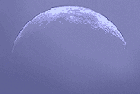

## Les albâtres
### Les albâtres, usage en sculpture
 **Les albâtres**

Le mot _albâtre_ pose quelques problèmes de définition. Au-delà, la question du bon emploi de ce matériau ne semble pas non plus clairement résolue à ce jour.

Attardons nous en premier lieu à la définition lexicale de l'albâtre.

Lecture conseillée : [L'albâtre sur Pourpre.com](http://pourpre.com/chroma/dico.php?typ=fiche&&ent=albatre)

D'abord, son genre est masculin alors que son aspect blanc et transparent ainsi que quelques expressions poétiques comme "des épaules d'albâtre", "une gorge d'albâtre" évoquent clairement une féminité particulièrement affirmée.

Ensuite, les albâtres sont normalement des catégories de [gypses](gypse.html). Or, certains auteurs évoquent un "albâtre calcaire" (dit aussi parfois "onyx calcaire"), mais cette appellation peut être considérée comme abusive. Elle est jugée telle par différents dictionnaires et certains n'ont même pas estimé nécessaire de l'évoquer. Par ailleurs, des auteurs signalent une confusion : certains gypses ont pu être vendus comme [pierres calcaires](calcaires.html) ([calcites](calcite.html)) fines ou comme [marbres](marbres.html) alors qu'elles sont plus fragiles - l'ongle les raye - et sont aussi plus translucides - sauf traitement de falsification, [voir ci-dessous](albatres.html#falsification). Cette fragilité a longtemps été considéré comme un défaut. Dans ces conditions, au lieu de risquer de faire écho à de vieilles escroqueries, nous ne traiterons ici que de l'albâtre authentique, à base de gypse, non falsifiée.

Enfin, _albâtre_ est lié étymologiquement au latin _albus_, qui signifie blanc. Pourtant, dès l'époque romaine, certaines définitions de ce mot ont inclus des variétés colorées de gypse et le vocable un peu bâtard _alabastrites_ (en français actuel, _alabastrite_) est venu apporter une précision devenue nécessaire : il désignait les variétés italiennes blanches par opposition aux variétés colorées que le Petit Robert nomme encore de nos jours _albâtres orientaux_.

Ces imprécisions et bricolages lexicaux tournent au cauchemar lorsque l'on découvre que certains industriels anglo-saxons utilisent aujourd'hui le terme _alabastrite_ pour désigner des statues en résines dont l'apparence évoque avec insistance celle de nains de jardins !

Pourquoi, au fond, tant de confusions et de rapiéçages manqués ? Le livre "s/z" de Roland Barthes pourrait peut-être nous inspirer quelques réponses car l'albâtre, souvent associée à la Lune, est donc double, tout comme le cristal de gypse ("queue d'aronde") et tout comme le nom ambigu _Sarrasine_. Certaines sources prétendent d'ailleurs que le mot gypse serait venu remplacer celui de sélénite - véritable terme originel - dès l'Antiquité grecque (information non confirmée).

Le fait que l'albâtre blanc doive être distingué par un vocable spécifique répondant à un impératif académique ne nous intéresse plus tellement dans l'approche contemporaine de la sculpture, aussi évacuerons-nous sans vains questionnements le terme d'alabastrite, le laissant pour ainsi dire aux nains de jardins.

La transparence de l'albâtre semble être encore un défaut aux yeux de certains auteurs qui vont même jusqu'à exposer un procédé de blanchiment destiné à lui donner l'aspect d'un marbre de Carrare. Ce procédé qui frise la malhonnêteté ne sera pas reproduit dans nos pages.

**Faut-il donc à tout prix dissimuler la transparence et la tendreté de l'albâtre ?** Pourquoi ne pas en user plutôt à bon escient, comme l'ont fait d'innombrables sculpteurs de l'Antiquité ainsi que des lapidaires et des décorateurs de tous temps ? Son aspect lunaire un peu magique peut se prêter parfaitement à certains travaux. Sa tendreté et sa finesse autorisent des tailles, des polissages, des "matières" inimitables, proches de ce qui peut être obtenu avec le [plâtre](platreliant.html) mais avec une translucidité que celui-ci n'a pas.

Attention : comme tout [gypse](gypse.html), l'albâtre peut commencer à s'altérer à la température de 70°C. Il est imprudent de placer des oeuvres à proximité immédiate de sources de forte chaleur (des spots, par exemple). 

 [Communication](http://www.artrealite.com/annonceurs.htm) 

