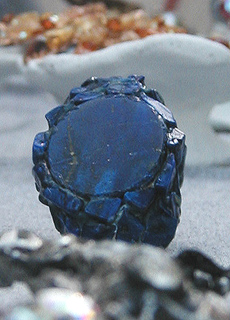

## Les bleus outremer
### Les pigments bleus outremer, usage en arts plastique
 **Les bleus outremer**

**Genèse**

Pour des raisons qui sont exposées dans l'article consacré au [lapis-lazuli](bleusfroids.html#lelapislazuliveritable), l'imitation de cette pierre - appelée outremer bien avant la synthèse qui porte ce nom - préoccupe l'être humain depuis l'ancienne Égypte (voir [bleu d'Égypte](bleuschauds.html#lebleudegypte)).

A partir du XVIIIème siècle, l'attention de chimistes et même d'un génie universel, Goethe (1787), se porte sur des poussières bleutées qui se déposent sur les parois de certains four à chaux ou à verre. Mais c'est surtout la découverte de la composition chimique du lapis-lazuli (Désormes et Clément, 1806) qui donne le départ d'une véritable course entre savants. En 1814, Vauquelin s'aperçoit qu'un échantillon prélevé dans un four de Saint Gobain n'est autre que de l'outremer, du véritable lapis-lazuli !

Dix ans plus tard, la Société d'Encouragement pour l'Industrie Nationale offre un prix de six mille francs pour le premier découvreur d'un procédé de synthèse. Cette même société d'encouragement avait déjà récompensé en 1802 l'invention du procédé Thénard permettant la fabrication du [bleu de cobalt](bleusfroids.html#concourscobalt). Il était clair dans tous les esprits qu'il y avait énormément d'argent à faire dans ce domaine qui était pratiquement l'enjeu industriel et financier majeur de l'époque.

En Allemagne, le malheureux Christian Gottlob Gmelin réalise bien à Tübingen une synthèse contrôlée, mais... un mois trop tard ! Il produira cependant son pigment industriellement. Moins froid que ce qui deviendra l'outremer français, l'outremer allemand n'aura pas une vie aussi longue.

C'est bel et bien Jean-Baptiste Guimet, le talentueux chimiste lyonnais qui inventa, en 1828, le complexe procédé de synthèse de ce bleu violacé encore plus froid que le lapis-lazuli, ce qui en fait une véritable _nouvelle couleur_, malgré une relative ressemblance avec les bons [indigos](bleusfroids.html#lindigo), toutefois beaucoup moins couvrants et d'usages moins variés.

Guimet gagne non seulement le concours, mais aussi une réputation universelle. Son invention eut des répercutions bien au-delà du domaine des Beaux-arts où elles sont déjà immenses. Elle autorisa notamment _[l'azurage optique](azurantoptique.html)_ des fibres textiles et des papiers tendant naturellement à jaunir. Selon certaines sources absolument non confirmées, la production industrielle massive du pigment destiné à la peinture daterait seulement de 1920 ([toute information fiable à ce sujet sera la bienvenue](ecrire.html)). Il semblerait en tout cas qu'entre sa découverte et son entrée encore timide dans les ateliers d'art au cours du XIXème, l'outremer ait surtout été utilisé à des fins industrielles d'ordre tinctorial.

Tout cela augmenta considérablement la fortune de la famille Guimet - l'enjeu industriel étant colossal. D'ailleurs, Émile, le fils de Jean-Baptiste, eut les moyens de construire un très remarquable musée - cité par ailleurs sur ce site -, d'abord à Lyon (1879), puis transféré à Paris (1885), dont les collections asiatiques sont réellement inestimables.

**Composition(s)**

Le pigment nouveau était et est encore constitué d'alumino-silicate de sodium polysulfuré, tout comme le véritable lapis-lazuli. [François Perego](livres.html#perego) donne des indications intéressantes (p. 447) : le lapis « _contient 25 à 40% de lazurite, le reste étant constitué d'augite, de [calcite](calcite.html) (...), de diopside, enstatite, de [mica](mica.html), d'haüyne, d'hornblende, de noséane, de wollastonite et de pyrite. (...) La lazurite théorique répond à la formule structurale Na8 \[S2|(AlSiO4)6\]. Toutefois, sa formule dans le lapis-lazuli est plus ou moins hybride entre les trois, ce qui donne (Na, Ca)8 \[(S, SO4, Cl)2|(AlSiO4)6\], où la forme lazurite est prédominante._ » De quoi situer chimiquement ces substances.

La variété artificielle qui fit référence ("_bleu outremer français_", "_french ultramarine_", voir photo ci-dessous) correspond sensiblement au "_bleu outremer foncé_" actuel, d'une teinte un peu violacée ([voir photo ci-dessous](outremer.html#photobleuoutremerfonce)).

Mais il existe d'autres variétés, du vert au violet. A ce sujet, lire absolument _[La famille chimique des outremers](outremers.html)__._

En ce qui concerne les bleus, l'outremer clair et le moyen sont assez chauds et ressemblent au lapis-lazuli ou à certains [cobalts](bleusfroids.html#lebleudecobalt). A part [l'outremer violet](violetsetmauves.html#levioletoutremer), les autres variétés que nous rencontrons sur le marché sont des variantes comportant des ajouts parfois consternants et d'un intérêt très relatif (Le _bleu outremer teinte verte_ et même le très surprenant _vert outremer_ par exemple). Nous enquêtons actuellement sur un mystérieux gris d'outremer. 

**Emplois**

_L'oltramarino_ synthétique de Guimet était originellement fabriqué à l'aide _d'argile, de soude, de soufre, de charbon et d'autres substances_ (voir [le cahier de laboratoire du chimiste sur le site du CNAM-CNUM](http://cnum.cnam.fr/CGI/fpage.cgi?4KY15.18/109/120/391/15/381)). Des matériaux à bas prix. Malgré le coût de la synthèse en four, vers 1830 un kilo de pigment coûte 882 francs alors que le lapis lazuli vaut de 7 à 11 000 F.  Cette accessibilité toute nouvelle d'un bleu vraiment froid fut perçue partout, très tôt en Occident. La couleur nouvelle a servi et sert toujours en peinture décorative, notamment dans le sud de l'Europe (par exemple au sud du Portugal), mais aussi en Scandinavie, pour la pigmentation des façades.

  

De fait, le bleu outremer foncé ou "outremer français", est vraiment très conseillé en tant que couleur de base de la palette. Il autorise la création, en mélange,

>  - de violets splendides en combinaison avec les rouges les plus clairs possible, même orangés, comme le rouge de cadmium clair ou le rouge vermillon.
> 
>  - de verts déjà assez sophistiqués rien qu'en mélange binaire avec un jaune de cadmium clair ou moyen, encore davantage s'il est adjoint à une terre jaune. Il donne alors une déclinaison de verts proches de la terre verte.
> 
>  - de terres jaunes, rouges et brunes, adjoint à une base binaire orange comme "jaune de cadmium clair ou moyen + rouge vermillon".

Il faut signaler

>  - la présence en lui de soufre. Si le pigment est de mauvaise qualité et contient du soufre libre, il peut présenter des incompatibilités avec le plomb.
> 
>  - sa légère sensibilité aux variations hygrométriques
> 
> \- le risque de la "_maladie de l'outremer_", l'altérant rapidement, lorsque, _employé pur_, il est placé dans des conditions hygrométriques défavorables
> 
>  - il se décompose au contact des acides (suffisamment violents et concentrés).

**Le bleu Majorelle**

Une curiosité amusante. C'est un outremer clair dont s'est servi le peintre du même nom pour peindre sa maison marocaine.

Lecture conseillée : [Le bleu Majorelle sur Pourpre.com](http://pourpre.com/chroma/dico.php?typ=fiche&&ent=majorelle)

**Toxicité**

Nulle selon certains, il faudrait cependant, selon des sources tout à fait sérieuses (notamment le CSST - voir [Art, sécurité, pollution _in_ Références](liensutiles.html#artetsecurite)), éviter de boire et de manger pendant l'utilisation de ces pigments et au moins éviter le contact cutané. Attention aussi aux yeux.

Stockage : lieu sec et bien ventilé.

**Emplois particuliers**

L'outremer serait assez utilisé comme couleur de fond pour la dorure.

 [Communication](http://www.artrealite.com/annonceurs.htm) 

