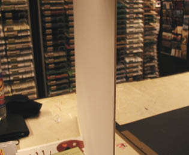
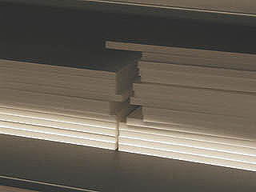
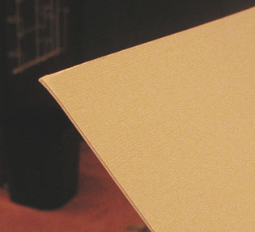

## Les cartons
### Cartons, usage en arts plastiques
 **Les cartons**

_**Le "carton bois" (dit aussi "carton museum") est normalement neutre chimiquement. Le carton gris et les cartons ondulés sont [acides](acides.html) le plus souvent.**_

**_Le traitement, l'utilisation possible du support varie essentiellement en fonction de ce facteur. Un carton que le fabricant laisse non-neutre chimiquement n'est évidemment pas destiné aux mêmes usages qu'un carton neutre. Mais l'enduction peut modifier les comportements._**

_A lire en complément,  
[le courrier d'un lecteur](courrierdeslecteurs2011b130.html#20110705fl)  
portant sur ces problématiques_

**Sommaire**

[Cartons neutres](cartons.html#cartonsneutres)

[Cartons acides](cartons.html#cartonsacides)

[Le carton-médium](cartons.html#lecartonmedium)

[Encollage](cartons.html#encollage)

**\_**

 Cartons chimiquement neutres  
(ou légèrement alcalins)

 

_**Le carton bois** est en principe neutre ou dispose d'une "réserve alcaline". Cependant, tel quel, il ne peut guère être employé sans enduction préalable : il réagit aux peintures à l'eau et à l'huile au point de se décoller en strates (fait confirmé). Il est nécessaire de l'enduire de préférence recto-verso, sachant que cette dernière opération peut nécessiter une tension préalable. Des manipulations relativement "lourdes"._

Carton bois

C'est la raison pour laquelle les papetiers (notamment Vinci-Stouls) proposent des **_cartons bois [contre-collés](contrecollage.html)_**, sorte de "haut de gamme" des cartons, dont une face est couverte d'un papier sur lequel il est possible de peindre (c'est typiquement le "contre-collé lavis-Bristol"), alors que l'autre face est couverte d'un autre papier qui n'a pas vocation à être peint. Certains contre-collés "une face" ne sont collés que d'un côté. Ils ont une fâcheuse tendance à s'incurver. _**Les contre-collés pour encadrement**_ (Canson, Vinci-Stouls, Fabriano, etc., tous basés sur un carton neutre et un [papier à dessin](papiersadessin.html)) peuvent être utilisés notamment pour les lavis et techniques mixtes à l'eau, mais ils ont aussi une déplorable tendance générale à s'incurver naturellement, n'étant collés que sur une face.

Ils sont généralement élaborés sur un support de carton bois, mais aussi, parfois, sur des cartons teintés ("esprit" coloré, voir [ci-dessous](cartons.html#cartonschimiquementneutresteintes)). Les épaisseurs de l'ordre d'un millimètre jusqu'à 2 mm sont le plus souvent destinés aux maquettistes - surtout les "double faces Bristol". Les peintres employant l'acrylique ou travaillant les collages préfèrent souvent les contre-collés "[_lavis-bristol_](cartons.html#facelavis)" _d'au moins 2,5 mm_ - la photo ci-dessus à gauche montre précisément un contre-collé de cette épaisseur. Les dimensions dépassent rarement le _[grand monde](formatsdepapiers.html#grandmonde)_.

Les contre-collés peuvent être pourvus 

     \* de "_deux faces_", présentant effectivement deux faces identiques faites de papier bristol (destination : maquette ou présentation), 

     \* d'une "_face lavis_" (typiquement, du _papier lavis Vinci_, face destinée à être peinte, encollée, travaillée de quelque manière) et d'une "_face bristol_" (utilitaire - voir [contre-collage](contrecollage.html)). Ils sont nommés "_lavis-bristol_".

     \* d'une face "papier artistique ou décoratif". Il s'agit alors de _contre-collés d'encadrement_ pouvant être détournées de leur destination normale. Le contre-collé vergé, par exemple autorise des techniques combinées fusain/sanguine/pastel/aquarelle/acrylique, mais il doit être tendu de préférence pour permettre l'usage de peintures à l'eau.

    \* de mousse ("carton-plume", "cadapac ®", support pour présentations, pour maquettes, assez inadaptés à la peinture ou aux collages massifs). Le centre du "plume" est une mousse de polyester, légère mais robuste (plus ou mois selon son épaisseur, 3 à 10mm), sur laquelle sont plaquées deux feuilles de bristol très fin (ou autre papier lisse), au recto et au verso. Dans le cas où un encollage doit être effectué sur la tranche, une colle spécifique doit être employée car la plupart des colles habituelles font littéralement fondre la mousse.

Photo : cartons-plume de 10 mm d'épaisseur.

   

\* de cartons chimiquement neutres teintés, le contre-collé final étant théoriquement destiné à l'encadrement :  
"[L'esprit](esprit.html)" coloré apparaît sur la tranche biseautée des maries-louises.

ATTENTION : les contre-collés d'encadrement couverts d'un papier noir ne sont pas toujours garantis sans acides.

Image ci-contre : un contre-collé vergé de 0,8 mm d'épaisseur.

Contre-collés

Cartons acides

 

Les **_cartons gris_** sont massifs et ne semblent pas avoir le moindre "sens" dans leur fibre.

Ils ne sont en principe pas conseillés en tant que supports à peindre.

Pour cet usage il est fortement indiqué de les enduire le plus intégralement possible afin d'éviter le délitement (danger majeur) et les interactions avec toutes les substances (peintures, colles) que l'on souhaite y poser. Gare à la réaction du carton imbibé de liquide, d'autant plus forte que son épaisseur est fine. Il est prudent de le tendre préalablement ou bien de le fixer sur un support, tout comme [l'Isorel ®](bois.html#lisorel).

Les cartons gris

Les **_cartons bruns_** se trouvent partout. Ils sont d'un beige assez clair rappelant le kraft, pas sans intérêt d'ailleurs. Il vaut mieux les enduire le plus intégralement possible pour les protéger des micro-organismes. Cependant, malgré cette précaution, ils n'offrent guère de garanties de pérennité car ils sont le plus souvent ondulés et offrent donc prise à l'air.

Les cartons bruns

Le carton-médium

 

Mélange de bois et de carton pulvérisés, il est poreux au centre comme le [carton plume](cartons.html#cartonplume). Mais il est beaucoup plus grossier.

Il a des qualités : il peut servir à amortir les chocs lors de transports et à isoler de l'humidité, on peut le découper et en faire des maquettes, mais en tant que support à peindre, il se comporte très mal !

Certains emplois en dessin et en peinture (très légère, peu liquide) seraient néanmoins possibles. Il ne faut pas escompter une conservation durable sauf peut-être en pratiquant une très bonne enduction.

 

Encollage

 

L'encollage du carton n'est pas celui du bois ni de la toile. Il est très semblable à celui du papier.

Un carton immobilisés sur une surface rigide n'impose aucune contrainte particulière à l'encollage. C'est en quelque sorte la situation idéale. Venons-en aux autres cas de figures.

 

Dans l'ensemble, il vaut toujours mieux enduire un carton ou un papier _recto-verso_ pour équilibrer les forces de traction des colles d'enduction.

L'épaisseur du carton a bien entendu son importance, mais elle n'est pas déterminante pour tous les types d'encollages. Il est généralement assez facile d'effectuer des marouflages sur de petites surfaces (compter une épaisseur d'au moins 4mm) alors que la préparation d'un grand carton pour la peinture peut poser davantage de problèmes

La colle de peau risque de poser des problèmes à cause de son fort tirant. Il faudrait l'utiliser vraiment très diluée et en plus de deux couches, en enduisant à chaque fois les deux faces. Nous n'avons pas testé ce mode d'encollage mais nous émettons de sérieuses réserves quant à sa réussite sans expérience avérée de ce type de pratiques.

Les enduits de type caséine/chaux sont à proscrire car ils sont beaucoup trop fragiles. La caséine mêlée d'une forte proportion de glycérine, pourrait peut-être convenir à condition d'être appliquée en de multiples couches, de la même manière que la colle de peau. Sur un carton très solide et sans garantie de notre part.

L'encollage au [Caparol ®](caparol.html) ou un autre liant [vinylique](vinylegloss.html), face après face, en deux couches dont la première assez diluée, peut donner des résultats. Il peut cependant s'avérer nécessaire de tendre le carton à chaque encollage pour éviter les déformations, surtout lors de la pose de la première couche.

_Ce que nous conseillons ?_

L'immersion totale dans une eau adjointe d'un liant vinylique (25% environ). "Ca passe ou ça casse" : soit le carton se tord lamentablement au séchage (en position verticale sur un séchoir à linge, retourner la feuille de temps en temps), soit il se conduit bien et la ou les couches ultérieures sont pratiquement garanties sans accident.

Feuilles de carton "nues", non immobilisées

 

 

 [Communication](http://www.artrealite.com/annonceurs.htm) 

