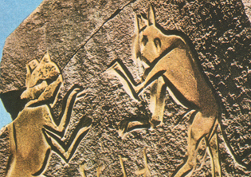

## Les catégories de sculptures
### Les catégories de sculptures, ronde bosse et reliefs
 **Les catégories de sculptures** 

Voir [Tête de section Sculpture](produitsnonliants.html) Si ces catégories semblent éternelles, cela n'empêche pas l'apparition de nouvelles formes d'art sensiblement assimilables - du moins associables - à la sculpture. _L'installation_ contemporaine semble constituer _a priori_ une nouvelle catégorie qui sera un jour, peut-être, entièrement assimilée à la sculpture. Éléments pour un débat ci-dessous.

Quant aux arts de la lumière, ils semblent encore plus inclassables.

On distingue les catégories suivantes :

> \* **la ronde bosse** (lire [l'article du glossaire](rondebosse.html)). A l'intérieur de cette catégorie, les distinctions entre sculptures monumentales, mobiles, miniatures, motorisées, informatisées, etc. n'ont rien d'éternel et ne peuvent être l'objet de jugements catégoriques fiables à long terme.
> 
> \* **les "reliefs"**, autour desquels on ne peut tourner sans les voir disparaître. Il s'agit de :

> > \* l'entaille. Pratiquée surtout en Égypte et dans le Sahara anciens. Les contours sont très marqués, "entaillés" dans la roche (voir illustration ci-contre, _Les chats de Mathendush_, Fazzan, Lybie, néolithique, détail). L'intérieur, les surfaces, sont plus ou moins modelées, parfois pas du tout.
> > 
> > \* le bas-relief écrasé, variété de l'entaille dans laquelle le creusement est peu profond. Le néolithique européen abonde d'oeuvres de ce type. L'exemple le plus célèbre et le plus remarquable est certainement l'hallucinant monument tumulaire de Gavrinis, Morbihan, France.
> > 
> > \* le bas-relief est l'objet de définitions parfois très précises. Trop, serait-on tenté de dire, car si l'avancée d'une forme _hors du plan_ "doit être inférieure à la moitié de son volume sans contre-dépouillé" (c'est la définition la plus stricte que nous ayons trouvée), qu'en est-il des bas-reliefs réalisés sur des surfaces irrégulières ou arrondies ?  
> > Dans un bas-relief, les formes "saillantes" sont généralement très attachées au fond, en font littéralement partie intégrante.
> > 
> > \* le demi-relief. Ce terme peu usité, absent des dictionnaires, est aussi l'objet de descriptions un peu trop affinées ! Il correspond surtout, naturellement, à un intermédiaire entre bas-relief et haut-relief.
> > 
> > \* le haut-relief. Les formes sont presque entièrement détachées du fond. Les têtes des maîtres de Ghiberti sur les portes du baptistère de Florence sont des haut-reliefs.
> 
> \* **les "installations"**. Souvent non dénuées d'un caractère architectural, parfois sculptural, quelquefois pures mises en scène, elles sont tantôt intérieures, tantôt extérieures, tantôt rondes bosses (lorsque l'on peut tourner autour), tantôt reliefs (lorsque l'on ne peut pas), et souvent ni tout à fait l'un ni l'autre (notamment lorsqu'il s'agit d'entrer dans l'oeuvre devenue lieu). A quel domaine faut-il les rattacher ? Faut-il considérer cette pratique artistique comme isolée et nouvelle dans l'histoire de l'art ou bien comme le retour d'un très ancien concept d'art remontant à une période où les disciplines fusionnaient très facilement autour d'une expression globale ?
> 
> \* **les arts de la lumière**. Sky art et disciplines proches ont connu leur véritablement avènement à l'époque nazie avec les travaux d'Albert Speer. Cas particulier du procès de Nuremberg, cet homme - qui était un architecte - n'était peut-être pas le tout premier à saisir les possibilités "artistiques" ou "rituelles" totalement nouvelles offertes par la lumière électrique. Cependant, il a très bien saisi leur intérêt dans le domaine de la mise en scène mégalomane hitlérienne.  
> Son exploitation de la lumière et de l'espace tridimensionnel offert par le ciel, les bâtiments, les foules, les banderoles, etc., a été largement reprise dans la seconde moitié du XXème siècle à des fins tantôt comparables (spectacles de masses), tantôt sans rapport direct (sky art, land art, etc.).  
> Dans tous les cas, s'agit-il d'architecture, c'est-à-dire d'un travail d'ouvrier ([cf. glossaire](architecte.html))  ? Rien n'est moins sûr.  
> Ce qui semble assez évident, c'est que la lumière sculpte l'espace plutôt qu'elle ne le construit et que la question de l'appartenance de cette pratique à la sculpture n'est pas absurde _a priori_. La véritable question, a affiner au cas par cas, semble être de savoir s'il s'agit de scénographie, de communication ou véritablement d'art.
> 
> > \* L'holographie est longtemps restée un phénomène mineur difficile à associer aux arts plastiques. Certes, la lumière semblait sculpter l'air, mais c'était bien un _photographe_ qui était l'auteur de cette "sculpture". Or, depuis quelque temps, il semble que l'on soit capable de produire des hologrammes à partir d'images purement numériques. Il s'agit donc de véritables créations formelles pouvant prendre un caractère artistique.

 [Communication](http://www.artrealite.com/annonceurs.htm) 

