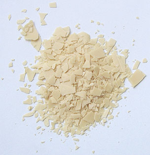
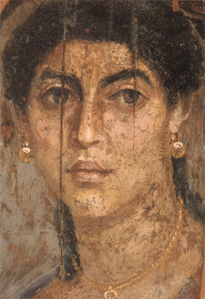

## Les cires utilisées comme liants, l'encaustique
### Les cires utilisées comme liants, usage en arts plastiques
 **Les cires utilisées comme liants**

_Les cires sont toutes réputées pour leur permanence, leur stabilité dans le temps, moyennant certaines conditions de conservation. Elles ne sont pas très résistantes au point de vue mécanique et sont assez [thermosensibles](liants.html#thermosensibilite). Pourtant elle présentent des avantages irremplaçables. Voir ci-dessous,_ [propriétés spécifiques communes](cires.html#proprietesspecifiquescommunes)_._

_Le modelage et le moulage des cires sont évoqués [dans un autre article](ciredebougie.html)._

**Diluants, solvants, dissolvants des cires**

Diluants : [essences](essences.html), [alcool](alcools.html) (éthanol). Pour une simple mise en solution, la chaleur est le meilleur agent. Le mélange de cires, par exemple, peut donc être effectué par simple réchauffement.

Accélérateur de séchage : le réfrigérateur !

Dissolvant : [acétone](acetone.html). Voir [diluants, solvants, dissolvants](diluantssolvants.html).

Les hydrocarbures benzéniques seraient soi-disant d'excellents solvants des cires, prétendent certains auteurs, mais en fait les essences non [aromatiques](aromatique.html) sont d'un emploi plus facile et infiniment moins nocif. Contrairement à ce que prétendent les mêmes auteurs, nous avons constaté que la cire diluée dans la [térébenthine](essences.html#essencedeterebenthine) se comporte infiniment mieux que dans le [white spirit](essences.html#whitespirit) ou toute essence minérale.

Sommaire

[_Modelage et moulage des cires (externe)_](ciredebougie.html)

[Diluants, solvants, dissolvants des cires](cires.html#diluantssolvantsdissolvants)

[L'encaustique des ébénistes et la cire des peintres](cires.html#ebenisterievspeinture)

[Liste de cires](cires.html#listedecires)

\- [La cire d'abeilles](cires.html#laciredabeilles)

\- [La cire de carnauba](cires.html#laciredecarnauba)

\- [La cire de gomme laque de Coromandel](cires.html#laciredegommelaquedecoromandel)

\- [Les cires synthétiques diluables à l'eau](cires.html#lesciressynthetiquesdiluablesaleau)

\- [Les cires de Chine](cires.html#lesciresdechine)

\- [Les cires minérales, la paraffine](cires.html#lacireminerale)

\- [La cire de myrthe](cires.html#ciredemyrte)

 - [Les cires au silicone](cires.html#lesciresausilicone)

[La cire de lanoline](cires.html#laciredelanoline)

[La cire de _montan_](cires.html#laciredemontan)

[Propriétés spécifiques communes](cires.html#proprietesspecifiquescommunes)

[La cire comme liant : peinture à l'encaustique et cire saponifiée](cires.html#peinturealencaustique)

**\- [Introduction](cires.html#introduction)**

**\- [La cire saponifiée](cires.html#ciresaponifiee)**

**\- [Procédés à la cire non saponifiée](cires.html#procedesalacirenonsaponifiee)**

**\- [Application à chaud (rarissime)](cires.html#emploiachaud)**

**\- [Application à froid (encaustiques classiques)](cires.html#emploiensolutionafroid)**

\* [Cas particulier de l'imprégnation à froid](cires.html#impregnationafroid)

\* [Patines, encaustiques décoratives](cires.html#patines)

\* [En peinture](cires.html#enpeinture)

\* [En dessin et techniques mixtes](cires.html#endessin)

Lors d'un réchauffement en présence de white spirit, on constate une très suspecte carbonisation, certes résiduelle mais survenant très rapidement. Cela semble démontrer qu'il y a dissolution (séparation d'éléments) plus que mise en solution. Le white spirit peut cependant s'avérer un bon décirant.

Ajoutons que, dénuées d'élément gras, les essences minérales (mais aussi l'éthanol) provoquent une décantation et non une dispersion, nous l'avons constaté en ce qui concerne le white spirit et l'[essence de pétrole raffinée](essences.html#lessencedepetrole). Une essence minérale qui permettrait d'obtenir une dispersion pourrait être soupçonnée de contenir des éléments gras ou émulsifiants - en tout cas suspects - en proportion assez importante.

L'essence de pétrole raffinée peut quand même être employée dans le cas précis de la préparation par [imprégnation à froid](cires.html#impregnationafroid). Elle ne donne pas une encaustique onctueuse, mais son avantage est de ne pas altérer le parfum de la cire.

**L'usage courant, depuis quelques siècles, veut que l'on emploie la térébenthine**, riche en résines, visqueuse, _empêchant la décantation_.

La très odoriférante [essence d'aspic](essences.html#essencedaspic) peut également être utilisée.

L'encaustique des ébenistes et la cire des peintres

Les produits employés sont très différents, de même que les procédés. Les peintres recherchent souvent un produit ayant une grande solidité et recourent soit à un adjuvant tel que l'huile de lin, soit d'emblée à une [cire saponifiée](cires.html#ciresaponifiee), plus proche d'une peinture "habituelle". L'ébéniste recourra à un mélange pur d'essence et de cire le plus souvent. Il n'hésitera pas à frotter les surfaces enduites pour bien imprégner le bois, pratique plus difficile à envisager pour l'artiste - du moins d'une manière générale.

L'artiste peintre cherchera souvent à obtenir un matériau relativement onctueux, "[plastique](plastique.html)" alors que l'ébéniste appréciera plutôt un produit assez solide, relativement dur. Entre ces deux extrêmes, on peut situer le peintre décorateur, toujours prêt à travailler sur des surfaces plus vastes à l'aide de produits dilués.

Mais ne cherchons pas trop à classifier les pratiques par métiers : tout est possible ! Le plasticien contemporain cherchera surtout à choisir et adapter un produit à l'usage qu'il souhaite en faire. De même, l'ébéniste et le décorateur utilisent aussi bien la cire saponifiée que l'encaustique en fonction du travail à effectuer.

Liste de cires

_Il existe des centaines, voire des milliers de cires. Cette liste est une simple sélection._

[La cire d'abeilles](cire.html) (acide cérotique, [éther](e.html#ether) myricilpalmitique) a une température de fusion de 62 à 70°C (généralement 63 ou 64°C).

Faite des parois des cellules de la ruche, elle est séparée du miel par un traitement à l'eau bouillante. Refroidie puis de nouveau fondue, elle donne la cire vierge ou cire jaune, employée pour la fabrication d'encaustique, de cirage et de cosmétiques depuis l'Antiquité.

La cire jaune se décolore sous l'action des rayons ultraviolets.

Fondue à nouveau puis versée dans l'eau froide et exposée à la lumière et à l'humidité, elle perd sa teinte jaune et gagne en blancheur, donnant la cire blanche. C'est celle-ci qui est employée dans les travaux artistiques et en restauration.

La cire d'abeilles serait parfois falsifiée ou coupé par ajout de [suif](suif.html) ou plus couramment, de [paraffine](cires.html#lacireminerale), notamment dans les produits dits "à la" cire d'abeille. Il faut donc bien veiller à la qualité et la provenance de ce produit. Une cire [insaturée](saturation.html) comme la cire d'abeille doit coller légèrement lorsqu'elle est réchauffée pendant une dizaine de secondes entre le pouce et l'index. C'est net : elle a du tirant, alors que la paraffine n'est presque pas visqueuse dans les mêmes conditions.

Ayant reçu les témoignages de plusieurs peintres "victimes de la cire", nous faisons écho de leurs avertissements : la cire d'abeilles, _cela fond vraiment_, et même avant de fondre tout à fait, ça bouge ! _Gare aux spots dans les expositions, danger n°1_, gare au soleil du mois d'août, et n'emportez surtout pas vos travaux au Sénégal, à Tahiti... ou dans un métro à pneus en été, par exemple.

_Nocivité et conservation_

> Globalement non toxique (elle est employée dans l'industrie pharmaceutique), elle peut quand même susciter des dermatoses.
> 
> Conserver évidemment à l'écart de sources de chaleur. Exposée à un surchauffage ou à un chauffage prolongée, elle se décompose.

_Charge électrochimique_

> La cire jaune peut être assez acide. Il peut être utile de tester son [pH](ph.html) à l'aide de [papier tournesol](papiertournesol.html). Il est possible de mettre à profit cette acidité de sorte à saponifier la cire (voir [plus loin](cires.html#ciresaponifiee)).
> 
> Une bonne cire blanche _doit_ avoir un [pH](ph.html) neutre.

La cire de carnauba - voir photo ci-contre

Dite aussi cire du Brésil, elle a pour principe chimique le céronate de myricile. Elle fond entre 82 et 86°C, ce qui rend un peu difficile sa cuisson au bain-marie. _Il faut couvrir le récipient afin de gagner les quelques degrés supplémentaires nécessaires à la liquéfaction complète ou mieux : faire fondre doucement à feu direct (sans danger). Le nettoyage des contenants n'est pas très aisé. Il faut remplir le récipient d'eau, le faire bouillir, le vider et répéter l'opération plusieurs fois afin d'enlever la majeure partie de la cire avant de poursuivre avec les nettoyants habituels._

La cire de carnauba est moins sensible à la température que la cire d'abeilles. C'est son principal atout. Elle résiste aussi particulièrement bien à l'humidité. Végétale, récoltée sur les feuilles des palmiers carnauba du Brésil, elle est un peu plus dure que la cire d'abeille. Elle sert à la fabrication de bougies, d'encaustiques et de quelques médiums et liants à peindre. Elle est un peu moins mate que la cire d'abeilles.

Au contact direct avec les mains, elle présente beaucoup moins de viscosité que la cire d'abeille.

_Elle est peu ou pas acide_, mais _cassante_. Pour cette raison et pour élever un peu le point de fusion des cires pour peintures décoratives, elle est souvent employée en mélange avec la cire d'abeille.

**ATTENTION :** elle est beaucoup plus teintée que celle-ci, c'est son principal défaut. Sa coloration jaune surprend car elle n'apparaît qu'à partir du moment où elle est liquéfiée. Aucun témoignage ne rend compte d'une aggravation du jaunissement avec le temps.

La cire de carnauba est un produit utile et reconnu. Son emploi conjoint à la cire d'abeille est presque systématique dans le domaine décoratif  où une proportion d'un tiers pour deux tiers de cire d'abeille est courante. Mais sa coloration gênante la condamne, dans le domaine artistique, à un usage tout à fait anecdotique.

Non toxique. Conserver à l'écart de sources de chaleur.

**La cire de gomme laque de Coromandel** est vraiment très dure. Selon nos sources, son point de fusion serait proche de celui de la cire de carnauba (information non confirmée). Elle est surtout employée en ébénisterie mais aucune raison ne justifie de la négliger pour différents usages en arts plastiques ou décoratifs. Un court passage lui est consacré dans l'article sur la gomme laque ([cliquer ici](gommelaque.html#ciredegommelaque)).

Conserver à l'écart de sources de chaleur.

**Les cires synthétiques diluables à l'eau** sont utilisées dans la fabrication des [crayons aquarellables](crayon.html#crayonsaquarellables). Nous ignorons tout de leur composition et de leur processus de fabrication. Il semble fort difficile de s'en procurer à l'état pur. Peut-être ont-elles des points communs avec la [cire saponifiée](cires.html#ciresaponifiee).

**Les cires de Chine** ne semblent pas utilisées en peinture et autres arts plastiques (si vous avez constaté le contraire, merci de [nous en informer](ecrire.html)). Leur température de fusion est de 82°C.

Selon [François Perego](livres.html#perego), leur origine serait animale. Citons-le (p. 206) : « _On a cru un certain temps qu'elle était produite par l'arbre suite à la piqûre d'un insecte (...). », « La cire de Chine est produite par la femelle d'une cochenille_ Coccus ceriferus_, qui se fixe sur les tiges ou les branches d'un frêne asiatique,_ Fraxinus chinensis_._ »

Effectivement, [André Béguin](livres.html#beguin) indique - mais bien avant F. Perego - dans son Dictionnaire (t.I, p.206) une origine végétale ou plutôt végétale et animale puisque selon lui ces cires apparaissent sur les arbres en réaction à la piqûre de Coccus.

Miellat pouvant évoquer la [laque dite de coromandel](gommelaque.html) ou résine végétale ? Qui croire de ces deux très grands auteurs ? Sur un sujet aussi difficile car nécessitant une observation in situ, nous ne pouvons accorder à l'une ou l'autre hypothèse plus de poids sans une observation directe preuves à l'appui (photos, vidéos). Tout lecteur pouvant apporter ce type de preuves est bienvenu à [entrer en contact](ecrire.html) avec nous.

Les larves des insectes seraient, selon François Perego, élevées au Yunan, puis déplacées au Sichuan (cap. Chengdu) pour la production de la cire. Il indique que « _Des cires apparentées sont produites par d'autres cochenilles extrême-orientales telles que Brahmea japonica, Erytherus pela (qui donne la cire de Chine d'Echigo) et d'autres Coccidées donnant la cire de Chine de Tsingtao._ » (p.206).

Enfin, « _En Extrême-Orient, elle sert entre autres pour le glaçage du papier.  
En Europe, cette cire de haute qualité est quasiment inconnue_ (...) » (p.207).

**Les cires minérales**, à savoir principalement la [paraffine](paraffine.html), la [cire microcristalline](ciredebougie.html#ciremicrocristallineetcireamodeler) et les gels-cires ne sont pas des [liants](liant.html) (sauf peut-être la [cire microcristalline](ciredebougie.html#cireamodeler)). Leur rôle dans les arts plastiques est à part. Elles peuvent tantôt être moulées, tantôt colorées ou parfumées. Employées surtout actuellement dans la fabrication des bougies et en sculpture (modelage, moulage, fonte des métaux), elle peuvent parfaitement être utilisées à d'autres fins.

Lire absolument l'article [_La cire de bougie, les cires minérales : cires et sculpture_](ciredebougie.html).

**La cire de myrte.** Elle n'est pas liante non plus mais peut trouver quelques applications dans le domaine des arts plastiques. [Lire l'article du glossaire.](myrte.html)

**Les cires au silicone** sont utilisées en ébénisterie comme substituts de la cire d'abeille. Comme celle-ci, elles ne supporteraient pas de surcouche autre que réalisée avec la même cire.

Elles seraient employées dans la fabrication de [médiums acryliques](mediumspourlacrylique.html). 

**La cire de lanoline** est employée dans la fabrication de cosmétiques. Voir [lanoline](lanoline.html).

**La cire de _montan_ ou cire de lignite** est noire ou brune. Elle servirait dans la fabrication de certains vernis.

Propriétés spécifiques communes

La cire coagule au contact de corps froids, d'air tiède. Ce phénomène rapide est particulièrement utile pour "figer" certains processus mécaniques plus lents, particulièrement en peinture à l'huile. Elle a notamment été utilisée par les maîtres vénitiens pour compenser la lourdeur de la [litharge](siccatifs.html#lalitharge) et peut-être de la [céruse](ceruse.html). C'est de ce point de départ qu'est probablement né le [médium vénitien](mediumspourlhuile.html#mediumgelvenitien). La cire permet aussi, nous l'avons constaté expérimentalement, de freiner la "chute" de certaines [charges transparentes](chargesincolores.html) comme la poudre de marbre et l'hydrate d'alumine.

Seule ou considérée à part dans un mélange, il est important de souligner qu'elle reste toujours friable et réversible à la chaleur, aussi vaut-il mieux l'employer en toutes petites quantités dans une pâte destinée à la peinture. Une autre solution possible pour l'artiste consiste à s'en servir à la manière d'un ébéniste ou d'un sculpteur réalisant une patine sur plâtre par exemple : tous deux n'hésitent pas à étaler, frotter, lustrer leurs encaustiques. La variété saponifiée fait cependant exception. Elle peut être appliquée avec des pinceaux, comme un peinture habituelle.

_Sauf en ce qui concerne les produits dits "minéraux" comme la [paraffine](paraffine.html), il est déplacé d'affirmer qu'une cire ne sèche jamais. On peut dire, pour faire court, que sa coagulation n'est pas synonyme de siccativation, s'agissant de processus différents, et que la structure obtenue après siccativation peut toujours être détruite par réchauffement. La siccativation des cires ne peut être comparée avec celle d'une huile à peindre, qui donne un résultat d'une solidité et d'une résistance exceptionnelles. La comparaison n'a aucun sens. Cependant, moyennant de bonnes conditions de conservation, les cires [insaturées](saturation.html) (abeilles, carnauba, etc.) protègent réellement le pigment._

Il faut bien spécifier que, contrairement à la cire minérale ([paraffine](paraffine.html)), les cires végétales et animales ne sont pas [saturées](saturation.html) et donc s'associent, une fois coagulées, aux autres corps. Ce processus difficile à observer pourrait durer, selon les auteurs, assez peu de temps (vingt-quatre heures selon certains, quelques semaines selon d'autres), le reste du phénomène étant surtout le fait des corps avec lesquels la cire est associée. Disons-le autrement : l'insaturation de ces cires permet aux autres corps "actifs", liants, de "s'agripper" à elles, contrairement à ce que l'on constate avec la paraffine, totalement rétive à toute association. Mais répétons-le : il ne faut pas attendre d'une cire une siccativation d'une qualité et d'une solidité comparables à celle de l'huile de lin.

En tant que corps gras, les cires semblent "nourrir" les bois, supports solides auxquels elles sont bien adaptées. Elles peuvent d'ailleurs servir de bouche-pores. _Les cires pures ou simplement diluées (encaustiques) doivent absolument être appliquées en couches fines successives, à chaque fois lustrées, en respectant ce que l'on pourrait nommer un "temps de séchage" de l'ordre de plusieurs jours ou semaines._ 

_Travailler "en masse" ne donne aucun résultat satisfaisant. Les encaustiques ont besoin d'accrocher, d'imprégner leurs supports par couches extrêmement fines et progressivement._

Autre propriété extraordinaire pouvant être mise à profit en arts plastiques comme en ébénisterie et arts décoratifs : toutes les cires sont plutôt mates, mais on peut les rendre satinées par simple frottement.

Enfin, une cire peut difficilement être recouverte par une autre substance... qu'une cire. Même les corps gras tels que l'huile n'adhèrent pas toujours. Dans certains cas (celui de la [paraffine](paraffine.html) particulièrement), un réchauffement est même nécessaire pour "souder" les couches de cire entre elles.

Pas de gros danger sur le plan de la sécurité. La cire n'est pas inflammable : _elle fond simplement, même à haute température_ (renseignement pris auprès des Pompiers de Paris). Les cas d'allergies sont rares avec la cire d'abeille, la cire de carnauba et la paraffine.

La cire comme liant : peinture à l'encaustique et cire saponifiée

**Introduction**

Voir [Diluants, solvants, dissolvants, en tête de l'article](cires.html#diluantssolvantsdissolvants)

Utilisée dans l'Antiquité, l'encaustique s'est extrêmement bien conservée dans les tombes égyptiennes des périodes ptolémaïque et ultérieures (art mortuaire du Fayoum). Il est vrai que les conditions de fabrication et de conservation étaient particulièrement adaptées à sa [thermosensibilité](liants.html#thermosensibilite). Le célèbre et vénérable portrait ci-dessous a presque deux mille ans. Il s'agit d'une encaustique sur [tilleul](bois.html#cennini).

Cependant, cette sensibilité des cires à la chaleur et leur fragilité les ont, depuis ces temps, pratiquement éliminées en tant que liant à peindre employé pur ou presque pur. On notera quand même quelques oeuvres contemporaines de Jasper Johns par exemple et les travaux de peintres utilisant la cire saponifiée.

Par contre, l'emploi conjoint de cires traditionnelles avec d'autres liants - sans parler des médiums - a été largement exploité et est encore assez répandu. La cire est souvent associée à [l'huile de lin](huiledelin.html) qui l'assouplit très légèrement tout en la solidifiant et en lui donnant une tenue à la chaleur un peu meilleure.  

La cire peut être employée conjointement à de la [caséine](caseine.html) (ou même de la [chaux](chaux.html)) et bien sûr, de l'huile de lin et d'autres huiles à peindre.

Une utilisation marginale de cire non-minérale nous a été décrite : il s'agit d'en faire une sorte de vernis à apposer sur une gouache ou une aquarelle afin de créer un effet de satiné. On mentionnera aussi l'emploi encore plus marginal du même type de cires pour l'application de réserves ([cf. article](cirereserves.html)). Généralement, les cires minérales sont cependant préférées, pas forcément à juste titre lorsque la réserve n'est pas destinée à être retirée.

Enfin il faut signaler les innombrables recettes de cires à modeler et à tailler inventées par les sculpteurs. Certaines présentent des ressemblances troublantes avec les encaustiques des peintres et des ébénistes. [Voir article.](ciredebougie.html)

**La cire saponifiée**

_Il existe_ _des recettes où la cire naturelle est [saponifiée](saponification.html). L'agent majeur de cette opération est le [carbonate d'ammonium](carboammonium.html)._

**Exemple de recette :**

Avertissement : le dégagement de vapeurs ammoniacales rend nécessaire une très bonne **aération** du local.  
Il est conseillé de faire un courant d'air et même, si nécessaire, de porter un masque (personnes allergiques ou atteintes de maladies respiratoires).

Ingrédients

140 ml d'eau  
28 gr de cire d'abeille blanche  
14 gr de carbonate d'ammonium

Procédé

\* diluer le carbonate d'ammonium dans un peu d'eau  
\* faire bouillir les 140 ml d'eau  
\* y jeter progressivement la cire tout en remuant  
\* incorporer le carbonate d'ammonium. La consistance doit devenir crémeuse  
\* continuer la cuisson jusqu'à évaporation des vapeurs ammoniacales et laisser refroidir.

(traduit de l'anglais, _[Artist's handbook of materials and techniques de Ralph Mayers](livres.html#ralphmayer)_)

_  
Il est possible de se procurer des cires saponifiées prêtes à l'emploi sous forme de flacons de liquide ou bien de copeaux à diluer dans l'eau bouillante (magasins de fournitures Beaux-arts et ébénisterie).  
La peinture obtenue a d'excellentes qualités picturales. Il s'agit d'une [émulsion maigre](liantsemulsions.html#emulsionsmaigres) diluable à froid dans l'eau. Sa consistance est crémeuse. Elle est fine._

_Elle peut être travaillée une fois sèche avec un micro fer à souder à gaz (information [Hugues Delberg](quinoussommes.html#huguesdelberg), site [EggTempera](http://eggtempera.free.fr/fr))._

_Ce liant est utilisé par des artistes professionnels et des peintres décorateurs._

_Il peut être enrichi d'huile de lin ([lire passage in Les liants émulsions](liantsemulsions.html#caseineciresaponifieehuile))._

**Procédés à la cire non saponifiée**

Voici, ci-dessous, deux types d'emplois de ces cires : à chaud et à froid. Ils sont relativement simples dans leur principe mais nécessitent souvent un peu de jugement, de mesure, d'adaptation. Nous les publions en précisant que tout compte-rendu d'adaptation à la [cire de gomme laque](cires.html#laciredegommelaquedecoromandel) ou d'autres cires sera [bienvenu](ecrire.html).

_[Cliquer ici pour accéder directement à la section](cires.html#emploiensolutionafroid)_ [Application à froid](cires.html#emploiensolutionafroid)

Application à chaud (rarissime)

_C'est le contraire de la chaîne du froid : tout doit être chaud_ tant la cire d'abeilles se fige au contact du froid. La cire de carnauba et la cire de gomme laque ont une température de fusion trop élevée pour être massivement employées de cette manière - ou alors prévoir une combinaison ignifuge !

Il faut tout réchauffer :

> \* le support. Dans le cas de statues d'argile, de plâtre, de toile, le sèche-cheveux peut suffire.
> 
> \* les outils. On peut les passer sous l'eau chaude. Employer éventuellement des gants pour éviter tout brûlure.
> 
> \* la surface de travail (palette ou autre)
> 
> \* les pigments. Il faut trouver un moyen de les chauffer _sans les cuire_  !
> 
> \* la cire d'abeille blanche, au bain-marie. Les autres cires ne peuvent être employées car il faudrait encore élever la température !
> 
> \* l'atmosphère, qui doit être aussi saharienne que possible.

Mélanger cire et pigments sur la surface de travail bien chaude.

Application à froid (encaustiques classiques)

Pour fabriquer une pâte ou un liquide à base de cire et de térébenthine utilisable à froid, il est plus aisé de réaliser la préparation à chaud. Mais il nous a paru souhaitable d'évoquer la préparation à froid par imprégnation qui est malgré tout très utilisée.

**Cas particulier de l'imprégnation à froid**

Pour obtenir une encaustique d'une certaine homogénéité, la préparation à froid est bien longue et contraignante.

_L'avantage principal de ce procédé est de permettre l'emploi l'une essence minérale raffinée qui n'altèrera pas l'odeur de la cire._ Attention cependant : même réalisée par imprégnation, l'encaustique obtenue avec l'essence minérale sera nettement moins onctueuse, moins grasse qu'une encaustique réalisée avec une essence végétale.

Aucune méthode précise ne sera explosée ici en détail car il en existe déjà un grand nombre qui sont disponibles sur internet. En résumé, la cire est d'abord réduite en paillettes, à l'aide d'une râpe par exemple. On la fait baigner dans l'essence pendant un ou deux jours (fermer hermétiquement le contenant) puis on ajoute encore de l'essence et ainsi de suite. De cette manière, on imprègne progressivement la cire en exploitant ses propres capacités de liant.

**Préparations à chaud**

**1 - Patines**, encaustiques décoratives. On utilise principalement l'[essence de térébenthine](essences.html#essencedeterebenthine). Pour obtenir une encaustique plus "mordante" on mélange de [l'essence d'aspic](essences.html#essencedaspic) à la térébenthine.

Il faut placer dans une casserole parfaitement propre environ...

> \* une part constituée
> 
> > \* d'au moins 1/3 de cire de carnauba et même de préférence davantage lorsqu'il faut éviter la fonte intempestive sur les zones exposées au soleil ou à la chaleur des lampes et radiateurs. Si le travail doit prendre place dans un lieu bien à l'abri de ces dangers, on peut parfaitement s'en passer : l'encaustique n'en sera que plus claire.
> > 
> > \* au plus 2/3 de cire d'abeilles si possible blanche si l'on souhaite réaliser une encaustique peu colorée en elle-même
> 
> \* une à cinq parts de térébenthine (la quantité a assez peu d'importance, pouvant être modifiée à tout moment par la suite). On a pu constater que l'essence de pétrole ne convient pas : elle provoque une décantation. Elle ne produit que des encaustiques très dures.
> 
> \* une part facultative d'huile de lin, voire davantage. Plus le support est poreux et plus on souhaite "patiner", faire vraiment pénétrer l'encaustique dans les pores, moins l'huile est nécessaire. Le rôle de celle-ci étant de renforcer et d'assouplir, elle s'imposera par exemple pour des supports légèrement souples ou les travaux que l'on ne souhaite pas frotter et qui sans elle s'effriteraient.

Faire chauffer doucement jusqu'à la fusion de la cire, qui survient assez soudainement. C'est un processus assez rapide.

**Attention : vous faites chauffer de l'essence. Ce n'est pas sans danger !**

Il est absolument nécessaire d'utiliser un réchaud sans flammes

Ne pas fumer

Éviter toute étincelle, toute flamme, toute incandescence

Travailler en milieu calme

Être présent pendant toute l'opération

Bien aérer le local mais se tenir prêt à le clore immédiatement au moindre incident

Repérer les extincteurs les plus proches, s'assurer de la proximité d'un téléphone en service.

Vous obtenez une encaustique, une pâte visqueuse qui peut être liée à froid aux pigments. Ce produit peut être utilisé comme liant à peindre sur supports durs, en tant que patine (voir [bitume](bitume.html)) ou bien appliqué sur des meubles, entre autres utilisations possibles. Pour obtenir une cire à [céruser](ceruse.html), un blanc de titane peut parfaitement convenir. 

L'apposition d'une couche supérieure non pigmentée, bien chargée en huile de lin de qualité et dûment frottée, lustrée, apporte une protection mais modifie l'aspect, le satiné.

Noter qu'il est déconseillé de peindre par-dessus une encaustique (surtout dépourvue d'huile de lin) avec un autre produit que de la cire : les phénomènes d'écaillement sont si courants que certains décorateurs s'en servent pour créer des effets !

**2 - En peinture**, les supports sont souvent souples et le pigment est utilisé en proportion plus importante par rapport au liant. La proportion d'huile de lin doit donc être beaucoup plus grande et la térébenthine n'est pas nécessaire car elle peut être adjointe après, au moment de peindre (lire [La cire comme adjuvant](cirecommeadjuvant.html)). Il y a donc moins de précautions à prendre, mais il est bon de s'assurer de la proximité d'un extincteur et d'un téléphone.

Ne jamais jeter d'eau sur l'huile bouillante.

Les quantités sont exprimées en poids. Ce sont des quantités "prudentes", adaptées à des usages variés mais dont l'un des principaux intérêts est l'obtention d'une plasticité inouïe. Les empâtements réalisables peuvent être exceptionnels. 

> Placer dans une casserole
> 
> \* une part de cire d'abeilles blanche
> 
> \* 300 parts d'huile de lin !
> 
> Laisser fondre à feu doux.

Le produit obtenu est un liant qui peut être utilisé avec du pigment, ou bien pur, ou encore dilué à la térébenthine. Il peut être utile d'ajouter d'autres ingrédients.

Étant donné la proportion d'huile de lin, vous êtes dans le domaine de la peinture à l'huile en même temps que dans celui de l'encaustique. Toutes les règles de peinture traditionnelle demeurent valables sauf en ce qui concerne l'empâtement : les possibilités sont ici plus nombreuses et ce mélange est d'une excellente tenue. La seule véritable limite est la capacité de siccativation de la pâte, même à proximité de la surface. Il semble qu'un siccatif puisse s'avérer utile.

**3 - En dessin et techniques mixtes**, on se sert de pastels à la cire. [Lire la page concernée.](pastelsalacire.html)

Voir aussi _[la cire comme adjuvant](cirecommeadjuvant.html)_, _[les réserves à la cire](cirereserves.html), [les vernis à la cire](vernisdefinitifs.html#cires), [la cire de bougie, les cires minérales : cire et sculpture](ciredebougie.html)._

 [Communication](http://www.artrealite.com/annonceurs.htm) 

