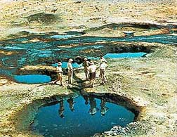
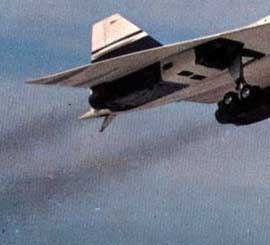

## Les essences
### Les essences, usage en arts plastiques
 **Les essences**

Révision importante en octobre 2009  
Lire en particulier "[Essences minérales, survol](essences.html#nouvelledonne)" 

**Sécurité**

ATTENTION : odoriférante ou non, toutes les essences sont inflammables. La cuisson des essences ou produits à l'essence est extrêmement dangereuse.

Elles sont aussi NOCIVES, même si certains fabricants omettent l'apposition du "Xn-Nocif" sur les flacons, ainsi que d'autres mentions obligatoires.

L'ingestion d'une cuillerée à café de white spirit ou de térébenthine peut être mortelle pour des enfants.  
[Voir Secours, numéros d'urgence.](liens.html#1secoursnumerosdurgence)

Après une période de suspension de la réglementation, ce type d'étiquettes est redevenu OBLIGATOIRE, mais pour combien de temps ? Les fluctuations de la législation doivent inciter les utilisateurs à s'informer.

  
**Essences végétales**

Les essences végétales ne font pas l'objet d'un texte réellement séparé dans cet article. Elles sont évoquées singulièrement dans le "Tableau des essences" ([cliquer ici](essences.html#tabvegetales)). La raison en est qu'elles ne connaissent pas une évolution aussi sensible que les variétés d'origine minérale. Ces dernières méritaient, à part, un traitement approfondi.

On précisera cependant ici que ces essences - du moins celles qui sont utilisées dans les arts plastiques et décoratifs - ont une température d'ébullition curieusement élevée par rapport aux variétés minérales habituelles, ce qui pourrait signaler des masses moléculaires plus importantes. Cela pourrait être lié à la présence en elles de composants [terpéniques](terpene.html) élaborés. Ces essences ont de toute façon une véritable "tendance résineuse".

Il est impossible de référer ici à l'ensemble des essences végétales car il est beaucoup trop disparate et trop immense pour entrer dans le cadre de ce site.

**Essences minérales, survol**

Moyennant quelques précautions élémentaires, les essences "peu ou non [aromatiques](benzeneetbenjoin.html)" ne posent guère de problèmes majeurs. Les personnes présentant des symptômes allergiques en présence d'essences odoriférantes peuvent utiliser des [essences minérales dites raffinées](essences.html#lessencedepetrole), qui sont conseillées de toute façon pour les peintures fines. Lire cependant sur l'appellation "raffinée" la mise à jour [ci-dessous](essences.html#nouvelledonne).

Dans l'ensemble, la pureté d'une essence minérale se mesure principalement par sa teneur en hydrocarbures [aromatiques](aromatique.html) et en [soufre](soufre.html). Cette teneur varie surtout en fonction du degré de [raffinage](raffinage.html). On notera au passage que la teneur en soufre détermine aussi la valeur d'un pétrole brut. Ainsi les raffineries américaines sont-elles adaptées aux pétroles peu sulfureux, ce qui explique certains choix stratégiques internationaux. Le pétrole africain (Tchad, Nigeria, Angola, grand off-shore somalien, Darfour et autres "points chauds" du continent), qui est pur, n'est à ce titre - notamment - pas sans attraits pour les raffineurs des États-unis, mais aussi de Chine. Source : [Bruno ANGSTHELM, CCFD, pour le F.I.G. Saint Dié sur Education.gouv.fr](http://fig-st-die.education.fr/actes/actes_2007/angsthelm/article.htm).

Toute essence minérale est raffinée, presque par définition, puisque l'on part d'un produit oléagineux particulièrement sale, le pétrole (_petra oleum_, huile de pierre), mais en fonction du procédé et du positionnement dans la colonne de [distillation](distillationraffinage.html), on obtient des résultats plus ou moins purs. En fin de chaîne, dans un atelier bien aéré ou un laboratoire, une essence assez impure peut être soumise à évaporation quoique sans garantie de résultats. En général, l'odeur s'échappe en grande partie et peut être "couverte", masquée par l'addition d'une menue quantité [d'essence d'aspic](essences.html#essencedaspic).

Ainsi, certains white spirits soi-disant "désodorisés" (en fait "ré-odorisés") ont été "designés" de cette manière dans un passé relativement récent. Un raffinage de niveau supérieur est cependant indispensable pour évacuer véritablement la plus grande partie des impuretés sans perdre la précieuse part active du produit. Les solutions maison en fin de chaîne sont du bricolage.

_La nouvelle donne_

Tout d'abord, l'appellation "essence de pétrole raffinée" semble avoir peu ou prou disparu.

Alertés par un partenaire détaillant, nous avons contacté un ingénieur travaillant pour une entreprise intermédiaire qui réalise notamment du "design de produits".

Cet ingénieur, appelons-le Mr. X, a tout d'abord rappelé le contexte : les peintures non-aqueuses disparaîtront en 2012 suite à une directive européenne. Cela explique au passage la campagne anti-glycéro actuelle (lire [passage](courrierdeslecteurs2009b040.html#20090623ab) du Courrier des Lecteurs). Il n'est pas sûr que l'utilisateur final s'y retrouve en termes de santé car on pourrait aussi bien évoquer la polémique sur la toxicité des peintures aqueuses appelées à les remplacer (cf. [autre texte](courrierdeslecteurs2009c030.html#20090903te) du Courrier), mais c'est une autre histoire. Il s'agit simplement ici de pointer une mutation à venir.

Celle-ci a d'ores et déjà un impact important sur plusieurs métiers industriels et artisanaux (même si sur le versant industriel, les liants interdits seront tout simplement exportés hors UE). Les évolutions technologiques s'ajoutent à ce contexte pour produire une certaine confusion terminologique.

Un détaillant - comme un intermédiaire ou n'importe qui - peut trouver les descriptifs détaillés d'un éventail de produits sur les sites internet des producteurs tels que Total, Shell, etc., sous l'intitulé général "white spirit". Au-delà, l'intermédiaire peut choisir un autre intitulé. In fine, le détaillant est bien en peine de répondre à la demande du client final, le peintre, venu acheter sa chère "essence de pétrole raffinée" disparue : de quel produit s'agit-il aujourd'hui ?

Champ pétrolifère à ciel ouvert  
Kirkuk, Kurdistan irakien, 1953

_Points de repère_

A défaut d'appellations claires, essayons de donner quelques points de repère chiffrés. On remarque au passage, en écho au début de cet article, qu'il n'est même plus question de soufre à ces niveaux de raffinage (sinon dans quelques documents extrêmement techniques). Tout se joue donc dans la teneur en hydrocarbures [aromatiques](aromatique.html).

> \* Mr. X cité ci-dessus pense qu'à 0,05% d'aromatiques, une Kerdane (appellation producteur) est déjà exploitable en peinture. Ce point discutable est évoqué [plus loin](essences.html#kerdane).
> 
> \* Il signale également à titre d'exemple une sorte de "super white spirit" à 0,03%, la Spirdane D40.

Il s'agit en fait ici d'essences plutôt utilisées en peinture décorative très "haut de gamme". Concernant les essences minérales à destination artistique, lisons [François Perego](livres.html#perego). Tout d'abord, il distingue trois catégories d'essences :

> \* Les légères. Coupes étroites dites de "C5" à "C7" dans la colonne. Nous reviendrons sur ces appellations.
> 
> \* Les white spirits. C9 à C12, jusqu'à 20% d'aromatiques mais parfois beaucoup moins.
> 
> \* Les kérosènes. C10 à C14.

A ce stade il n'est pas inutile de lire  
[l'encadré](distillationraffinage.html#fonctionnement) de l'article _Distillation, raffinage_

Sans entrer dans le détail, les coupes Cn correspondent à la longueur des chaînes moléculaires mesurée en nombre d'atomes de carbone. Ainsi, par exemple l'heptane (C7H16) est dans la coupe C7 et l'octane (C8H18) dans la coupe C8. Plus le n augmente, plus on s'approche du bitume.

Pour autant, ces "coupes" n'ont aucun rapport direct avec par exemple la teneur en alcanes plutôt qu'en alcènes (source INRS) ou même en benzéniques. Il ne s'agit pas ici de type d'essences mais littéralement de poids moléculaires.

F. Perego précise également que :

> \* Les essence légères seraient les fameuses essences C et F. Mais rappelons 1) que l'on se sert de ces variétés en gravure ou comme dissolvants, pas en peinture, 2) que comme on l'a dit, les coupes ne correspondent pas à des types d'essences précis, les C7 à C9 par exemple pouvant être des alcanes, des alcènes, cycliques ou non, aussi bien que des aromatiques, ce qui pose un problème de qualité qui doit être souligné.
> 
> \* Une essence bien raffinée, véritablement apte à la peinture artistique, doit contenir selon lui entre 0,01 et 0,001% d'aromatiques. Ainsi, la Spirdane D40 ne conviendrait pas encore tout à fait.

Ajoutons que les intitulés "essence A" à H correspondent à des tranches (irrégulières) de températures de distillation (de 30 à 210°C). A ce sujet, lire [ce document](http://www.inrs.fr/inrs-pub/inrs01.nsf/IntranetObject-accesParReference/FT%2096/$File/ft96.pdf) de l'INRS.

Un fabricant bien connu de produits Beaux-arts interrogé par le détaillant qui a initié cette enquête précise que _les produits sont moins toxiques que par le passé mais les précautions d'emploi sont toujours d'actualité. La plupart des fabricants proposent de plus des essences "sans odeur" présentant des taux d'agents aromatiques plus faibles._

Étant donné les changements terminologiques et les transformations réglementaires à venir, Dotapea ne saurait trop conseiller l'ensemble des intervenants d'annoncer clairement le taux d'aromatiques des essences afin de maintenir une relation de confiance avec les consommateurs dans l'intérêt de tous car c'est ce taux qui détermine les facteurs de loin les plus importants, tant en peinture artistique que décorative :

> \* la qualité des couleurs obtenues in fine sur le tableau car une essence minérale trop aromatique les voile,
> 
> \* l'innocuité des produits. Les aromatiques sont toxiques ([lien](benzene.html)).

_Que trouve-t-on dans les essences minérales ?_

On peut distinguer quelques types de corps presque omniprésents dans les essences :

> \* les [alcènes](alcene.html) (insaturés) et les [alcanes](alcane.html) (saturés), sous forme de chaînes ouvertes ou cycliques (voir absolument [les chaînes](chaine.html))
> 
> \* les [aromatiques](aromatique.html), cycliques, de base [benzénique](benzene.html).

Quelques exemples :

> \* L'essence F
> 
> > \* [alcanes](alcane.html) en C7, C8 et C9 : 65 à 85 %.\* [alicycliques](alicyclique.html) (on parle probablement ici de cycloalcanes) en C7, C8 et C9 : 20 à 25 %.  
> > \* [aromatiques](aromatique.html) (toluène, xylène, éthylbenzène.) : < 14 %, selon cette source, en fait plutôt beaucoup moins car cette essence comme les autres essences dites spéciales comptent parmi les plus désaromatisées sur les catalogues industriels (même par rapport aux white spirits les plus purs).
> 
> \* Une essence automobile ordinaire
> 
> > \* 20 à 30 % [d'alcanes](alcane.html) [acycliques](acyclique.html)  
> > \* 5 % de [cycloalcanes](alcane.html#cycloalcane)  
> > \* 30 à 45 % [d'alcènes](alcene.html)  
> > \* 30 à 45 % [d'aromatiques](aromatique.html). D'autres sources donnent 25-30%  
> > \* des pourcentages variés d'agents divers.
> 
> \* Un white spirit de supermarché
> 
> > \* aliphatiques linéaires : 30 à 50%  
> > \* alicycliques : 30 à 40%  
> > \* aromatiques : 10 à 20%.
> 
> \* Un carburant pour avions à réaction contiendrait bon an mal an
> 
> > \* 87,5% d'alcanes  
> > \* 12% d'aromatiques dont 0,3% de benzène et 1% de toluène  
> > \* 0,5% d'alcènes.

Ces données viennent de plusieurs sources et sont livrées sans garanties. Elles sont de plus fluctuantes.

_Tableau des essences  
ayant un pouvoir diluant pour les peintures grasses_

AVERTISSEMENT : certaines appellations ont été conservées car elles sont toujours utilisées mais concernant les essences minérales, il est conseillé de lire en premier lieu le passage ci-dessus, _[La nouvelle donne](essences.html#nouvelledonne)_ et ce qui suit.

Note : on n'évoquera pas ici le kérosène, hors-sujet, mais il semble que le [naphta](naphtalene.html#naphta), produit intermédiaire, soit utilisé dans certaines formulations.

 

**Accès direct**

[Essences végétales](essences.html#tabvegetales)

[Essences minérales](essences.html#tabminerales)

**Produit**

**Caractéristiques principales**

**Odeur, dangerosité, toxicité**

 **_ESSENCES VÉGÉTALES_**

_Essence de térébenthine_

Bon [tirant](liants.html#laviscositeladherence) dû à ses résines végétales. N'appauvrit qu'assez peu la pâte pour la même raison. S'apparente déjà à un médium léger : certains la classent même parmi les vernis à peindre. Séances plutôt courtes à cause du poissant qui a tendance à figer la pâte plus rapidement qu'une essence minérale.

L'essence de térébenthine est déconseillée pour le nettoyage des pinceaux et outils car, contenant des résines végétales, elle les rend poisseux.

On distingue

> **\*** la térébenthine proprement dite qui n'est pas une essence (lire [l'article du glossaire](terebenthine.html)),
> 
> **\*** l'essence de térébenthine, produit de la distillation de la térébenthine (informations complémentaires dans un [article](courrierdeslecteurs2009c010.html#20090820hf) du courrier des lecteurs),
> 
> **\*** l'essence de térébenthine rectifiée (c'est à dire ayant subi une distillation supplémentaire accroissant sa fluidité). C'est elle que l'on utilise le plus en peinture à l'huile,
> 
> **\*** l'essence de térébenthine tri-distillée. Moins odoriférante, moins allergène, elle est aussi, forcément, moins riche en résines. Un procédé de fabrication a été établi par le Docteur de Mayenne dont certains fabricants actuels s'inspirent directement. Il est permis de s'interroger sur la valeur concrète d'un tel produit car l'intérêt de la térébenthine réside précisément dans ses impuretés et sa masse moléculaire.

Toute essence de térébenthine trouble, recelant des pulvérulences visibles à l'oeil nu, peut être considérée comme suspecte. Toutes sortes de fraudes ont été pratiquées et les conditions de stockage peuvent aussi accentuer les dégradations.

Il faut en effet préciser que cette essence s'oxyde avec le temps. Fraîche, elle doit être assez peu odorante (information [F. Perego](livres.html#perego)).

La température d'ébullition de l'essence de térébenthine est d'environ 150-175°C, un peu moins que l'essence d'aspic (ci-dessous). Sa masse moléculaire globale n'est semble-t-il pas négligeable.

Comme son nom l'indique, elle contient des [terpènes](terpene.html).

**Recyclage "maison" de la térébenthine usagée**

Il est très aisé à réaliser : il suffit de consacrer un contenant à la décantation ! Celle-ci s'opère toute seule et donne d'excellents résultats avec la peinture à l'huile. Lorsque la quantité de résidus est devenue trop importante (il faut des mois !), laissez sécher comme s'il s'agissait d'un tableau. Si vous n'utilisez pas de siccatifs ou d'autres produits contenant des métaux lourds, vous pouvez jeter le pot bien sec dans une poubelle.

Si vous réalisez certaines expérimentations ou lors de nettoyages, attention : l'essence de térébenthine est chimiquement incompatible avec plusieurs produits à base de chlore (éviter l'eau de Javel).

Lire un ajout important au courrier des lecteurs consacré à la nocivité de cette essence.  
[Cliquer ici.](courrierdeslecteurs2010b310.html#20100819st)

Odeur forte, agréable pour certains, insupportable ou allergénique pour d'autres (réaction cutanée), particulièrement avec les variétés de basse qualité.

**NOCIF**

L'ingestion, même en petite quantité, est extrêmement dangereuse et peut entraîner la mort d'un adulte, notamment par crise cardiaque. L'inhalation et le contact sont généralement beaucoup plus bénins mais doivent être évités autant que possible.

Stocker hors de portée des enfants et des animaux.

**GRAND POLLUANT DES COURS D'EAU**

Les résidus doivent être confiés aux [institutions chargées du traitement des déchets](liens.html#dechetteries).

Voir aussi [Recyclage](essences.html#recyclagetere), ci-contre.

_L'essence d'aspic (lavande)_

A ne pas confondre avec l'essence de lavande (ou de lavandin) qui ne correspond pas à la même variété de lavande, aux mêmes préparations ni aux mêmes compositions. Il y a très peu de camphre par exemple dans l'essence de lavande ou de lavandin par rapport à l'aspic.

Celle-ci est extraite des sommités florales de _Lavandula latifolia_ Vill.

Le mot aspic proviendrait du latin _spicus_, épi. On nomme d'ailleurs aussi la plante _lavande à épis_. L'étymologie de la vipère du même nom n'aurait guère de rapport selon l'Académie française. En anglais elle se nomme _spike lavender_.

Moins volatile et moins [tirante](liants.html#laviscositeladherence) que la térébenthine, elle est assez mordante (bon pouvoir solvant). Diluée dans l'essence de pétrole pour modérer cette tendance, elle se prêterait aux fins de séances (pour prolonger) mais aussi, notoirement, à l'imbibition des surfaces en vue de retouches.

On mentionne son utilisation ancienne (très marginale) comme vernis léger.

L'essence d'aspic contient du [camphre](camphre.html) et une dizaine d'autres molécules. Comme la térébenthine, elle contient une part déterminante de [terpénes](terpene.html).

C'est semble-t-il une essence plutôt lourde (moléculairement parlant), qui bout autour de 190°C ± 15°C.

Odeur agréable mais forte !

Les notices de sécurité sont généralement très peu documentées.

**NOCIF**

_L'essence de romarin_

Apparemment abandonnée, elle est mentionnée par [Xavier de Langlais](livres.html#langlais) qui lui-même reconnaît ne pas l'avoir essayée. [Toute information sur ce produit sera bienvenue.](ecrire.html)

 

 **_ESSENCES MINÉRALES_**

_L'essence de pétrole raffinée,_ _l'huile essentielle de pétrole_

Mise à jour 2009 : lire absolument en premier le passage "[Nouvelle donne](essences.html#nouvelledonne)".

N'ajoute aucun tirant, aucun poissant. Pour cette raison, elle permet de travailler très longtemps dans le frais. S'évapore complètement - en théorie, si elle est de bonne qualité. Elle a tendance à appauvrir la pâte comme tout pur diluant. La matière, une fois sèche, semble plutôt maigre et plutôt mate, ce qui n'est aucunement un défaut mais bien une particularité qui peut être exploitée à bon escient.

L'appellation "huile essentielle de pétrole" est une sorte d'archaïsme linguistique. Il s'agit bien d'une essence dont on nous dit non explicitement qu'elle n'est pas raffinée. L'étiquette porte le X nocif. L'usage en peinture de l'_essence de pétrole raffinée_ est par contre éprouvé depuis longtemps.

L'appellation "essence de pétrole" que nous voyons apparaître parmi les produits du commerce actuellement laisse toujours planer un doute : quel est au juste son niveau de raffinage?

Plus clairement : certains distributeurs spécialisés dans les arts plastiques proposent aux peintres des promotions sur des "essences de pétrole" qui, manifestement, à en juger par leur odeur infecte, ne sont pas désaromatisées et sont donc à peu près inutilisables comme diluant, voire toxiques. Ce genre de pratiques se situent juste en deçà des limites de l'escroquerie. Elles doivent inciter les artistes à signaler en premier lieu les faits au détaillant (qui n'est pas forcément informé) et à changer éventuellement et selon le cas de fabricant ou de détaillant.

Lors du choix d'une essence de pétrole destinée à la peinture, il est très important de vérifier la présence de l'épithète "raffinée" sur l'étiquette. L'essence désaromatisée n'a pas non plus la qualité suffisante pour un emploi en peinture, sauf pour des travaux mineurs (voir [ci-dessous](essences.html#kerdane)).

Pratiquement aucune odeur sauf certains produits à l'appellation trompeuse (voir texte en couleur ci-contre). Celles-ci pourraient comporter des substances dangereuses.

**NOCIF**

Éviter surtout l'ingestion.

Le contact avec la peau peu parfois dessécher celle-ci mais dans une moindre mesure que le white spirit.

_Kerdane_ _® et autres essences désaromatisées_

Mise à jour 2009 : lire absolument en premier le passage "[Nouvelle donne](essences.html#nouvelledonne)" et en particulier les [Points de repère](essences.html#pointsderepere).

Il s'agit de parents pauvre de l'essence de pétrole raffinée. Elles ont tendance à voiler légèrement les couleurs. Étant impures, elle peuvent entrer en réaction avec les pigments et médiums, quoique beaucoup moins radicalement que le white spirit. Certains peintres, parfois de très bons professionnels ne disposant que de budgets limités, s'en servent cependant beaucoup.

Elles sont vraiment très pratiques, peu coûteuses et particulièrement efficaces pour le nettoyage du matériel (pinceaux, etc.) ainsi que comme diluants pour la peinture décorative. A part leur inflammabilité et leur nocivité en cas d'ingestion - caractères inhérents aux essences -, elles ne semblent pas présenter un caractère spécifiquement très dangereux.

Il s'agit de produits de grande utilité.

Note : le terme "pétrole lampant" correspond sensiblement à ces essences.

Pratiquement aucune odeur.

**NOCIF**

_White spirit_

Précision 2009 : On appelle aujourd'hui white spirit des produits ne correspondant plus à l'usage ancien de ce terme. Lire ci-dessus [La nouvelle donne](essences.html#nouvelledonne).

La description correspond essentiellement au white spirit ménager.

Bon dissolvant, bon produit de nettoyage, il est trop impur et par conséquent mauvais comme diluant : trop chargé d'éléments [aromatiques](aromatique.html) fortement [dissolvants](diluantssolvants.html), il peut aussi contenir du [soufre](soufre.html) et risque d'entrer en réaction avec les composants de la pâte. Certains peintres l'utilisent néanmoins comme diluant notamment pour créer des effets un peu... sales !

Contenant des hydrocarbures benzéniques, le white spirit est moins anodin que les essences raffinées et désaromatisées quant à ses effets sur l'être vivant.

Odeur désagréable, soûlante voire vraiment incommodante. Son ingestion en petite quantité par un enfant peut entraîner la mort.

Éviter les contacts avec la peau.

**POLLUANT**

**NOCIF**

_Essence "C"_

Un produit dont la distribution se révèle à éclipses, _probablement pas anodin_. On en trouve, on n'en trouve plus pendant un temps, puis on en trouve à nouveau. Actuellement, elle semble disponible.

Informations complémentaires ci-dessus (_[Points de repère](essences.html#pointsderepere)_).

Nous manquons d'informations.

**NOCIF ou TOXIQUE**

_Essence "F"_

Elle est annoncée par les fabricants comme un "dissolvant des peintures synthétiques". On mentionne des usages marginaux dans différents domaines des arts plastiques.

Informations complémentaires ci-dessus (_[Points de repère](essences.html#pointsderepere)_).

Nous manquons d'informations.

**NOCIF ou TOXIQUE**

_Essences aromatiques et autres produits benzéniques_

Benzène, toluène et xylène sont des hydrocarbures [benzéniques](benzeneetbenjoin.html) qui ne trouvent guère d'emploi _comme produits purs_ pour les arts plastiques, sinon celui de dissolvant "brutal".

Ce sont en effet des dissolvants remarquables, mais par eux-mêmes, ils présentent une toxicité réellement très inquiétante. Ils peuvent provoquer la mort et sont transmissible au fotus et au bébé (lait maternel).

Ils sont pourtant présents, mais pas à l'état pur, dans une quantité non négligeable de produits utilisés couramment par les artistes.

Lire absolument l'article [Benzène, toluène et xylène, etc.](benzene.html)

L'essence de mirbane (un nom poétique trompeur), dite aussi, nettement plus à propos, "nitrobenzène" (C6H5NO2), est un toxique aromatique huileux utilisé comme précurseur de colorants (voir [anniline](anilines.html)) mais aussi comme agent conservateur ([lire passage _in_ La caséine](caseine.html#xavieretlamirbane)) et en parfumerie.

L'aniline est traitée séparément. [Cliquer ici](anilines.html)

Le styrène est traité dans une autre page ([cliquer ici](styrene.html)).

 Odeur infecte.

**POLLUANTS**

**TOXIQUES**

**RISQUES TRÈS IMPORTANTS EN CAS D'INCENDIE**

En complément, lire les pages consacrées aux liants gras : [huile](huiles.html) et [cires](cires.html).

 [Communication](http://www.artrealite.com/annonceurs.htm) 

