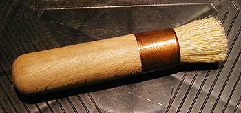

## Les formes de pinceaux
### Les fores de pinceaux, usage en arts plastiques
 **Pinceaux : formes et tailles**  La forme dont nous parlons ici est avant tout définie par celle de **la tranche de la [virole](virole.html)  : plate ou ronde**. Au-delà, il existe d'autres catégories qui se définissent par la forme de la [sortie](sortie.html) :

\* les ronds pointus. Leur virole est ronde mais leur sortie peut être moyennement longue ou bien courte pour exécuter des tracés détaillés.

\* les mouilleurs. Ce sont des ronds pointus d'un type un peu particulier. De forme rebondie, ils ont une [réserve](reserve.html) inégalable. Le poil est du [petit-gris](pincpoils.html#lepetitgris) éventuellement mélangé à du [poney](pincpoils.html#leponey), beaucoup moins cher.  
 - Il existe des mouilleurs ovales dont la destination n'est pas de faire la pointe mais juste de stocker un maximum de liquide.

\* les ronds arrondis. Une dénomination qui peut surprendre. Cependant, elle désigne bien une catégorie précise de pinceaux  : la virole est ronde, la sortie n'est pas pointue mais arrondie. Cette forme est assez utilisée en peinture décorative, mais pas exclusivement. Elle incite au [frottis](frotte.html).

\* les plats carrés ou "plats courts". Les sorties sont effectivement de forme plus ou moins carrée. A cause de leur étroitesse, ils incitent naturellement à brosser au lieu de poser (voir [article](brossepose.html)), surtout chez les débutants.

\* les plats carrés longs ou "plats longs". Leur sortie est nettement rectangulaire (il s'agit approximativement d'un double carré). Leur réserve est supérieure à celle des plats courts. Ils ressemblent aux [queues de morues](spalter.html) mais sont souvent moins larges et proportionnellement moins longs.

\* les brosses à rechampir. Rondes (voir photo ci-contre à gauche) et allongées, elles "accrochent" aux parois à [rechampir](rechampir.html). Solides, elles sont en [soie de porc](pincpoils.html#lasoiedeporc).

\* les [spalters et queues de morues](spalter.html) (voir photo ci-contre à droite).

\* les "usés bombés" ou "langues de chat". Ils sont assemblés de sorte à ressembler à un plat carré ou long qui aurait été usé sur les bords. Incitant à poser plus qu'à brosser, ils ont une valeur pédagogique certaine comparativement aux sorties carrées.

\* les éventails. Ils sont assemblés sur une virole plate d'aspect plus ou moins triangulaire. Le poil est tantôt de la mangouste, tantôt du blaireau, tantôt du synthétique. Cette forme autorise certains types d'applications particulières, notamment pour réaliser des marbrures ou pour des techniques particulières à base de poudre de pastels secs.

\* les plats biseautés. Ils sont surtout employés en peinture décorative.

\* les sorties multiples (voir photo ci-contre à gauche). Elles sont destinées au [chiquetis](chiquetis.html) et aux peintures décoratives (faux bois, faux marbre, etc.). Le poil est le plus souvent du [poney](pincpoils.html#leponey), parfois de la [soie de porc](pincpoils.html#lasoiedeporc).

\* les brosses à filet, dites aussi "traceurs". Rondes, leurs sorties sont très longues. Elles sont employées surtout en peinture décorative, notamment pour les faux marbres (tracé des veines du marbre), mais pas exclusivement.

\* les brosses à adoucir. Elles sont utilisées notamment en peinture décorative. Leur rôle est d'étaler la peinture et surtout d'effacer les traces des coups de brosse dans un glacis à l'huile frais. Le poil est très fin, la forme est celle d'un [plat court](pincformes.html#lesplatscarresouplatscourts) fort large. 

\* les brosses à veiner, dite aussi _veinettes_ ou brosses à lisser (voir ci-contre). Sortes de queues de morue à la sortie hypertrophiée et au poil très épais, elles permettent d'imprimer, par retrait dans une matière épaisse, des veinures droites ou galbées lors de la réalisation de faux bois. Voir [Le veiné](veinelisse.html) et [Le peigne](peigne.html).

\* les pinceaux pour la calligraphie chinoise. Il en existe de différentes sortes. Les plus courants sont en poil de chèvre. Le prix de ceux-ci ne devrait pas être élevé car ils ont une tendance particulièrement prononcée à perdre leurs poils. En conséquence, les prix proposés sous certaines enseignes en France sont nettement disproportionnés. Ils n'ont pas de virole métallique (bois) et sont très fragiles, cassant à la moindre chute. Ils ont un peu la forme des mouilleurs : pointus avec une grande réserve.

\* les pinceaux en mousse synthétique. Substituts des [queues de morue](spalter.html), leur mousse doit être assez fine pour justifier leur préférence par rapport à la soie de porc. Ils sont employés en peinture décorative et parfois aussi pour les "loisirs créatifs". Ils ne sont pas très faciles à nettoyer, comme toutes les mousses.

\* les pinceaux pour putoiser. En blaireau, en putois, en petit-gris, de formes finalement assez variées, ces outils sont consacrés à des domaines particuliers : porcelaine, céramique, vitrail. Lire l'article [putoiser](techmelangecouleurs.html#putoiser).

\* les brosses à pochoirs. Utilisées aussi par les [pastellistes](pastelssecs.html), elles sont en soie de porc. Leur forme est tronquée (voir photo ci-contre à droite). Elle autorise un [moucheté](mouchete.html) sur des surfaces réduites. [Lire l'article sur le pochoir](pochoir.html).

**_Les tailles_**

Elles sont référencées

> \* par des numéros. D'un fabricant, d'un poil, d'une forme à l'autre, les numérotations diffèrent vraiment radicalement. Ce qui permet d'identifier absolument un pinceau, c'est le nom du fabricant et un code de 3 ou 4 chiffres (ou une appellation très précise, comme "Kevrin plat court") identifiant à la fois le poil et la forme, suivi d'un numéro précisant la taille.
> 
> \* ou par des dimensions réelles exprimées en millimètres. C'est le cas des [spalters et des queues de morue](spalter.html).

**_Pinceau ou brosse ?_**

La distinction entre ces deux termes n'est pas très clairement établie. Très souvent, les peintres parlent de brosses lorsqu'ils utilisent des pinceaux à manche long ou à poil dur (soie) ou à sortie carrée ou courte. Le terme de pinceau désigne plus spécifiquement les brosses à manche court ou à poil mou (petit-gris). La définition la plus pertinente de la brosse est peut-être liée à la dureté du poil, permettant vraiment l'action de brosser.

**_Longueur du manche_**

La distinction manche court / manche long est beaucoup plus déterminante : le manche long autorise la peinture de chevalet et interdit quasiment la peinture sur support horizontal (gare aux yeux !). Il faut garder à l'esprit le fait qu'il est très facile de transformer un manche long en manche court mais que le contraire est impossible.

 [Communication](http://www.artrealite.com/annonceurs.htm) 

