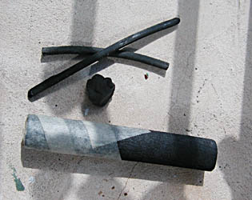
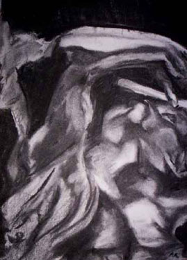

## Les fusains
### Les fusains, usage en arts plastiques
 **Les fusains**  

Lire d'abord de préférence [l'article du glossaire](fusain2.html).  
Anecdote : lire _[L'histoire de l'inconnu aux fusains](pigmnaturelsetsynth.html#inconnuauxfusains)_.  
A lire également : _[Fusains, fabrication artisanale](courrierdeslecteurs2009c040.html#20090920gc)_ in _Courrier des Lecteurs_.

Il existe deux catégories de fusains à ce jour :

1. le fusain directement produit par la calcination de branches de saules, dit "fusain végétal". Il est adapté à un travail particulier. Contrairement au crayon et autres techniques, _il autorise le dessinateur à travailler par retraits sur une base volontairement noircie presque intégralement_ plus que par ajouts légers sur une surface laissée en bonne partie intacte. Plus il est tendre, plus il rend aisé le retrait si le papier "accroche" bien.

Le dessinateur couvre largement la surface picturale de noir à l'aide de son fusain puis fait apparaître des nuances de gris en effleurant le papier avec sa main, un chiffon, un Sopalin ou un Kleenex, [un tortillon, une estompe](estompetortillon.html) ou une [gomme mie de pain](gommemiedepain.html). L'aisance avec laquelle il est possible d'apporter de massives corrections de valeurs est inimitable.

Les possibilités de cet outil très simple sont uniques. Les ancêtres du fusain, de simples torches brûlées, ont été utilisées dès le paléolithique et rares sont encore les artistes, aujourd'hui, qui dédaignent ce très puissant moyen d'expression, certes amélioré (essences végétales plus propices, formes éventuellement [équarries](equarrir.html), etc.). Certains disent que si la peinture à l'huile est dans les arts plastiques ce que l'orchestre symphonique représente pour la musique, le fusain est l'équivalent du piano.

Son usage le plus mineur - quoique courant - est l'emploi pour les esquisses préparatoires à la réalisation de tableaux (lire [l'article sur le dessin préparatoire](dessinpreparatoire.html)).

Il existe également des emplois en techniques mixtes, notamment avec l'aquarelle et les lavis.

Ci contre, une composition autour de _'La joueuse de flûte'_ de Camille Claudel, un travail de la jeune [Aude Rivard](quinoussommes.html#aude) qui met à profit une manière [académique](academies.html) pour réaliser une véritable composition contemporaine sans concession à la joliesse. Le fusain est à la fois énergique et tempéré (ce qu'il sait si bien être), il respecte et accompagne la complexité du bronze de Claudel.

2. le fusain reconstitué, dit aussi "fusain compressé" ou synthétique, généralement fabriqué avec de la poudre de fusain "végétal". Il se présente sous forme de cylindres semblables à des pastels ou sous forme de crayons. Il est **plus noir** que le fusain "végétal" mais on ne peut pas l'estomper et le retravailler aussi aisément. Il sert donc en premier lieu à noircir les zones laissées trop grises par le fusain végétal. C'est, à ce titre, un précieux outil de finition. En tant qu'outil employé pur, il permet un travail d'estompe certes inférieur au fusain "végétal" mais bien supérieur au crayon graphite.

\>  Donc, simple en apparence, le dessin au fusain peut en fait mettre en oeuvre les outils suivants :

> \* le fusain "végétal"
> 
> \* la [main](maindoigtscorps.html), les tortillons et estompes, le chiffon
> 
> \* la [gomme mie de pain](gommemiedepain.html)
> 
> \* le [fixatif](fixatifs.html) - sur la fixation spécifique du fusain à l'aide de résines naturelles, lire ici un [témoignage](resinedammar.html#fixatif).
> 
> \* le fusain compressé
> 
> \* un papier éventuellement teinté (les grains Ingres sont particulièrement conseillés, fabriqués à l'origine pour le fusain, mais certains [BFK Rives](papiersadessin.html#bfk) teintés peuvent aussi donner d'excellents résultats ainsi que les [vélins](papiersadessin.html#velins) et [papiers pour l'aquarelle](papierspourlaquarelle.html#gelatineacoeur) 'gélatine à coeur' et autres)
> 
> \* un pastel blanc ou à défaut un crayon blanc "accrochant" bien.

Les manières de travailler sont diverses.

Assez souvent, le fusain "végétal" permettra la mise en place des éléments, voire la mise au point définitive, mais pour ce travail, certains artistes préfèrent le fusain "synthétique", parfois appliqué après estompage au chiffon des points de repère posés avec l'élément végétal. Mais dans la plupart des cas, le fusain synthétique ne servira qu'à renforcer les noirs après une première fixation des éléments déjà très travaillés avec le fusain végétal.

Par ailleurs, il est assez rare qu'un dessinateur recherche un fusain dur. Cette catégorie de fusains a en effet tendance à marquer le papier de manière indélébile et surtout rend difficile la couverture de vastes zones picturales. Cependant, il faut bien reconnaître que certains travaux réalisés avec des fusains peu tendres ne sont pas dépourvus d'intérêt esthétique, surtout dans une approche gestuelle où la maltraitance du papier peut parfois prendre du sens.

 [Communication](http://www.artrealite.com/annonceurs.htm) 

