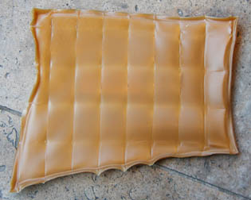

## Les gélatines
### Les gélatines, usage en arts plastiques et autres
 **Les gélatines**  

Lire absolument [l'article du glossaire](gelatine2.html)

_Il en existe de qualité alimentaire et de qualité "artistique", si l'on peut dire. Le terme de gélatine est en fait relativement flou. Pour certains, il désigne aussi bien la [colle de peau](colledepeau.html) que les [colles de poisson](colledepoisson.html) et d'autres produits (dont [la colle d'os](colledos.html) mais aussi la_ gelée de cerf _asiatique, extraite des bois du cerf, et d'autres variétés très nombreuses), tous provenant des la peau, des sabots, des cornes ou des os animaux._

_Les différences entre ces substances sont très importantes. Nous bouderons donc toute recette où le terme de gélatine est employé sans autre précision ! Il en existe dans le domaine de la peinture comme dans celui de la sculpture, car des gélatines peuvent être employées pour prendre une [empreinte](moulage.html) et servir de moule, voire même pour polir un métal, conjointement à un tissu ([cf. "patate" in Les abrasifs et les outils de polissage](abrasifs.html#patate))._

_Les gélatines sont des substances [protéiques](proteine.html), mais contrairement aux [caséines](caseine.html), plus solides, aux chaînes moléculaires plus longues, elles ne contiennent que des_ segments _protéiques. Elles sont très majoritairement d'origine animale, mais il existe au moins deux gélatines végétales, surtout utilisées en moulage : [l'alginate](alginate.html) et [l'agar-agar](agaragar.html). Elles ne sont pas traitées dans cette section._

[L'acétone](acetone.html), le [formol](formol.html), l'acétate d'alumine et [l'alun](alun.html) (qui a largement fait ses preuves en teinture notamment) pourraient servir d'imperméabilisants/insolubilisants pour les gélatines. Cependant, l'action de ces substances pourrait être fragilisante. D'autre part, les gélatines présentent des compositions variées pouvant offrir des réactions diverses à ces produits. Le formol (inclus dans la gélatine ou badigeonné à sec) et l'acétone (à projeter sur la surface peinte) sont cependant conseillés par certains auteurs, malgré la réserve toujours émise au sujet de l'accroissement de la friabilité et... la dangerosité des telles opérations.  
L'alun doit être incorporé au liant.

[L'alcool éthylique](alcools.html) permet au contraire une remise en solution des gélatines, de même que l'eau très chaude pour la plupart d'entre elles.

Cette [réversibilité](liants.html#reversibilite) à l'eau constitue bien souvent un handicap important, tant en peinture décorative qu'artistique. Dans les deux cas, les temps très humides, notamment sous les latitudes européennes, peuvent réellement provoquer des catastrophes picturales. Nous sommes quelques uns à l'avoir constaté, mais il faut quand même préciser que ce n'est pas systématique. Il faut cependant veiller aux conditions de conservation des travaux, au moins autant que pour les peintures à la [cire](cires.html).

La gélatine d'emploi "artistique" est en fait aujourd'hui réservée à des domaines précis et limités : restauration, enluminure, enduction, collage et type de peintures très particuliers ([voir _La colle de peau comme liant_](colledepeau.html#lacolledepeaucommeliant)).

Sa pureté est très déterminante. Certains auteurs affirment qu'une gélatine sombre est toujours impure (information non confirmée). Il faut reconnaître que les gélatines alimentaires sont bien plus sombres que les autres.

Les gélatines se travaillent le plus souvent à chaud, exactement comme la [colle de peau de lapin](colledepeau.html), étant basées sur un même constituant commun : le [collagène](collagene.html).

Certains auteurs reprochent aux gélatines leur manque d'élasticité, ce qui a incité fabricants et peintres à leur adjoindre de la [glycérine](glycerine.html), agent assouplissant généralement compatible avec les substances aux collagènes. Malheureusement, cette adjonction a souvent été réalisée en proportions trop importantes, ce qui provoque une altération de la viscosité de ces produits.

Note : une gélatine qui a été humectée avant application pourrit très rapidement, perd son tirant et devient inutilisable.

 [Communication](http://www.artrealite.com/annonceurs.htm) 

