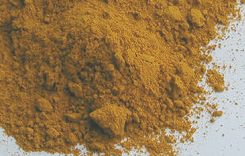
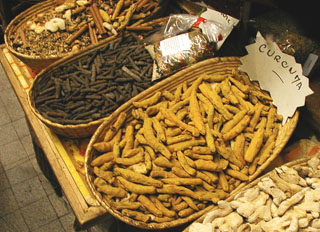
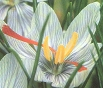
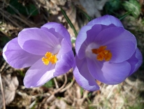
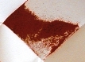

## Les jaunes
### Les jaunes, pigments utilisés en arts plastiques
 **Les jaunes**

\[Lectures conseillées :  
[Le jaune dans la langue française, Pourpre.com](http://www.pourpre.com/langue/expressions.php#jaune)  
[La couleur jaune, Pourpre.com](http://pourpre.com/chroma/dico.php?typ=fiche&&ent=jaune)\]

_Couleur symbolisant dans les temps anciens le bonheur et la prospérité, le jaune, lors de l'avènement du christianisme, est subitement et durablement devenu en Occident (puis dans le monde musulman mais dans une moindre mesure) le stigmate de l'infamie, de la traîtrise et de la félonie, voire encore de l'anormalité. Cela pour des raisons très probablement religieuses au départ - les prêtres de l'ancienne religion romaine auraient porté un vêtement sacerdotal de cette couleur. Rome était d'ailleurs l'empire des couleurs détestées : le bleu aussi, notamment, était honni, mais pour d'autres raisons (voir [texte](bleusfroids.html#peurromaine))._

_Dans l'Asie d'aujourd'hui (en Inde, par exemple - voir [curcuma](jaunes.html#curcuma)), comme dans l'Europe antique pré-chrétienne, le jaune est encore synonyme de bonheur. La Renaissance occidentale a provoqué le démarrage d'un lent processus de réhabilitation de cette couleur, à peine achevé à ce jour._

Lecture conseillée : [Le jaune sur Pourpre.com](http://pourpre.com/chroma/dico.php?typ=fiche&&ent=jaune)

**Assombrir un jaune : pas si facile !**

C'est même une opération étonnamment difficile. Le noir verdit le jaune. Alors que faire ?

**Sommaire**

[Jaunes traités dans d'autres articles](jaunes.html#jaunestraitesdansdautresarticles)

\- [Terres jaunes](terresjaunes.html)

\- [Jaune de Naples et jaunes d'antimoine (jaune Mérimée, jaune de Turner)](jaunedenaples.html)

\- [Jaunes de cadmium](cadmiumsjaunes.html)

\- [La laque de gaude](laquesanciennes.html#laquedegaude)

[Assombrir un jaune](jaunes.html#assombrirunjaune) : pas si facile

[Jaunes divers](jaunes.html#jaunesdivers)

\- [Jaunes azoïques](jaunes.html#lesjaunesazoiques)

\- [Jaunes de chrome](jaunes.html#lesjaunesdechrome)

\- [Auréoline, jaune auréolin](jaunes.html#laureoline)

\- [Jaunes citron](jaunes.html#lesjaunescitron)

\- [Jaune de Hansa](jaunes.html#lesjaunesdehansa)

\- [Jaunes japonais](jaunes.html#lesjaunesjaponais)

\- [Jaunes persans](jaunes.html#lesjaunespersans)

\- [Orpiment ou jaune royal, jaune de Perse et orpin de perse, jaune d'arsenic](jaunes.html#lorpiment)

\- [Jaune de cobalt](jaunes.html#lejaunedecobalt)

[\- Jaune de zinc ou jaune bouton d'or](jaunes.html#jaunedezinc)

[\-](jaunes.html#lejaunedebaryum) [Jaune de baryum/d'outremer](jaunes.html#lejaunedebaryum)

\- [Jaune de baryte](jaunes.html#lejaunedebaryum)

[\- Jaune de strontiane](jaunes.html#jaunestrontiane)

[\- Jaune minéral dit de turbith](jaunes.html#jaunemineral)

\- [Jaune de momie](jaunes.html#lejaunedemomie)

[Jaunes végétaux](jaunes.html#jaunesdoriginevegetale)

\- [Jaunes safran et curcuma](jaunes.html#lesjaunessafran)  
[\[accès direct safran\]](jaunes.html#safran)

\- [Jaune indien](jaunes.html#lejauneindien)

\- [Gomme gutte ou jaune du Cambodge](jaunes.html#lagommegutteoujauneducambodge)

\- [Le quercitrin et le quercitron](jaunes.html#quercitrin)

\- [Autres jaunes végétaux](jaunes.html#autresjaunesvegetaux)

Il existe deux solutions. La première est d'utiliser une terre brune. Mais dans certains cas, le résultat est le même qu'avec le noir.

La seconde consiste à adjoindre au jaune sa couleur complémentaire, un violet, avec le risque de le griser.

C'est donc souvent par un [glacis](glacis.html) sombre ou par un fond noir que l'on assombrit un jaune.

**Jaunes divers**

 \* les jaunes azoïques. Imitations de jaune de cadmium ou de Naples laissés pour compte à cause de leur coût, de leur toxicité ou de leur manque de miscibilité... ou bien véritables "jaunes azo" annoncés comme tels, ils ont les particularités propres à [cette famille chimique](azoiques.html) de pigments : très fort pouvoir colorant, permanence remarquable, excellente stabilité en mélange, mais pouvoir couvrant assez faible. Ils couvrent pratiquement toute la gamme des jaunes, associés ou non à d'autres éléments.

 \* les jaunes de chrome. Toxiques en eux-mêmes et par leur **association avec du plomb** (il s'agit de chromate de plomb, PbCrO4 pour un jaune moyen selon [François Perego](livres.html#perego)), noircissant facilement en présence de composants sulfurés insuffisamment lavés (toujours à cause du [plomb](plomb.html)) ou d'autres éléments, ils ont été avantageusement remplacés par de belles [imitations](imitations.html) [azoïques](jaunes.html#lesjaunesazoiques) ou autres après le court épisode des [jaunes de zinc](jaunes.html#jaunedezinc) et [de baryum](jaunes.html#lejaunedebaryum).

Voir [Les chromes](chrome.html), mais aussi le [courrier d'un lecteur](courrierdeslecteurs2011a130.html#20110218aa) évoquant l'affaire des jaunes de Van Gogh où l'altération du jaune de chrome est abordée plus en détail.

 \* l'auréoline ou jaune auréolin (ou aurocoline ou sel de Fischer, anciennement jaune de cobalt, parfois nommé à tort jaune indien). Du radical _aur_, or. Il s'agit de nitrite de cobalt ou de nitrite-potassium de cobalt (PY40 - voir [famille des cobalts](cobalts.html#jaunedecobalt)) - selon les indications des fabricants. Selon [André Béguin](livres.html#beguin), l'auréoline serait le résultat de la triple mise en contact de nitrite de potassium, d'un sel de cobalt (on aimerait savoir lequel) et d'acide acétique. De fait, signalons que le sel de Fischer présente normalement la formule suivante : K3\[Co(NO2)6\].

Le jaune auréolin serait stable en présence de soufre. André Bégin précise que mal préparé, il deviendrait brunâtre et inutilisable. Ordinairement, il est d'un jaune orangé plutôt clair et assez subtil, mais on peut signaler certaines variations, notamment dans les gammes d'aquarelles.

Légèrement transparent, il est d'une assez bonne tenue mais relativement coûteux.

Lecture conseillée : [Le jaune auréolin sur Pourpre.com](http://pourpre.com/chroma/dico.php?typ=fiche&&ent=aureolin)

 \* les jaunes citron. Transparents (sauf le [cadmium citron](cadmiumsjaunes.html#lejaunedecadmiumcitron)), d'une teinte légèrement verdâtre, ils ne sont pas d'un usage très fréquent dans le domaine professionnel car ils ne se prêtent guère aux mélanges chromatiques qu'ils ont tendance à salir. Ils sont présents surtout dans les gammes et boîtes de peintures à l'eau pour débutants et enfants. Anciennement, les jaunes citron étaient composés de chromate de plomb fugaces et toxiques quoique couvrants. Des imitations mono[azoïques](azoiques.html) (moins couvrantes) ainsi que les "cadmiums citron" et les titanates de nickel (assez couvrants) les ont totalement supplantés.

 \* les jaunes de Hansa. C'est un groupe de pigments [azoïques](azoiques.html) relativement anciens, inventés avant la première guerre mondiale en Allemagne par les laboratoires Hoechst (groupe Hansa). Ils sont typiquement composés, dans leurs versions actuelles, d'une base [arylide](aryle.html) 10G, un pigment monoazoïque, instance de PY3, mais leur architecture moléculaire extrêmement complexe peut être altérée au point de donner lieu à des rouges. Encore moins poétiquement, "_ils dégorgent dans certains solvants organiques_" selon [André Béguin](livres.html#beguin).  
Peu évoqués par les auteurs français, ils sont davantage cités par les auteurs anglo-saxons, peut-être plus accoutumés à désigner des couleurs par des noms d'entreprises. En terre francophone, on parlera plus globalement et plus souvent de "jaunes azoïques".  
Ces couleurs vives sont fort présentes dans les gammes de peinture acrylique - ce qui explique en partie la domination des références anglo-saxonnes - et pratiquement absentes dans le domaine de la peinture à l'huile.  
Ils sont colorants (du jaune verdâtre au jaune rougeâtre) et transparents, sauf une variété opaque possiblement enrichie de blanc. Ils sont réputés sans grand danger sur le plan de la toxicité, sauf selon certains auteurs peut-être soupçonneux.  
Leur permanence, sans pouvoir être comparée à celle de pigments minéraux, n'est pas médiocre.  
Ils sont assez résistants à la chaleur, ce qui leur vaut d'être utilisés dans des procédés thermiques de peinture industrielle.

 \* les jaunes japonais. Nous ignorons la composition, les caractéristiques et l'histoire de ces couleurs. D'un point de vue chromatique et chimique, elles diffèrent peu des cadmiums, des azos et autres jaunes habituels. La plupart du temps, les versions actuelles sont [azoïques](azoiques.html).

 \* les jaunes persans. Aujourd'hui, cet intitulé commercial désigne des imitations de [l'orpiment](jaunes.html#lorpiment), voir [ci-dessous](jaunes.html#lorpiment).

 \* l'orpiment ou jaune royal ou jaune de Perse ou orpin de Perse

_Du latin_ auripigmentum_, "couleur d'or" ou "pigment d'or"_

"(...) _garde-toi d'en souiller ta bouche, de peur que ta personne n'en pâtisse._", écrivait [Cennini](livres.html#cennini).

Ce sont des pigments lumineux, d'emploi très ancien, composés d'une base de [trisulfure](soufre.html) [d'arsenic](arsenic.html), existant à l'état naturel dans le Sinaï, l'Asie Mineure, l'Iran, l'Albanie, la Saxe (mine de Gostar) et la Transylvanie notamment (en association avec d'autres minéraux tels que le zinc), bien que [Cennini](livres.html#cennini), qui décrit "_un jaune plus vague et plus semblable à l'or qu'aucun autre_", évoque un procédé "_véritablement toscan_". Selon les sources, l'orpiment tire sur l'orangé ou le doré (un consul romain aurait essayé d'en extraire de l'or en le calcinant) - en fait il pourrait se décliner du jaune citron au rouge orangé - et serait, selon certains, opaque et éclatant, mais aussi stable en mélange sauf en présence de plomb et de cuivre.

Il semble que les différentes préparations donnent effectivement des couleurs variables, l'orpin (de _auripigmentum_), plus ou moins assimilé à la variété la plus naturelle, constituant en théorie la nuance la plus claire. Les couleurs obtenues artificiellement semblent se rapprocher davantage du [réalgar](realgar.html). Mais au-delà de ces considérations, l'historien latin Vitruve nommait déjà ce pigment ou ces pigments, de manière sans doute plus réaliste, _arsenicum_ et de fait, les "plaques feuilletées", les "écailles" souvent mentionnées pas les auteurs donneraient "_en brûlure une odeur pernicieuse d'ail_" (Le Pileur d'Apligny, cité par [André Béguin](livres.html#beguin), t. 2, p. 698) caractéristique de [l'arsenic](arsenic.html).

Le fameux Pileur d'Apligny mentionne différentes variétés d'orpiment, variant du jaune au rouge : la variété jaune, resplendissante, tirée notamment "_des environs de Smyrne_", celle qui est "_l'orpiment commun des boutiques_", assez belle, et une variété étrange, sorte de [réalgar](realgar.html) combiné au cobalt (ce qui peut susciter questionnement), pouvant arborer différentes couleurs en fonction de la quantité de soufre qui lui est adjointe lors de la préparation (le soufre étant censé faire rougeoyer la couleur).

Signalons aussi une variété préparée sur la base d'un composé sulfuré du [baryum](baryum.html), mentionné également par [André Béguin](livres.html#beguin). On ne saurait dire clairement si cette préparation - semblant relever d'une autre chimie - a un réel rapport avec les couleurs arsénieuses que nous venons d'évoquer.

L'orpiment serait à déconseiller pour toute peinture murale pour cause de _noircissement à l'air._ [Cennini](livres.html#cennini) évoquait déjà cette problématique, ce qui n'a pas empêché l'utilisation d'orpiment même jusqu'au XVIIIème siècle bien que dès l'Antiquité, cette couleur ait été exclue de la palette des décorateurs. Du moins d'une partie d'entre eux car très curieusement, elle ne disparaîtra _à peu près_ qu'au-delà du XIXème, lors de l'apparition des couleurs au [cadmium](cadmiums.html). Elle serait encore utilisé à ce jour en peinture traditionnelle chinoise et on la trouve encore aujourd'hui dans les catalogues de certains fournisseurs occidentaux. L'emploi de l'orpiment en peinture à la cire ne poserait cependant pas de problèmes de noircissement (Comte de Caylus et M.-J. Majault, _Mémoire sur la peinture à l'encaustique et sur la peinture à la cire_, cité par [André Béguin](livres.html#beguin), t. 2, p. 698), information non confirmée.

Question toxicité, nous sommes un peu dans le flou. La seule chose à dire, c'est qu'il faut éviter l'oxydation de ce pigment. Il semblerait, selon certains auteurs, qu'il soit extrêmement toxique (mortel) même sans oxydation mais nous ne sommes pas en mesure de confirmer cette information pour le moment, même si la présence d'arsenic ainsi que la recommandation de [Cennini](livres.html#cennini) peuvent évidemment incliner à une grande circonspection.

Son emploi actuel se ferait surtout par quantités minimes sous contrôle industriel et peut-être en restauration. Dans le passé, après un usage avéré en Égypte et en Inde antiques, son emploi s'était généralisé au long de l'Antiquité. Au Moyen-âge il servait à réaliser des enluminures. C'était alors l'un des deux jaunes, l'autre ([giallolino](jaunes.html#giallolino)) provenant en premier lieu de la [gaude](laquesanciennes.html#laquedegaude).

On signale une synthèse toute différente et assez ancienne (médiévale) de ce pigment à partir de curcuma ([voir plus loin](jaunes.html#curcuma)). Cette information n'est pas confirmée. Il pourrait s'agir d'une sorte de contrefaçon ou de substitut.

Lecture conseillée : [L'orpiment sur Pourpre.com](http://pourpre.com/chroma/dico.php?typ=fiche&&ent=orpiment)

Mentionnons pour terminer l'existence d'un tout proche jaune d'arsenic, qui semble atteindre certains sommets dans le monde pigmentaire. [André Béguin](livres.html#beguin) l'évoque en ces termes (tome 2, p. 698) : "_\[c'est\] une couleur très vénéneuse \[...\] noircissant à l'air. Il modifie les pigments métalliques avec lesquels il est mélangé ou qu'il côtoie. \[... Il\] sert d'épilatoire en tannerie. On s'en est servi, au siècle dernier, pour peindre les marbres, dissous dans l'ammoniac ; la peinture pénétrait le marbre et l'air faisait foncer le ton peu à peu._"  
L'arsenic dilué dans l'ammoniac, voici une peinture - ou peut-être plutôt une teinture - qui aurait pu inspirer Agatha Christie et d'autres auteurs.

 \* le jaune de cobalt est clair et orangé. Il est devenu introuvable dans les gammes proposées par les fabricants, probablement pour des raisons de prix (les [couleurs au cobalt](cobalts.html) sont très chères), mais sûrement pas uniquement. Il disposait d'une bonne réputation de non-toxicité. Enquête en cours.

\--> enquête effectuée, il a simplement changé le nom : c'est le [jaune auréolin](jaunes.html#laureoline).

 \* Le jaune de zinc. Lorsque Leclaire et Barruel (cf. _[jaune de baryum](jaunes.html#lejaunedebaryum)_) créèrent ce pigment en 1809, ils l'intitulèrent _jaune bouton d'or_. Pas sans motif : ils avaient en effet cherché à donner un "aspect doré" à ce nouveau pigment censé remplacer ou du moins concurrencer les nombreux jaunes contenant du plomb (enfin reconnu toxique), qui émergeaient à la même époque.

Les variations dans les préparations des jaunes de zinc permettent d'obtenir différentes teintes (proches) et différents [pH](ph.html).

Leur utilisation en peinture artistique est pratiquement abandonnée car leur couleur est instable, variante. En peinture décorative (où leur emploi n'a pas été négligeable aux XIX et XXème siècles), le jaune de zinc ne fait plus le poids par rapport aux synthèses réalisées déjà depuis plusieurs décennies.

La toxicité des jaunes de zinc est faible comparativement aux couleurs au plomb et c'est bien ce qui a fait le succès de cette invention. Cependant, elle ne serait pas nulle à cause de la présence de [chrome](chrome.html) (élément toxique dans certains états) dans sa formulation, articulée autour d'une base de _chromate de zinc_ (d'après nos informations actuellement non confirmées).

Mentionnons l'utilisation de ce pigment dans la fabrication de peintures antirouille.

 \* le jaune de baryum Ce pigment a parfois été nommé _jaune d'outremer_. [André Béguin](livres.html#beguin) souligne très pertinemment que cette appellation est parfaitement impropre sur le plan chimique. En effet, on ne voit pas le rapport entre les [outremers](outremers.html), à base d'aluminium et de silicium notamment, et la formulation normale du jaune de baryum, qui est la suivante :

> chlorure de baryum + chromate double de potassium et de sodium (informations André Béguin).

_\[Note : cette formulation semble n'avoir guère  
de rapports avec le baryte et le sulfate de baryum.  
[Cf. jaune de baryte](jaunes.html#lejaunedebaryte)\]_

Ses inventeurs, Leclaire et Barruel (début XIXème siècle), avant de s'intéresser au baryum, ont créé le [jaune de zinc](jaunes.html#jaunedezinc) qui échoua à remplacer les jaunes contenant du plomb, du moins dans le domaine de la peinture artistique.

Gavé de [baryum](baryum.html) et de [chrome](annexe1.html#cr), le soi-disant "jaune d'outremer" est un pigment toxique, et c'est peut-être là qu'il faut chercher l'explication de ces étonnants changements de noms. Céruse, blanc d'argent, cinabre, vermillon, et nombre d'autres couleurs empoisonnantes ont en effet une tendance marquée, depuis l'Antiquité, à se "refaire une identité" régulièrement pour faire oublier un passé trop lourd. Ces éléments posés, on peut faire une supposition : le terme "jaune d'outremer" pourrait bien sembler d'autant plus parlant (concernant les réelles intentions de ses promoteurs) qu'il est farfelu, sans relation avec la réalité et surtout... attractif et rassurant.

Jaune clair qu'André Béguin qualifie _d'anémique_, ce pigment est pratiquement abandonné car il n'est pas seulement toxique : il verdit en présence de lumière et présente des incompatibilités avec certaines couleurs (d'après Bontinck cité par A. Béguin).

 \* le jaune de baryte. Nous en avons vaguement entendu parler mais nous manquons d'informations à son sujet. Il s'agit peut-être d'une confusion avec le jaune de baryum, ci-dessus. Merci d'avance de [nous communiquer](ecrire.html) toute connaissance à ce sujet.

 \* le jaune de strontiane. Bien vif mais fugace et coûteux, il est peu courant. Voir _[Strontiane](strontiane.html)_. Le strontium n'est pas, en effet, un élément courant dans notre environnement. Dans le domaine industriel, le jaune de strontiane serait préparé en fait sans strontiane, à l'aide d'un sel azoté de strontium et de sels plus communs.

 \* le jaune minéral, dit jaune Turbith. L'appellation "jaune minéral" est d'une grande imprécision ([cf. Jaune Mérimée](jaunedenaples.html#jaunemerimee)). C'est un jaune de mercure obtenu par l'emploi d'acide sulfurique et d'eau. Il n'est d'ailleurs pas soluble dans l'eau ni dans l'alcool et revient très cher sans être pour autant permanent. Ce "_jaune citron (...) vénéneux_" (cf. [André Béguin](livres.html#beguin), T.2 p.699) n'a clairement pas encore trouvé d'emploi.

 \* le jaune de momie. Initialement utilisé comme remède, ce sordide et abominable mélange obtenu dès l'Antiquité par broyage des corps momifiés et des bandelettes a été mis à profit par les peintres à la Renaissance. Il disparut au XIXème siècle. (source : [Anne Varichon](livres.html#annevarichon))

**Jaunes d'origine végétale**

      \* les jaunes dit jaunes safran. Il en existe deux "variétés" si l'on peut dire (car en fait il n'existe qu'un seul véritable jaune safran, voir [point B](jaunes.html#safran)) :

         

_**A**_. La première, la plus courante, est tirée des rhizomes râpés, séchés et bouillis du _curcuma_ (_curcuma longa_, herbe vivace de la famille du gingembre - _Zingibéracées_ -, poussant en Asie, en Océanie et en Amérique centrale, colorant puissant), et non du crocus (véritable safran, [voir plus loin](jaunes.html#safran)). Les termes de "jaune safran" et de "safran des Indes" sont donc impropres en ce qui le concerne.  
Certains auteurs le confondent aussi avec le souchet (_cyperacées_), herbacée sauvage de nos régions qui ne donne pas une épice ni des pigments mais une "amande de terre".

Le curcuma (voir photo ci-dessus) ne serait guère stable en mélange dans la peinture à l'huile selon certaines sources non confirmées. Il manquerait aussi de permanence. Merci de [nous faire part](ecrire.html) de votre expérience picturale de ce produit.

_En teinturerie_, le curcuma est référencé [petit teint](teint.html) notamment à cause de son peu de permanence et de résistance au lavage mais aussi parce qu'il est sensible à l'acidité de l'eau. _Il virerait vers le rouge en présence d'eau acide_, information non confirmée par nos expériences. Celles-ci ont montré par contre une tendance à virer vers un jaune plus froid et clair en présence d'une eau [alcaline](alcalin.html). Ces données - à confirmer donc toujours par un test préalable - peuvent être mises à profit lors de la teinture ou du liage.  
On peut parfaitement utiliser l'épice en poudre que l'on trouve maintenant assez facilement en Europe (épiceries orientales, supermarchés, grands magasins) et la lier avec un [liant](liants.html) aqueux.  
En teinturerie, le curcuma est particulièrement facile à utiliser car il s'agit d'un colorant [substantif](substantif.html). Il suffit d'immerger le textile dans une eau chargée d'un poids de poudre équivalent à celui du tissus à teindre. Faire bouillir une heure, laisser refroidir puis rincer avec une eau que vous pouvez rendre acide ou alcaline.

Le curcuma n'est pas réservé à la teinture ou à la peinture, même corporelle. Il est aussi utilisé pour

colorer des plats, notamment en Inde où il est considéré comme propitiatoire (mariage, bonheur, sexualité, fertilité, prospérité, comme dans toute l'Asie) et sert entre autres à _teinter les mets des fêtes de mariages_ (voir aussi [_coloration des mets à Bagdad_](jaunes.html#bagdad)). Par ailleurs, en Polynésie voire jusqu'en Mélanésie, le curcuma connaît beaucoup d'usages, sacrés ou profanes : peinture corporelle, teinture sacrée, parfum sacré, remède médical, et même, il serait prisé (inhalé) par certains chefs polynésiens. (source [Anne Varichon](livres.html#annevarichon))

          _**B**_. La seconde variété provient bien des stigmates (terminaison des pistils, contenant le pollen) orangés et colorants du _Crocus sativus_ (voir photo de gauche), à distinguer des autres variétés de la plante comme par exemple speciosus ou vernus (à droite) qui n'ont pas ces stigmates. Ceux-ci sont séchés et réduits en poudre pour obtenir l'épice, le véritable safran.  
 

Crédit photo [Jean Mascolo](quinoussommes.html#outa)

A cause de sa rareté et de la difficulté à le prélever, le safran coûte plus cher que l'or au kilo. [Curcuma](jaunes.html#curcuma) et [carthame](rouges.html#lerougedecarthame) auraient donc été utilisés par des falsificateurs, jusqu'à aujourd'hui.  
Denrée de luxe, il a été évidemment très recherché depuis la nuit des temps jusqu'à la Renaissance (apparition de nouveaux colorants). Durant ce laps de temps, il fut un enjeu économique - et l'est encore, mais davantage pour ses caractéristiques gustatives. Le monde musulman l'implanta notamment en Espagne où il est encore massivement cultivé et d'où il se répandit progressivement vers le Nord en Europe. Le terme "safran" proviendrait d'ailleurs de l'arabe _za'farân_ (donnant _asfar_, signifiant _jaune_), d'origine perse (il signifie également _jaune_ en persan) alors que _crocus_ provient du grec.  
Dans l'univers du bouddhisme et de l'hindouisme, il est très important. C'est lui, par exemple, qui teinte souvent les tenues des religieux et le maquillage des sâdhus. Dans la Rome antique, avant le christianisme, il eut un succès certain. _Il habillait les prêtres_, comme en Asie, mais aussi les mariés (riches), comme le [curcuma](jaunes.html#curcuma) en Inde. Symbole de pouvoir, il fut progressivement supplanté en tant que tel par la [pourpre](pourpre.html) en Occident. Par contre, à Bagdad, aux tous premiers temps de l'Islam, le safran a coloré les mets comme le curcuma en Inde (voir _[coloration des plats indiens par le curcuma](jaunes.html#colorerdesplatscurcuma)_).  
Le safran a surtout été utilisé pour ses propriétés gustatives et tinctoriales. Nous ne disposons pas d'informations concernant son usage en peinture.

En fait, comme le sait tout gastronome et comme le confirme la photo ci-contre, le safran tire nettement sur le rouge, plus ou moins sombre selon les variétés, donnant en cuisine un riz orangé, tandis que le curcuma est naturellement plus jaune.

L'orangé est la couleur la plus récemment reconnue. Le safran a peut-être été classé parmi les jaunes à défaut de cette catégorie (à ce sujet, lire l'article _[Les orangés](oranges.html)_). Cependant, une certitude : à l'état pur c'est un rouge, au sens contemporain de ce mot.

Notons pour terminer que le safran aurait le pouvoir de colorer certains [collagènes](collagene.html).

Lecture conseillée : [Le safran sur Pourpre.com](http://pourpre.com/chroma/dico.php?typ=fiche&&ent=safran)

      \* le jaune indien. On a affirmé un peu n'importe quoi sur lui.

Disons donc simplement que

> \* selon certains il est produit à partir des feuilles du [mangoustanier](mangoustan.html) (_Garcinia kola heschel_ ?), arbre de la famille des _Clusiacées [gutt](gommegutte.html)ifères_. Elles sont mises à macérer dans l'urine décomposée de bovidés ou, peut-être, dans certains cas, de chameaux. Le mélange est mis à sécher en boules ; le pigment est extrait de l'intérieur des boules. [Voir _La gomme gutte ou jaune du Cambodge_, ci-dessous.](jaunes.html#lagommegutteoujauneducambodge)
> 
> \* selon d'autres, il serait recueilli dans l'urine ou la bouse de vaches nourries avec des feuilles de manguier (_Anacardiacées_) et volontairement assoiffées (d'où, dit-on, une interdiction au début du XXème siècle, information non confirmée). On laisserait les excréments se déposer. Le reste du procédé de fabrication serait identique à celui qui précède.

Foin des polémiques stériles : ce qui semble caractériser cette couleur est qu'elle contiendrait du magnésium et un composé organique azoté de type [xanthine](xanthine.html) dérivé, de toute manière, de l'urine (lire [passage in L'ammoniac](ammoniac.html#urine)).

_Il n'est absolument pas exclu que différents procédés aient été employés. Par exemple, le premier ci-dessus a pu se substituer au second lors de l'interdiction de celui-ci._

Quelques rares auteurs britanniques semblent se gausser de cette couleur à cause de son procédé de fabrication. _C'est oublier le caractère sacré de certains animaux dans l'Union Indienne_. C'est oublier aussi que des couleurs occidentales ont été préparées de manière bien plus repoussante. Par ailleurs, arrivé en Europe au XVIIème siècle, le jaune indien y aurait supplanté avantageusement la [gaude](laquesanciennes.html#laquedegaude) et le curcuma (voir [jaune safran](jaunes.html#lesjaunessafran)), plus fugaces.

Nous n'avons pas testé à ce jour l'original de ce produit (merci de [nous faire part](ecrire.html) de votre expérience à ce sujet).

Les jaunes indiens disponibles en Occident aujourd'hui sont le plus souvent des imitations.

      \* la gomme gutte ou jaune du cambodge. Le terme de "[gomme gutte](gommegutte.html)" (_gutta gummi_) fait référence au type d'arbres (Clusiacées guttifères) dont colorants et gomme sont extraits. Des colorants auraient été tirés de l'écorce - et non du latex - alors que la gomme bien connue (voir _[Gomme gutte](autresresines.html#lagommegutte)_ [in _Autres résines_](autresresines.html#lagommegutte)) est la sève du _Garcinia morella_, guttifère poussant dans la péninsule indochinoise et au Sri Lanka. En Europe, des pigments ont été tirés de la gomme notamment par dissolution dans la [térébenthine](terebenthine.html).

Aujourd'hui, ce jaune ou plutôt ces jaunes sont utilisé en aquarelle, plus rarement en peintures à l'huile et à l'acrylique. Mais trop fugace, l'original est souvent accompagné dans les nuanciers d'une version plus moderne, une imitation plus permanente.  
Certaines sources évoquent des utilisations en glacis sans précisions supplémentaires, ce qui n'est peut-être pas un hasard. Pourquoi existe-t-il tant d'imitations de la "gomme gutte" (dont une intitulée "New Gambodge") ?

On peut remarquer beaucoup d'imprécisions chez les auteurs sans parler des écarts chromatiques chez les fabricants. Les imitations industrielles comme les produits présentés comme originaux ont en effet des couleurs fort différentes allant d'un jaune sale à un jaune orangé assez vif. Il règne une certaine confusion peut-être liée aux éléments suivants :

> _le_ _[jaune indien](jaunes.html#lejauneindien)_ _est tiré des feuilles d'un autre arbre de la même famille (Guttiféracées). Il est l'objet de certaines réticences - et confusions encore une fois) dues à son mode de fabrication. Peut-être y a-t-il eu assimilation entre jaune indien et jaune de gomme gutte... et peut-être n'est-ce pas sans raison car il n'est pas exclu que l'on ait utilisé les feuilles, l'écorce et le latex d'arbres très proches pour fabriquer des gommes et des colorants selon des méthodes variées. Par exemple, qui sait si l'on n'a pas fabriqué des sortes de jaunes indiens à l'aide de feuilles de Garcinia morella ? Ou de la gomme avec le latex de Garcinia kola heschel ? Il n'est en effet pas rare dans ce domaine que l'appellation d'un produit ait été usurpée par des marchands et des trafiquants falsificateurs._

      \* le quercitrin. L'étymologie de ce terme dérive du latin _quercus_, chêne, et de citron. Il s'agit en effet d'un colorant jaune tiré de l'écorce du quercitron, chêne d'Amérique du Nord. Il supplanta progressivement la [gaude](laquesanciennes.html#laquedegaude) avant d'être a son tour remplacé par des pigments synthétiques.

      \* les autres jaunes végétaux. Ils sont innombrables car presque tout végétal est susceptible après traitement de teinter une surface en jaune. Chaque peuple a utilisé des procédés et ingrédients différents. Peu d'entre eux sont éclatants : il donnent le plus souvent un ton mêlé de gris ou de brun, à la différence des jaunes cités ci-dessus. Ceux-là, certes, ne sont pas les seuls, mais ils associent à leur beauté une facilité d'emploi qui a fait leur succès depuis des temps anciens. Citons quand même

> \* le jaune de sumac. Cette substance a aussi une tout autre utilisation : purifiée, c'est le liant de [la laque japonaise KI-URUSHI](laquejaponaise.html). Brute, c'est la sève brun foncé, presque noire, de l'arbre URUSHI. Cette sève est utilisée comme colorant. Son nom est [ARAMI-URUSHI](laquejaponaise.html#aramiurushi)
> 
> \* l'écorce de grenade
> 
> \* le carthame, qui donne surtout un [rouge et un rose](rouges.html#lerougedecarthame) soutenus. Comme indiqué ci-dessus, il aurait largement été utilisé pour fabriquer un faux jaune safran, souvent en mélange avec du curcuma
> 
> \* le pied-d'alouette.

 [Communication](http://www.artrealite.com/annonceurs.htm) 

